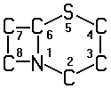

# **SECTION A — HUMAN NECESSITIES**
## **AGRICULTURE**
## **A01 AGRICULTURE; FORESTRY; ANIMAL HUSBANDRY; HUNTING; TRAPPING; FISHING**
***
### **A01B SOIL WORKING IN AGRICULTURE OR FORESTRY; PARTS, DETAILS, OR ACCESSORIES OF AGRICULTURAL MACHINES OR IMPLEMENTS, IN GENERAL** (making or covering furrows or holes for sowing, planting or manuring A01C 5/00; machines for harvesting root crops A01D; mowers convertible to soil working apparatus or capable of soil working A01D 42/00; mowers combined with soil working implements A01D 43/00; soil working for engineering purposes E01, E02, E21)
### <u>**Subclass Index**</u>
+ HAND TOOLS		1/00
+ PLOUGHS
	+ General construction		3/00, 5/00, 9/00, 11/00
	+ Special adaptations		13/00, 17/00
	+ Details		15/00
+ HARROWS
	+ General construction		19/00, 21/00
	+ Special applications		25/00
	+ Details		23/00
+ IMPLEMENTS USABLE EITHER AS PLOUGHS OR AS HARROWS OR THE LIKE		7/00
+ OTHER MACHINES		27/00 to 45/00, 49/00, 77/00
+ ELEMENTS OR PARTS OF MACHINES OR IMPLEMENTS		59/00 to 71/00
+ TRANSPORT IN AGRICULTURE		51/00, 73/00, 75/00
+ OTHER PARTS, DETAILS OR ACCESSORIES OF AGRICULTURAL MACHINES OR IMPLEMENTS		76/00
+ PARTICULAR METHODS FOR WORKING SOIL		47/00, 79/00
***
### **1/00 Hand tools** (edge trimmers for lawns A01G 3/00)
### <u>**Ploughs**</u>
### **3/00 Ploughs with fixed plough-shares**
### **5/00 Ploughs with rolling non-driven tools, e.g. discs** (with rotary driven tools A01B 9/00)
### **7/00 Disc-like soil-working implements usable either as ploughs or as harrows, or the like**
### **9/00 Ploughs with rotary driven tools** (tilling implements with rotary driven tools A01B 33/00)
### **11/00 Ploughs with oscillating, digging or piercing tools**
### **13/00 Ploughs or like machines for special purposes** (for drainage E02B 11/00)
### **15/00 Elements, tools, or details of ploughs**
### **17/00 Ploughs with special additional arrangements, e.g. means for putting manure under the soil, clod-crushers** (A01B 49/00 takes precedence; ploughs for working subsoil A01B 13/00)
### <u>**Harrows**</u>
### **19/00 Harrows with non-rotating tools**
### **21/00 Harrows with rotary non-driven tools** (tilling implements with rotary driven tools A01B 33/00)
### **23/00 Elements, tools, or details of harrows** (discs for both harrows and ploughs A01B 15/00)
### **25/00 Harrows with special additional arrangements, e.g. means for distributing fertilisers; Harrows for special purposes** (A01B 39/00 takes precedence)
### <u>**Other machines for working soil**</u>
### **27/00 Clod-crushers**
### **29/00 Rollers**
### **31/00 Drags**
### **33/00 Tilling implements with rotary driven tools**
### **35/00 Other machines for working soil** (A01B 37/00, A01B 39/00, A01B 77/00 take precedence)
### **37/00 Devices for loosening soil compacted by wheels or the like**
### **39/00 Other machines specially adapted for working soil on which crops are growing**
### **41/00 Thinning machines**
### **43/00 Gatherers for removing stones, undesirable roots or the like from the soil, e.g. tractor-drawn rakes**
### **45/00 Machines for treating meadows or lawns**
### **47/00 Soil-working with electric potential applied between tools and soil**
### **49/00 Combined machines** (auxiliary devices attached to machines of a different kind, e.g. harrows attached to ploughs, <u>see</u> the relevant groups for the machines)
### <u>**Parts, details or accessories of agricultural machines or implements, in general**</u> (seat constructions A47C; wheels B60B; shelters for drivers B60J; seats specially adapted for vehicles, arrangement or mounting of seats in vehicles B60N 2/00; wheel scrapers B60S 1/00)
### **51/00 Undercarriages specially adapted for mounting-on various kinds of agricultural tools or apparatus** (general vehicle aspects, <u>see</u> the relevant subclass of class B60 or B62)
### **59/00 Devices specially adapted for connection between animals or tractors and agricultural machines or implements** (A01B 63/00 takes precedence; vehicle connections in general B60D; draught assemblies for animal drawn vehicles, in general B62C 5/00)
### **61/00 Devices for, or parts of, agricultural machines or implements for preventing overstrain** (preventing overstrain in vehicle connections, in general B60D; preventing overstrain in couplings <u>per se</u>F16D)
### **63/00 Lifting or adjusting devices or arrangements for agricultural machines or implements** (lifting mechanisms for the cutter-bar of a mower A01D 34/02; adjusting devices for the cutter-bar of a mower A01D 34/02; constructional features of lifting devices <u>per se</u>B66F)
### 63/02 . for implements mounted on tractors
### 63/10 . . operated by hydraulic or pneumatic means
### 63/102 . . . characterised by the location of the mounting on the tractor, e.g. on the rear part
### 63/11 . . . for controlling weight transfer between implements and tractor wheels
### 63/111 . . . regulating working depth of implements
### 63/118 . . . Mounting implements on power-lift linkages (A01B 59/00 takes precedence; preventing or limiting side-play of implements A01B 59/00; preventing overstrain A01B 61/00)
### **67/00 Devices for controlling the tractor motor by resistance of tools** (preventing overstrain A01B 61/00)
### **69/00 Steering of agricultural machines or implements; Guiding agricultural machines or implements on a desired track**
### 69/02 . Ridge-marking or like devices; Checkrow wires; Accessories therefor
### 69/04 . Special adaptations of automatic tractor steering, e.g. electric system for contour ploughing
### 69/06 . Lateral steering of machines by an additional operator
### 69/08 . Lateral steering of machines derived from the lateral movement of tractor
### **71/00 Construction or arrangement of setting or adjusting mechanisms, of implement or tool drive or of power take-off; Means for protecting parts against dust, or the like; Adapting machine elements to or for agricultural purposes**
### **73/00 Means or arrangements to facilitate transportation of agricultural machines or implements, e.g. folding frames to reduce overall width** (arrangements of lifting devices for soil working implements A01B 63/00; vehicles adapted for load transportation or to transport, to carry or to comprise special loads or objects B60P; motor vehicles, trailers B62D)
### **75/00 Carriers for supporting persons when working in the field, e.g. while thinning beet**
***
### **76/00 Parts, details or accessories of agricultural machines or implements, not provided for in groups A01B 51/00 to A01B 75/00**
### **77/00 Machines for lifting and treating soil** (biocides, pest repellants or attractants, plant growth regulators A01N 25/00 to A01N 65/00; fertilisers C05; soil-conditioning or soil-stabilising materials C09K 17/00)
### **79/00 Methods for working soil** (essentially requiring the use of particular machines, <u>see</u> the relevant groups for the machines)
***
### **A01C PLANTING; SOWING; FERTILISING** (combined with general working of soil A01B 49/00; parts, details or accessories of agricultural machines or implements, in general A01B 51/00 to A01B 75/00)
### <u>**Subclass Index**</u>
+ FERTILISING
	+ Methods		3/00, 21/00
	+ Apparatus		3/00, 15/00, 17/00, 19/00, 23/00
+ WORK PREVIOUS TO SOWING OR PLANTING		1/00
+ PLANTING		9/00, 11/00, 13/00, 14/00
+ SOWING		7/00, 17/00, 19/00
+ COMMON APPARATUS		5/00
***
### **1/00 Apparatus, or methods of use thereof, for testing or treating seed, roots, or the like, prior to sowing or planting** (chemicals therefor A01N 25/00 to A01N 65/00)
### 1/04 . Arranging seed on carriers, e.g. on tapes, on cords
### 1/06 . Coating or dressing seed
### **3/00 Treating manure; Manuring** (dung forks A01D 9/00; organic fertilisers from waste or refuse C05F)
### **5/00 Making or covering furrows or holes for sowing, planting, or manuring** (ploughs for making ridges A01B 13/00)
### **7/00 Sowing** (arrangements for driving working parts A01C 19/00)
### 7/08 . Broadcast seeders; Seeders depositing seeds in rows
### **9/00 Potato planters** (combinations with soil-working A01B 49/00)
### **11/00 Transplanting machines** (carriers for supporting persons A01B 75/00; transplanting devices for trees A01G 23/00)
### 11/02 . for seedlings
### 11/04 . for deeper setting or shifting of plants
### **13/00 Machines or apparatus for consolidating soil around plants**
### **14/00 Methods or apparatus for planting not provided for in other groups of this subclass**
### **15/00 Fertiliser distributors** (A01C 7/00 takes precedence; with centrifugal wheels A01C 17/00; arrangements for driving working parts A01C 19/00; sand, gravel or salt spreaders for roads E01C 19/00)
### 15/04 . using blowers
### **17/00 Fertilisers or seeders with centrifugal wheels** (mechanical throwing machines for articles or solid bulk materials, in general B65G 31/00; sand, gravel, or salt spreaders E01C 19/00)
### **19/00 Arrangements for driving working parts of fertilisers or seeders**
### **21/00 Methods of fertilising** (fertilisers C05; soil-conditioning or soil-stabilising materials C09K 17/00)
### **23/00 Distributing devices specially adapted for liquid manure or other fertilising liquid, including ammonia, e.g. transport tanks, sprinkling wagons** (watering fields in general A01G 25/00; spraying or applying liquids or other fluent materials in general B05)
***
### **A01D HARVESTING; MOWING**
> ### <u>**Note**</u>
> This subclass <u>covers</u> the shredding or pulverising of stubble, e.g. for the purpose of producing mulch, but <u>does not cover</u> other mechanical destruction of unwanted vegetation, which is covered by group A01M 21/00.
### <u>**Subclass Index**</u>
+ HAND IMPLEMENTS
	+ Cutting implements, rakes, forks, others		1/00, 7/00, 9/00, 11/00
	+ Accessories		3/00, 5/00
+ MACHINES FOR HARVESTING ROOT CROPS
	+ Diggers		13/00 to 19/00, 27/00
	+ Topping		23/00, 27/00
	+ For specific products		13/00, 21/00, 25/00, 29/00
	+ Other machines		31/00
	+ Accessories		33/00
+ HARVESTING OR MOWING CEREALS OR GRASS
	+ Harvesters or mowers		34/00, 37/00, 41/00, 42/00, 43/00
	+ Binders		37/00, 39/00
	+ Headers		47/00
	+ For specific products		44/00, 45/00
	+ Components		57/00 to 69/00
	+ Accessories		75/00, 85/00
+ HAYMAKERS		76/00 to 84/00
+ HARVESTING OTHER CROPS
	+ Underwater plants		44/00
	+ Standing crops		45/00
	+ Picking or gathering fruits, vegetables, or the like		46/00, 51/00
+ GATHERING, LOADING, TRANSPORT		51/00, 85/00 to 90/00
+ GENERAL METHODS		91/00
***
### <u>**Hand implements**</u> (devices for picking apples or like fruit A01D 46/00; soil working implements not specially adapted for harvesting A01B 1/00)
### **1/00 Hand-cutting implements for harvesting** (hedge trimming means A01G 3/00)
### **3/00 Non-abrasive sharpening devices for scythes, sickles, or the like** (abrasive or similar sharpening devices B24D 15/00)
### **5/00 Containers for whetstones for use during harvesting** (whetting implements B24D 15/00)
### **7/00 Rakes** (mowers convertible to rakes or capable of raking A01D 42/00; mowers combined with rakes A01D 43/00; haymakers, crop conditioners A01D 76/00 to A01D 84/00)
### **9/00 Forks**
### **11/00 Other hand implements**
### <u>**Machines for harvesting root crops**</u>
### **13/00 Diggers, e.g. potato ploughs**
### **15/00 Digging machines with sieve graters but without conveying mechanisms**
### **17/00 Digging machines with sieving and conveying mechanisms**
### **19/00 Digging machines with centrifugal wheels, drums, or spinners**
### **21/00 Digging machines with potato-picking implements**
### **23/00 Topping machines**
### **25/00 Lifters for beet or like crops**
### **27/00 Machines with both topping and lifting mechanisms**
### **29/00 Harvesters for peanuts**
### **31/00 Other digging harvesters**
### **33/00 Accessories for digging harvesters**
### <u>**Harvesters or mowers for grass, cereals or other crops**</u> (component parts thereof A01D 57/00 to A01D 69/00; accessories therefor A01D 75/00)
### **34/00 Mowers** (combined with apparatus performing additional operations while mowing A01D 37/00 to A01D 41/00, A01D 43/00; convertible to apparatus for purposes other than mowing or capable of performing operations other than mowing A01D 42/00); Mowing apparatus of harvesters
### 34/01 . characterised by features relating to the type of cutting apparatus
### 34/02 . . having reciprocating cutters
### 34/412 . . having rotating cutters
### 34/63 . . . having cutters rotating about a vertical axis
### 34/67 . . . . hand-guided by a walking operator
### 34/73 . . . . Cutting apparatus
### **37/00 Reaper-binders** (features relating to mowing only A01D 34/00, to binding only A01D 39/00; equipment thereon for binding harvested or mown produce, e.g. knotters, A01D 59/00)
### **39/00 Independent binders, e.g. for hay; Binders attachable to mowers** (equipment thereon for binding harvested or mown produce, e.g. knotters, A01D 59/00; stationary apparatus or hand tools for forming or binding straw or hay into bundles A01F 1/00)
### **41/00 Combines, i.e. harvesters or mowers combined with threshing devices** (threshing devices for combines A01F 7/00 to A01F 12/00)
### **42/00 Mowers convertible to apparatus for purposes other than mowing; Mowers capable of performing operations other than mowing** (mowers combined with apparatus performing additional operations while mowing A01D 43/00)
### **43/00 Mowers combined with apparatus performing additional operations while mowing** (A01D 37/00, A01D 39/00, A01D 41/00 take precedence)
### **44/00 Harvesting of underwater plants, e.g. harvesting of seaweed**
### **45/00 Harvesting of standing crops** (A01D 44/00 takes precedence; threshing machines adapted for special crops, threshing devices for combines adapted for special crops A01F 11/00)
### **46/00 Picking of fruits, vegetables, hops, or the like; Devices for shaking trees or shrubs**
### **47/00 Headers**
### **51/00 Apparatus for gathering together crops spread on the soil, e.g. apples, beets, nuts, potatoes**
### <u>**Components of harvesters or mowers for grass or cereals**</u> (mowing apparatus A01D 34/00; wheels B60B; wheel scrapers B60S 1/00)
### **57/00 Delivering mechanisms for harvesters or mowers**
### **59/00 Equipment for binding harvested or mown produce** (specially adapted for baling presses A01F 15/00; bundling articles for packaging in general B65B 13/00)
### **61/00 Elevators or conveyers for binders or combines** (conveying in general B65G; hoisting, lifting, in general B66)
### **63/00 Outside dividers**
### **65/00 Grain-crop lifters**
### **67/00 Undercarriages or frames specially adapted for harvesters or mowers** (coupling arrangements between animal or tractor and harvester or mower A01B 59/00); Mechanisms for adjusting the frame (adjusting devices for the cutter-bar A01D 34/02); Platforms
### 67/02 . Protection against weather
### 67/04 . Seats
### **69/00 Driving mechanisms or parts thereof for harvesters or mowers** (driving mechanisms for the cutters of mowers or harvesters A01D 34/00)
***
### **75/00 Accessories for harvesters or mowers**
### <u>**Haymakers**</u> (combined with mowers A01D 43/00); Crop conditioners
> ### <u>**Note**</u>
> In groups A01D 76/00 to A01D 87/00, the following terms are used with the meanings indicated:
> 	- "hay" includes all mown forage crop in a dry or partially dry state;
> 	- "haymakers" covers all apparatus working on mown forage crop lying on the ground with the intention to make hay, with the exception of "rakes" which are covered by group A01D 7/00.&nbsp;
### **76/00 Haymakers with tines that are stationary with respect to the machine during operation but that may be liftable for dumping**
### **78/00 Haymakers with tines moving with respect to the machine**
### **80/00 Parts or details of haymakers** (parts or details specific for one type of machine, <u>see</u> the relevant groups for these machines)
### **82/00 Crop conditioners, i.e. machines for crushing or bruising stalks** (mowers combined with means for crushing or bruising the mown crop A01D 43/00)
### **84/00 Haymakers not provided for in a single one of groups A01D 76/00 to A01D 82/00**
***
### **85/00 Arrangements for making or setting stacks**
### **87/00 Loaders for hay or like field crops** (combined with mowers A01D 43/00; loading in general B65G, B66)
### **89/00 Pick-ups for loaders, chaff-cutters, balers, field-threshers, or the like**
### **90/00 Vehicles for carrying harvested crops with means for selfloading or unloading** (combined with mowers A01D 43/00; load transporting vehicles modified to facilitate loading, in general, B60P; bucket cars, i.e. having scraper bowls, E02F 3/64)
### **91/00 Methods for harvesting agricultural products** (essentially requiring the use of particular machines, <u>see</u> the relevant groups for the machines)
***
### **A01F THRESHING; BALING OF STRAW, HAY OR THE LIKE; STATIONARY APPARATUS OR HAND TOOLS FOR FORMING OR BINDING STRAW OR HAY INTO BUNDLES; CUTTING OF HAY, STRAW OR THE LIKE; STORING AGRICULTURAL OR HORTICULTURAL PRODUCE**
### <u>**Subclass Index**</u>
+ THRESHING
	+ General construction		5/00, 7/00, 9/00
	+ Special applications		11/00
	+ Details		12/00
+ BALING OF STRAW, HAY OR THE LIKE		1/00, 13/00, 15/00
+ ACCESSORIES FOR THRESHING MACHINES OR BALING PRESSES		17/00, 19/00, 21/00
+ STORING AGRICULTURAL OR HORTICULTURAL PRODUCE		25/00
+ MACHINES OR IMPLEMENTS FOR CUTTING HAY OR STRAW		3/00, 29/00
***
### <u>**Forming or tying straw; Hand-operated implements for cutting hay or straw**</u>
### **1/00 Stationary apparatus or hand tools for forming or binding straw or hay into bundles** (baling apparatus or presses A01F 13/00, A01F 15/00; binders A01D 37/00, A01D 39/00)
### **3/00 Hand-operated implements for cutting-up hay or straw** (mechanically-driven straw cutters A01F 29/00; cutting in general B26)
### <u>**Threshing**</u>
### **5/00 Hand-operated implements for threshing**
### **7/00 Threshing machines** (with flails A01F 9/00); Threshing devices for combines
### **9/00 Threshing machines with flails; Threshing devices with flails for combines**
### **11/00 Threshing machines adapted for special crops; Threshing devices for combines adapted for special crops**
### **12/00 Parts or details of threshing machines; Parts or details of threshing devices for combines**
### 12/10 . Feeders
### 12/18 . Threshing devices
### 12/30 . Straw separators
### 12/40 . Straw crushing or cutting, e.g. by chaff-cutters (cutting apparatus of chaff-cutters A01F 29/00)
### 12/44 . Grain cleaners; Separators (screening or sifting apparatus in general B07B)
### 12/46 . Mechanical grain conveyers (conveyers in general B65G)
### 12/48 . Air conduits or blowers for grain (for transport in general B65G 51/00, B65G 53/00)
### 12/52 . Arrangements for returning unthreshed grain to the threshing device
### 12/60 . Grain tanks
### <u>**Baling of straw, hay or the like**</u> (baling presses in general, briquetting presses B30B)
### **13/00 Hand-operated baling apparatus**
### **15/00 Baling presses for straw, hay, or the like** (making compressed stacks A01D 85/00; pick-ups A01D 89/00)
### <u>**Accessories for threshing machines or baling presses**</u> (loaders for sheaves, stacks or bales A01D 87/00; trailers B62D 63/00)
### **17/00 Straw conveyers for threshing machines or baling presses** (conveyers in general B65G)
### **19/00 Devices for securing threshing machines or baling presses to the ground, e.g. for compensating for unevenness of the ground**
### **21/00 Devices for protecting human beings** (in combines A01D 75/00; safety devices in general F16P)
***
### **25/00 Storing agricultural or horticultural produce; Hanging-up harvested fruit** (preservation of plants A01N 3/00; preservation of vegetables or fruit A23B 7/00; maturing fruit A23N 15/00; arrangements in barns for preparatory treatment of tobacco A24B 1/00; storing bulk material in general B65G; packing or storing hops C12C 3/00; drying in general F26B)
### 25/13 . Coverings (A01F 25/14 takes precedence; protective coverings for plants A01G 13/02)
### 25/14 . Containers specially adapted for storing (silos built by civil engineering techniques E04H 7/00)
### 25/16 . Arrangements in forage silos (loading or unloading arrangements in general B65G; construction of silos E04H 7/00)
### **29/00 Special adaptations of cutting machines for cutting hay, straw or fodder; Cutting apparatus of chaff-cutters** (mowers combined with means for cutting up the mown crop A01D 43/00; disintegrating in general B02C; cutting machines in general B26D)
***
### **A01G HORTICULTURE; CULTIVATION OF VEGETABLES, FLOWERS, RICE, FRUIT, VINES, HOPS, OR SEAWEED; FORESTRY; WATERING** (picking of fruits, vegetables, hops, or the like A01D 46/00; plant reproduction by tissue culture techniques A01H 4/00; devices for topping or skinning onions or flower bulbs A23N 15/00; propagating unicellular algae C12N 1/12; plant cell culture C12N 5/00)
### <u>**Subclass Index**</u>
+ CULTIVATION IN GENERAL		1/00, 3/00, 7/00, 9/00, 16/00, 17/00
+ HYDROPONICS, CULTIVATION WITHOUT SOIL		31/00
+ CULTIVATION OF SEAWEED		33/00
+ PROTECTING PLANTS		11/00, 13/00, 15/00
+ PICKING OR HANDLING FLOWERS, HANDLING FRUIT		3/00, 5/00
+ FORESTRY		23/00
+ WATERING		25/00, 27/00, 29/00
***
### **1/00 Horticulture; Cultivation of vegetables** (labels or name-plates G09F 3/00, G09F 7/00)
### 1/02 . Cultivation of asparagus
### 1/04 . Cultivation of mushrooms (composts or fertilisers for cultivating mushrooms C05)
### 1/06 . Grafting (grafting-wax A01N 3/00)
### 1/08 . Edging for beds, lawns, or the like, e.g. using tiles
### 1/12 . Tools for cultivating turf; Sweeping apparatus for lawns; Gardens rollers (machines for treating meadows or lawns A01B 45/00; lawn-mowers A01D 34/00)
### **3/00 Cutting implements specially adapted for horticultural purposes; Delimbing standing trees** (felling trees A01G 23/00; mowers having rotating flexible line cutters A01D 34/412; special adaptation of mowers for carrying by the operator A01D 34/00; hand-held cutting tools suitable for other use B26B)
### **5/00 Floral handling**
### **7/00 Botany in general** (cultivation without soil A01G 31/00)
### 7/02 . Treatment of plants with carbon dioxide (greenhouses therefor A01G 9/18)
### 7/04 . Electric or magnetic treatment of plants for promoting growth
### 7/06 . Treatment of growing trees or plants, e.g. for preventing decay of wood, for tingeing flowers or wood, for prolonging the life of plants
### **9/00 Cultivation of flowers, vegetables or rice in receptacles, forcing-frames or greenhouses** (cultivation without soil A01G 31/00)
### 9/02 . Receptacles, e.g. flower-pots or boxes (hanging flower baskets, holders or containers for flower-pots A47G 7/00); Glasses for cultivating flowers
### 9/04 . Flower-pot saucers
### 9/06 . Devices for cleaning flower-pots
### 9/08 . Devices for filling-up flower-pots; Devices for setting plants in pots
### 9/10 . Pots for seedlings; Soil-blocks for seedlings; Means for forming soil-blocks
### 9/12 . Supports for plants; Trellis for strawberries or the like (stays for trees, props for vines A01G 17/00)
### 9/14 . Greenhouses (cloches A01G 13/04)
### 9/16 . . Dismountable or portable greenhouses
### 9/18 . Greenhouses for treating plants with carbon dioxide or the like
### 9/20 . Forcing-frames; Lights
### 9/22 . Shades or blinds for greenhouses, or the like
### 9/24 . Devices for heating, ventilating, regulating temperature, or watering, in greenhouses, forcing-frames, or the like
### **11/00 Sterilising soil by steam** (soil-conditioning or soil-stabilising materials C09K 17/00)
### **13/00 Protecting plants** (apparatus for the destruction of vermin or noxious animals A01M; use of chemical materials therefor, composition of protective materials, e.g. grafting wax, A01N)
### 13/02 . Protective coverings for plants; Devices for laying-out coverings
### 13/04 . . Cloches
### 13/06 . Devices for generating heat, smoke, or fog in gardens, orchards, or forests, e.g. to prevent damage by frost (chemical aspects of generating smoke or mist C06D 3/00; heating devices in general, <u>see</u> the appropriate classes, e.g. F24)
### 13/10 . Devices for affording protection against animals, birds, or other pests (A01M 29/00 takes precedence; traps A01M 23/00; pesticides A01N)
### **15/00 Devices or methods for influencing weather conditions** (dispersing fog in general E01H 13/00)
### **16/00 Cultivation of rice** (A01G 9/00 takes precedence)
### **17/00 Cultivation of hops, vines, fruit trees, or like trees**
### **23/00 Forestry**
### **25/00 Watering gardens, fields, sports grounds, or the like** (special apparatus or adaptations for fertilising-liquids A01C 23/00; nozzles or outlets, spraying apparatus B05B; gravity flow, open channel irrigation ditch systems E02B 13/00)
### 25/02 . Watering arrangements located above the soil which make use of perforated pipe-lines or pipe-lines with dispensing fittings, e.g. for drip irrigation (perforated pipes <u>per se</u>B05B 1/14)
### 25/16 . Control of watering (controlling spraying devices B05B)
### **27/00 Self-acting watering devices, e.g. for flower-pots**
### **29/00 Root feeders; Injecting fertilisers into the roots**
### **31/00 Hydroponics; Cultivation without soil** (A01G 33/00 takes precedence)
### 31/02 . Special apparatus therefor (apparatus for cultivation in receptacles or greenhouses in general A01G 9/00; self-acting watering devices A01G 27/00)
### **33/00 Cultivation of seaweed**
***
### **A01H NEW PLANTS OR PROCESSES FOR OBTAINING THEM; PLANT REPRODUCTION BY TISSUE CULTURE TECHNIQUES**
### <u>**Subclass Index**</u>
+ PROCESSES		1/00, 3/00
+ REPRODUCTION		4/00
+ FLOWERING PLANTS; GYMNOSPERMS		5/00; 7/00
+ OTHER PRODUCTS		9/00 to 17/00
***
### <u>**Processes**</u>
### **1/00 Processes for modifying genotypes** (A01H 4/00 takes precedence)
### 1/02 . Methods or apparatus for hybridisation; Artificial pollination
### 1/04 . Processes of selection
### 1/06 . Processes for producing mutations, e.g. treatment with chemicals or with radiation (mutation or genetic engineering C12N 15/00)
### **3/00 Processes for modifying phenotypes** (A01H 4/00 takes precedence; influencing the growth of plants without producing new plants, non-chemically A01G 7/00, chemically A01N 25/00 to A01N 65/00)
### **4/00 Plant reproduction by tissue culture techniques**
### <u>**Products**</u>
### **5/00 Flowering plants, i.e. angiosperms**
### 5/02 . Flowers
### 5/04 . Stems
### 5/06 . Roots
### 5/08 . Fruits
### 5/10 . Seeds
### 5/12 . Leaves
### **7/00 Gymnosperms, e.g. conifers**
### **9/00 Pteridophytes, e.g. ferns, club-mosses, horse-tails**
### **11/00 Bryophytes, e.g. mosses, liverworts**
### **13/00 Algae** (unicellular algae C12N 1/12)
### **15/00 Fungi; Lichens** (fungal micro-organisms C12N 1/14)
### **17/00 Symbiotic or parasitic combinations including one or more new plants, e.g. mycorrhiza** (lichens A01H 15/00)
***
### **A01J MANUFACTURE OF DAIRY PRODUCTS** (preservation, pasteurisation, sterilisation of milk products A23; for chemical matters, <u>see</u> subclass A23C)
### <u>**Subclass Index**</u>
+ MILKING		1/00 to 9/00
+ TREATMENT OF MILK OR CREAM		11/00, 13/00
+ MANUFACTURING BUTTER		15/00
+ KNEADING OR FORMING BUTTER, MARGARINE OR BUTTER SUBSTITUTES		17/00 to 23/00
+ CHEESE-MAKING		25/00, 27/00
+ SUBJECT MATTER NOT PROVIDED FOR IN OTHER GROUPS OF THIS SUBCLASS		99/00
***
### <u>**Milking**</u> (milking stations A01K 1/00)
### **1/00 Devices or accessories for milking by hand** (milking stools A47C 9/00)
### **3/00 Milking with catheters**
### **5/00 Milking machines or devices** (A01J 1/00, A01J 3/00 take precedence)
### 5/003 . Movable milking machines
### 5/007 . Monitoring milking processes; Control or regulation of milking machines
### **7/00 Accessories for milking machines or devices**
### **9/00 Milk receptacles** (containers in general B65D; devices for tilting and emptying of containers B65G 65/00)
### <u>**Treatment of milk or cream**</u>
### **11/00 Apparatus for treating milk** (preserving or sterilising A23C)
### **13/00 Tanks for treating cream**
***
### **15/00 Manufacturing butter**
### <u>**Kneading or forming butter; Kneading or forming margarine or butter substitutes**</u>
### **17/00 Kneading machines for butter, or the like** (mixing or kneading machines for the preparation of dough A21C 1/00)
### **19/00 Hand devices for forming slabs of butter, or the like**
### **21/00 Machines for forming slabs of butter, or the like**
### **23/00 Devices for dividing bulk butter, or the like**
### <u>**Cheese-making**</u>
### **25/00 Cheese-making** (coating the cheese A01J 27/00)
### **27/00 After-treatment of cheese; Coating the cheese**
***
### **99/00 Subject matter not provided for in other groups of this subclass**
***
### **A01K ANIMAL HUSBANDRY; CARE OF BIRDS, FISHES, INSECTS; FISHING; REARING OR BREEDING ANIMALS, NOT OTHERWISE PROVIDED FOR; NEW BREEDS OF ANIMALS**
> ### <u>**Note**</u>
> This subclass <u>covers</u>:
> 	- equipment for the care, culture or rearing of all animals or for obtaining their products, unless provided for elsewhere, e.g. milking A01J, shoeing animals A01L, veterinary devices A61D, culture of animal cells C12M, C12N;
> 	- methods of breeding animals or new animal breeds.&nbsp;
### <u>**Subclass Index**</u>
+ ANIMAL HUSBANDRY IN GENERAL, ESPECIALLY CATTLE RAISING
	+ Housing, feeding or watering devices		1/00 to 9/00
	+ Taming; muzzles, leads		15/00; 25/00; 27/00
	+ Marking; devices for grooming		11/00; 13/00
	+ Removing the fleece		14/00
	+ Other apparatus		17/00 to 23/00, 29/00
+ AVICULTURE; EGGS
	+ Housing, feeding or drinking appliances		31/00, 39/00
	+ Marking		35/00
	+ Other apparatus		33/00, 37/00, 41/00, 43/00, 45/00
+ APICULTURE
	+ Housing, feeding or drinking appliances		47/00, 53/00
	+ Other devices		49/00, 51/00, 55/00, 57/00, 59/00
+ PISCICULTURE		61/00, 63/00
+ OTHER REARING OR BREEDING, NEW BREEDS		67/00
+ FISHING WITH NETS		69/00 to 75/00
+ ANGLING
	+ Rods; reels		87/00; 89/00
	+ Lines; accessories therefor		91/00; 83/00, 85/00, 93/00, 95/00
	+ Accessories		97/00
+ OTHER FISHING		69/00, 77/00 to 81/00, 99/00
***
### <u>**Animal husbandry in general, especially cattle-raising**</u> (devices in connection with harnesses B68B)
### **1/00 Housing animals; Equipment therefor** (building construction, features of buildings E04; ventilating buildings F24F)
### 1/01 . Removal of dung or urine (A01K 1/015 takes precedence)
### 1/015 . Floor coverings, e.g. bedding-down sheets
### 1/02 . Pigsties; Dog-kennels; Rabbit-hutches or the like
### **3/00 Pasturing equipment, e.g. tethering devices; Grids for preventing cattle from straying; Electrified wire fencing** (construction of fencing in general E04H 17/00; electric circuits for fences H05C)
### **5/00 Feeding devices for stock or game** (A01K 1/00 takes precedence; for poultry A01K 39/00)
### **7/00 Watering equipment for stock or game**
### **9/00 Sucking apparatus for young stock**
### **11/00 Marking of animals** (of poultry A01K 35/00; lead-sealing pliers B25B)
### **13/00 Devices for grooming or caring of animals, e.g. curry-combs** (scissors B26B); Fetlock rings (bandages, poultices A61D); Tail-holders (as part of the harness B68B 5/00); Devices for preventing crib-biting; Washing devices (milking machine accessories for treatment of udders or teats A01J 7/00; for medical purposes A61D 11/00); Protection against weather conditions or insects
### **14/00 Removing the fleece from live sheep or similar animals** (hand-held cutting tools B26B)
### **15/00 Devices for taming animals, e.g. nose-rings, hobbles; Devices for overturning animals in general; Training equipment; Covering boxes** (devices for veterinary purposes A61D 3/00)
### **17/00 Dehorners; Horn trainers**
### **19/00 Weaning apparatus**
### **21/00 Devices for assisting or preventing mating** (covering boxes A01K 15/00)
### **23/00 Manure or urine pouches**
### **25/00 Muzzles**
### **27/00 Leads or collars, e.g. for dogs** (devices specially adapted or mounted for storing and repeatedly paying-out and re-storing lengths of material B65H 75/34)
### **29/00 Other apparatus for animal husbandry**
### <u>**Aviculture; Testing, cleaning, stamping, or grading eggs**</u>
### **31/00 Housing birds**
### **33/00 Nest-eggs**
### **35/00 Marking poultry or other birds**
### **37/00 Constraining birds, e.g. wing clamps**
### **39/00 Feeding or drinking appliances for poultry or other birds**
### **41/00 Incubators for poultry**
### **43/00 Testing, sorting, or cleaning eggs** (investigating or analysing eggs, e.g. by candling, G01N 33/02)
### **45/00 Other aviculture appliances, e.g. devices for determining whether a bird is about to lay**
### <u>**Apiculture**</u>
### **47/00 Beehives**
### **49/00 Rearing-boxes; Queen transporting or introducing cages**
### **51/00 Appliances for treating beehives or parts thereof, e.g. for cleaning or disinfecting**
### **53/00 Feeding or drinking appliances for bees**
### **55/00 Bee-smokers; Bee-keepers' accessories, e.g. veils** (smoking pipes A24F)
### **57/00 Appliances for providing, preventing, or catching swarms; Drone-catching devices**
### **59/00 Honey collection**
### <u>**Pisciculture; Aquaria; Terraria**</u>
### **61/00 Culture of fish, mussels, crayfish, lobsters, sponges, pearls, or the like** (harvesting oysters, mussels, sponges or the like A01K 80/00)
### 61/02 . Feeding devices for fish
### **63/00 Receptacles for live fish, e.g. aquaria** (keepnets or other containers for keeping captured fish A01K 97/00); Terraria
### 63/02 . Receptacles specially adapted for transporting live fish
### 63/04 . Arrangements for treating water specially adapted to receptacles for live fish (filters in general B01D; water treatment in general C02F)
### 63/06 . Arrangements for heating or lighting in, or attached to, receptacles for live fish (heating or lighting apparatus <u>per se</u>F21, H01, H05B)
***
### **65/00 Fish stringers**
### **67/00 Rearing or breeding animals, not otherwise provided for; New breeds of animals** (methods for reproduction or fertilisation A61D 19/00; medicinal preparations containing sperm A61K 35/48; tissue- or animal-cell cultivation apparatus C12M 3/00; cultivation or maintenance of tissue or animal cells C12N 5/00; mutation or genetic engineering C12N 15/00)
> ### <u>**Note**</u>
> In this group the following term is used with the meaning indicated:
> 	- "breeding" means obtaining animals up to and including their birth or hatching.&nbsp;
### 67/027 . New breeds of vertebrates
### <u>**Fishing**</u> (fish stringers A01K 65/00; angling A01K 83/00 to A01K 97/00)
### **69/00 Stationary catching devices**
### **71/00 Floating nets**
### **73/00 Drawn nets**
### **74/00 Other catching nets or the like**
### **75/00 Accessories for nets; Details of nets, e.g. structure**
### **77/00 Landing-nets; Landing-spoons**
### **79/00 Methods or means of catching fish in bulk not provided for in groups A01K 69/00 to A01K 77/00**
### **80/00 Harvesting oysters, mussels, sponges or the like** (nets A01K 73/00, A01K 74/00; dredgers E02F)
### **81/00 Fishing with projectiles** (weapons, projectiles other than fish-spears F41, F42)
### <u>**Angling**</u>
### **83/00 Fish-hooks**
### **85/00 Artificial baits**
### 85/01 . with light emission, sound emission, scent dispersal or the like
### **87/00 Rods**
### 87/02 . Connecting devices for parts of the rods
### 87/04 . Fishing-line guides on rods
### 87/06 . Devices for fixing reels on rods
### 87/08 . Handgrips
### **89/00 Reels** (devices for casting lines A01K 91/00)
### **91/00 Lines**
### **93/00 Floats for angling, with or without signalling devices**
### **95/00 Sinkers for angling**
### **97/00 Accessories for angling** (landing-nets, landing-spoons A01K 77/00)
### 97/04 . Containers for bait; Preparation of bait (feeding-stuffs for particular animals A23K 1/18)
### 97/06 . Containers or holders for hooks, lines, sinkers, flies or the like
### 97/10 . Supports for rods
### 97/12 . Signalling devices, e.g. tip-up devices (A01K 91/00 takes precedence)
***
### **99/00 Methods or apparatus for fishing not provided for in groups A01K 69/00 to A01K 97/00**
***
### **A01L SHOEING OF ANIMALS**
### <u>**Subclass Index**</u>
+ SHOES		1/00, 3/00, 5/00, 9/00
+ EQUIPMENT AND ACCESSORIES		7/00, 11/00, 13/00, 15/00
***
### **1/00 Shoes for horses or other solipeds fastened with nails** (A01L 3/00 takes precedence)
### **3/00 Horseshoes fastened by means other than nails, with or without additional fastening by nailing**
### **5/00 Horseshoes made of elastic materials**
### **7/00 Accessories for shoeing animals**
### **9/00 Shoes for other animals, e.g. oxen**
### **11/00 Farriers' tools or appliances** (making horseshoes by rolling B21H 7/00, by forging B21K 15/00)
### **13/00 Pens for animals while being shod**
### **15/00 Apparatus or use of substances for the care of hoofs**
***
### **A01M CATCHING, TRAPPING OR SCARING OF ANIMALS** (apiculture A01K 47/00 to A01K 59/00; fishing A01K 69/00 to A01K 97/00; pesticides A01N); APPARATUS FOR THE DESTRUCTION OF NOXIOUS ANIMALS OR NOXIOUS PLANTS (equipment fitted in or to aircraft for dropping or releasing powdered, liquid or gaseous matter, e.g. pesticides, herbicides, B64D 1/00)
> ### <u>**Note**</u>
> In this subclass, terms "killing" and "destruction" cover "non-chemical sterilisation" of invertebrates.
### <u>**Subclass Index**</u>
+ SPRAYERS; FUMIGATORS; FLAME-THROWERS		7/00 to 11/00; 13/00; 15/00
+ CATCHING OR KILLING INSECTS		1/00 to 5/00, 17/00
+ CATCHING OR KILLING ANIMALS OTHER THAN INSECTS		19/00, 23/00, 25/00, 27/00
+ SCARING DEVICES; HUNTING APPLIANCES		29/00; 31/00
+ DESTRUCTION OF UNWANTED VEGETATION		21/00
+ SUBJECT MATTER NOT PROVIDED FOR IN OTHER GROUPS OF THIS SUBCLASS		99/00
***
### **1/00 Stationary means for catching or killing insects**
### 1/02 . with devices attracting the insects
### 1/08 . using combined illumination and suction effects
### 1/20 . Poisoning, narcotising, or burning insects
### **3/00 Manual implements, other than sprayers or powder distributors, for catching or killing insects, e.g. butterfly nets**
### **5/00 Catching insects in fields, gardens, or forests by movable appliances**
### **7/00 Special adaptations or arrangements of liquid-spraying apparatus for purposes covered by this subclass** (spraying apparatus in general B05B)
### **9/00 Special adaptations or arrangements of powder-spraying apparatus for purposes covered by this subclass** (spraying apparatus in general B05B)
### **11/00 Special adaptations or arrangements of combined liquid- and powder-spraying apparatus for purposes covered by this subclass** (spraying apparatus in general B05B)
### **13/00 Fumigators; Apparatus for distributing gases**
### **15/00 Flame-throwers specially adapted for purposes covered by this subclass** (flame-throwers in general F41H 9/00)
### **17/00 Apparatus for the destruction of vermin in soil or in foodstuffs**
### **19/00 Apparatus for the destruction of noxious animals, other than insects, by hot water, steam, hot air, or electricity** (electric circuits therefor H05C)
### **21/00 Apparatus for the destruction of unwanted vegetation, e.g. weeds** (biocides, plant growth regulators A01N 25/00 to A01N 65/00; spraying or atomising apparatus in general B05B; soil-conditioning or soil-stabilising materials C09K 17/00; control of undesirable vegetation on roads or permanent ways of railways E01H 11/00)
### **23/00 Traps for animals**
### **25/00 Devices for dispensing poison for animals** (A01M 27/00 takes precedence; for insects A01M 1/20)
### **27/00 Apparatus having projectiles or killing implements projected to kill the animal, e.g. pierce or shoot, and triggered thereby**
### **29/00 Scaring devices, e.g. bird-scaring apparatus**
### **31/00 Hunting appliances**
### **99/00 Subject matter not provided for in other groups of this subclass**
***
### **A01N PRESERVATION OF BODIES OF HUMANS OR ANIMALS OR PLANTS OR PARTS THEREOF; BIOCIDES, e.g. AS DISINFECTANTS, AS PESTICIDES, AS HERBICIDES** (preparations for medical, dental, or toilet purposes A61K; methods or apparatus for disinfection or sterilisation in general, or for deodorisation of air A61L); PEST REPELLANTS OR ATTRACTANTS (decoys A01M 31/00; medicinal preparations A61K); PLANT GROWTH REGULATORS (compounds in general C01, C07, C08; fertilisers C05; soil conditioners or stabilisers C09K 17/00)
> ### <u>**Note**</u>
> 1. This subclass <u>covers</u>:
> 		- compositions, physical forms, methods of application of specific materials or the use of single compounds or compositions;
> 		- chemosterilants for the sexual sterilisation of invertebrates, e.g. insects (sex sterilants for other purposes A61K).
> 2. This subclass <u>does not cover</u> materials which affect the growth of a plant solely by supplying nutrients, i.e. plant food, ordinarily required for growth or materials which are used to prevent or cure mineral deficiencies in plants, e.g. addition of iron chelates to cure iron chlorosis, which materials are covered by class C05.
> 3. In this subclass, the following expression is used with the meaning indicated:
> 		- "plant growth regulators" are those materials which alter the plant through a chemical modification of the plant metabolism, such as auxins.
> 4. Biocidal, pest repellant, pest attractant or plant growth regulatory activity of compounds or preparations is further classified in subclass A01P.
### <u>**Subclass Index**</u>
+ PRESERVATION OF CORPSES OF HUMANS OR ANIMALS, OR OF PLANTS		1/00, 3/00
+ BIOCIDES, PEST REPELLANTS OR ATTRACTANTS, PLANT GROWTH REGULATORS
	+ Physical form or method of application		25/00
	+ containing organic compounds		27/00 to 57/00, 61/00
	+ containing inorganic compounds		59/00
	+ containing micro-organisms, enzymes, extracts of animals or plants		63/00, 65/00
***
### <u>**Preservation of bodies of humans or animals, or plants, or parts thereof**</u>
### **1/00 Preservation of bodies of humans or animals, or parts thereof** (preservation of foodstuffs A23; medicinal preparations containing materials from mammals or birds, e.g. blood, sperm, A61K 35/12; cell or tissue culture C12N 5/00)
### 1/02 . Preservation of living parts
### **3/00 Preservation of plants or parts thereof, e.g. inhibiting evaporation, improvement of the appearance of leaves** (preservation of foodstuffs A23; preservation or chemical ripening of fruit or vegetables A23B 7/00); Grafting wax
### <u>**Biocides; Pest repellants or attractants; Plant growth regulators**</u>
> ### <u>**Note**</u>
> 1. Attention is drawn to the definitions of groups of chemical elements following the title of section C.
> 2. In groups A01N 27/00 to A01N 65/00, in the absence of an indication to the contrary, an active ingredient is classified in the last appropriate place.
> 3. A composition, i.e. a mixture of two or more active ingredients is classified in the last of groups A01N 27/00 to A01N 65/00 that provides for at least one of these active ingredients.
> 4. Any part of a composition which is not identified by the classification according to Note (3), and which itself is determined to be novel and non-obvious, must also be classified in the last appropriate place in groups A01N 27/00 to A01N 65/00. The part can be either a single ingredient or a composition in itself.
> 5. Any part of a composition which is not identified by the classification according to Note (3) or (4), and which is considered to represent information of interest for search, may also be classified in the last appropriate place in groups A01N 27/00 to A01N 65/00. This can, for example, be the case when it is considered of interest to enable searching of compositions using a combination of classification symbols. Such non-obligatory classification should be given as "additional information".
> 6. Where a compound is described as existing in tautomeric forms, it is classified as if existing in the form which is classified last in the system.
> 7. Compounds covered by different main groups according to alternatively specified parts of their formulae are classified in every one of the relevant main groups.
> 8. Salts formed between two or more organic compounds are classified as the compound providing the essential ion and it is also classified as the compound providing the other ion.
> 9. Salts or metal chelates of an organic compound are classified as that compound.
> 10. In this subclass, a foodstuff is not considered as an active ingredient.
> 11. Different materials applied in sequence, at different times, are considered as a mixture of all materials employed.
> 12. Synergistic or potentiated compositions are classified as if the synergist or potentiator were an active ingredient.
> 13. In groups A01N 25/00 to A01N 65/00, the symbol X means nitrogen, oxygen, sulfur or a halogen; Y means nitrogen, oxygen or sulfur. A dotted line between atoms indicates an optional bond, e.g. <u>...</u> indicates one or two single bonds or a double bond.
### **25/00 Biocides, pest repellants or attractants, or plant growth regulators, characterised by their forms, or by their non-active ingredients or by their methods of application** (apparatus for the destruction of noxious animals or noxious plants A01M; fungicidal, bactericidal, insecticidal, disinfecting or antiseptic paper D21H); Substances for reducing the noxious effect of the active ingredients to organisms other than pests
### 25/02 . containing liquids as carriers, diluents or solvents
### 25/04 . . Dispersions or gels (foams A01N 25/16)
### 25/06 . . . Aerosols
### 25/08 . containing solids as carriers or diluents
### 25/10 . . Macromolecular compounds
### 25/12 . Powders or granules (A01N 25/26 takes precedence)
### 25/14 . . wettable
### 25/16 . Foams
### 25/18 . Vapour or smoke emitting compositions with delayed or sustained release (fumigators A01M 13/00)
### 25/20 . Combustible or heat-generating compositions
### 25/22 . containing ingredients stabilising the active ingredients
### 25/24 . containing ingredients to enhance the sticking of the active ingredients
### 25/26 . in coated particulate form
### 25/30 . characterised by the surfactants
### 25/32 . Ingredients for reducing the noxious effect of the active substances to organisms other than pests, e.g. toxicity reducing compositions, self-destructing compositions
### 25/34 . Shaped forms, e.g. sheets, not provided for in any other group of this main group
### **27/00 Biocides, pest repellants or attractants, or plant growth regulators containing hydrocarbons**
### **29/00 Biocides, pest repellants or attractants, or plant growth regulators containing halogenated hydrocarbons**
### **31/00 Biocides, pest repellants or attractants, or plant growth regulators containing organic oxygen or sulfur compounds**
### **33/00 Biocides, pest repellants or attractants, or plant growth regulators containing organic nitrogen compounds**
### **35/00 Biocides, pest repellants or attractants, or plant growth regulators containing organic compounds containing a carbon atom having two bonds to hetero atoms with at the most one bond to halogen, e.g. aldehyde radical**
### **37/00 Biocides, pest repellants or attractants, or plant growth regulators containing organic compounds containing a carbon atom having three bonds to hetero atoms with at the most two bonds to halogen, e.g. carboxylic acids** (containing cyclopropane carboxylic acids or derivatives thereof, e.g. cyclopropane carboxylic acid nitriles, A01N 53/00)
### 37/02 . Saturated carboxylic acids or thio-analogues thereof; Derivatives thereof
### 37/06 . Unsaturated carboxylic acids or thio-analogues thereof; Derivatives thereof
### 37/08 . containing carboxylic groups or thio-analogues thereof, directly attached by the carbon atom to a cycloaliphatic ring; Derivatives thereof
### 37/10 . Aromatic or araliphatic carboxylic acids, or thio-analogues thereof; Derivatives thereof
### 37/12 . containing the group , wherein Cn means a carbon skeleton not containing a ring; Thio-analogues thereof
### 37/14 . containing the group ; Thio-analogues thereof
### 37/16 . containing the group ; Thio-analogues thereof
### 37/18 . containing the group —CO—N〈, e.g. carboxylic acid amides or imides; Thio-analogues thereof
### 37/20 . . containing the group , wherein Cn means a carbon skeleton not containing a ring; Thio-analogues thereof
### 37/22 . . the nitrogen atom being directly attached to an aromatic ring system, e.g. anilides
### 37/26 . . containing the group ; Thio-analogues thereof
### 37/28 . . containing the group ; Thio-analogues thereof
### 37/30 . . containing the groups —CO—N〈 and  both being directly attached by their carbon atoms to the same carbon skeleton, e.g. H2N—NH—CO—C6H4—COOCH3; Thio-analogues thereof
### 37/32 . . Cyclic imides of polybasic carboxylic acids or thio-analogues thereof
### 37/34 . Nitriles
### 37/36 . containing at least one carboxylic group or a thio-analogue, or a derivative thereof, and a singly bound oxygen or sulfur atom attached to the same carbon skeleton, this oxygen or sulfur atom not being a member of a carboxylic group or of a thio-analogue, or of a derivative thereof, e.g. hydroxy-carboxylic acids
### 37/42 . containing within the same carbon skeleton a carboxylic group or a thio-analogue, or a derivative thereof, and a carbon atom having only two bonds to hetero atoms with at the most one bond to halogen, e.g. keto-carboxylic acids
### 37/44 . containing at least one carboxylic group or a thio-analogue, or a derivative thereof, and a nitrogen atom attached to the same carbon skeleton by a single or double bond, this nitrogen atom not being a member of a derivative or of a thio-analogue of a carboxylic group, e.g. amino-carboxylic acids
### 37/52 . containing  groups, e.g. carboxylic acid amidines
### **39/00 Biocides, pest repellants or attractants, or plant growth regulators containing aryloxy- or arylthio-aliphatic or cycloaliphatic compounds, containing the group  or , e.g. phenoxyethylamine, phenylthio-acetonitrile, phenoxyacetone**
> ### <u>**Note**</u>
> In this group, the symbol Cn means a carbon skeleton, not containing an aromatic ring system wherein n≥2.&nbsp;
### **41/00 Biocides, pest repellants or attractants, or plant growth regulators containing organic compounds containing a sulfur atom bound to a hetero atom**
### **43/00 Biocides, pest repellants or attractants, or plant growth regulators containing heterocyclic compounds** (containing cyclic anhydrides, cyclic imides A01N 37/00; containing compounds of the formula , containing only one heterocyclic ring, wherein m≥1 and n≥0 and  is unsubstituted or alkylsubstituted pyrrolidine, piperidine, morpholine, thiomorpholine, piperazine or a polymethyleneimine with four or more CH2 groups A01N 33/00 to A01N 41/00; containing cyclopropane carboxylic acids or derivatives thereof, e.g. esters having heterocyclic rings, A01N 53/00)
> ### <u>**Note**</u>
> 1. In this group,&nbsp;the following terms or expressions are used with the meanings indicated:
> 		- "hetero ring" is a ring having at least one halogen, nitrogen, oxygen or sulfur atom as a ring member;
> 		- "bridged" means the presence of at least one fusion other than ortho, peri and spiro;
> 		- two rings are "condensed" if they share at least one ring member, i.e. "spiro" and "bridged" are considered as condensed;
> 		- "condensed ring system" is a ring system in which all rings are condensed among themselves.
> 2. In this group, the number of rings in a condensed ring system equals the number of scissions necessary to convert the ring system into one acyclic chain. The relevant rings in a condensed system are chosen according to the following criteria consecutively:
> 		- lowest number of ring members,
> 		- highest number of hetero atoms as ring members.Ring members shared by two or more rings are regarded as being a member of each of these rings.
### 43/02 . having rings with one or more oxygen or sulfur atoms as the only ring hetero atom
### 43/34 . having rings with one nitrogen atom as the only ring hetero atom
### 43/48 . having rings with two nitrogen atoms as the only ring hetero atoms
### 43/64 . having rings with three nitrogen atoms as the only ring hetero atoms
### 43/713 . having rings with four or more nitrogen atoms as the only ring hetero atoms
### 43/72 . having rings with nitrogen atoms and oxygen or sulfur atoms, as ring hetero atoms
### 43/90 . having two or more relevant hetero rings, condensed among themselves or with a common carbocyclic ring system
### 43/92 . having rings with one or more halogen atoms as ring hetero atoms
### **45/00 Biocides, pest repellants or attractants, or plant growth regulators containing compounds having three or more carbocyclic rings condensed among themselves, at least one ring not being a six-membered ring** (halogenated hydrocarbons A01N 29/00; condensed with heterocyclic rings A01N 43/00)
### **47/00 Biocides, pest repellants or attractants, or plant growth regulators containing organic compounds containing a carbon atom not being member of a ring and having no bond to a carbon or hydrogen atom, e.g. derivatives of carbonic acid** (carbon tetrahalides A01N 29/00)
### 47/02 . the carbon atom having no bond to a nitrogen atom
### 47/08 . the carbon atom having one or more single bonds to nitrogen atoms
### 47/10 . . Carbamic acid derivatives, i.e. containing the group —O—CO—N〈; Thio-analogues thereof
### 47/28 . . Ureas or thioureas containing the groups 〉N—CO—N〈 or 〉N—CS—N〈 (isoureas, isothioureas A01N 47/40)
### 47/40 . the carbon atom having a double or triple bond to nitrogen, e.g. cyanates, cyanamides (inorganic cyanamides A01N 59/24)
### 47/48 . . containing —S—C≡N groups (A01N 43/00 to A01N 47/28 take precedence)
### **49/00 Biocides, pest repellants or attractants, or plant growth regulators containing compounds containing the group  wherein m+n≥1, both X together may also mean —Y— or a direct carbon-to-carbon bond, and the carbon atoms marked with an asterisk are not part of any ring system other than that which may be formed by the atoms X, the carbon atoms in square brackets being part of any acyclic or cyclic structure, or the group  wherein A means a carbon atom or Y, n ≥ 0, and not more than one of these carbon atoms being a member of the same ring system, e.g. juvenile insect hormones or mimics thereof** (containing hydrocarbons A01N 27/00)
### **51/00 Biocides, pest repellants or attractants, or plant growth regulators containing organic compounds having the sequences of atoms O—N—S, X—O—S, N—N—S, O—N—N or O-halogen, regardless of the number of bonds each atom has and with no atom of these sequences forming part of a heterocyclic ring**
### **53/00 Biocides, pest repellants or attractants, or plant growth regulators containing cyclopropane carboxylic acids or derivatives thereof**
### **55/00 Biocides, pest repellants or attractants, or plant growth regulators containing organic compounds containing elements other than carbon, hydrogen, halogen, oxygen, nitrogen and sulfur** (containing organo-phosphorus compounds A01N 57/00)
### **57/00 Biocides, pest repellants or attractants, or plant growth regulators containing organic phosphorus compounds**
### **59/00 Biocides, pest repellants or attractants, or plant growth regulators containing elements or inorganic compounds**
### 59/02 . Sulfur; Selenium; Tellurium; Compounds thereof
### 59/04 . Carbon disulfide; Carbon monoxide; Carbon dioxide (treatment of plants with carbon dioxide A01G 7/02)
### 59/06 . Aluminium; Calcium; Magnesium; Compounds thereof
### 59/08 . Alkali metal chlorides; Alkaline earth metal chlorides
### 59/10 . Fluorides
### 59/12 . Iodine, e.g. iodophors; Compounds thereof
### 59/14 . Boron; Compounds thereof
### 59/16 . Heavy metals; Compounds thereof
### 59/24 . Cyanogen or compounds thereof, e.g. hydrogen cyanide, cyanic acid, cyanamide, thiocyanic acid
### 59/26 . Phosphorus; Compounds thereof
### **61/00 Biocides, pest repellants or attractants, or plant growth regulators containing substances of unknown or undetermined composition, e.g. substances characterised only by the mode of action**
### **63/00 Biocides, pest repellants or attractants, or plant growth regulators containing micro-organisms, viruses, microbial fungi, enzymes, fermentates or substances produced by, or extracted from, micro-organisms or animal material** (containing compounds of determined constitution A01N 27/00 to A01N 59/00)
### 63/02 . Fermentates or substances produced by, or extracted from, micro-organisms or animal material
### 63/04 . Microbial fungi or extracts thereof
### **65/00 Biocides, pest repellants or attractants, or plant growth regulators containing plant material, e.g. mushrooms, derris root, or extracts thereof** (containing compounds of determined constitution A01N 27/00 to A01N 59/00)
***
### **A01P BIOCIDAL, PEST REPELLANT, PEST ATTRACTANT OR PLANT GROWTH REGULATORY ACTIVITY OF CHEMICAL COMPOUNDS OR PREPARATIONS**
> ### <u>**Note**</u>
> 1. This subclass <u>covers</u> biocidal, pest repellant, pest attractant or plant growth regulatory activity of chemical compounds or preparations already classified as such in subclasses A01N or C12N, or in classes C01, C07 or C08.
> 2. Attention is drawn to the notes following the title of subclass A01N, which are also applicable to this subclass.
> 3. In this subclass, activity is classified in all appropriate places.
> 4. The classification symbols of this subclass are not listed first when assigned to patent documents.
### **1/00 Disinfectants; Antimicrobial compounds or mixtures thereof**
### **3/00 Fungicides**
### **5/00 Nematocides**
### **7/00 Arthropodicides**
### 7/02 . Acaricides
### 7/04 . Insecticides
### **9/00 Molluscicides**
### **11/00 Rodenticides**
### **13/00 Herbicides; Algicides**
### 13/02 . selective
### **15/00 Biocides for specific purposes not provided for in groups A01P 1/00 to A01P 13/00**
### **17/00 Pest repellants**
### **19/00 Pest attractants**
### **21/00 Plant growth regulators**
### **23/00 Chemosterilants**
## **FOODSTUFFS; TOBACCO**
## **A21 BAKING; EQUIPMENT FOR MAKING OR PROCESSING DOUGHS; DOUGHS FOR BAKING**
> ### <u>**Note**</u>
> Processes using enzymes or micro-organisms in order to:
> 	- liberate, separate or purify a pre-existing compound or composition, or to
> 	- treat textiles or clean solid surfaces of materialsare further classified in subclass C12S.&nbsp;
***
### **A21B BAKERS' OVENS; MACHINES OR EQUIPMENT FOR BAKING** (domestic baking equipment A47J 37/00; combustion apparatus F23; domestic stoves or ranges being wholly or partly ovens F24B, F24C)
### **1/00 Bakers' ovens**
### **2/00 Baking apparatus employing high-frequency or infra-red heating**
### **3/00 Parts or accessories of ovens**
### **5/00 Baking apparatus for special goods; Other baking apparatus**
### **7/00 Baking plants**
***
### **A21C MACHINES OR EQUIPMENT FOR MAKING OR PROCESSING DOUGHS; HANDLING BAKED ARTICLES MADE FROM DOUGH**
### <u>**Subclass Index**</u>
+ WORKING DOUGH BEFORE BAKING
	+ Mixing, kneading, homogenising		1/00, 7/00
	+ Shaping		3/00, 11/00
	+ Dividing; handling		5/00; 9/00, 11/00
+ APPARATUS PERMITTING DOUGH TO RISE		13/00
+ OTHER MACHINES OR EQUIPMENT FOR MAKING OR PROCESSING DOUGH		14/00
+ HANDLING BAKED ARTICLES		15/00
***
### **1/00 Mixing or kneading machines for the preparation of dough** (domestic mixing or kneading machines A47J 43/00, A47J 44/00)
### **3/00 Machines or apparatus for shaping batches of dough before subdivision**
### **5/00 Dough-dividing machines**
### **7/00 Machines which homogenise the subdivided dough by working other than by kneading**
### **9/00 Other apparatus for handling dough or dough pieces**
### **11/00 Other machines for forming the dough into its final shape before cooking or baking**
### **13/00 Provers, i.e. apparatus permitting dough to rise**
### **14/00 Machines or equipment for making or processing dough, not provided for in other groups of this subclass**
### **15/00 Apparatus for handling baked articles**
***
### **A21D TREATMENT, e.g. PRESERVATION, OF FLOUR OR DOUGH FOR BAKING, e.g. BY ADDITION OF MATERIALS; BAKING; BAKERY PRODUCTS; PRESERVATION THEREOF**
### <u>**Subclass Index**</u>
+ PRODUCTS BEFORE BAKING; TREATMENT OR CONSERVATION THEREOF		10/00; 2/00 to 8/00
+ BAKING OF DOUGH		8/00
+ BAKERY PRODUCTS; PRESERVATION OR REFRESHING THEREOF		13/00; 15/00, 17/00
***
### **2/00 Treatment of flour or dough by adding materials thereto before or during baking** (A21D 10/00 takes precedence)
### **4/00 Preserving flour or dough before baking by storage in an inert atmosphere**
### **6/00 Other treatment of flour or dough before baking, e.g. cooling, irradiating, heating**
### **8/00 Methods for preparing dough or for baking** (A21D 2/00 takes precedence)
### 8/02 . Methods for preparing dough; Treating dough prior to baking (machines or equipment for making or processing dough A21C)
### **10/00 Batters, dough or mixtures before baking**
### **13/00 Finished or partly finished bakery products**
### **15/00 Preserving finished bakery products; Improving** (refreshing A21D 17/00; packaging or wrapping bakery products B65B, e.g. B65B 23/00, B65B 25/00)
### **17/00 Refreshing bakery products** (improving A21D 15/00)
## **A22 BUTCHERING; MEAT TREATMENT; PROCESSING POULTRY OR FISH**
***
### **A22B SLAUGHTERING**
### **1/00 Apparatus for fettering animals to be slaughtered**
### **3/00 Slaughtering or stunning** (cutting in general B26)
### **5/00 Accessories for use during or after slaughtering**
### **7/00 Slaughterhouse arrangements**
***
### **A22C PROCESSING MEAT, POULTRY, OR FISH** (preserving A23B; obtaining protein compositions for foodstuffs A23J 1/00; fish, meat or poultry preparations A23L; disintegrating, e.g. chopping meat, B02C 18/00; preparation of proteins C07K 1/00)
### <u>**Subclass Index**</u>
+ PROCESSING MEAT
	+ Apparatus for mixing, pounding, tenderising		5/00, 7/00, 9/00
	+ Other apparatus		11/00 to 17/00
	+ Plants, factories, or the like		18/00
+ PROCESSING POULTRY		21/00
+ PROCESSING FISH OR SHELLFISH		25/00, 29/00
***
### <u>**Processing meat**</u>
### **5/00 Apparatus for mixing meat, sausage-meat, or meat products** (mixing in general B01F)
### **7/00 Apparatus for pounding, forming, or pressing meat, sausage-meat, or meat products**
### **9/00 Apparatus for tenderising meat, e.g. ham**
### **11/00 Sausage-making**
### **13/00 Sausage casings**
### **15/00 Apparatus for hanging-up meat or sausages** (conveyers B65G)
### **17/00 Other devices for processing meat or bones**
### **18/00 Plants, factories, or the like for processing meat** (for processing poultry only A22C 21/00; for processing fish only A22C 25/00)
***
### **21/00 Processing poultry**
### <u>**Processing fish, including shellfish**</u>
### **25/00 Processing fish**
### 25/14 . Beheading, eviscerating, or cleaning fish
### **29/00 Processing shellfish, e.g. oysters, lobsters**
## **A23 FOODS OR FOODSTUFFS; THEIR TREATMENT, NOT COVERED BY OTHER CLASSES**
> ### <u>**Note**</u>
> 1. Attention is drawn to the following places:
> > |||||
> > |:---|:---:|---:|:---|
> > |C08B|&nbsp;||Polysaccharides, derivatives thereof|
> > |C11|&nbsp;||Animal or vegetable oils, fats, fatty substances or waxes|
> > |C12|&nbsp;||Biochemistry, beer, spirits, wine, vinegar|
> > |C13|&nbsp;||Sugar industry.&nbsp;|
> 2. Processes using enzymes or micro-organisms in order to:
> 		- liberate, separate or purify a pre-existing compound or composition, or to
> 		- treat textiles or clean solid surfaces of materialsare further classified in subclass C12S.&nbsp;
***
### **A23B PRESERVING, e.g. BY CANNING, MEAT, FISH, EGGS, FRUIT, VEGETABLES, EDIBLE SEEDS; CHEMICAL RIPENING OF FRUIT OR VEGETABLES; THE PRESERVED, RIPENED, OR CANNED PRODUCTS** (preserving foodstuffs in general A23L 3/00; applying food preservatives in packages B65D 81/28)
### **4/00 General methods for preserving meat, sausages, fish or fish products**
### 4/005 . Preserving by heating
### 4/02 . Preserving by means of inorganic salts (apparatus therefor A23B 4/26, A23B 4/32)
### 4/03 . Drying; Subsequent reconstitution
### 4/044 . Smoking; Smoking devices
### 4/06 . Freezing; Subsequent thawing; Cooling
### 4/12 . Preserving with acids; Acid fermentation
### 4/14 . Preserving with chemicals not covered by groups A23B 4/02 or A23B 4/12
### 4/26 . Apparatus for preserving using liquids
### 4/32 . Apparatus for preserving using solids
### **5/00 Preservation of eggs or egg products** (preserving dough or bakery products A21D)
### 5/005 . Preserving by heating
### **7/00 Preservation or chemical ripening of fruit or vegetables**
### 7/005 . Preserving by heating
### 7/02 . Dehydrating; Subsequent reconstitution (dried cooked potatoes A23L 1/214)
### 7/04 . Freezing; Subsequent thawing; Cooling
### 7/08 . Preserving with sugars (marmalade, jam, fruit jellies A23L 1/06)
### 7/10 . Preserving with acids; Acid fermentation
### 7/14 . Preserving or ripening with chemicals not covered by group A23B 7/08 or A23B 7/10
### 7/144 . . in the form of gases, e.g. fumigation; Compositions or apparatus therefor
### **9/00 Preservation of edible seeds, e.g. cereals**
***
### **A23C DAIRY PRODUCTS, e.g. MILK, BUTTER, CHEESE; MILK OR CHEESE SUBSTITUTES; MAKING THEREOF** (obtaining protein compositions for foodstuffs A23J 1/00; preparation of peptides, e.g. of proteins, in general C07K 1/00)
> ### <u>**Note**</u>
> This subclass <u>covers</u>:
> 	- the chemical aspects of making dairy products;&nbsp;
> 	- the apparatus used for performing techniques provided for therein, e.g. for concentration, evaporation, drying, preservation, or sterilisation, unless such apparatus is specifically provided for in another subclass, e.g. A01J for treatment of milk or cream for manufacture of butter or cheese.&nbsp;
### <u>**Subclass Index**</u>
+ DAIRY TECHNOLOGY		1/00 to 7/00
+ MILK PREPARATIONS; MILK SUBSTITUTES; CREAM; BUTTER		9/00; 11/00; 13/00; 15/00
+ CHEESE; CHEESE SUBSTITUTES		19/00; 20/00
+ BUTTERMILK; WHEY; OTHER DAIRY PRODUCTS		17/00; 21/00; 23/00
***
### <u>**General dairy technology**</u>
### **1/00 Concentration, evaporation or drying** (A23C 3/00 takes precedence; products obtained thereby A23C 9/00; making butter powder A23C 15/00, cheese powder A23C 19/00; evaporating in general B01D 1/00)
### **3/00 Preservation of milk or milk preparations** (of cream A23C 13/00; of butter A23C 15/00; of cheese A23C 19/00)
### **7/00 Other dairy technology**
### <u>**Dairy products; Processes specially adapted therefor**</u>
### **9/00 Milk preparations; Milk powder or milk powder preparations** (A23C 21/00 takes precedence; preservation A23C 3/00; chocolate milk A23G 1/00; ice-cream, mixtures for preparation of ice-cream A23G 9/00; puddings, dry powder puddings A23L 1/187)
### 9/12 . Fermented milk preparations; Treatment using micro-organisms or enzymes (whey preparations A23C 21/00)
### 9/13 . . using additives
### 9/152 . containing additives (fermented milk preparations containing additives A23C 9/13)
### **11/00 Milk substitutes, e.g. coffee whitener compositions** (cheese substitutes A23C 20/00; butter substitutes A23D; cream substitutes A23L 1/19)
### **13/00 Cream; Cream preparations** (ice-cream A23G 9/00); Making thereof (coffee whitener compositions A23C 11/00; cream substitutes A23L 1/19)
### **15/00 Butter; Butter preparations; Making thereof** (butter substitutes A23D)
### **17/00 Buttermilk; Buttermilk preparations** (A23C 9/00 takes precedence; preservation A23C 3/00)
### **19/00 Cheese; Cheese preparations; Making thereof** (cheese substitutes A23C 20/00; casein A23J 1/00)
### **20/00 Cheese substitutes** (A23C 19/00 takes precedence)
### **21/00 Whey; Whey preparations** (A23C 1/00, A23C 3/00, A23C 9/00 take precedence)
### **23/00 Other dairy products**
***
### **A23D EDIBLE OILS OR FATS, e.g. MARGARINES, SHORTENINGS, COOKING OILS** (animal feeding-stuffs A23K 1/00; foods or foodstuffs containing edible oils or fats A21D, A23C, A23G, A23L; obtaining, refining, preserving C11B, C11C; hydrogenation C11C 3/00)
### **7/00 Edible oil or fat compositions containing an aqueous phase, e.g. margarines**
### 7/005 . characterised by ingredients other than fatty acid triglycerides
### 7/015 . Reducing calorie content; Reducing fat content
### 7/02 . characterised by the production or working-up
### 7/06 . Preservation of finished products
### **9/00 Other edible oils or fats, e.g. shortenings, cooking oils**
### 9/007 . characterised by ingredients other than fatty acid triglycerides
### 9/02 . characterised by the production or working-up
### 9/06 . Preservation of finished products
***
### **A23F COFFEE; TEA; THEIR SUBSTITUTES; MANUFACTURE, PREPARATION, OR INFUSION THEREOF** (coffee or tea pots A47G 19/00; tea infusers A47G 19/00; apparatus for making beverages, e.g. coffee or tea, A47J 31/00; coffee mills A47J 42/00)
### **3/00 Tea; Tea substitutes; Preparations thereof**
### 3/06 . Treating tea before extraction (reducing or removing alkaloid content A23F 3/00); Preparations produced thereby (tea extract preparations A23F 3/00)
### 3/40 . Tea flavour; Tea oil; Flavouring of tea or tea extract (synthetic tea flavours A23L 1/226)
### **5/00 Coffee; Coffee substitutes; Preparations thereof**
### 5/24 . Extraction of coffee (isolation of coffee flavour or coffee oil A23F 5/46); Coffee extracts (with reduced alkaloid content A23F 5/00); Making instant coffee (methods of roasting extracted coffee A23F 5/00)
### 5/46 . Coffee flavour; Coffee oil; Flavouring of coffee or coffee extract (synthetic coffee flavours A23L 1/226)
***
### **A23G COCOA; COCOA PRODUCTS, e.g. CHOCOLATE; SUBSTITUTES FOR COCOA OR COCOA PRODUCTS; CONFECTIONERY; CHEWING GUM; ICE-CREAM; PREPARATION THEREOF**
> ### <u>**Note**</u>
> 1. In this subclass, the following term is used with the meaning indicated:
> 		- "ice-cream" includes any edible frozen or congealed semi-liquid or pasty substance, e.g. slush-ice.
> 2. In this subclass, subject matter which cannot be completely classified in a single one of the main groups should be classified in each relevant main group.
### **1/00 Cocoa; Cocoa products, e.g. chocolate; Substitutes therefor** (kitchen equipment for cocoa preparation A47J, e.g. apparatus for making beverages A47J 31/00)
### 1/02 . Preliminary treatment, e.g. fermentation of cocoa (machines for roasting cocoa A23N 12/00)
### 1/04 . Apparatus specially adapted for manufacture or treatment of cocoa or cocoa products (machines for roasting cocoa A23N 12/00; crushing or grinding apparatus in general B02C)
### 1/30 . Cocoa products, e.g. chocolate; Substitutes therefor
### **3/00 Sweetmeats; Confectionery; Marzipan; Coated or filled products** (chewing gum A23G 4/00)
### 3/02 . Apparatus specially adapted for manufacture or treatment of sweetmeats or confectionery; Accessories therefor
### 3/32 . Processes for preparing caramel or sugar colours (colouring or flavouring foodstuffs A23L 1/27)
### 3/34 . Sweetmeats, confectionery or marzipan; Processes for the preparation thereof (composite structures including chocolate, e.g. as layer, coating or filler A23G 1/30)
### **4/00 Chewing gum** (medicinal preparations characterised by chewing gum form A61K 9/68)
### 4/02 . Apparatus specially adapted for manufacture or treatment of chewing gum
### 4/06 . characterised by the composition
### 4/18 . characterised by shape, structure or physical form, e.g. aerated products
### **7/00 Other apparatus specially adapted for the chocolate or confectionery industry**
### **9/00 Frozen sweets, e.g. ice confectionery, ice-cream; Mixtures therefor**
### 9/04 . Production of frozen sweets, e.g. ice-cream (packages B65D 85/72)
### 9/32 . characterised by the composition
### 9/44 . characterised by shape, structure or physical form (liquid products, solid products in the form of powders, flakes or granules for making liquid products A23G 9/52)
### 9/52 . Liquid products; Solid products in the form of powders, flakes or granules for making liquid products
***
### **A23J PROTEIN COMPOSITIONS FOR FOODSTUFFS; WORKING-UP PROTEINS FOR FOODSTUFFS; PHOSPHATIDE COMPOSITIONS FOR FOODSTUFFS** (fodder A23K; protein compositions or phosphatide compositions for pharmaceuticals A61K; phosphatides <u>per se</u>C07F 9/00; proteins <u>per se</u>C07K)
### **1/00 Obtaining protein compositions for foodstuffs; Bulk opening of eggs and separation of yolks from whites** (preparation of glue C09H)
### **3/00 Working-up of proteins for foodstuffs** (drying casein A23J 1/00)
### **7/00 Phosphatide compositions for foodstuffs, e.g. lecithin**
***
### **A23K FODDER**
### **1/00 Animal feeding-stuffs** (detoxicating or removing bitter tastes from seeds, e.g. lupin seeds for fodder or food A23L 1/211)
### 1/02 . from molasses
### 1/06 . from distillers' or brewers' waste
### 1/08 . from waste products of dairy plant
### 1/10 . from meat, fish, or bones; from kitchen waste
### 1/14 . from vegetable materials, e.g. potatoes or roots without ensilaging (preserving food A23B, A23L)
### 1/16 . supplemented with accessory food factors; Salt blocks
### 1/165 . . with steroids, hormones, or enzymes
### 1/17 . . with antibiotics
### 1/175 . . with inorganic substances; Salt blocks
### 1/18 . specially adapted for particular animals (milk substitutes A23C 11/00)
### 1/20 . Cakes or briquettes
### 1/22 . containing chemicals which are converted to proteins by cattle, e.g. ammonium salts, urea
### **3/00 Preservation of materials to produce animal feeding-stuffs**
***
### **A23L FOODS, FOODSTUFFS, OR NON-ALCOHOLIC BEVERAGES, NOT COVERED BY SUBCLASSES A21D OR A23B to A23J; THEIR PREPARATION OR TREATMENT, e.g. COOKING, MODIFICATION OF NUTRITIVE QUALITIES, PHYSICAL TREATMENT** (shaping or working, not fully covered by this subclass, A23P); PRESERVATION OF FOODS OR FOODSTUFFS, IN GENERAL (preservation of flour or dough for baking A21D)
### **1/00 Foods or foodstuffs; Their preparation or treatment** (preservation thereof in general A23L 3/00)
### 1/01 . General methods of cooking foods, e.g. by roasting or frying (methods specialized to particular food, <u>see</u> the relevant subgroups; apparatus for baking, roasting, grilling or frying A47J 37/00)
### 1/015 . Removal of unwanted matter, e.g. deodorisation, detoxification (A23L 1/211 takes precedence)
### 1/025 . Physical treatment, e.g. with wave energy, irradiation, electrical means, magnetic fields (cooking A23L 1/01; preserving A23L 3/00, A23B)
### 1/03 . containing additives (A23L 1/05, A23L 1/30, A23L 1/308 take precedence)
### 1/05 . containing gelling or thickening agents (A23L 1/06 takes precedence)
### 1/052 . . of vegetable origin
### 1/0522 . . . Starch; Modified starch; Starch derivatives, e.g. esters, ethers
### 1/06 . Marmalades; Jams; Jellies; Other similar fruit or vegetable compositions; Simulated fruit products
### 1/076 . Products from apiculture, e.g. royal jelly or pollen (apiculture A01K 47/00 to A01K 59/00); Substitutes therefor
### 1/09 . containing carbohydrate syrups; containing sugars; containing sugar alcohols, e.g. xylitol; containing starch hydrolysates, e.g. dextrin (A23L 1/076, A23L 1/236 take precedence)
### 1/10 . containing cereal-derived products (treating or baking of doughs containing flour A21D)
### 1/105 . . Fermentation of farinaceous cereal or cereal material; Addition of enzymes or micro-organisms (A23L 1/16, A23L 1/185, A23L 1/238 take precedence)
### 1/16 . . Types of pasta, e.g. macaroni, noodles (machines for making A21C; devices for drying F26B)
### 1/162 . . . Par-boiled or instant pasta
### 1/164 . . Flakes or other shapes of the ready-to-eat type (A23L 1/18 takes precedence)
### 1/168 . . Cereal granules or flakes to be cooked and eaten hot, e.g. oatmeal
### 1/172 . . Cereal germ products
### 1/176 . . Farinaceous granules for dressing meat, fish or the like
### 1/18 . . Puffed cereals, e.g. popcorn, puffed rice
### 1/182 . . Products in which the original granular shape is maintained, e.g. par-boiled rice
### 1/185 . Malt products (malt products of pulse A23L 1/202; preparation of malt for brewing C12C)
### 1/187 . Puddings; Dry powder puddings
### 1/19 . Cream substitutes (milk substitutes, coffee whitener compositions A23C 11/00)
### 1/20 . Treatment of pulse, i.e. fruits of leguminous plants, for production of fodder or food; Preparation of products from legumes; Chemical means for rapid cooking of these foods, e.g. treatment with phosphates (animal foods A23K)
### 1/201 . . Rapid cooking pulse
### 1/202 . . Malt products; Fermented malt products (A23L 1/22 takes precedence; malt products of cereals A23L 1/185)
### 1/211 . . Removing bitter or other undesirable substances
### 1/212 . Preparation of fruits or vegetables (of pulse A23L 1/20; treating harvested fruit or vegetables in bulk A23N)
### 1/214 . . of tuberous or like starch containing root crops
### 1/218 . . by pickling, e.g. sauerkraut, pickles
### 1/22 . Spices; Flavouring agents or condiments; Artificial sweetening agents; Table salts; Dietetic salt substitutes
### 1/221 . . Natural spices, flavouring agents, or condiments; Extracts thereof (natural coffee or tea flavour A23F 3/40, A23F 5/46)
### 1/226 . . Synthetic spices or flavouring agents or condiments
### 1/236 . . Artificial sweetening agents
### 1/237 . . Table salts; Dietetic salt substitutes
### 1/238 . . Soya sauce
### 1/24 . . Salad dressings; Mayonnaise; Ketchup
### 1/27 . Colouring or decolouring of foods
### 1/28 . Edible extracts or preparations of fungi (for medicinal purposes A61K)
### 1/29 . Modifying nutritive qualities of foods; Dietetic products (A23L 1/09 takes precedence; dietetic salt substitutes A23L 1/22; enriched flour A21D 2/00; milk preparations A23C 9/00)
### 1/30 . . containing additives (A23L 1/308 takes precedence)
### 1/302 . . . Vitamins
### 1/304 . . . Inorganic salts, minerals, trace elements
### 1/305 . . . Amino acids, peptides or proteins (working-up proteins for foodstuffs A23J 3/00)
### 1/307 . . Reducing nutritive value; Dietetic products with reduced nutritive value
### 1/308 . . . Addition of substantially indigestible substances, e.g. dietary fibres (A23L 1/05 takes precedence)
### 1/31 . Meat products; Meat meal (working-up proteins for foodstuffs A23J 3/00)
### 1/314 . . containing additives
### 1/315 . . Poultry products, e.g. poultry sausages
### 1/317 . . Comminuted or emulsified meat products, including sausages; Reformed meat from comminuted meat products
### 1/318 . . Tenderised or flavoured meat pieces, e.g. obtained by injecting solutions; Macerating solutions
### 1/32 . Egg products
### 1/325 . Food-from-the-sea products; Fish products; Fish meal; Fish-egg substitutes
### 1/326 . . Fish meal or powder; Granules, agglomerates or flakes
### 1/327 . . Fish extracts
### 1/328 . . Fish eggs, e.g. caviar; Fish-egg substitutes
### 1/33 . . Shell-fish
### 1/333 . . Molluscs
### 1/337 . . Edible seaweed
### 1/36 . Food consisting mainly of nut meats or seeds
### 1/39 . Soups; Sauces (A23L 1/238, A23L 1/24 take precedence)
### 1/48 . Food compositions or treatment thereof not covered by the preceding subgroups
### **2/00 Non-alcoholic beverages; Dry compositions or concentrates therefor; Their preparation** (soup concentrates A23L 1/39; preparation of non-alcoholic beverages by removal of alcohol C12H 3/00)
### 2/02 . containing fruit or vegetable juices
### 2/38 . Other non-alcoholic beverages (milk products A23C; coffee, tea or their substitutes A23F)
### 2/385 . Concentrates of non-alcoholic beverages
### 2/40 . Effervescence-generating compositions
### 2/42 . Preservation of non-alcoholic beverages
### 2/52 . Adding ingredients (adding preservatives A23L 2/42)
### 2/70 . Clarifying or fining of non-alcoholic beverages; Removing unwanted matter (purifying water C02F, e.g. by ion-exchange C02F 1/42)
### **3/00 Preservation of foods or foodstuffs, in general, e.g. pasteurising, sterilising, specially adapted for foods or foodstuffs** (preservation of flour or bread A21D; processes specially adapted for particular foods or foodstuffs, <u>see</u> the relevant groups for the foods or foodstuffs in A23; preserving foods or foodstuffs in association with packaging B65B 55/00; preservation of alcoholic beverages C12H)
### 3/005 . by heating using irradiation or electric treatment (drying or kilning A23L 3/40)
### 3/015 . by treatment with pressure variation, shock, acceleration or shear stress
### 3/02 . by heating materials in packages which are progressively transported, continuously or stepwise, through the apparatus (A23L 3/005 takes precedence)
### 3/10 . by heating materials in packages which are not progressively transported through the apparatus (A23L 3/005 takes precedence)
### 3/16 . by heating loose unpacked materials (A23L 3/005 takes precedence)
### 3/26 . by irradiation without heating
### 3/32 . by treatment with electric currents without heating effect
### 3/34 . by treatment with chemicals
### 3/3454 . . in the form of liquids or solids
### 3/3463 . . . Organic compounds; Micro-organisms; Enzymes
### 3/36 . Freezing; Subsequent thawing; Cooling
### 3/365 . . Thawing subsequent to freezing
### 3/40 . by drying or kilning; Subsequent reconstitution
***
### **A23N MACHINES OR APPARATUS FOR TREATING HARVESTED FRUIT, VEGETABLES, OR FLOWER BULBS IN BULK, NOT OTHERWISE PROVIDED FOR; PEELING VEGETABLES OR FRUIT IN BULK; APPARATUS FOR PREPARING ANIMAL FEEDING-STUFFS** (machines for cutting straw or fodder A01F 29/00; disintegrating, e.g. shredding, B02C; severing, e.g. cutting, splitting, slicing, B26B, B26D)
### <u>**Subclass Index**</u>
+ APPARATUS FOR DRAINING		1/00
+ MACHINES FOR STONING OR REMOVING SEED CONTAINING SECTIONS		3/00, 4/00
+ MACHINES FOR HULLING, HUSKING, CRACKING, OR PEELING		5/00, 7/00
+ APPARATUS FOR PREPARING ANIMAL FEEDING-STUFFS		17/00
+ MACHINES FOR OTHER TREATMENT		11/00 to 15/00
***
### **1/00 Machines or apparatus for extracting juice** (preparation of non-alcoholic beverages, e.g. by adding ingredients to fruit or vegetable juices, A23L 2/00; apparatus for making beverages A47J 31/00; extracting presses B30B)
### **3/00 Machines for coring or stoning fruit, characterised by their feeding device** (A23N 4/00 takes precedence)
### **4/00 Machines for stoning fruit or removing seed-containing sections from fruit, characterised by their stoning or removing device** (for peeling fruit and removing seed-containing sections A23N 7/00; domestic devices for stoning fruit A47J 23/00, for coring fruit A47J 25/00)
### **5/00 Machines for hulling, husking, or cracking nuts**
### **7/00 Peeling vegetables or fruit** (devices for skinning onions A23N 15/00; peeling machines of the household type A47J 17/00)
### **11/00 Removing pith from stems**
### **12/00 Machines for cleaning, blanching, drying or roasting fruits or vegetables, e.g. coffee, cocoa, nuts** (methods for treating, e.g. roasting, coffee or cocoa A23F, A23G; cleaning, e.g. washing, or drying grain B02B 1/00; separating solids from solids for cleaning B07B; cleaning in general B08B; heating devices <u>per se</u>, <u>see</u> the relevant classes, e.g. F24; drying machines in general F26B)
### **15/00 Machines or apparatus for other treatment of fruits or vegetables for human purposes; Machines or apparatus for topping or skinning flower bulbs**
### **17/00 Apparatus specially adapted for preparing animal feeding-stuffs**
***
### **A23P SHAPING OR WORKING OF FOODSTUFFS, NOT FULLY COVERED BY A SINGLE OTHER SUBCLASS** (shaping substances in a plastic state in general B29C)
> ### <u>**Note**</u>
> Attention is drawn to subclasses A01J, A21C, A22C, A47J, B02C, in addition to other subclasses of A23, in connection with the shaping or working of foodstuffs.
### **1/00 Shaping or working of foodstuffs**
### 1/02 . Agglomerating; Granulating; Tabletting
### 1/04 . Encapsulation of particles, e.g. foodstuff additives (flavouring agents A23L 1/22)
### 1/06 . Making free-flowing or instant powder (A23P 1/02, A23P 1/04 take precedence)
### 1/08 . Coating of foodstuffs; Coatings therefor; Making of laminated, multilayered or stuffed foodstuffs
### 1/10 . Other shaping methods, e.g. moulding
### 1/14 . . Puffing or expanding (A23L 1/164, A23L 1/18, A23L 1/214 take precedence)
## **A24 TOBACCO; CIGARS; CIGARETTES; SMOKERS' REQUISITES**
***
### **A24B MANUFACTURE OR PREPARATION OF TOBACCO FOR SMOKING OR CHEWING; TOBACCO; SNUFF**
### <u>**Subclass Index**</u>
+ PREPARATION		1/00, 3/00
+ STRIPPING; CUTTING; HUMIDIFYING		5/00; 7/00; 3/00, 9/00
+ TWISTING MACHINES		11/00
+ CHEMICAL TREATMENT		15/00
+ TOBACCO		13/00
***
### **1/00 Preparation of tobacco on the plantation** (harvesters for tobacco A01D 45/00)
### **3/00 Preparing tobacco in the factory**
### **5/00 Stripping tobacco; Treatment of stems or ribs** (humidifying A24B 3/00)
### **7/00 Cutting tobacco** (hand-cutting tools B26B; slicing in general B26D 1/00, B26D 3/00)
### **9/00 Control of the moisture content of tobacco products, e.g. cigars, cigarettes, pipe tobacco** (devices for use by the smoker for controlling the moisture content of tobacco products A24F 25/00)
### **11/00 Tobacco-twisting machines**
### **13/00 Tobacco for pipes, for cigars, e.g. cigar inserts, or for cigarettes; Chewing tobacco; Snuff** (mechanical treatment A24B 3/00 to A24B 11/00; reconstituted tobacco products A24B 3/00; chemical features or treatment of tobacco A24B 15/00)
### **15/00 Chemical features or treatment of tobacco; Tobacco substitutes** (A24B 3/00 takes precedence)
***
### **A24C MACHINES FOR MAKING CIGARS OR CIGARETTES**
### <u>**Making cigars**</u>
### **1/00 Elements of cigar manufacture** (combinations of two or more elements of cigar manufacture A24C 3/00; attaching or incorporating filters or mouthpieces A24C 5/00; cutting machines in general B26D)
### **3/00 Complete manufacture of cigars; Combinations of two or more elements of cigar manufacture**
***
### **5/00 Making cigarettes; Making tipping materials for, or attaching filters or mouthpieces to, cigars or cigarettes**
### 5/32 . Separating, ordering, counting, or examining cigarettes (in relation to packaging B65B 19/00); Regulating the feeding of tobacco according to rod or cigarette condition (investigating or analysing materials by determining their chemical or physical properties G01N; controlling in general G05)
***
### **A24D CIGARS; CIGARETTES; TOBACCO SMOKE FILTERS; MOUTHPIECES FOR CIGARS OR CIGARETTES; MANUFACTURE OF TOBACCO SMOKE FILTERS OR MOUTHPIECES**
### **1/00 Cigars; Cigarettes**
### **3/00 Tobacco smoke filters, e.g. filter-tips, filtering inserts** (filters in general B01D); Mouthpieces for cigars or cigarettes (for pipes, for cigar or cigarette holders A24F 7/00)
***
### **A24F SMOKERS' REQUISITES; MATCH BOXES** (lighters F23Q)
### <u>**Subclass Index**</u>
+ TOBACCO PIPES; MOUTHPIECES
	+ General structure		1/00
	+ Special pipes		1/00, 3/00
	+ Bowls; mouthpieces		5/00; 7/00
	+ Accessories; seasoning		9/00; 11/00
+ APPLIANCES FOR SMOKING CIGARS OR CIGARETTES		13/00, 15/00, 17/00
+ MATCH RECEPTACLES OR BOXES		27/00, 29/00
+ OTHER SMOKERS' REQUISITES		19/00 to 25/00, 31/00, 47/00
***
### <u>**Tobacco pipes**</u>
### **1/00 Tobacco pipes** (bee-keepers' pipes A01K 55/00)
### **3/00 Tobacco pipes combined with other objects** (smoking appliances on walking sticks or canes A45B 3/00)
### <u>**Component parts or accessories for pipes; Mouthpieces**</u>
### **5/00 Bowls for pipes**
### **7/00 Mouthpieces for pipes; Mouthpieces for cigar or cigarette holders**
### **9/00 Accessories for smokers' pipes** (cleaning devices for pipes combined with pipes A24F 3/00; tobacco stoppers in combination with tobacco cases A24F 23/00)
***
### **11/00 Seasoning of tobacco pipes**
### **13/00 Appliances for smoking cigars or cigarettes** (cigar cutters, slitters or perforators, combined with hand shears or scissors B26B 13/00)
### **15/00 Cigar or cigarette receptacles or boxes** (adaptations for use in vehicles B60N 3/00; packages B65D)
### **17/00 Receptacles for cigarette papers**
### <u>**Other smokers' requisites**</u>
### **19/00 Ash-trays** (arrangements in vehicle passenger accommodation B60N 3/08)
### **21/00 Stands for smokers' requisites**
### **23/00 Cases for tobacco, snuff, or chewing tobacco**
### **25/00 Devices used by the smoker for controlling the moisture content of, or for scenting, cigars, cigarettes or tobacco** (humidifying in the factory A24B 3/00)
### **27/00 Match receptacles or boxes** (packages B65D; composition of strike-surfaces, matches C06F)
### **29/00 Devices for igniting matches; Holders for ignited matches**
### **31/00 Pipe-spills; Devices for splitting matches**
### **47/00 Smokers' requisites not provided for elsewhere**
## **PERSONAL OR DOMESTIC ARTICLES**
## **A41 WEARING APPAREL**
***
### **A41B SHIRTS; UNDERWEAR; BABY LINEN; HANDKERCHIEFS**
### <u>**Subclass Index**</u>
+ SELECTION OF SPECIAL MATERIALS		17/00
+ SHIRTS		1/00 to 7/00
+ UNDERGARMENTS; BABY LINEN; HANDKERCHIEFS		9/00, 11/00; 13/00; 15/00
***
### **1/00 Shirts**
### **3/00 Collars** (A41B 1/00 takes precedence)
### **5/00 Fold-line formings for collars or cuffs** (folding collar or cuff edges while manufacturing A41H 33/00)
### **7/00 Cuffs** (A41B 1/00, A41B 3/00 take precedence; cuff links A44B 5/00)
### **9/00 Undergarments** (corsets, brassières A41C; protective undergarments combined with swabs or absorbent pads or specially adapted for supporting them A61F 13/15)
### **11/00 Hosiery; Panti-hose** (elastic stockings for curative purposes A61F 13/06)
### **13/00 Baby linen** (babies' pants combined with swabs or absorbent pads or specially adapted for supporting them, babies' napkins or holders therefor A61F 13/15)
### **15/00 Handkerchiefs**
### **17/00 Selection of special materials for underwear**
***
### **A41C CORSETS; BRASSIÈRES**
### **1/00 Corsets or girdles** (corset fasteners A41F 1/00; orthopaedic corsets A61F 5/02)
### **3/00 Brassières**
### **5/00 Machines, appliances, or methods for manufacturing corsets or brassières**
***
### **A41D OUTERWEAR; PROTECTIVE GARMENTS; ACCESSORIES** (eye or ear protectors A61F 9/00, A61F 11/00; sweating suits A61H 36/00)
> ### <u>**Note**</u>
> In this subclass, the following term is used with the meaning indicated:
> 	- "outerwear" covers dressing-gowns, bathing costumes and pyjamas.
### <u>**Subclass Index**</u>
+ SELECTION OF SPECIAL MATERIALS		31/00
+ OUTERWEAR
	+ Outerwear in general		1/00, 3/00, 5/00, 11/00, 15/00
	+ Outerwear for particular use		7/00, 10/00, 13/00, 29/00
	+ Details of garments		27/00
+ ACCESSORIES		17/00 to 25/00
***
### **1/00 Garments** (for children A41D 11/00)
### 1/06 . Trousers
### **3/00 Overgarments** (fur garments A41D 5/00; for children A41D 11/00; professional or sporting protective garments A41D 13/00)
### **5/00 Fur garments; Garments of fur substitutes**
### **7/00 Bathing gowns; Swim-suits, drawers, or trunks; Beach suits** (bathing caps A42B 1/04)
### **10/00 Pyjamas; Nightdresses**
### **11/00 Garments for children**
### **13/00 Professional, industrial or sporting protective garments, e.g. garments affording protection against blows or punches, surgeons' gowns** (helmets A42B 3/00; clothing affording protection against chemical agents or for use at high altitudes A62B 17/00; life-saving garments for use at sea, diving suits B63C; bulletproof or armoured clothing F41H; clothing affording protection against radiation G21F 3/00; electric heating elements H05B)
### 13/002 . with controlled internal environment
### 13/005 . . with controlled temperature
### 13/008 . protecting against electric shocks or static electricity
### 13/01 . with reflective or luminous safety means
### 13/012 . for aquatic activities, e.g. with buoyancy aids
### 13/015 . with shock-absorbing means (A41D 13/05 takes precedence)
### 13/02 . Overalls
### 13/04 . Aprons; Fastening devices for aprons
### 13/05 . protecting only a particular body part (sports brassières A41C 3/00)
### 13/12 . Surgeons' or patients' gowns or dresses
### **15/00 Convertible garments** (for travelling or camp articles A45F 4/00)
### **17/00 Gaiters; Spats**
### **19/00 Gloves** (operating gloves A61B 19/00; swimming gloves A63B 31/00; as accessories for games or sports, e.g. baseball, boxing or golf gloves, A63B 71/08; gloves for glove-boxes B25J 21/00)
### 19/01 . with undivided covering for all four fingers, i.e. mittens (A41D 19/015 takes precedence)
### 19/015 . Protective gloves
### 19/02 . Arrangements for cutting-out, or shapes of, glove blanks
### 19/04 . Appliances for making gloves; Measuring devices for glove-making
### **20/00 Wristbands or headbands, e.g. for absorbing sweat** (hat fittings A42C 5/00)
### **23/00 Scarves; Head-scarves; Neckerchiefs**
### **25/00 Neckties**
### **27/00 Details of garments or of their making** (haberdashery A44)
### 27/02 . Linings
### 27/20 . Pockets; Making or setting-in pockets
### **29/00 Uniforms; Parts or accessories of uniforms**
### **31/00 Selection of special materials for outerwear**
***
### **A41F GARMENT FASTENINGS; SUSPENDERS**
### <u>**Subclass Index**</u>
+ FASTENING DEVICES		1/00
+ SUSPENDERS FOR TROUSERS OR SKIRTS		3/00, 5/00, 7/00, 9/00, 18/00
+ STOCKING OR SOCK SUSPENDERS		11/00, 13/00, 18/00
+ OTHER GARMENT SUSPENDERS; SHOULDER STRAPS		18/00, 19/00; 15/00
+ MEANS FOR HOLDING-DOWN GARMENTS		17/00
***
### **1/00 Fastening devices specially adapted for garments** (fastening devices in general A44B)
### <u>**Garment suspenders**</u>
### **3/00 Braces**
### **5/00 Trouser supports attached to the shirt, waistcoat, or the like**
### **7/00 Devices for connecting underpants to trousers**
### **9/00 Belts, girdles, or waistbands for trousers or skirts**
### **11/00 Stocking or sock suspenders**
### **13/00 Other devices for supporting or holding stockings or socks during wear**
### **15/00 Shoulder or like straps**
### **17/00 Means for holding-down garments**
### **18/00 Garment suspenders covered by two or more of groups A41F 3/00 to A41F 17/00**
### **19/00 Garment suspenders not otherwise provided for**
***
### **A41G ARTIFICIAL FLOWERS; WIGS; MASKS; FEATHERS**
### <u>**Subclass Index**</u>
+ ARTIFICIAL FLOWERS		1/00
+ WIGS		3/00, 5/00
+ MASKS		7/00
+ FEATHERS		9/00, 11/00
***
### **1/00 Artificial flowers, fruit, leaves, or trees** (artificial christmas trees A47G 33/00); Garlands
### **3/00 Wigs** (for dolls only A63H 3/00)
### **5/00 Hair pieces, inserts, rolls, pads, or the like; Toupées**
### **7/00 Masks or dominoes for concealing identity, e.g. for theatrical use**
### **9/00 Adornments of natural feathers; Working natural feathers** (treatment of bed feathers B68G 3/00, D06M)
### **11/00 Artificial feathers**
***
### **A41H APPLIANCES OR METHODS FOR MAKING CLOTHES, e.g. FOR DRESS-MAKING, FOR TAILORING, NOT OTHERWISE PROVIDED FOR** (machines, appliances or methods for making particular articles of apparel, <u>see</u> the relevant groups for these articles in A41B to A41F; cutting tools or machines in general B26; weaving, braiding, lace-making, knitting, tufting, treating of textiles D03 to D06; sewing-machines, sewing appliances, seam-ripping devices D05B; cutting or otherwise severing textile materials D06H 7/00)
### <u>**Subclass Index**</u>
+ METHODS; DEVICES OR ACCESSORIES
	+ Measuring		1/00, 3/00, 5/00
	+ Tracing		1/00, 3/00, 5/00, 11/00, 23/00
	+ Fitting		5/00, 21/00
	+ Finishing, mending		9/00, 25/00, 27/00, 31/00
	+ Accessories		15/00, 17/00, 19/00, 31/00
+ MACHINES, APPARATUS, OR METHODS FOR SPECIAL APPLICATIONS
	+ Folding; setting fastenings		33/00; 37/00
	+ Other methods or machines		41/00, 42/00, 43/00
***
### **1/00 Measuring aids or methods** (making patterns by modelling on the human body A41H 3/00; measuring persons for identification purposes A61B 5/117; measuring in general G01, e.g. G01B)
### **3/00 Patterns for cutting-out; Methods of drafting or marking-out such patterns, e.g. on the cloth** (woven fabrics characterised by the special disposition of the warp or weft threads D03D 13/00)
### **5/00 Dress forms; Bust forms; Stands** (for display purposes A47F 8/00)
### **9/00 Devices or methods for trimming, levelling, or straightening the hems of garments** (on sewing machines D05B)
### **11/00 Tracing-wheels**
### **15/00 Cloth-holders**
### **17/00 Cushions for needles or pins** (A41H 19/00 takes precedence)
### **19/00 Boxes for needles or pins**
### **21/00 Supports for the body whilst trying-on or fitting**
### **23/00 Devices for applying chalk; Sharpening or holding chalk** (writing or drawing implements B43)
### **25/00 Appliances or methods for marking-out, perforating, or making buttonholes** (by sewing D05B)
### **27/00 Mending garments by adhesives or adhesive patches**
### **31/00 Other aids for tailors**
### **33/00 Machines or appliances for folding the edges of collars, cuffs, or the like while manufacturing** (turning inside-out only D06G 3/00)
### **37/00 Machines, appliances or methods for setting fastener-elements on garments** (for shoes A43D 100/00; by sewing D05B)
### **41/00 Machines or appliances for making garments from natural or artificial fur** (fur garments A41D 5/00)
### **42/00 Multi-step production lines for making clothes** (sewing units consisting of combinations of several sewing machines D05B 25/00)
### **43/00 Other methods, machines, or appliances**
## **A42 HEADWEAR**
***
### **A42B HATS; HEAD COVERINGS** (headbands, head-scarves A41D 20/00, A41D 23/00)
### **1/00 Hats; Caps; Hoods**
### 1/04 . Soft caps; Hoods
### **3/00 Helmets; Helmet covers** (hoods as protection against chemical agents or for use at high altitudes A62B 17/00; gas helmets A62B 18/00; swimming helmets A63B 33/00; defence protection helmets F41H 1/00)
### 3/04 . Parts, details or accessories of helmets
### 3/18 . . Face protection devices
### 3/32 . Collapsible helmets; Helmets made of separable parts (A42B 3/04 takes precedence)
### **5/00 Veils; Holders for veils**
### **7/00 Fastening means for head coverings; Elastic cords; Ladies' hat fasteners** (hat-pins A44B 9/00)
***
### **A42C MANUFACTURING OR TRIMMING HATS OR OTHER HEAD COVERINGS**
### **1/00 Manufacturing hats**
### **2/00 Manufacturing helmets by processes not otherwise provided for**
### **3/00 Appliances for hat-making not provided for in group A42C 1/00, e.g. for making wire forms for hat-frames** (sewing-machines for straw hats D05B; sewing-machines for making hat-brims D05B); Apparatus for changing the form or size of finished hats
### **5/00 Fittings or trimmings for hats, e.g. hat-bands** (artificial flowers, feathers A41G)
### **99/00 Subject matter not provided for in other groups of this subclass**
## **A43 FOOTWEAR**
***
### **A43B CHARACTERISTIC FEATURES OF FOOTWEAR; PARTS OF FOOTWEAR**
### <u>**Subclass Index**</u>
+ CHARACTERISTIC FEATURES OF FOOTWEAR		1/00 to 9/00, 11/00
+ PARTS OF FOOTWEAR		13/00 to 23/00
***
### <u>**Characteristic features of footwear**</u>
### **1/00 Footwear characterised by the material** (layered products B32B)
### **3/00 Footwear characterised by the shape or the use**
### 3/10 . Low shoes; Slippers (sandals A43B 3/12)
### 3/12 . Sandals; Strap guides thereon
### 3/16 . Overshoes
### **5/00 Footwear for sporting purposes** (non-skid devices, e.g. ice spurs, studs for football shoes, A43C 15/00)
### 5/04 . Ski boots; Similar boots
### 5/16 . Skating boots
### **7/00 Footwear with health or hygienic arrangements**
### 7/14 . Footwear with foot-supporting parts
### 7/32 . Footwear with shock-absorbing means (resilient soles A43B 13/18)
### **9/00 Footwear characterised by the assembling of the individual parts**
### **11/00 Footwear with arrangements to facilitate putting-on or removing, e.g. with straps**
### <u>**Parts of footwear**</u>
### **13/00 Soles** (socks A43B 17/00; detachable metal protecting-soles A43C 13/00); Sole and heel units
### 13/02 . characterised by the material
### 13/14 . characterised by the constructive form
### 13/18 . . Resilient soles
### 13/38 . Insoles
### 13/42 . Filling materials located between the insole and outer sole; Stiffening materials
### **15/00 Welts for footwear**
### **17/00 Socks** (hosiery A41B 11/00; special medical insertions for shoes A61F 5/14)
### **19/00 Shoe-shaped inserts; Inserts covering the instep**
### **21/00 Heels; Top-pieces**
### **23/00 Uppers; Boot legs; Stiffeners; Other single parts of footwear**
### 23/02 . Uppers; Boot legs
***
### **A43C FASTENINGS OR ATTACHMENTS FOR FOOTWEAR; LACES IN GENERAL**
### <u>**Subclass Index**</u>
+ LACING		1/00 to 9/00
+ OTHER FASTENINGS FOR SHOES		11/00
+ ACCESSORIES FOR SHOES		13/00, 15/00, 17/00
+ OTHER ATTACHMENTS FOR FOOTWEAR		19/00
***
### **1/00 Shoe lacing fastenings** (garment fastening devices A41F)
### **3/00 Hooks for laces** (making from sheet metal B21D 53/00); Guards for hooks
### **5/00 Eyelets** (machines for setting eyelets A43D 100/00)
### **7/00 Holding-devices for laces**
### **9/00 Laces; Laces in general for garments made of textiles, leather, or plastics**
### **11/00 Other fastenings specially adapted for shoes** (dress fastenings in general A44B)
### **13/00 Wear-resisting attachments**
### **15/00 Non-skid devices or attachments** (apparatus for climbing poles, trees, or the like A63B 27/00)
### **17/00 Spurs**
### **19/00 Attachments for footwear, not provided for in other groups of this subclass**
***
### **A43D MACHINES, TOOLS, EQUIPMENT OR METHODS FOR MANUFACTURING OR REPAIRING FOOTWEAR**
> ### <u>**Note**</u>
> In this subclass, a method of manufacturing footwear which is dependent on a distinct machine or tool, is classified in the group covering the machine or tool for the manufacture.
### <u>**Subclass Index**</u>
+ MEASUREMENT OF FOOT OR LAST		1/00
+ LASTS		3/00
+ WORKING-UP UPPERS OR STIFFENERS		8/00
+ PULLING-OVER OR LASTING		9/00 to 23/00
+ MAKING OR PREPARING PARTS OF SHOES BEFORE ASSEMBLING
	+ Soles		8/00, 29/00, 35/00, 37/00, 43/00
	+ Heels, heel lifts		33/00, 83/00
	+ Shank stiffeners		31/00
+ ASSEMBLING PARTS OF SHOES
	+ Securing by metallic elements		69/00, 71/00, 75/00
	+ Securing by gluing		25/00
	+ Securing by other techniques, e.g. welding		86/00
	+ Securing soles		25/00, 44/00, 67/00, 86/00
	+ Securing heels		67/00, 79/00, 81/00, 86/00
	+ Securing welts		44/00
+ OTHER OPERATIONS SUBSEQUENT TO LASTING
	+ On soles or heels		27/00
	+ On welts		47/00, 57/00
	+ On inseams		51/00, 53/00, 55/00
	+ Other work		49/00, 59/00, 85/00
+ PERFORMING FINISHING OPERATIONS		63/00, 87/00 to 95/00
+ MAKING, SETTING, OR REMOVING ACCESSORIES		39/00, 97/00, 98/00, 100/00
+ OTHER EQUIPMENT OR MECHANISMS FOR SHOEMAKING OR REPAIRING		5/00, 61/00, 111/00 to 119/00
+ SUBJECT MATTER NOT PROVIDED FOR IN OTHER GROUPS OF THIS SUBCLASS		999/00
***
### <u>**Measuring devices; Lasts; Tools**</u>
### **1/00 Foot or last measuring devices; Measuring devices for shoe parts**
### **3/00 Lasts**
### **5/00 Hand appliances or hand tools for making or repairing shoes, other than those covered by groups A43D 15/00, A43D 19/00, A43D 95/00, A43D 100/00, A43D 117/00**
***
### **8/00 Machines for cutting, ornamenting, marking or otherwise working up shoe part blanks** (pulling-over or lasting A43D 9/00 to A43D 23/00; making or fastening soles, heels or welts A43D 25/00 to A43D 83/00)
### <u>**Pulling-over or lasting**</u>
### **9/00 Devices for binding the uppers upon the lasts** (for the toe ends A43D 15/00)
### **11/00 Machines for preliminary treatment or assembling of upper-parts, counters, or insoles on their lasts preparatory to the pulling-over or lasting operations; Applying or removing protective coverings**
### **13/00 Machines for pulling-over the uppers when loosely laid upon the last and tacking the toe end**
### **15/00 Pulling-over or lasting machines for binding the toe end with cord, string, or wire; Machines for lasting with clamps; Lasting machines with sewing devices, also for platform shoes** (special sewing machines for leather or shoes D05B)
### **17/00 Pulling-over or lasting machines with oscillating shoe supports**
### **19/00 Hand lasting; Lasting pincers**
### **21/00 Lasting machines**
### **23/00 Single parts for pulling-over or lasting machines** (nailing devices A43D 75/00)
### <u>**Making or fastening soles, heels, or welts, or preparing same for fastening to the shoe; Carrying out other operations subsequent to lasting; Turning**</u> (sewing D05B)
### **25/00 Devices for gluing shoe parts**
### **27/00 Machines for trimming as an intermediate operation** (working on edges or margins, e.g. by trimming, of shoe part blanks A43D 8/00; trimming as a finishing operation in shoemaking A43D 87/00)
### **29/00 Machines for making soles from strips of material**
### **31/00 Machines for making or inserting shank stiffeners**
### **33/00 Machines for assembling lifts for heels** (cutting-out heel lifts A43D 8/00)
### **35/00 Presses for shaping pre-existing loose soles, shoe bottoms, or soles fixed to shoe bottoms** (gluing soles on shoe bottoms A43D 25/00)
### **37/00 Machines for roughening soles or other shoe parts preparatory to gluing**
### **39/00 Machines for making foot-supporting pads or instep-raisers for flat feet**
### **43/00 Machines for making stitch lips, or other preparatory treatment of soles or insoles before fixing same** (flexing of soles or insoles A43D 8/00)
### **44/00 Machines for attaching welts or rands**
### **47/00 Machines for trimming or butting welts fixed on uppers**
### **49/00 Machines for pounding**
### **51/00 Machines for lip-setting**
### **53/00 Machines for trimming-off surplus material along the inseam**
### **55/00 Machines for flattening, pressing, or rubbing the inseams of lasted shoes**
### **57/00 Machines for attaching the welt ends**
### **59/00 Machines for rasping the lasting-margins of shoes which are sewn through**
### **61/00 Machines for nail-pulling, nail-cutting, or nail-detecting**
### **63/00 Machines for carrying out other finishing operations**
### **67/00 Machines for fastening soles or heels by means of screws or screwed wire**
### **69/00 Shoe-nailing machines** (nailing machines in general B27F)
### **71/00 Elements of nailing machines; Nail-feeding devices**
### **75/00 Nailing devices on pulling-over or lasting machines**
### **79/00 Combined heel-pressing and nailing machines**
### **81/00 Machines for attaching top-lifts**
### **83/00 Heel-presses without nailing apparatus; Machines for pressing single lifts or punching holes for nailing**
### **85/00 Machines or apparatus for turning, e.g. for making turn-shoes**
### **86/00 Machines for assembling soles or heels onto uppers, not provided for in groups A43D 25/00 to A43D 83/00, e.g. by welding**
### <u>**Performing finishing operations upon uppers, soles, or heels on soled shoes; Making shoe appurtenances**</u>
### **87/00 Edge or heel cutters; Machines for trimming the heel breast** (trimming machines for wooden heels B27M; copying machines B44B)
### **89/00 Sole-levelling machines with rolls**
### **91/00 Stitch-separating or seam-indenting machines**
### **93/00 Edge-indenting machines**
### **95/00 Shoe-finishing machines**
### **97/00 Machines for making pulling-on pieces**
### **98/00 Machines for making laces** (of leather C14B; braidings in general D04C); Applying fibre or celluloid to ends of laces (making tags from metal sheet B21D; from wire B21F)
### **100/00 Setting or removing eyelets, buttons, lacing-hooks, or elastic gussets in shoes**
### <u>**Other mechanisms for shoemaking or repairing**</u>
### **111/00 Shoe machines with conveyers for jacked shoes**
### **113/00 Machines for making shoes with out-turned flanges of the uppers or for making moccasins**
### **115/00 Machines for skiving or removing heel lifts, heels, or soles, or for removing stitches, preparatory to repair**
### **117/00 Racks for receiving or transporting shoes or shoe parts; Other conveying means**
### **119/00 Driving or controlling mechanisms of shoe machines; Frames for shoe machines**
***
### **999/00 Subject matter not provided for in other groups of this subclass**
## **A44 HABERDASHERY; JEWELLERY**
***
### **A44B BUTTONS, PINS, BUCKLES, SLIDE FASTENERS, OR THE LIKE** (fastenings specially adapted for footwear A43C)
> ### <u>**Note**</u>
> This subclass <u>covers</u> buckles or slide fasteners whether used as haberdashery or otherwise.
### <u>**Subclass Index**</u>
+ BUTTONS; CARDS THEREFOR		1/00 to 5/00; 7/00
+ SLIDE FASTENERS		19/00
+ OTHER CLAMPING OR HOLDING DEVICES		6/00 to 18/00, 21/00
***
### **1/00 Buttons** (setting on garments A41H 37/00; setting on footwear A43D 100/00; making buttons, <u>see</u> the relevant groups in the classes for making articles from particular materials)
### **3/00 Collar-studs**
### **5/00 Sleeve-links**
### **6/00 Retainers or tethers for neckties, cravats, neckerchiefs, or the like, e.g. tie-clips, spring clips with attached tie-tethers, woggles, pins with associated sheathing members tetherable to clothing** (tie-pins A44B 9/00; decorative or ornamental aspects A44C)
### **7/00 Cards for buttons, collar-studs, or sleeve-links**
### **9/00 Hat, scarf, or safety pins or the like** (decorative or ornamental aspect A44C; hair pins A45D 8/00; sewing needles D05B 85/00)
### **11/00 Buckles; Similar fasteners for interconnecting straps or the like, e.g. for safety belts**
### 11/25 . with two or more separable parts
### **13/00 Hook or eye fasteners**
### **15/00 Key-rings**
### **17/00 Press-button or snap fasteners**
### **18/00 Fasteners of the touch-and-close type; Making such fasteners** (making pile fabrics D03, D04)
### **19/00 Slide fasteners**
### 19/02 . with a series of separate interlocking members secured to each stringer tape
### 19/10 . with a one-piece interlocking member on each stringer tape
### 19/18 . with a third member or members, other than the slider, connected to the edges of adjacent stringers when closed, e.g. third member moved into position by a slider
### 19/24 . Details
### 19/42 . Making by processes not fully provided for in one other class, e.g. B21D 53/00, B21F 45/00, B22D 17/00, B29D 5/00
### **21/00 Other clamping or holding devices**
***
### **A44C JEWELLERY; BRACELETS; OTHER PERSONAL ADORNMENTS; COINS** (jewel boxes A45C 11/00)
### <u>**Subclass Index**</u>
+ ARTICLES ACCORDING TO THE PART OF THE BODY ON WHICH THEY ARE WORN
	+ On the ears		7/00
	+ On the arms or fingers		5/00, 9/00
	+ On other parts of the body		1/00, 3/00, 11/00, 23/00, 25/00
+ ARTICLES ACCORDING TO OTHER ASPECTS		13/00, 15/00, 17/00, 21/00, 25/00
+ MAKING JEWELLERY OR OTHER PERSONAL ADORNMENTS		27/00
+ ANTI-PILFERING DEVICES FOR WATCHES OR JEWELLERY		19/00
***
### **1/00 Brooches or clips in their decorative or ornamental aspect**
### **3/00 Medals; Badges** (frames or housings for storing same A47G 1/00)
### **5/00 Bracelets; Wrist-watch straps; Fastenings for bracelets or wrist-watch straps**
### 5/18 . Fasteners for straps (buckles A44B 11/00)
### **7/00 Ear-rings; Devices for piercing the ear-lobes**
### **9/00 Finger-rings**
### **11/00 Watch chains; Ornamental chains**
### **13/00 Connectible jewellery**
### **15/00 Other forms of jewellery**
### **17/00 Gems or the like**
### **19/00 Devices for preventing pilfering of watches or jewellery**
### **21/00 Coins** (coins specially adapted to operate coin-freed mechanisms G07F 1/00); Emergency money; Beer or gambling coins or tokens, or the like
### **23/00 Rosaries**
### **25/00 Fancy ware for personal wear, not provided for in groups A44C 1/00 to A44C 19/00 or A44C 23/00, e.g. crosses, crucifixes, charms**
### **27/00 Making jewellery or other personal adornments** (single step processes, <u>see</u> the relevant places, e.g. making rings from wire B21F 37/00)
## **A45 HAND OR TRAVELLING ARTICLES**
***
### **A45B WALKING STICKS; UMBRELLAS; LADIES' OR LIKE FANS** (cane or umbrella stands or holders A47G 25/00)
> ### <u>**Note**</u>
> In this subclass, the following term is used with the meaning indicated:
> 	- "umbrellas" also covers sunshades similar in construction to umbrellas.
### <u>**Subclass Index**</u>
+ WALKING STICKS OR STICKS FOR UMBRELLAS		1/00, 3/00, 7/00, 9/00
+ UMBRELLAS
	+ General structure		11/00 to 19/00, 23/00
	+ Details		25/00
+ CONVERTIBLE WALKING STICKS OR UMBRELLAS		5/00, 21/00
+ LADIES' OR LIKE FANS		27/00
***
### <u>**Walking sticks; Sticks for umbrellas**</u> (walking aids, e.g. sticks, for blind persons A61H 3/00; walking sticks formed as supports or tripod stands F16M 13/06)
### **1/00 Sticks with supporting, hanging or carrying means**
### **3/00 Sticks combined with other objects**
### **5/00 Walking sticks or umbrellas convertible into seats; Hunting sticks**
### **7/00 Other sticks, e.g. of cranked shape**
### **9/00 Details**
### <u>**Umbrellas**</u> (tables with means for holding umbrellas A47B 37/00)
### **11/00 Umbrellas characterised by their shape or attachment**
### **13/00 Umbrellas made of paper**
### **15/00 Umbrellas with detachable covers**
### **17/00 Tiltable umbrellas**
### **19/00 Special folding or telescoping of umbrellas**
### **21/00 Umbrellas convertible into walking sticks**
### **23/00 Other umbrellas**
### **25/00 Details of umbrellas** (sticks for umbrellas A45B 1/00 to A45B 9/00; illuminating devices for umbrellas A45B 3/00; detachable covers A45B 15/00)
***
### **27/00 Ladies' or like fans**
***
### **A45C PURSES; LUGGAGE; HAND CARRIED BAGS** (sacks or packs carried on the body A45F; containers in general B65D, e.g. portable flexible containers, B65D 27/00 to B65D 37/00; making leather, canvas, or like articles B68F)
> ### <u>**Note**</u>
> In this subclass, the following term is used with the meaning indicated:
> 	- "luggage" means containers for personal belongings for a journey, e.g. travelling bags, suitcases, trunks.
### <u>**Subclass Index**</u>
+ PURSES		1/00, 15/00
+ LUGGAGE OR HAND CARRIED BAGS		3/00, 5/00, 7/00, 9/00, 15/00
+ SPECIAL APPLICATIONS		11/00
+ DETAILS OR ACCESSORIES		13/00
***
### **1/00 Purses; Money-bags; Wallets** (for holding keys A45C 11/00)
### **3/00 Flexible luggage; Hand bags** (collapsible or extensible luggage, bags or the like A45C 7/00; handbag mirrors A45D 42/00)
### **5/00 Rigid or semi-rigid luggage** (collapsible or extensible luggage, bags or the like A45C 7/00)
### 5/03 . Suitcases
### **7/00 Collapsible or extensible luggage, bags or the like**
### **9/00 Luggage or bags convertible into objects for other use** (trunk-wardrobes A47B 61/00; trunks convertible into tables A47B 85/00; trunk-beds A47C 17/00)
### **11/00 Receptacles for purposes not provided for in groups A45C 1/00 to A45C 9/00** (specially adapted for toilet or cosmetic equipment A45D; travelling sewing kits A45F 3/00)
### 11/04 . Spectacle cases; Pince-nez cases
### 11/18 . Ticket-holders or the like
### 11/20 . Lunch or picnic boxes or the like
### 11/34 . Pencil boxes; Pencil etuis or the like (functioning as, or combined with, writing or drawing implements B43K 31/00)
### **13/00 Details; Accessories** (haberdashery A44; hinged lids for containers B65D 43/16; hinges E05D)
### 13/10 . Arrangement of fasteners (fastening devices for containers B65D, e.g. B65D 43/14; locks E05B)
### 13/30 . Straps; Bands
### **15/00 Purses, bags, luggage or other receptacles covered by groups A45C 1/00 to A45C 11/00, combined with other articles** (A45C 1/00, A45C 3/00 take precedence)
***
### **A45D HAIRDRESSING OR SHAVING EQUIPMENT; MANICURING OR OTHER COSMETIC TREATMENT** (wigs, toupees, or the like A41G 3/00, A41G 5/00; hairdressers' chairs A47C 1/00; hair cutting appliances, razors B26B)
### <u>**Subclass Index**</u>
+ HAIRDRESSING
	+ Washing or colouring; drying		19/00; 20/00
	+ Curling or waving		1/00 to 7/00
	+ Straightening		7/00
	+ Hair-holding		8/00
	+ Other hairdressing		24/00, 26/00
+ SHAVING ACCESSORIES		27/00
+ MANICURING OR PEDICURING		29/00, 31/00
+ OTHER BEAUTY CARES		2/00, 40/00
+ ACCESSORIES
	+ Containers or applicators		33/00 to 40/00
	+ Mirrors		42/00
+ OTHER TOILET OR COSMETIC EQUIPMENT		44/00
***
### <u>**Curling or holding the hair**</u>
### **1/00 Curling-tongs, i.e. tongs for use when hot; Curling-irons, i.e. irons for use when hot; Accessories therefor**
### **2/00 Hair-curling or hair-waving appliances** (heated curling-tongs, curling-irons A45D 1/00; pins or simple clamps for curlers A45D 6/00)
### **4/00 Separate devices designed for heating hair curlers or hair-wavers** (hair-drying devices without connection to hair curlers or hair-wavers A45D 20/00)
### **6/00 Details of, or accessories for, hair-curling or hair-waving devices**
### **7/00 Processes of waving, straightening or curling hair** (preparations for waving or straightening the hair A61K 8/00, A61Q 5/04)
### **8/00 Hair-holding devices; Accessories therefor**
### <u>**Cleaning the hair or the scalp; Drying the hair; Colouring the hair**</u> (preparations for treating the hair A61K 8/00, A61Q 5/00 to A61Q 9/00)
### **19/00 Devices for washing the hair or the scalp; Similar devices for colouring the hair**
### **20/00 Hair drying devices; Accessories therefor** (A45D 2/00 takes precedence; drying in general F26)
***
### **24/00 Hair combs for care of the hair; Accessories therefor** (high combs or dress combs A45D 8/00; hair-drying combs A45D 20/00; hair-trimming devices, using a razor blade, integral or combined with combs B26B 21/00, e.g. B26B 21/08)
### **26/00 Hair-singeing apparatus; Apparatus for removing superfluous hair, e.g. tweezers** (removing hair using electrosurgical instruments A61B 18/04, A61B 18/18)
### **27/00 Shaving accessories** (containers for handling shaving soap A45D 40/00; shaving mirrors A45D 42/00; cabinets for shaving tackle A47B 67/00; resharpening razor blades B24)
### <u>**Manicuring or pedicuring**</u>
### **29/00 Manicuring or pedicuring implements** (chiropodists' instruments A61B 17/54; scissors B26B)
### **31/00 Artificial nails**
### <u>**Containers or accessories specially adapted for handling toilet or cosmetic substances**</u> (for applying therapeutic or disinfecting substances A61M, e.g. A61M 35/00; spraying or atomising in general, applying liquids or other fluent materials to surfaces in general B05; containers in general B65D, e.g. for dispensing powdered or granular material B65D 83/06)
### **33/00 Containers or accessories specially adapted for handling toilet or cosmetic powder**
### **34/00 Containers or accessories specially adapted for handling liquid toilet or cosmetic substances, e.g. perfumes** (features common to writing or drawing implements B43)
### 34/04 . Appliances specially adapted for applying liquid, e.g. using roller or ball
### **37/00 Sachet pads for liquid substances**
### **40/00 Casings or accessories for storing or handling solid or pasty toilet or cosmetic substances, e.g. shaving soap, lipstick, make-up** (features common to containers for handling powdery or liquid toilet or cosmetic substances A45D 33/00 to A45D 37/00; lipstick or powder-pads casings incorporating mirrors A45D 42/00; cosmetic or like preparations A61K 8/00, A61Q; features common to writing or drawing implements B43; sample tables or the like G09F 5/00)
### 40/02 . Casings wherein movement of the lipstick or like solid is a sliding movement (A45D 40/06 takes precedence)
### 40/06 . Casings wherein movement of the lipstick or like solid is a screwing movement
### 40/26 . Appliances specially adapted for applying pasty paint, e.g. using roller, using a ball (for applying liquid paint A45D 34/04)
### <u>**Other toilet or cosmetic equipment**</u>
### **42/00 Hand, pocket, or shaving mirrors** (mirrors as household equipment A47G 1/00; mirrors as optical elements G02B 5/08)
### **44/00 Other toilet or cosmetic equipment, e.g. for hairdressers' rooms**
***
### **A45F TRAVELLING OR CAMP EQUIPMENT; SACKS OR PACKS CARRIED ON THE BODY** (hand carried bags or luggage A45C)
> ### <u>**Note**</u>
> This subclass <u>covers</u> only the equipment specified in its subdivisions. Travelling or camp equipment is normally classified in the classes for the equipment concerned, e.g. camp furniture in class A47.
### **3/00 Travelling or camp articles** (travelling rugs A47G 9/06); Sacks or packs carried on the body (convertible into other articles A45F 4/00)
### 3/04 . Sacks or packs carried on the body by means of two straps passing over the two shoulders
### **4/00 Travelling or camp articles which may be converted into articles for other use; Sacks or packs carried on the body and convertible into other articles**
### **5/00 Holders or carriers for hand articles; Holders or carriers for use while travelling or camping**
## **A46 BRUSHWARE**
***
### **A46B BRUSHES** (handles not integral with brushware B25G)
### <u>**Subclass Index**</u>
+ BRUSHES		1/00, 11/00, 13/0015/00
+ DETAILS OF BRUSHES		1/00 to 9/00
+ ACCESSORIES		17/00
***
### **1/00 Brush bodies and bristles moulded as a unit**
### **3/00 Brushes characterised by the way in which the bristles are fixed or joined in or on the brush body or carrier** (machines or appliances therefor A46D)
### **5/00 Brush bodies; Handles integral with brushware**
### **7/00 Bristle carriers arranged in the brush body**
### **9/00 Arrangements of the bristles in the brush body**
### **11/00 Brushes with reservoir or other means for applying substances, e.g. paints, pastes, water** (driven brush bodies A46B 13/00; applying liquids or other fluent materials to surfaces by liquid carrying members in general, e.g. by pads, B05C 1/00, B05D 1/28)
### **13/00 Brushes with driven brush bodies** (power-driven toothbrushes A61C 17/16)
### **15/00 Other brushes; Brushes with additional arrangements**
### **17/00 Accessories for brushes**
***
### **A46D MANUFACTURE OF BRUSHES**
### **1/00 Bristles; Selection of materials for bristles** (making artificial bristles D01D, D01F)
### **3/00 Preparing brush bodies**
### **5/00 Devices for preparing quills for use as carriers for bristles**
### **7/00 Pressing devices for making brooms composed of brushwood or the like**
### **9/00 Machines for finishing brushes**
### **99/00 Subject matter not provided for in other groups of this subclass**
## **A47 FURNITURE** (arrangements of seats for, or adaptation of seats to, vehicles B60N); DOMESTIC ARTICLES OR APPLIANCES; COFFEE MILLS; SPICE MILLS; SUCTION CLEANERS IN GENERAL (ladders E06C)
> ### <u>**Note**</u>
> In this class, the following term is used with the meaning indicated:
> 	- "furniture" covers also easels or stands, e.g. for blackboards or drawing tables.
***
### **A47B TABLES; DESKS; OFFICE FURNITURE; CABINETS; DRAWERS; GENERAL DETAILS OF FURNITURE** (furniture jointing F16B)
> ### <u>**Note**</u>
> In this subclass, the following terms are used with the meanings indicated:
> 	- "tables" covers also tables or underframes therefor for other than domestic use;
> 	- "cabinets" or "racks" cover also cabinets or racks for storage in general.
### <u>**Subclass Index**</u>
+ TABLES CHARACTERISED BY STRUCTURAL FEATURES
	+ Extensible tables; folding or stowable tables; stackable tables		1/00; 3/00, 5/00; 7/00
	+ Other tables		5/00 to 11/00
	+ Details		13/00
+ TABLES OR DESKS CHARACTERISED BY ADAPTATION FOR PARTICULAR PURPOSE
	+ For writing, reading or drawing purposes		17/00 to 23/00, 27/00
	+ For computer workstations		21/00
	+ For domestic use		29/00 to 35/00
	+ Other tables		23/00, 25/00, 37/00
+ SCHOOL BENCHES OR DESKS		39/00, 41/00
+ CABINETS, RACKS, OR THE LIKE CHARACTERISED BY STRUCTURAL FEATURES
	+ Of rigid construction		53/00, 55/00
	+ Foldable, collapsible, or extensible cabinets, racks, or the like		43/00, 45/00, 47/00
	+ With adjustable shelves or partitions		57/00
	+ Other cabinets, racks, or the like		46/00, 49/00, 51/0053/00
+ CABINETS, RACKS, OR THE LIKE CHARACTERISED BY ADAPTATION FOR PARTICULAR PURPOSE
	+ For books		63/00, 65/00
	+ For kitchen use or for storing food or drink		71/00 to 77/00
	+ Other cabinets, racks, or the like		61/00, 67/00, 69/00, 79/00, 81/00
+ FURNITURE COMBINATIONS		83/00, 85/00, 87/00
+ DETAILS OF FURNITURE		88/00 to 96/00
+ MISCELLANEOUS FURNITURE, MISCELLANEOUS ACCESSORIES FOR FURNITURE		95/00, 97/00
***
### <u>**Tables or desks characterised by structural features**</u>
### **1/00 Extensible tables** (extensible shelf units A47B 46/00)
### **3/00 Folding or stowable tables** (folded and suspended or hinged, or wall tables A47B 5/00; with tops of variable height A47B 9/00; foldable service or tea tables A47B 31/00)
### **5/00 Suspended or hinged panels forming a table; Wall tables** (bed tables A47B 23/00; in combination with other furniture A47B 83/00; arm-rest tables for chairs A47C)
### **7/00 Tables of rigid construction**
### **9/00 Tables with tops of variable height** (seats with variable height A47C 3/20)
### **11/00 Tables with tops revolvable on vertical spindles**
### **13/00 Details of tables or desks** (drawers A47B 88/00; feet for furniture in general A47B 91/00)
### 13/08 . Table tops; Rims therefor (not restricted to table tops A47B 95/00)
### <u>**Tables or desks characterised by adaptation for particular purposes**</u> (flower tables A47G 7/00; operating tables A61G 13/00; laboratory benches or tables B01L 9/00; work benches or tables B25H)
### **17/00 Writing-tables** (A47B 21/00 takes precedence)
### **19/00 Reading-desks; Lecterns; Pulpits**
### **21/00 Tables or desks specially adapted for use at individual computer workstations, e.g. for word processing or other manual data entry; Tables or desks specially adapted for typing; Auxiliary devices for attachment to such tables or desks** (mouse pads <u>per se</u>G06F 3/033)
### 21/06 . characterised by means for holding, fastening or concealing cables
### **23/00 Bed-tables; Trays; Reading-racks; Book-rests**
### **25/00 Card tables; Tables for other games** (billiard tables A63D 15/00)
### **27/00 Drawing desks or tables; Carriers for drawing-boards** (tables convertible to drawing desks A47B 85/00; easels or stands for blackboards or the like A47B 97/00; drawing-boards B43L 5/00)
### **29/00 Sewing-tables** (for industrial use D05B 75/00)
### **31/00 Service or tea tables, trolleys, or wagons** (features relating to running gear or to movement by hand B62B)
### **33/00 Kitchen or dish-washing tables**
### **35/00 Tables combined with ironing-boards, washers, wringers, or the like** (washing machines, ironing boards, wringers <u>per se</u>D06F)
### **37/00 Tables adapted for other particular purposes**
### <u>**School benches or desks**</u>
### **39/00 School forms; Benches or forms combined with desks** (attaching to floor A47B 91/00)
### **41/00 School desks or tables** (attaching to floor A47B 91/00)
### <u>**Cabinets; Racks; Shelf units; Similar furniture; Similar features of built-in cupboards**</u> (racks for dispensing merchandise A47F 1/00; showcases or show cabinets A47F 3/00; racks specially adapted for workshops B25H 3/00; storing articles in warehouses or magazines B65G 1/00; built-in cupboards as part of a building E04F 19/08; peculiar to housing recording apparatus or records therefor G11B 33/02; peculiar to housing electrical apparatus or installations H05K)
### **43/00 Cabinets, racks or shelf units, characterised by features enabling folding of the cabinet or the like**
### **45/00 Cabinets, racks or shelf units, characterised by features enabling enlarging in height, length, or depth** (sectional furniture A47B 87/00)
### **46/00 Cabinets, racks or shelf units, having one or more surfaces adapted to be brought into position for use by extending or pivoting** (A47B 63/00, A47B 77/04 take precedence; writing tables with extensible leaves A47B 17/00, A47B 21/00; with extensible garment holders A47B 61/00)
### **47/00 Cabinets, racks or shelf units, characterised by features related to dismountability or building-up from elements** (A47B 43/00, A47B 45/00 take precedence; features for adjusting shelves or partitions A47B 57/00)
### **49/00 Revolving cabinets or racks; Cabinets or racks with revolving parts**
### **51/00 Cabinets with means for moving compartments up and down**
### **53/00 Cabinets or racks having several sections one behind the other; Cabinet or rack systems** (revolving cabinets or racks A47B 49/00)
### **55/00 Cabinets, racks or shelf units, having essential features of rigid construction** (safes E05G)
### **57/00 Cabinets, racks or shelf units, characterised by features for adjusting shelves or partitions** (details of cabinets, racks or shelf units in general A47B 96/00; brackets adjustable in themselves A47B 96/06)
### **61/00 Wardrobes**
### **63/00 Cabinets, racks or shelf units, specially adapted for storing books, documents, forms, or the like**
### **65/00 Book-troughs; Accessories specially adapted for book-storing, e.g. book-ends**
### **67/00 Chests; Dressing-tables; Medicine cabinets or the like; Cabinets characterised by the arrangement of drawers**
### **69/00 Cocktail cabinets** (cabinets or racks for bottles only A47B 73/00)
### **71/00 Cabinets for perishable goods, e.g. meat safes, fly-proof cabinets** (fruit or potato storage cabinets, racks or trays A47B 75/00; ice-boxes, refrigerators F25D)
### **73/00 Bottle cupboards; Bottle racks**
### **75/00 Fruit or potato storage cabinets, racks or trays for domestic use**
### **77/00 Kitchen cabinets** (tops specially designed for working on A47B 96/00)
### 77/02 . General layout, e.g. relative arrangement of compartments, working surface or surfaces, supports for apparatus (A47B 77/08 takes precedence)
### 77/04 . Provision for particular uses of compartments or other parts
### 77/06 . . for incorporating sinks, with or without draining boards, splash-backs, or the like (constructional features of draining boards A47L 19/00; sinks E03C 1/18)
### 77/08 . . for incorporating apparatus operated by power, including water power; for incorporating apparatus for cooking, cooling, or laundry purposes
### **79/00 Bedside cabinets**
### **81/00 Cabinets or racks specially adapted for other particular purposes, e.g. for storing guns or skis**
### <u>**Furniture combinations**</u> (step-stools A47C 12/00)
### **83/00 Combinations comprising two or more pieces of furniture of different kinds** (foldable table and seat units A47B 3/00)
### **85/00 Furniture convertible into other kinds of furniture** (into beds A47C 17/00; into billiard tables A63D 15/00)
### **87/00 Sectional furniture, i.e. combinations of complete furniture units**
### <u>**Details of furniture**</u> (of tables or desks A47B 13/00; furniture joints F16B)
### **88/00 Drawers for tables, cabinets or like furniture; Guides for drawers** (A47B 63/00 takes precedence; drawers coupled to doors A47B 96/00)
### 88/04 . Sliding drawers; Slides or guides therefor
### **91/00 Feet for furniture in general** (castors B60B 33/00)
### **95/00 Fittings for furniture**
### **96/00 Details of cabinets, racks or shelf units not covered by a single one of groups A47B 43/00 to A47B 95/00; General details of furniture** (doors E06B)
### 96/02 . Shelves (movable shelves coupled to doors A47B 96/00)
### 96/06 . Brackets or similar supporting means for cabinets, racks or shelves (aspects of adjusting height or inclination A47B 57/00)
***
### **97/00 Furniture or accessories for furniture, not provided for in other groups of this subclass**
***
### **A47C CHAIRS** (seats specially adapted for vehicles B60N 2/00); SOFAS; BEDS (upholstery in general B68G)
### <u>**Subclass Index**</u>
+ SEATING FURNITURE
	+ General structure		3/00, 11/00
	+ Chairs of special materials		5/00
	+ Folding or collapsible chairs		4/00
	+ For special uses		1/00, 9/00, 11/00
	+ Step-stools, convertible chairs, other seating furniture		12/00 to 15/00
	+ Details or accessories		7/00, 16/00
+ SOFAS, COUCHES, BEDS
	+ General structure		17/00, 19/00
	+ Details; accessories		19/00, 20/00, 23/00; 21/00
+ DETAILS OR ACCESSORIES COMMON TO SEATING FURNITURE AND BEDS		25/00 to 31/00
***
### <u>**Chairs; Stools, Benches**</u>
### **1/00 Chairs adapted for special purposes** (features relating to vertical adjustability A47C 3/20; convertible chairs A47C 13/00; chairs or personal conveyances specially adapted for patients or disabled persons A61G 3/00, A61G 5/00; operating chairs, dental chairs A61G 15/00)
### 1/02 . Reclining or easy chairs (supports for parts of body A47C 7/36, A47C 7/00, A47C 7/54)
### 1/022 . . having independently-adjustable supporting parts
### 1/031 . . having coupled adjustable supporting parts
### **3/00 Chairs characterised by structural features; Chairs or stools with rotatable or vertically-adjustable seats** (A47C 1/00, A47C 4/00 take precedence)
### 3/02 . Rocking chairs (specially for children A47D 13/00)
### 3/20 . Chairs or stools with vertically-adjustable seats (tables with variable height A47B 9/00)
### **4/00 Foldable, collapsible or dismountable chairs** (of tubular metal type A47C 5/00; children's foldable chairs A47D 1/00)
### **5/00 Chairs of special materials**
### **7/00 Parts, details, or accessories of chairs or stools** (attaching to floor A47B 91/00; supports for the feet or the legs coupled to other adjustable parts A47C 1/031)
### 7/02 . Seat parts (adaptation of seats to mounting in tubular chairs A47C 5/00; such parts not restricted to chairs A47C 23/00; removable upholstered units or cushions A47C 27/00)
### 7/14 . . of adjustable shape; elastically mounted
### 7/18 . . having foamed material included in cushioning part (foamed material mattresses A47C 27/14)
### 7/36 . Support for the head or the back (for operating or dental chairs A61G 15/00)
### 7/40 . . for the back
### 7/46 . . . with special, e.g. adjustable, profile; "Ackerblom" profile chairs
### 7/54 . Supports for the arms
### 7/62 . Accessories for chairs
### 7/72 . . Adaptations for incorporating lamps, radio sets, bars, telephones, ventilation, heating or cooling arrangements or the like
### **9/00 Stools for specified purposes** (with rotatable seats A47C 3/00; with vertically adjustable seats A47C 3/20; step-stools A47C 12/00; footstools A47C 16/00; prayer stools A47C 16/00; platforms or seat-boxes specially adapted for angling A01K 97/00; walking sticks or umbrellas convertible into seats A45B 5/00)
### **11/00 Benches not otherwise provided for** (school forms A47B 39/00)
### **12/00 Step-stools**
> ### <u>**Note**</u>
> Folding or collapsing actions, of interest apart from any conversion between the step and seat functions, are classified in group A47C 4/00.&nbsp;
### **13/00 Convertible chairs, stools, or benches** (step-stools requiring conversion between the step and seat functions A47C 12/00; stretchers, for patients or invalids, convertible into chairs A61G 1/00)
### **15/00 Other seating furniture** (school forms A47B 39/00)
### **16/00 Rests or supports for feet, legs, arms, back or head** (associated with chairs A47C 7/00; associated with beds or sofas A47C 20/00)
### <u>**Sofas; Beds**</u>
> ### <u>**Note**</u>
> In groups A47C 17/00 to A47C 27/00, the following terms or expressions are used with the meanings indicated:
> 	- "bedstead" is used only for the frame of a bed;
> 	- "bed" includes bedsteads combined with spring mattresses, stuffed mattresses, or similar means to enable the lying of persons thereon;
> 	- "spring mattresses" do not include any stuffed material;
> 	- "stuffed mattresses" may include metal springs.
### **17/00 Sofas; Couches; Beds** (bedsteads A47C 19/00; spring mattresses A47C 23/00; divan bases A47C 23/00; stuffed mattresses A47C 27/00; beds with special provisions for nursing A61G 7/00)
### **19/00 Bedsteads** (spring mattresses with rigid frame or forming part of the bedstead A47C 23/00; for children's beds A47D 7/00; bed jointing members or fittings for bedsteads F16B)
### **20/00 Head-, foot- or like rests for beds, sofas or the like** (book-rests or bed tables A47B 23/00; bed-rests specially adapted for nursing A61G 7/05)
### **21/00 Attachments for beds, e.g. sheet holders, bed-cover holders** (bed tables supported on the bedstead A47B 23/00; devices for children’s beds for prevention against falling out A47D 7/00; other accessories for children's beds A47D 15/00); Ventilating, cooling or heating means in connection with bedsteads or mattresses
### **23/00 Spring mattresses with rigid frame or forming part of the bedstead; Divan bases** (unframed spring units A47C 25/00; spring units forming part of stuffed mattresses A47C 27/00; bed-rests specially adapted for nursing A61G 7/05)
### **25/00 Unframed spring units**
### **27/00 Stuffed or fluid mattresses specially adapted for chairs, beds or sofas** (arrangements for preventing bed-sores or for supporting patients with burns, e.g. mattresses specially adapted therefor, A61G 7/057; ready-made upholstery pads in general B68G 5/00; making mattresses B68G 7/00)
### 27/04 . with spring inlays (A47C 27/14 takes precedence)
### 27/08 . Fluid mattresses (connecting valves to inflatable elastic bodies B60C 29/00)
### 27/10 . . with two or more independently-fillable chambers
### 27/12 . with fibrous inlays, e.g. made of wool, of cotton
### 27/14 . with foamed material inlays
### 27/22 . with both fibrous and foamed material inlays
***
### **29/00 Nets for protection against insects in connection with chairs or beds** (insect nets for animals A01K 13/00; insect nets as travelling equipment A45F 3/00); Bed canopies
### **31/00 Details or accessories for chairs, beds, or the like, not provided for in other groups of this subclass, e.g. upholstery fasteners, mattress protectors, stretching devices for mattress nets**
***
### **A47D FURNITURE SPECIALLY ADAPTED FOR CHILDREN** (school benches or desks A47B 39/00, A47B 41/00)
### <u>**Subclass Index**</u>
+ CHAIRS; BEDS OR CRADLES		1/00, 11/00; 7/00, 9/00, 11/00
+ OTHER FURNITURE		3/00, 5/00, 13/00
+ ACCESSORIES		15/00
***
### **1/00 Children's chairs** (chairs generally A47C; vehicle seats for children B60N 2/26)
### **3/00 Children's tables**
### **5/00 Dressing-tables for children** (chests of drawers A47B 67/00)
### **7/00 Children's beds** (beds in general A47C)
### **9/00 Cradles**
### **11/00 Children's furniture convertible into other kinds of furniture, e.g. children's chairs or benches convertible into beds** (convertible furniture in general A47B 85/00)
### **13/00 Other nursery furniture** (auxiliary or portable toilet seats for children A47K 13/00)
### **15/00 Accessories for children's furniture, e.g. safety belts, baby-bottle holders** (holders for bottles for medicinal feeding A61J 9/00; safety belts or body harnesses, in general A62B 35/00; safety belts or body harnesses in land vehicles B60R 22/00; harnessing in aircraft B64D 25/00)
***
### **A47F SPECIAL FURNITURE, FITTINGS, OR ACCESSORIES FOR SHOPS, STOREHOUSES, BARS, RESTAURANTS, OR THE LIKE; PAYING COUNTERS**
### <u>**Subclass Index**</u>
+ FURNITURE AND FITTINGS CHARACTERISED BY THEIR CONSTRUCTION		1/00, 3/00, 5/00, 9/00, 11/00
+ FURNITURE AND FITTINGS ADAPTED TO PARTICULAR ARTICLES OR PRODUCTS		7/00
+ FURNITURE OR INSTALLATIONS ADAPTED TO PARTICULAR TYPES OF SERVICE SYSTEMS		10/00
+ ACCESSORIES FOR SHOPS, STORES, OR BARS; DUMMIES OR BUSTS		13/00; 8/00
***
### **1/00 Racks for dispensing merchandise** (racks in general A47B; storing means for workshops B25H); Containers for dispensing merchandise (show or display aspects A47F 3/00; for workshop fittings B25H 3/00; containers in general B65D; coin-freed dispensers G07F)
### **3/00 Showcases or show cabinets** (packing boxes used subsequently as display trays B65D; with coin-freed dispensing arrangements G07F)
### 3/04 . air-conditioned, refrigerated (refrigerators F25D; heating arrangements specially adapted for transparent or reflecting areas H05B 3/84)
### **5/00 Show stands, hangers, or shelves characterised by their constructional features**
### 5/01 . made of tubes or wire (foldable or adjustable A47F 5/10)
### 5/02 . Rotary display stands
### 5/04 . Stands with a central pillar, e.g. tree type
### 5/08 . secured to the wall, ceiling, or the like; Wall-bracket display devices
### 5/10 . Adjustable or foldable display stands
### 5/14 . Tubular connecting elements for wire stands
### 5/16 . Platform type show stands with flat, inclined, or curved upper surface
### **7/00 Show stands, hangers, or shelves, adapted for particular articles or materials**
### 7/02 . for jewellery, dentures, watches, eye-glasses, lenses, or the like
### 7/04 . for tyres; for wheels
### 7/06 . for hats
### 7/08 . for shoes
### 7/10 . for hosiery
### 7/12 . for ties (household necktie holders A47G 25/00); for collars
### 7/14 . for pictures, e.g. in combination with books or seed-bags
### 7/16 . for carpets; for wallpaper; for textile materials
### 7/19 . for garments (for hosiery A47F 7/10; for ties or collars A47F 7/12; dummies, busts, or the like A47F 8/00; wardrobes with garment-holders A47B 61/00; household implements used in connection with wearing apparel or dress holders A47G 25/00)
### 7/28 . for containers, e.g. flasks, bottles
### 7/30 . for furniture, e.g. beds, mattresses
### **8/00 Dummies, busts, or the like, e.g. for displaying garments** (tailors' dummies A41H 5/00)
### **9/00 Shop, bar, bank or like counters** (showcases or show cabinets A47F 3/00; safety transaction partitions, e.g. movable pay plates, E05G 7/00)
### **10/00 Furniture or installations specially adapted to particular types of service systems, not otherwise provided for** (table equipment specially adapted for restaurants A47G; conveyer aspects B65G; building aspects E04H; coin-freed apparatus G07F)
### **11/00 Arrangements in shop windows or showcases**
### **13/00 Shop or like accessories** (reaching devices having gripping means B25J; devices for drawing-off and cutting paper from a roll B65H; movably-mounted ladders E06C 9/00)
***
### **A47G HOUSEHOLD OR TABLE EQUIPMENT** (book-ends A47B 65/00; knives B26B)
> ### <u>**Note**</u>
> This subclass <u>covers</u> equipment for similar use in hotels, dressing rooms, vehicles, or the like, not otherwise provided for.
### <u>**Subclass Index**</u>
+ DECORATIVE EQUIPMENT		1/00 to 7/00, 33/00
+ BEDDING; TABLE LINEN		9/00; 11/00
+ TABLE EQUIPMENT		19/00 to 23/00
+ SUPPORTS, HOLDERS, CONTAINERS, IMPLEMENTS
	+ for wearing apparel		25/00
	+ for household use		29/00
+ FLOOR FABRICS		27/00
+ RELIGIOUS OR RITUAL EQUIPMENT		33/00
+ OTHER EQUIPMENT		35/00
***
### **1/00 Mirrors** (hand, pocket, or shaving mirrors A45D 42/00; as optical elements G02B 5/08); Picture frames or the like
### 1/06 . Picture frames (making from paper B31D)
### 1/16 . Devices for hanging or supporting pictures, mirrors, or the like
### **3/00 Removable ornamental heads for nails, screws, or the like** (specially shaped, non-removable heads for nails F16B 15/00, for screws F16B 23/00)
### **5/00 Screens** (shower screens A47K 3/28; shutters closing an opening E06B 9/02; fly-screens E06B 9/52); Draught-deflectors
### **7/00 Flower holders or the like** (flower holders worn on garments A45F 5/00)
### **9/00 Bed-covers; Counterpanes; Travelling rugs; Sleeping rugs; Sleeping bags; Pillows** (pillows specially adapted for preventing snoring A61F 5/56)
### 9/02 . Bed linen; Blankets; Counterpanes (sheets specially adapted for use as or with stretchers for patients or invalids A61G 1/00)
### 9/06 . Travelling rugs; Sleeping rugs
### **11/00 Table linen**
### <u>**Table devices or equipment**</u>
### **19/00 Table service**
### 19/20 . Tea or coffee pot cosies
### 19/22 . Drinking vessels or saucers used for table service (glass or drinking-vessel underlays A47G 23/00)
### **21/00 Table-ware** (crumb trays A47L 13/10; table knives B26B)
### **23/00 Other table equipment**
### <u>**Dwelling equipment**</u>
### **25/00 Household implements used in connection with wearing apparel; Dress, hat or umbrella holders** (wardrobes A47B 61/00; clothing holders with locking devices E05B 69/00)
### **27/00 Floor fabrics; Fastenings therefor** (woven fabrics D03D; non-woven fabrics D04H)
### **29/00 Supports, holders, or containers for household use, not provided for in groups A47G 1/00 to A47G 27/00 or A47G 33/00** (for fastening kitchen utensils A47J 45/00; for drying towels A47K 10/00; stands, racks, or the like for airing beds, garments, or the like, clothes, drying devices D06F 57/00)
### **33/00 Religious or ritual equipment in dwelling or for general use**
### **35/00 Other dwelling equipment**
***
### **A47H FURNISHINGS FOR WINDOWS OR DOORS** (concerned with the functioning of the door or window E05; roller blinds E06B)
### <u>**Subclass Index**</u>
+ CURTAINS		21/00, 23/00
+ SUSPENDING CURTAINS		1/00, 2/00, 7/00, 13/00, 15/00, 19/00
+ OPERATING CURTAINS		3/00, 5/00, 11/00, 15/00
+ OTHER WINDOW OR DOOR FURNISHINGS		27/00, 33/00
***
### <u>**Curtains; Draperies**</u>
### **1/00 Curtain suspension devices**
### **2/00 Pelmets or the like**
### **3/00 Fastening, clamping, or guiding devices for the bands or cords of curtains or the like**
### **5/00 Devices for drawing draperies, curtains, or the like**
### **7/00 Devices for putting-up and removing curtain rods**
### **11/00 Curtain cord appurtenances**
### **13/00 Fastening curtains on curtain rods or rails**
### **15/00 Runners or gliders for supporting curtains on rails or rods**
### **19/00 Rosettes for holding curtains; Festoon holders**
### **21/00 Curtain shields**
### **23/00 Curtains; Draperies** (shower curtain arrangements A47K 3/28)
***
### **27/00 Boxes, shelves, holders or similar supports for holding flowers** (windows adapted to carry plants E06B 7/00)
### **33/00 Other window or door furnishings** (incorporated in, or on, the door or window E06B 7/00)
***
### **A47J KITCHEN EQUIPMENT; COFFEE MILLS; SPICE MILLS; APPARATUS FOR MAKING BEVERAGES** (disintegrating, e.g. mincing, B02C; severing, e.g. cutting, slicing, B26B, B26D)
### <u>**Subclass Index**</u>
+ IMPLEMENTS OR MACHINES FOR PREPARING FOOD
	+ For peeling or paring; for straining		17/00; 19/00
	+ For shaping butter		9/00
	+ For preparing fruit		17/00 to 25/00
	+ Coffee mills, spice mills		42/00
	+ Other implements or machines		43/00, 44/00
+ COOKING; APPARATUS FOR MAKING BEVERAGES; THERMALLY-INSULATED VESSELS
	+ Cooking-vessels for general use		27/00
	+ Egg-cookers; Camp cookers		29/00; 33/00
	+ Apparatus for making beverages		31/00
	+ Details of cooking-vessels		36/00
	+ Baking, roasting, grilling, frying		37/00
	+ Cooking chambers, warming cupboards		39/00
	+ Thermally-insulated vessels		41/00
+ FASTENING OR GRIPPING UTENSILS		45/00
+ CONTAINERS, STANDS, CUTTING-BOARDS		47/00
***
### **9/00 Apparatus or utensils for shaping butter or the like** (for use in dairies A01J 19/00, A01J 21/00; moulding plastic material in general B29C)
### **17/00 Household peeling, stringing, or paring implements or machines** (for foodstuffs in bulk A23N)
### **19/00 Household machines for straining foodstuffs; Household implements for mashing or straining foodstuffs** (for foodstuffs in bulk A23N)
### **21/00 Devices for removing stalks from fruit** (machines A23N 15/00)
### **23/00 Devices for stoning fruit** (machines for stoning fruit in bulk A23N 3/00, A23N 4/00)
### **25/00 Devices for coring fruit** (machines for coring fruit in bulk A23N 3/00, A23N 4/00)
### <u>**Cooking; Apparatus for making beverages**</u>
### **27/00 Cooking-vessels** (A47J 29/00 to A47J 33/00 take precedence)
### 27/02 . with enlarged heating surfaces
### 27/04 . for cooking food in steam; Devices for extracting fruit juice by means of steam
### 27/06 . Steam-heated kettles for domestic use
### 27/08 . Pressure cookers; Lids or locking devices specially adapted therefor
### 27/10 . Cooking-vessels with water-bath arrangements for domestic use
### 27/12 . Multiple-unit cooking-vessels
### 27/14 . Cooking-vessels for use in hotels, restaurants, or canteens
### 27/16 . . heated by steam
### 27/20 . Ham-boilers
### 27/21 . Water-boiling vessels, e.g. kettles
### 27/212 . . with signalling means, e.g. whistling kettles (signalling milk-boiling vessels A47J 27/56)
### 27/56 . Preventing boiling over, e.g. of milk (appliances for preventing or destroying foam in dairy apparatus for treating milk A01J 11/00; preventing foaming in boiling in general B01B 1/00)
### **29/00 Egg-cookers**
### **31/00 Apparatus for making beverages** (household machines or implements for straining foodstuffs A47J 19/00; preparation of non-alcoholic beverages, e.g. by adding ingredients to fruit or vegetable juices, A23L 2/00; coffee or tea pots A47G 19/00; tea infusers A47G 19/00; dispensing beverages on draught B67D 1/00; brewing of beer C12C; preparation of wine or other alcoholic beverages C12G)
### 31/02 . Coffee-making machines with removable extraction cups, to be placed on top of drinking-vessels, e.g. cafe filtre (filters A47J 31/06)
### 31/04 . Coffee-making apparatus with rising pipes
### 31/06 . Filters or strainers for coffee or tea makers
### 31/10 . Coffee-making apparatus, in which the brewing vessel is placed above or in the upper part of the beverage containers; Drip coffee-makers (A47J 31/02 takes precedence)
### 31/24 . Coffee-making apparatus in which hot water is passed through the filter under pressure (A47J 31/04 takes precedence)
### 31/40 . Beverage-making apparatus with dispensing means for adding a measured quantity of ingredients, e.g. coffee, water, sugar, cocoa, milk, tea
### 31/42 . Beverage-making apparatus with incorporated grinding or roasting means for coffee
### 31/44 . Parts or details of beverage-making apparatus (filters or strainers A47J 31/06)
### **33/00 Camp cooking devices without integral heating means** (travelling cookers with one burner A47J 36/24; other travelling cookers heated by petroleum, gasoline, spirit, or the like F24C)
### **36/00 Parts, details or accessories of cooking-vessels** (A47J 27/00 to A47J 33/00 take precedence insofar as these parts, details or accessories are restricted to a particular kind of cooking-vessel provided for in a single one of those groups; lids or covers specially adapted for pressure cookers A47J 27/08; wire inserts for deep fat fryers A47J 37/12; heating devices for cooking-vessels in general F24)
### 36/02 . Selection of specific materials, e.g. heavy bottoms with copper inlay or with insulating inlay
### 36/24 . Warming devices
### **37/00 Baking; Roasting; Grilling; Frying** (bakers' ovens, non-domestic baking apparatus or equipment A21B; domestic stoves or ranges F24B, F24C)
### 37/01 . Vessels uniquely adapted for baking (for use in bakers' ovens A21B)
### 37/04 . Roasting apparatus with movably-mounted food supports or with movable heating implements; Spits
### 37/06 . Roasters; Grills, Sandwich grills
### 37/07 . . Roasting devices for outdoor use; Barbecues
### 37/08 . . Bread-toasters (electric heating elements H05B)
### 37/10 . Frying-pans, including lids or basting devices
### 37/12 . Deep fat fryers, including apparatus specially adapted for frying fish
***
### **39/00 Heat-insulated cooking chambers; Cupboards with heating arrangements for warming kitchen utensils**
### **41/00 Thermally-insulated vessels, e.g. flasks, jugs, jars** (containers with thermal insulation in general B65D 81/38)
### **42/00 Coffee mills; Spice mills** (as part of universal or multi-purpose machines A47J 43/04, A47J 44/00; grinding or pulverising in general B02C)
### **43/00 Implements for preparing or holding food, not provided for in other groups of this subclass**
### 43/04 . Machines for domestic use not covered elsewhere, e.g. for grinding, mixing, stirring, kneading, emulsifying, whipping or beating foodstuffs, e.g. power-driven (food straining implements A47J 19/00; devices for grating A47J 43/00; multi-purpose machines A47J 44/00)
### **44/00 Multi-purpose machines for preparing food**
### **45/00 Devices for fastening or gripping kitchen utensils** (kitchen cabinets with provisions for attachment of kitchen implements or utensils A47B 77/00)
### **47/00 Kitchen containers, stands or the like, not provided for in other groups of this subclass** (containers in general B65D); Cutting-boards, e.g. for bread (with slicing devices B26D)
***
### **A47K SANITARY EQUIPMENT NOT OTHERWISE PROVIDED FOR** (connecting to water supply or waste pipe, sinks E03C; water-closets E03D); TOILET ACCESSORIES (cosmetic equipment A45D)
### <u>**Subclass Index**</u>
+ TOILET FITTINGS		1/00 to 10/00
+ CLOSETS; ACCESSORIES THEREFOR		11/00; 10/00, 13/00
+ OTHER EQUIPMENT		17/00
***
### **1/00 Wash-stands; Appurtenances therefor** (devices for washing the hair or scalp A45D 19/00; basins used in manual washing or cleaning of crockery, table-ware, cooking-ware, or the like A47L 17/00; with appurtenances for curative purposes A61H)
### 1/02 . Portable toilet tables; Wash cabinets or stands (for automobiles B60R; for railway cars B61D; for ships B63B; for aircraft B64D; connected to waste pipe E03C)
### 1/08 . Accessories for toilet tables, e.g. glass plates, supports therefor (towel holders A47K 10/00)
### **3/00 Baths; Showers; Appurtenances therefor** (for curative purposes A61H, A61M, e.g. bathing devices for special therapeutic or hygienic purposes A61H 33/00)
### 3/02 . Baths (combined with showers A47K 3/20; heatable F24H)
### 3/022 . . specially adapted for particular use, e.g. for washing the feet, for bathing in sitting position (collapsible baths A47K 3/02)
### 3/10 . Wave-producers or the like
### 3/12 . Separate seats or body supports (seats for chairs A47C 7/02)
### 3/14 . Replaceable separating walls for baths (sinks with separating walls E03C 1/18)
### 3/16 . Devices for fastening baths to floors or walls; Adjustable bath feet
### 3/18 . combined with hand basins
### 3/20 . Baths combined with showers
### 3/26 . Bidets without upward spraying means (bidets with upward spraying means A61H 35/00, E03D 9/08)
### 3/28 . Showers (combined with baths A47K 3/20; nozzles, spray heads B05B 1/00)
### **4/00 Combinations of baths, showers, sinks, wash-basins, closets, or urinals, not covered by a single other group of this subclass**
### **5/00 Holders or dispensers for soap, toothpaste, or the like** (lather making devises for shaving A45D 27/00; specially adapted for shaving soap or cosmetics A45D 33/00 to A45D 40/00)
### **7/00 Body washing or cleaning implements** (bathing devices for special therapeutic or hygienic purposes A61H 33/00; baths for specific parts of the body A61H 35/00)
### 7/02 . Bathing sponges, brushes, gloves, or similar cleaning or rubbing implements (brushes in general A46B; sponges for domestic cleaning A47L 13/16; specially for massage A61H 7/00)
### **10/00 Body-drying implements; Toilet paper; Holders therefor**
### 10/24 . Towel dispensers; Toilet-paper dispensers (sheet or web dispensers in general B65H)
### **11/00 Closets without flushing** (closets with recirculation of bowl-cleaning fluid E03D 5/00); Urinals without flushing (urinals for bed-ridden persons A61G 9/00; for vehicles in general B60R; closets for railway-cars B61D; for ships B63B; for aircraft B64D; urinals with flushing arrangements E03D 13/00); Chamber pots; Chairs with toilet conveniences or specially adapted for use with toilets
### **13/00 Seats or covers for all kinds of closets**
### 13/10 . Devices for raising and lowering (thereby controlling flushing valves E03D 5/00)
### **17/00 Other equipment** (devices for receiving spittle A61J 19/00)
***
### **A47L DOMESTIC WASHING OR CLEANING** (brushes A46B; cleaning quantities of bottles or of other hollow articles of one kind B08B 9/00; laundry D06F); SUCTION CLEANERS IN GENERAL (cleaning in general B08)
> ### <u>**Note**</u>
> Machines or implements which can be used for cleaning windows, window shades, window screens, venetian blinds, as well as floors, carpets, furniture, walls, or wall coverings are classified in group A47L 11/00 or A47L 13/00.&nbsp;
### <u>**Subclass Index**</u>
+ CLEANING WINDOWS, THEIR SHADES, SCREENS, OR VENETIAN BLINDS		1/00, 3/00, 4/00
+ SUCTION CLEANERS		5/00, 7/00, 9/00
+ CLEANING FLOORS, CARPETS, FURNITURE OR WALLS		11/00, 13/00
+ CLEANING OR POLISHING HOUSEHOLD ARTICLES		15/00 to 21/00
+ CLEANING FOOTWEAR		23/00
+ OTHER DOMESTIC CLEANING DEVICES		25/00
***
### <u>**Cleaning windows, window shades, window screens, venetian blinds**</u>
### **1/00 Cleaning windows**
### 1/16 . Devices for defrosting window-panes (H05B 3/84 takes precedence)
### **3/00 Safety devices for use in window-cleaning** (safety belts A62B 35/00; for scaffolding in general E04G; for ladders E06C)
### **4/00 Cleaning window shades, window screens, venetian blinds** (A47L 1/00 takes precedence; suction cleaner nozzles A47L 9/02)
### <u>**Suction cleaners**</u> (pneumatically taking-up undesirable matter from roads or like surfaces E01H 1/00)
### **5/00 Structural features of suction cleaners**
### 5/12 . with power-driven air-pumps or air-compressors, e.g. driven by motor vehicle engine vacuum
### 5/22 . . with rotary fans
### **7/00 Suction cleaners adapted for additional purposes** (with floor-polishing tools A47L 11/00; suction devices for removing ash F23J 1/02); Tables with suction openings for cleaning purposes; Containers for cleaning articles by suction; Suction cleaners adapted to cleaning of brushes; Suction cleaners adapted to taking-up liquids
### **9/00 Details or accessories of suction cleaners, e.g. mechanical means for controlling the suction or for effecting pulsating action; Storing devices specially adapted to suction cleaners or parts thereof; Carrying-vehicles specially adapted for suction cleaners**
### 9/02 . Nozzles (suction nozzles for fluid transport B65G 51/00)
### 9/04 . . with driven brushes or agitators
### 9/06 . . with fixed, e.g. adjustably fixed brushes or the like
### 9/10 . Filters (in general B01D; cyclones B04C); Dust separators; Dust removal; Automatic exchange of filters
### 9/14 . . Bags or the like; Attachment of, or closures for, bags
### 9/20 . Means for cleaning filters
### 9/22 . Mountings for motor fan assemblies
### 9/24 . Hoses; Hose couplings (hoses or hose joints in general F16L)
### 9/26 . Incorporation of winding devices for electric cables (devices specially adapted for repeatedly paying-out or re-storing cables B65H 75/34; arrangements of electrical cables or lines between relatively-movable parts H02G 11/00)
### 9/28 . Installation of the electric equipment, e.g. adaptation or attachment to the suction cleaner; Regulation of suction cleaners by electric means
### 9/30 . . Arrangement of illuminating devices
### 9/32 . Handles
### <u>**Cleaning floors, carpets, furniture, walls, or wall coverings**</u>
### **11/00 Machines for cleaning floors, carpets, furniture, walls, or wall coverings**
### 11/29 . Floor-scrubbing machines characterised by means for taking-up dirty liquid
### **13/00 Implements for cleaning floors, carpets, furniture, walls, or wall coverings** (brushes, their handles or fastenings A46B, B25G; scrapers for finishing work on buildings E04F 21/00)
### 13/02 . Scraping
### 13/10 . Scrubbing; Scouring; Cleaning; Polishing
### 13/16 . . Cloths; Pads; Sponges (metal scraping sponges A47L 13/02)
### 13/20 . . Mops
### <u>**Cleaning or polishing household articles or the like**</u>
### **15/00 Washing or rinsing machines for crockery or table-ware**
### 15/14 . with stationary crockery baskets and spraying devices within the cleaning chamber
### 15/42 . Details
### 15/44 . . Devices for adding cleaning agents
### 15/46 . . Devices for the automatic control of the different phases of cleaning
### 15/48 . . Drying arrangements
### 15/50 . . Racks
### **17/00 Apparatus or implements used in manual washing or cleaning of crockery, table-ware, cooking-ware or the like** (foam-making devices A47K 5/00)
### **19/00 Drying devices for crockery or table-ware, e.g. tea-cloths**
### **21/00 Polishing of table-ware, e.g. knives, forks, spoons**
### **23/00 Cleaning footwear**
***
### **25/00 Domestic cleaning devices not provided for in other groups of this subclass** (for cleaning spectacles G02C 13/00)
## **HEALTH; AMUSEMENT**
## **A61 MEDICAL OR VETERINARY SCIENCE; HYGIENE**
***
### **A61B DIAGNOSIS; SURGERY; IDENTIFICATION** (analysing biological material G01N, e.g. G01N 33/48; obtaining records using waves other than optical waves, in general G03B 42/00)
> ### <u>**Note**</u>
> This subclass <u>covers</u> instruments, implements, and processes for diagnostic, surgical and person-identification purposes, including obstetrics, instruments for cutting corns, vaccination instruments, finger-printing, psycho-physical tests.
### <u>**Subclass Index**</u>
+ MEDICINAL METHODS (NON-SURGICAL)		1/00, 5/00, 17/00
+ INSTRUMENTS FOR PSYCHO-PHYSICAL TESTS		5/00
+ MEDICAL INSTRUMENTS
	+ For auscultation and diagnostics		5/00 to 10/00
	+ For medical examination of the interior of cavities or tubes of the body and the eyes		1/00, 3/00
	+ Aids for examination and care of the mouth		1/00, 13/00
+ SURGICAL INSTRUMENTS, DEVICES OR METHODS		17/00; 18/00
+ OTHER INSTRUMENTS, IMPLEMENTS OR ACCESSORIES FOR SURGERY OR DIAGNOSIS		19/00
***
### <u>**Diagnosis; Psycho-physical tests**</u>
### **1/00 Instruments for performing medical examinations of the interior of cavities or tubes of the body by visual or photographical inspection, e.g. endoscopes** (examination of body cavities or body tracts using ultrasonic, sonic or infrasonic waves A61B 8/12; endoscopic instruments for taking cell samples or for biopsy A61B 10/02; for surgical purposes A61B 17/00; surgical instruments using a laser beam being directed along or through a flexible conduit A61B 18/20); Illuminating arrangements therefor (for the eyes A61B 3/00)
### 1/002 . having rod-lens arrangements (A61B 1/055 takes precedence)
### 1/005 . Flexible endoscopes
### 1/008 . . Articulations
### 1/012 . characterised by internal passages or accessories therefor
### 1/04 . combined with photographic or television appliances
### 1/045 . . Control thereof
### 1/05 . . characterised by the image sensor, e.g. camera, being in the distal end portion
### 1/055 . . having rod-lens arrangements
### 1/06 . with illuminating arrangements
### 1/12 . with cooling or rinsing arrangements (A61B 1/012 takes precedence)
### 1/227 . for ears, i.e. otoscopes
### 1/233 . for the nose, i.e. nasoscopes
### 1/24 . for the mouth, i.e. stomatoscopes, e.g. with tongue depressors (tongue depressors <u>per se</u>A61B 13/00); Instruments for opening or keeping open the mouth (combined with saliva removers A61C 17/06; mouth openers for animals A61D 15/00)
### 1/267 . for the respiratory tract, e.g. laryngoscopes, bronchoscopes
### 1/273 . for the upper alimentary canal, e.g. oesophagoscopes, gastroscopes
### 1/303 . for the vagina, i.e. vaginoscopes
### 1/307 . for the urinary organs, e.g. urethroscopes, cystoscopes
### 1/31 . for the rectum, e.g. proctoscopes, sigmoidoscopes
### 1/313 . for introducing through surgical openings, e.g. laparoscopes
### 1/32 . Devices for opening or enlarging the visual field, e.g. of a tube of the body (dilators A61M 29/00)
### **3/00 Apparatus for testing the eyes; Instruments for examining the eyes** (eye inspection using ultrasonic, sonic or infrasonic waves A61B 8/10; devices for treatment of the eyes A61F 9/00; exercisers for the eyes A61H 5/00; optical systems in general G02B)
### 3/02 . Subjective types, i.e. testing apparatus requiring the active assistance of the patient
### 3/10 . Objective types, i.e. instruments for examining the eyes independent of the patients perceptions or reactions
### 3/103 . . for determining refraction, e.g. refractometers, skiascopes
### 3/107 . . for determining the shape or measuring the curvature of the cornea
### 3/11 . . for measuring interpupillary distance or diameter of pupils
### 3/113 . . for determining or recording eye movement
### 3/117 . . for examining the anterior chamber or the anterior chamber angle, e.g. gonioscopes
### 3/12 . . for looking at the eye fundus, e.g. ophthalmoscopes (A61B 3/13 takes precedence)
### 3/13 . . Ophthalmic microscopes
### 3/14 . . Arrangements specially adapted for eye photography
### 3/15 . . . with means for aligning, spacing or blocking spurious reflection
### 3/16 . . for measuring intraocular pressure, e.g. tonometers
### 3/18 . Arrangement of plural eye-testing or -examining apparatus
### **5/00 Measuring for diagnostic purposes** (radiation diagnosis A61B 6/00; diagnosis by ultrasonic, sonic or infrasonic waves A61B 8/00); Identification of persons
> ### <u>**Note**</u>
> In this group, the following term is used with the meaning indicated:
> 	- "measuring" <u>covers</u> also detecting or recording.
### 5/01 . Measuring temperature of body parts (clinical thermometers G01K 5/00; thermometers for special purposes G01K 13/00)
### 5/02 . Measuring pulse, heart rate, blood pressure or blood flow; Combined pulse/heart-rate/blood pressure determination; Evaluating a cardiovascular condition not otherwise provided for, e.g. using combinations of techniques provided for in this group with electrocardiography; Heart catheters for measuring blood pressure
### 5/0205 . . Simultaneously evaluating both cardiovascular conditions and different types of body conditions, e.g. heart and respiratory condition
### 5/021 . . Measuring pressure in heart or blood vessels (A61B 5/0205 takes precedence)
### 5/0215 . . . by means inserted into the body (solid probes A61M 23/00; catheters A61M 25/00)
### 5/022 . . . by applying pressure to close blood vessels, e.g. against the skin; Ophthaldynamometers
### 5/0225 . . . . the pressure being controlled by electric signals, e.g. derived from Korotkoff sounds
### 5/024 . . Measuring pulse rate or heart rate (A61B 5/0205, A61B 5/021 take precedence)
### 5/026 . . Measuring blood flow
### 5/03 . Measuring fluid pressure within the body other than blood pressure, e.g. cerebral pressure
### 5/04 . Measuring bioelectric signals of the body or parts thereof (electrically conductive preparations for use in therapy or testing <u>in vivo</u>A61K 50/00)
### 5/0402 . . Electrocardiography, i.e. ECG
### 5/0408 . . . Electrodes specially adapted therefor (for foetal cardiography A61B 5/0402; for electroencephalograph signals A61B 5/0476; for electromyography A61B 5/0488)
### 5/0432 . . . Recording apparatus specially adapted therefor
### 5/0452 . . . Detecting specific parameters of the electrocardiograph cycle
### 5/0476 . . Electroencephalography
### 5/0488 . . Electromyography
### 5/0496 . . Electro-oculography, e.g. detecting nystagmus
### 5/05 . Measuring for diagnosis by means of electric currents or magnetic fields (A61B 5/02, A61B 5/04, A61B 5/11 take precedence)
### 5/053 . . Measuring electrical impedance or conductance of a portion of the body
### 5/055 . . involving electronic (EMR) or nuclear (NMR) magnetic resonance, e.g. magnetic resonance imaging (arrangements or instruments for measuring magnetic variables involving electronic or nuclear magnetic resonance, in general G01R 33/20)
### 5/06 . Devices, other than using radiation, for detecting or locating foreign bodies (for removing same A61B 17/50)
### 5/07 . Endoradiosondes
### 5/08 . Measuring devices for evaluating the respiratory organs (A61B 5/0205 takes precedence)
### 5/103 . Measuring devices for testing the shape, pattern, size or movement of the body or parts thereof, for diagnostic purposes (A61B 5/08 takes precedence; measuring aids for tailors A41H 1/00; measuring instruments specially adapted for dentistry A61C 19/04)
### 5/107 . . Measuring physical dimensions, e.g. size of the entire body or parts thereof
### 5/11 . . Measuring movement of the entire body or parts thereof, e.g. head or hand tremor, mobility of a limb (measuring pulse A61B 5/02)
### 5/117 . Identification of persons, e.g. finger-printing, foot-printing, impression techniques (dental impression cups or articulators A61C 9/00, A61C 11/00; recognition of data G06K; recognising finger-prints G06K 9/00; identification tags G09F 3/00; speaker identification G10L 17/00)
### 5/12 . Audiometering
### 5/145 . Measuring characteristics of blood <u>in vivo</u>, e.g. gas concentration, pH-value (measuring of blood pressure or blood flow A61B 5/02; non-radiation detecting or locating of foreign bodies in blood A61B 5/06)
### 5/15 . Devices for taking samples of blood (hypodermic syringes A61M 5/178)
### 5/16 . Devices for psychotechnics (testing capability G09B 1/00 to G09B 5/00); Testing reaction times
### 5/20 . Measuring urological functions
### 5/22 . Ergometry; Measuring muscular strength or the force of a muscular blow (measuring of work or force, in general G01L)
### **6/00 Apparatus for radiation diagnosis, e.g. combined with radiation therapy equipment** (X-ray contrast preparations A61K 49/04; preparations containing radioactive substances A61K 51/00; radiation therapy <u>per se</u>A61N 5/00; instruments measuring radiation intensity for application in the field of nuclear medicine, e.g. <u>in vivo</u> counting, G01T 1/00; apparatus for taking X-ray photographs G03B 42/02; X-ray photographic processes G03C 5/16; irradiation devices G21K; X-ray apparatus or circuits therefor H05G 1/00)
### 6/02 . Devices for diagnosis sequentially in different planes; Stereoscopic radiation diagnosis (stereoscopic photography G03B 35/00)
### 6/03 . . Computerised tomographs (echo-tomography A61B 8/14; data processing equipment for medical or biological purposes G06F 17/00, G06F 19/00)
### 6/04 . Positioning of patients; Tiltable beds or the like (operating tables A61G 13/00; operating chairs A61G 15/00)
### 6/06 . Diaphragms
### 6/08 . Auxiliary means for directing the radiation beam to a particular spot, e.g. using light beams
### 6/10 . Application or adaptation of safety means (protection against dangerous radiation in general G21F)
### 6/12 . Devices for detecting or locating foreign bodies (A61B 6/02 takes precedence)
### 6/14 . Applications or adaptations for dentistry
### **7/00 Instruments for auscultation**
### **8/00 Diagnosis using ultrasonic, sonic or infrasonic waves** (ultrasound therapy A61N 7/00; systems using the reflection or reradiation of acoustic waves, e.g. acoustic imaging, G01S 15/00)
### 8/02 . Measuring pulse or heart rate
### 8/04 . Measuring blood pressure
### 8/06 . Measuring blood flow (measuring volume flow in general G01F, e.g. G01F 1/66, G01F 1/72; measuring speed of fluids in general G01P 5/00)
### 8/08 . Detecting organic movements or changes, e.g. tumours, cysts, swellings (A61B 8/02 to A61B 8/06 take precedence)
### 8/10 . Eye inspection
### 8/12 . in body cavities or body tracts, e.g. by using catheters (catheters <u>per se</u>A61M 25/00)
### 8/13 . Tomography (A61B 8/10, A61B 8/12 take precedence; tomography for radiation diagnosis A61B 6/02)
### 8/14 . . Echo-tomography
### **9/00 Instruments for examination by percussion; Pleximeters**
### **10/00 Other methods or instruments for diagnosis, e.g. for vaccination diagnosis** (vaccination prophylaxis, vaccination therapy A61B 17/20); Sex determination; Ovulation-period determination (menstruation tables G06C 3/00); Throat striking implements
> ### <u>**Note**</u>
> Attention is drawn to group A61F 13/15 which provides for swabs.&nbsp;
### 10/02 . Instruments for taking cell samples or for biopsy (devices for taking samples of blood A61B 5/15)
### **13/00 Instruments for depressing the tongue** (combined with illuminating and viewing instruments A61B 1/24; combined with saliva removers A61C 17/06)
### **16/00 Devices specially adapted for vivisection or autopsy** (similar devices for medical purposes, <u>see</u> the relevant groups for such devices)
### <u>**Surgery**</u>
### **17/00 Surgical instruments, devices or methods, e.g. tourniquets** (A61B 18/00 takes precedence; contraceptive devices, pessaries, or applicators therefor A61F 6/00; eye surgery A61F 9/007; ear surgery A61F 11/00)
> ### <u>**Note**</u>
> When classifying in this group, classification is also made in group A61B 17/94 if the endoscopic features of the surgical instrument are of interest.
### 17/02 . for holding wounds open; Tractors (drainage appliances for wounds A61M 27/00)
### 17/03 . for closing wounds, or holding wounds closed, e.g. surgical staples; Accessories for use therewith
### 17/04 . . for suturing wounds; Holders or packages for needles or suture materials (suture materials A61L 17/00)
### 17/06 . . . Needles; Holders or packages for needles or suture materials (puncturing needles A61B 17/34; nerve needles A61C 5/02; hypodermic needles A61M 5/32)
### 17/062 . . . Needle manipulators
### 17/064 . . Surgical staples
### 17/068 . . Surgical staplers (for performing anastomosis A61B 17/03)
### 17/12 . for ligaturing or otherwise compressing tubular parts of the body, e.g. blood vessels, umbilical cord (specially adapted for vas deferens or fallopian tubes A61F 6/00; materials for ligaturing blood vessels A61L 17/00)
### 17/14 . Surgical saws (tooth saws A61C 3/00; cast-cutting saws A61F 15/00)
### 17/16 . Osteoclasts; Drills or chisels for bones; Trepans
### 17/20 . for vaccinating or cleaning the skin previous to the vaccination (diagnosis by vaccination A61B 10/00; apparatus for injections A61M)
### 17/22 . Implements for squeezing-off ulcers or the like on inner organs of the body; Implements for scraping-out cavities of body organs, e.g. bones (for biopsy A61B 10/02; gynaecological or obstetrical instruments or methods A61B 17/42); for invasive removal or destruction of calculus using mechanical vibrations (ultrasound therapy A61N 7/00); for removing obstructions in blood vessels, not otherwise provided for (dilators A61M 29/00)
### 17/225 . for extracorporeal shock wave lithotripsy (ESWL), e.g. by using ultrasonic waves (ultrasound therapy A61N 7/00)
### 17/24 . for use in the oral cavity, larynx, bronchial passages or nose (for medical inspection of cavities or tubes in the body A61B 1/00); Tongue scrapers
### 17/28 . Surgical forceps (biopsy forceps A61B 10/02; obstetrical forceps A61B 17/42)
### 17/30 . Surgical pincettes (wound clamps A61B 17/03)
### 17/32 . Surgical cutting instruments (implements for ligaturing and cutting A61B 17/12)
### 17/322 . . Skin grafting apparatus
### 17/326 . . Circumcision apparatus
### 17/34 . Trocars; Puncturing needles
### 17/42 . Gynaecological or obstetrical instruments or methods (dilators A61M 29/00)
### 17/50 . Instruments, other than pincettes or toothpicks, for removing foreign bodies from the human body (locating otherwise A61B 5/06; locating by radiation A61B 6/00)
### 17/54 . Chiropodists' instruments
### 17/56 . Surgical instruments or methods for treatment of bones or joints; Devices specially adapted therefor (orthopaedic methods or devices for non-surgical treatment of bones or joints A61F 5/00)
### 17/58 . . for osteosynthesis, e.g. bone plates, screws or the like (A61B 17/14, A61B 17/16 take precedence)
### 17/60 . . . for external osteosynthesis, e.g. distractors, contractors (bandages, dressings or absorbent pads A61F 13/00)
### 17/68 . . . Internal fixation devices
### 17/70 . . . . Spinal positioners or stabilisers
### 17/88 . . . Methods or means for implanting or extracting internal fixation devices
### 17/94 . Endoscopic surgical instruments (endoscopic instruments for taking cell samples or for biopsy A61B 10/02)
***
### **18/00 Surgical instruments, devices or methods for transferring non-mechanical forms of energy to or from the body** (eye surgery A61F 9/007; ear surgery A61F 11/00)
### 18/04 . by heating (by applying electromagnetic radiation A61B 18/18; hyperthermia using electric or magnetic fields, radiation or ultrasound A61N)
### 18/12 . . by passing a current through the tissue to be heated, e.g. high-frequency current
### 18/14 . . . Probes or electrodes therefor
### 18/18 . by applying electromagnetic radiation, e.g. microwaves (radiation therapy A61N 5/00)
### 18/20 . . using laser
### **19/00 Instruments, implements or accessories for surgery or diagnosis not covered by any of the groups A61B 1/00 to A61B 18/00, e.g. for stereotaxis, sterile operation, luxation treatment, wound edge protectors** (protective face masks A41D 13/05; surgeons' or patients' gowns or dresses A41D 13/12; devices for carrying-off, for treatment of, or for carrying-over, body liquids A61M 1/00)
***
### **A61C DENTISTRY; ORAL OR DENTAL HYGIENE** (tooth brushes A46B; preparations for dentistry A61K 6/00)
### <u>**Subclass Index**</u>
+ DENTAL SURGERY		1/00 to 8/00
+ DENTAL PROSTHETICS; ARTIFICIAL TEETH		9/00 to 13/00
+ CLEANING OF TEETH OR MOUTH		15/00, 17/00
+ DENTAL AUXILIARY APPLIANCES		19/00
***
### <u>**Dental surgery**</u>
### **1/00 Dental machines for boring or cutting**
### 1/08 . Machine parts specially adapted for dentistry
### **3/00 Dental tools or instruments** (implanting tools A61C 8/00; tools for fastening artificial teeth A61C 13/00; visual inspection devices, e.g. dental mirrors, A61B 1/24)
### 3/02 . Tooth drilling or cutting instruments; Instruments acting like a sandblast machine
### 3/06 . Tooth grinding or polishing discs; Holders therefor
### **5/00 Filling or capping teeth**
### 5/02 . Implements for surgical treatment of the roots or nerves of the teeth; Nerve needles; Methods or instruments for medication of the roots (substances for chemical treatment A61K 6/00)
### 5/04 . Implements for filling natural teeth; Methods or instruments for medication of tooth nerve channels (composition of the fillings A61K 6/02)
### 5/08 . Tooth crowns; Making same; Securing crowns in the mouth (dental implants A61C 8/00)
### **7/00 Orthodontics, i.e. obtaining or maintaining the desired position of teeth, e.g. by straightening, evening, regulating, separating, or by correcting malocclusions**
### **8/00 Means to be fixed to the jaw-bone for consolidating natural teeth or for fixing dental prostheses thereon; Dental implants; Implanting tools** (fastening of peg-teeth in the mouth A61C 13/225)
### 8/02 . Means for transfixation of natural teeth
### <u>**Dental prosthetics; Artificial teeth**</u> (preparations for dentistry A61K 6/00)
### **9/00 Impression cups; Impression methods**
### **11/00 Dental articulators, i.e. for simulating movement of the temporo-mandibular joints; Articulation forms or mouldings**
### **13/00 Dental prostheses; Making same** (tooth crowns for capping teeth A61C 5/08; dental implants A61C 8/00)
### 13/003 . Prostheses without bases, e.g. dental bridges (fastening prostheses in the mouth A61C 13/225); Making same (artificial teeth A61C 13/08)
### 13/007 . Prostheses with bases, e.g. palates or plates; Making same
### 13/08 . Artificial teeth; Making same (kilns for artificial teeth F27B)
### 13/20 . Methods or devices for soldering, casting, moulding or melting
### 13/225 . Fastening prostheses in the mouth (securing tooth crowns in capping teeth A61C 5/08; bases for prostheses A61C 13/007)
### <u>**Tooth-cleaning or mouth-rinsing devices**</u> (non-driven toothbrushes A46B; preparations for cleaning the teeth or mouth A61K 8/00, A61Q 11/00)
### **15/00 Devices for cleaning between the teeth**
### **17/00 Devices for cleaning, polishing, rinsing or drying teeth, teeth cavities or prostheses** (instruments acting like a sandblast machine A61C 3/02; tooth polishing discs or holders therefor A61C 3/06; devices for cleaning between the teeth A61C 15/00); Saliva removers; Dental appliances for receiving spittle
> ### <u>**Note**</u>
> Cleaning of prostheses using ultrasonic techniques similar to those used for natural teeth is classified in this group. Other ultrasonic cleaning of prostheses is classified in group B08B 3/12.&nbsp;
### 17/06 . Saliva removers; Accessories therefor
### 17/16 . Power-driven cleaning or polishing devices
***
### **19/00 Dental auxiliary appliances** (dental chairs or accessories therefor, working stands whether or not combined with chairs A61G 15/00)
### 19/04 . Measuring instruments specially adapted for dentistry (radiation diagnosis A61B 6/00)
***
### **A61D VETERINARY INSTRUMENTS, IMPLEMENTS, TOOLS, OR METHODS**
> ### <u>**Note**</u>
> This subclass <u>covers</u> only instruments, implements, tools, or methods specially adapted for use with animals.
### <u>**Subclass Index**</u>
+ SURGERY AND DENTAL TREATMENT		1/00, 5/00
+ CARE OF ANIMALS		7/00 to 13/00
+ IMPLEMENTS FOR RESTRAINING, FOR MOUTH-OPENING		3/00, 15/00
+ DEVICES FOR INDICATING TROUBLE DURING LABOUR		17/00
+ INSTRUMENTS OR METHODS FOR REPRODUCTION OR FERTILISATION		19/00
+ SUBJECT MATTER NOT PROVIDED FOR IN OTHER GROUPS OF THIS SUBCLASS		99/00
***
### **1/00 Surgical instruments for veterinary use**
### **3/00 Appliances for supporting or fettering animals for operative purposes** (fettering in slaughter houses A22B 1/00)
### **5/00 Instruments for treating animals' teeth**
### **7/00 Devices or methods for introducing solid, liquid, or gaseous remedies or other materials into or onto the bodies of animals** (for reproduction or fertilisation A61D 19/00; syringes A61M)
### **9/00 Bandages, poultices, compresses specially adapted to veterinary purposes** (fetlock-joint protecting rings A01K 13/00)
### **11/00 Washing devices or gaseous curative baths specially adapted to veterinary purposes** (milking machine accessories for treatment of udders or teats A01J 7/00)
### **13/00 Thermometer holders specially adapted to veterinary purposes**
### **15/00 Mouth openers** (devices to prevent crib-biting A01K 13/00)
### **17/00 Devices for indicating trouble during labour of animals**
### **19/00 Instruments or methods for reproduction or fertilisation**
### **99/00 Subject matter not provided for in other groups of this subclass**
***
### **A61F FILTERS IMPLANTABLE INTO BLOOD VESSELS; PROSTHESES; DEVICES PROVIDING PATENCY TO, OR PREVENTING COLLAPSING OF, TUBULAR STRUCTURES OF THE BODY, E.G. STENTS; ORTHOPAEDIC, NURSING OR CONTRACEPTIVE DEVICES; FOMENTATION; TREATMENT OR PROTECTION OF EYES OR EARS; BANDAGES, DRESSINGS OR ABSORBENT PADS; FIRST-AID KITS** (dental prosthetics A61C)
### <u>**Subclass Index**</u>
+ FILTERS IMPLANTABLE INTO BLOOD VESSELS; PROSTHESES OR ACCESSORIES		2/00, 3/00
+ INVALID OPERATED APPARATUS OR DEVICES		4/00
+ ORTHOPAEDICS, NURSING, CONTRACEPTIVE DEVICES		5/00, 6/00
+ FOMENTATION, HEATING OR COOLING		7/00
+ TREATMENT OR PROTECTION OF THE EYES OR EARS, SUBSTITUTION BY OTHER SENSES		9/00, 11/00
+ BANDAGES, DRESSINGS OR ABSORBENT PADS; FIRST-AID KITS		13/00, 15/00; 17/00
***
### <u>**Filters, devices providing patency to tubular structures, prostheses or accessories**</u> (anatomic models, educational appliances G09B)
### **2/00 Filters implantable into blood vessels; Prostheses, i.e. artificial substitutes or replacements for parts of the body; Appliances for connecting them with the body; Devices providing patency to, or preventing collapsing of, tubular structures of the body, e.g. stents** (as cosmetic articles, <u>see</u> the relevant subclasses, e.g. wigs, hair pieces, A41G 3/00, A41G 5/00, artificial nails A45D 31/00; dental prostheses A61C 13/00; materials for prostheses A61L 27/00; artificial hearts A61M 1/10; artificial kidneys A61M 1/14)
### 2/01 . Filters implantable into blood vessels
### 2/02 . Prostheses implantable into the body
### 2/04 . . Hollow or tubular parts of organs, e.g. bladders, tracheae, bronchi, bile ducts (A61F 2/18, A61F 2/20 take precedence; devices providing patency to, or preventing collapsing of, tubular structures of the body, e.g. stents A61F 2/82)
### 2/06 . . . Blood vessels
### 2/08 . . Muscles; Tendons; Ligaments
### 2/10 . . Hair or skin implants
### 2/12 . . Mammary prostheses
### 2/14 . . Eye parts, e.g. lenses, corneal implants (removable contact lenses G02C 7/04); Artificial eyes (making thereof from organic plastic material B29C, B29D 11/00)
### 2/16 . . . Intraocular lenses
### 2/18 . . Internal ear or nose parts, e.g. ear-drums
### 2/20 . . Larynxes; Tracheae combined with larynxes or for use therewith (tracheae, bronchi <u>per se</u>A61F 2/04)
### 2/24 . . Heart valves
### 2/26 . . Penis implants
### 2/28 . . Bones (joints A61F 2/30)
### 2/30 . . Joints
### 2/32 . . . for the hip
### 2/36 . . . . Femoral heads
### 2/38 . . . for elbows or knees
### 2/42 . . . for wrists or ankles; for hands, e.g. fingers; for feet, e.g. toes
### 2/44 . . . for the spine, e.g. vertebrae, spinal discs
### 2/46 . . . Special tools for implanting artificial joints (surgical instruments A61B 17/00)
### 2/48 . . Operating or control means, e.g. from outside the body, control of sphincters
### 2/50 . Prostheses not implantable in the body
### 2/60 . . Artificial legs or feet or parts thereof
### 2/82 . Devices providing patency to, or preventing collapsing of, tubular structures of the body, e.g. stents (for closing wounds, or holding wounds closed A61B 17/03; dilators A61M 29/00)
### **3/00 Lengthening pieces for natural legs**
### **4/00 Methods or devices enabling patients or disabled persons to operate an apparatus or a device not forming part of the body** (operating or control means for prostheses A61F 2/48, A61F 2/50)
***
### **5/00 Orthopaedic methods or devices for non-surgical treatment of bones or joints** (surgical instruments or methods for treatment of bones or joints, devices specially adapted therefor A61B 17/56); Nursing devices (bandages, dressings or absorbent pads A61F 13/00)
> ### <u>**Note**</u>
> This group <u>does not cover</u> chiropractic methods or devices, which are covered by group A61H 1/00.
### 5/01 . Orthopaedic devices, e.g. long-term immobilising or pressure directing devices for treating broken or deformed bones such as splints, casts or braces
### 5/02 . . Orthopaedic corsets (arm-rests for use as writing aids B43L 15/00)
### 5/04 . . Devices for stretching or reducing fractured limbs; Devices for distractions; Splints
### 5/14 . . Special medical insertions for shoes for flat-feet, club-feet, or the like (ordinary arch supports A43B 7/14)
### 5/37 . Restraining devices for the body or for body parts; Restraining shirts
### 5/40 . Suspensory bandages
### 5/41 . Devices for promoting penis erection (penis implants A61F 2/26; massage of the genitals A61H 19/00)
### 5/44 . Devices worn by the patient for reception of urine, faeces, catamenial or other discharge (absorbent pads, e.g. sanitary towels, A61F 13/15; drainage appliances for wounds A61M 27/00); Colostomy devices (adhesives for colostomy devices A61L 24/00; materials for colostomy devices A61L 28/00)
### 5/441 . . having deodorant means, e.g. filters
### 5/442 . . having irrigation ports or means (irrigators A61M 3/00)
### 5/443 . . having hydrocolloid type seals, e.g. gels, starches, karaya gums
### 5/445 . . Colostomy devices (A61F 5/441, A61F 5/442, A61F 5/443 take precedence)
### 5/451 . . Genital receptacles (A61F 5/441, A61F 5/442, A61F 5/443 take precedence)
### 5/48 . Devices for preventing wetting or pollution of the bed
### 5/50 . Devices for preventing finger-sucking
### 5/56 . Devices for preventing snoring
### 5/58 . Apparatus for correcting stammering or stuttering
### **6/00 Contraceptive devices; Pessaries; Applicators therefor** (chemical aspects of contraception A61K)
### **7/00 Heating or cooling appliances for medical or therapeutic treatment of the human body** (heating or cooling means in connection with bedsteads or mattresses A47C 21/00; hyperthermia using electric or magnetic fields or ultrasound A61N; electric heating elements H05B)
### 7/02 . Compresses or poultices for effecting heating or cooling
### 7/08 . Warming pads, pans or mats (A61F 7/02 takes precedence); Hot-water bottles
### 7/12 . Devices for heating or cooling internal body cavities
### <u>**Treatment or protection of the eyes or ears; Substitution by other senses**</u>
### **9/00 Methods or devices for treatment of the eyes; Devices for putting in contact-lenses; Devices to correct squinting; Apparatus to guide the blind; Protective devices for the eyes, carried on the body or in the hand** (caps with means for protecting the eyes A42B 1/04; visors for helmets A42B 3/18; appliances for aiding patients or disabled persons to walk A61H 3/00; eye baths A61H 35/00; sunglasses or goggles having the same features as spectacles G02C)
### 9/007 . Methods or devices for eye surgery
### 9/02 . Goggles
### 9/04 . Eye-masks
### 9/08 . Devices or methods enabling eye-patients to replace direct visual perception by another kind of perception
### **11/00 Methods or devices for treatment of the ears, e.g. surgical; Protective devices for the ears, carried on the body or in the hand** (headwear, e.g. caps or helmets, with means for protecting the ears A42B 1/04, A42B 3/04)
### <u>**Bandages, dressings or absorbent pads; First-aid kits**</u>
### **13/00 Bandages or dressings** (suspensory bandages A61F 5/40; radioactive dressings A61M 36/00); Absorbent pads (chemical aspects of, or use of materials for, bandages, dressings or absorbent pads A61L 15/00, A61L 26/00)
### 13/02 . Adhesive plasters or dressings (A61F 13/06 to A61F 13/15 take precedence; surgical adhesives or cements A61L 24/00)
### 13/04 . Plaster of Paris bandages; Other stiffening bandages (A61F 13/06 to A61F 13/15 take precedence; orthopaedic casts made from stiffening bandages A61F 5/01)
### 13/06 . specially adapted for feet or legs; Corn-pads; Corn-rings
### 13/10 . specially adapted for fingers, hands, or arms; Finger-stalls; Nail-protectors
### 13/12 . specially adapted for the head or neck
### 13/14 . specially adapted for the breast or abdomen (corsets or bandages for support of breast or abdomen A61F 5/01)
### 13/15 . Absorbent pads, e.g. sanitary towels, swabs or tampons for external or internal application to the body (non-absorbent catamenial receptacles A61F 5/44); Supporting or fastening means therefor; Tampon applicators
### 13/20 . . Tampons, e.g. catamenial tampons; Accessories therefor
### 13/36 . . Surgical swabs, e.g. for absorbency or packing body cavities during surgery (A61F 13/38, A61F 13/40 take precedence)
### 13/38 . . Swabs having a stick-type handle (A61F 13/40 takes precedence)
### 13/40 . . having means integral therewith for supplying media to the absorbent material, e.g. contained in a rupturable reservoir
### 13/42 . . with wetness indicator or alarm
### 13/44 . . with radio-opaque material or signalling means for residual material
### 13/56 . . Supporting or fastening means
### **15/00 Auxiliary appliances for wound dressings; Dispensing containers for dressings or bandages**
### **17/00 First-aid kits**
***
### **A61G TRANSPORT, PERSONAL CONVEYANCES, OR ACCOMMODATION SPECIALLY ADAPTED FOR PATIENTS OR DISABLED PERSONS; OPERATING TABLES OR CHAIRS; CHAIRS FOR DENTISTRY; FUNERAL DEVICES** (chairs or beds in general A47C; appliances for aiding patients or disabled persons to walk A61H 3/00)
### <u>**Subclass Index**</u>
+ MEANS FOR DISPLACING DISABLED PERSONS OR PATIENTS		1/00 to 7/00
+ BEDS; TREATMENT ROOMS; NURSING FACILITIES		7/00; 10/00; 9/00, 12/00
+ INCUBATORS OR COUVEUSES FOR BABIES		11/00
+ APPLIANCES FOR OPERATING ROOMS OR DENTISTS ROOMS		13/00, 15/00
+ FUNERAL DEVICES		17/00 to 21/00
+ SUBJECT MATTER NOT PROVIDED FOR IN OTHER GROUPS OF THIS SUBCLASS		99/00
***
### **1/00 Stretchers**
### 1/003 . with facilities for picking up patients or disabled persons, e.g. break-away type or using endless belts (devices in general for lifting patients or disabled persons A61G 7/10)
### 1/007 . with skis or sled runners (ski vehicles A63C 5/00)
### **3/00 Ambulance aspects of vehicles; Vehicles with special provisions for transporting patients or disabled persons, or their personal conveyances, e.g. for facilitating access of, or for loading, wheelchairs**
### **5/00 Chairs or personal conveyances specially adapted for patients or disabled persons, e.g. wheelchairs** (chairs with toilet conveniences A47K 11/00; devices enabling patients or disabled persons to operate an apparatus or device not forming part of the body A61F 4/00; running gear or propulsion features B60K; bicycles specially adapted for disabled riders B62K 3/00)
> ### <u>**Note**</u>
> Chairs for patients or disabled persons having removable seats specially adapted to be transferred with the patient or disabled person to a vehicle and support the patient or disabled person during use of the vehicle are classified in group A61G 3/00.
### <u>**Beds or accessories for patients or disabled persons; Treatment rooms for medical purposes; Accommodation for nursing**</u>
### **7/00 Beds specially adapted for nursing; Devices for lifting patients or disabled persons** (A61F 5/04 takes precedence; stretchers with facilities for picking up patients or disabled persons A61G 1/003)
### 7/002 . having adjustable mattress frame
### 7/005 . . tiltable around transverse horizontal axis, e.g. for Trendelenburg position
### 7/008 . . tiltable around longitudinal axis, e.g. for rolling
### 7/02 . with toilet conveniences, or specially adapted for use with, toilets
### 7/05 . Parts, details or accessories of beds (devices for prevention against falling out A47C 21/00, A47D 7/00)
### 7/057 . . Arrangements for preventing bed-sores or for supporting patients with burns, e.g. mattresses specially adapted therefor
### 7/10 . Devices for lifting patients or disabled persons, e.g. special adaptations of hoists thereto
### **9/00 Bed-pans, urinals or other sanitary devices for bed-ridden persons; Cleaning devices therefor, e.g. combined with toilet-urinals** (urinals worn by the patient A61F 5/44)
### **10/00 Treatment rooms for medical purposes** (baby incubators, couveuses A61G 11/00; devices for gas baths with ozone, hydrogen or the like A61H 33/14; containers or portable cabins for affording breathing protection in general A62B 31/00)
### **11/00 Baby-incubators; Couveuses**
### **12/00 Accommodation for nursing, e.g. in hospitals, not covered by groups A61G 1/00 to A61G 11/00, e.g. trolleys for transport of medicaments or food** (service or tea tables, trolleys or wagons A47B 31/00); Prescription lists
### <u>**Operating tables or chairs; Dental chairs**</u>
### **13/00 Operating tables; Auxiliary appliances therefor** (adjustability of tables in general A47B 9/00; illumination of operating tables F21)
### **15/00 Operating chairs; Dental chairs** (barbers' chairs A47C 1/00); Accessories specially adapted therefor, e.g. work stands
### <u>**Funeral devices**</u> (embalming corpses A01N 1/00)
### **17/00 Coffins; Wrappings; Urns**
### 17/007 . characterised by the construction material used, e.g. biodegradable material; Use of several materials
### **19/00 Hoisting or lowering devices for coffins**
### **21/00 Funeral aspects of hearses or like vehicles**
***
### **99/00 Subject matter not provided for in other groups of this subclass**
***
### **A61H PHYSICAL THERAPY APPARATUS, e.g. DEVICES FOR LOCATING OR STIMULATING REFLEX POINTS IN THE BODY; ARTIFICIAL RESPIRATION; MASSAGE; BATHING DEVICES FOR SPECIAL THERAPEUTIC OR HYGIENIC PURPOSES OR SPECIFIC PARTS OF THE BODY** (methods or devices enabling patients or disabled persons to operate an apparatus or a device not forming part of the body A61F 4/00; electrotherapy, magnetotherapy, radiation therapy, ultrasound therapy A61N)
> ### <u>**Note**</u>
> In this subclass, the following expression is used with the meaning indicated:
> 	- "physical therapy" covers the treatment of disease or disability by means, e.g. mechanical means, as opposed to drugs or surgery. It includes, by way of example, massage, whirlpool baths and devices for exercising a passive body member.
### <u>**Subclass Index**</u>
+ APPLIANCES FOR AIDING PATIENTS OR DISABLED PERSONS TO WALK ABOUT		3/00
+ APPARATUS FOR PASSIVE EXERCISING, FOR EXERCISING THE EYES		1/00, 5/00
+ MASSAGE
	+ Techniques of massage		7/00, 9/00, 15/00, 23/00
	+ Belts, strips or combs for massage		11/00
	+ Massage of particular parts of the body and devices therefor		13/00, 19/00, 21/00
	+ Accessories for massage		37/00
+ ARTIFICIAL RESPIRATION		31/00
+ THERAPEUTIC OR HYGIENIC BATHING		33/00, 35/00, 36/00
+ DEVICES FOR LOCATING OR STIMULATING REFLEX POINTS OF THE BODY		39/00
+ SUBJECT MATTER NOT PROVIDED FOR IN OTHER GROUPS OF THIS SUBCLASS		99/00
***
### **1/00 Apparatus for passive exercising** (A61H 5/00 takes precedence); Vibrating apparatus; Chiropractic devices, e.g. body impacting devices, external devices for briefly extending or aligning unbroken bones (percussion or vibration massage A61H 23/00)
> ### <u>**Note**</u>
> This group <u>does not cover</u> orthopaedic methods or devices, which are covered by group A61F 5/00
### 1/02 . Stretching or bending apparatus for exercising
### **3/00 Appliances for aiding patients or disabled persons to walk about** (apparatus for helping babies to walk A47D 13/00; exercising apparatus for the feet or toes A63B 23/04)
### **5/00 Exercisers for the eyes**
### <u>**Massage**</u> (of the heart A61H 31/00; accessories for massage A61H 37/00; electro-medical massage devices applying electric current by contact A61N 1/18)
### **7/00 Devices for suction-kneading massage; Devices for massaging the skin by rubbing or brushing not otherwise provided for** (brushes in general A46; bathing sponges, brushes, gloves or similar cleaning or rubbing implements not specially for massage A47K 7/02; suction devices for nursing A61M 1/06, A61M 1/08)
### **9/00 Pneumatic or hydraulic massage**
### **11/00 Belts, strips, or combs for massage purposes**
### **13/00 Gum massage**
### **15/00 Massage by means of rollers, balls, e.g. inflatable, chains, or roller chains**
### **19/00 Massage of the genitals**
### **21/00 Massage devices for cavities of the body**
### **23/00 Percussion or vibration massage, e.g. using supersonic vibration; Suction-vibration massage; Massage with moving diaphragms**
### 23/02 . with electric or magnetic drive
### 23/04 . with hydraulic or pneumatic drive
### 23/06 . Hand percussion
***
### **31/00 Artificial respiration or heart stimulation** (artificial respiration by treatment with gas or air, e.g. mouth-to-mouth respiration, A61M 16/00; applying electric currents by contact electrodes for stimulation, e.g. heart pace-makers, A61N 1/36)
### **33/00 Bathing devices for special therapeutic or hygienic purposes** (A61H 35/00 takes precedence; for subaquatic intestinal cleaning A61M 9/00; electric or magnetic baths, applying ionised fluids A61N 1/00)
### 33/02 . Bathing devices for use with gas-containing liquid, or liquid in which gas is led or generated, e.g. carbon dioxide baths
### 33/04 . Appliances for sand, mud, or foam baths; Appliances for metal baths, e.g. using metal salt solutions
### 33/06 . Artificial hot-air or cold-air baths; Steam or gas baths or douches, e.g. sauna or Finnish baths (pneumatic chambers A61G 10/00)
### 33/14 . Devices for gas baths with ozone, hydrogen, or the like (production of ozone or hydrogen C01B, C25B 1/00)
### **35/00 Baths for specific parts of the body, e.g. breast douches** (bidets without upward-spraying means A47K 3/26; devices for cleaning the buttocks A47K 7/00; for subaquatic intestinal cleaning A61M 9/00)
### **36/00 Sweating suits**
### **37/00 Accessories for massage**
### **39/00 Devices for locating or stimulating specific reflex points of the body for physical therapy, e.g. acupuncture** (locating by bioelectric signal detection A61B 5/04; locating by using electric currents or magnetic fields A61B 5/05)
### 39/04 . Devices for pressing such points, e.g. shiatsu (massage or pressure on general areas A61H 9/00 to A61H 23/00)
### **99/00 Subject matter not provided for in other groups of this subclass**
***
### **A61J CONTAINERS SPECIALLY ADAPTED FOR MEDICAL OR PHARMACEUTICAL PURPOSES; DEVICES OR METHODS SPECIALLY ADAPTED FOR BRINGING PHARMACEUTICAL PRODUCTS INTO PARTICULAR PHYSICAL OR ADMINISTERING FORMS; DEVICES FOR ADMINISTERING FOOD OR MEDICINES ORALLY; BABY COMFORTERS; DEVICES FOR RECEIVING SPITTLE**
### <u>**Subclass Index**</u>
+ CONTAINERS SPECIALLY ADAPTED FOR MEDICAL OR PHARMACEUTICAL PURPOSES		1/00
+ DEVICES OR METHODS SPECIALLY ADAPTED FOR BRINGING PHARMACEUTICAL PRODUCTS INTO PARTICULAR PHYSICAL OR ADMINISTERING FORMS		3/00
+ ADMINISTRATION OF FOOD OR MEDICINE
	+ Feeding-bottles, teats, feeding-tubes		9/00, 11/00, 15/00
	+ Other devices		7/00
	+ Breast-nipple shields		13/00
+ BABY COMFORTERS		17/00
+ DEVICES FOR RECEIVING SPITTLE		19/00
***
### **1/00 Containers specially adapted for medical or pharmaceutical purposes** (capsules or the like for oral use A61J 3/07; boxes for medical appliances, doctors' bags A61B 19/00; antithrombogenic treatment of articles for conditioning blood A61L 33/00; devices for introducing media into or onto the body A61M; containers with special dispensing means for pills or tablets B65D 83/04; containers for radioactive substances G21F 5/00)
### 1/05 . for collecting, storing or administering blood, plasma or medical fluids
### 1/06 . . Ampoules or cartridges (syringe ampoules or cartridges A61M 5/28)
### 1/10 . . Bag-type containers
### 1/14 . . Details; Accessories therefor (A61J 7/00 takes precedence; openers B65D, B67B 7/00)
### **3/00 Devices or methods specially adapted for bringing pharmaceutical products into particular physical or administering forms** (chemical aspects, <u>see</u> the relevant classes)
### 3/06 . into the form of pills, lozenges or dragees
### 3/07 . into the form of capsules or similar small containers for oral use
### 3/10 . into the form of compressed tablets (tablet presses B30B 11/00)
### <u>**Administering medicines orally; Feeding-bottles in general; Teats; Devices for receiving spittle**</u>
### **7/00 Devices for administering medicines orally, e.g. spoons** (calibrated capacity measures for fluids or fluent solid material G01F 19/00; weighing spoons G01G 19/52); Pill counting devices; Arrangements for time indication or reminder for taking medicine
### **9/00 Feeding-bottles in general** (electric heating elements H05B)
### **11/00 Teats**
### **13/00 Breast-nipple shields** (breast-pumps A61M 1/06)
### **15/00 Feeding-tubes for therapeutic purposes** (drinking tubes as table-ware A47G 21/00)
### **17/00 Baby comforters; Teething rings**
### **19/00 Devices for receiving spittle, e.g. spittoons** (for dentists A61C 17/00; on invalid beds A61G 7/05)
***
### **A61K PREPARATIONS FOR MEDICAL, DENTAL, OR TOILET PURPOSES** (bringing into special physical form A61J; chemical aspects of, or use of materials for deodorisation of air, for disinfection or sterilisation, or for bandages, dressings, absorbent pads or surgical articles A61L; compounds <u>per se</u>C01, C07, C08, C12N; soap compositions C11D; micro-organisms <u>per se</u>C12N)
> ### <u>**Note**</u>
> 1. This subclass <u>covers</u> the following subject matter, whether set forth as a composition (mixture), process of preparing the composition or process of treating using the composition:
> 		- Drug or other biological compositions which are capable of:
> 			- preventing, alleviating, treating or curing abnormal or pathological conditions of the living body by such means as destroying a parasitic organism, or limiting the effect of the disease or abnormality by chemically altering the physiology of the host or parasite (biocides A01N 25/00 to A01N 65/00);
> 			- maintaining, increasing, decreasing, limiting, or destroying a physiological body function, e.g. vitamin compositions, sex sterilants, fertility inhibitors, growth promotors, or the like (sex sterilants for invertebrates, e.g. insects, A01N; plant growth regulators A01N 25/00 to A01N 65/00);
> 			- diagnosing a physiological condition or state by an <u>in vivo</u> test, e.g. X-ray contrast or skin patch test compositions (measuring or testing processes involving enzymes or micro-organisms C12Q; <u>in vitro</u> testing of biological material, e.g. blood, urine, G01N, e.g. G01N 33/48);
> 		- Body treating compositions generally intended for deodorising, protecting, adorning or grooming a body, e.g. cosmetics, dentifrices, tooth filling materials.
> 2. Attention is drawn to the definitions of groups of chemical elements following the title of section C.
> 3. Attention is drawn to the notes in class C07, for example the notes following the title of the subclass C07D, setting forth the rules for classifying organic compounds in that class, which rules are also applicable, if not otherwise indicated, to the classification of organic compounds in A61K.
> 4. In this subclass, with the exception of group A61K 8/00, in the absence of an indication to the contrary, classification is made in the last appropriate place.
> 5. Therapeutic activity of medicinal preparations is further classified in subclass A61P.
### <u>**Subclass Index**</u>
+ DENTAL PREPARATIONS		6/00
+ COSMETICS, PERFUMES		8/00
+ PHARMACEUTICAL PREPARATIONS
	+ characterised by form		9/00
	+ characterised by active ingredients
		+ organic active ingredients		31/00, 35/00, 36/00, 38/00
		+ materials from animals, protozoa, bacteria or viruses		35/00
		+ materials from algae, fungi lichens or plants		36/00
		+ inorganic active ingredients		33/00, 35/00
		+ obtained by treating material with wave energy or particle radiation		41/00
		+ for testing <u>in vivo</u>		49/00, 51/00
		+ radioactive ingredients		51/00
	+ Vaccines		39/00, 45/00
	+ Carriers		47/00
	+ Medicinal preparations with genetic material, gene therapy		48/00
***
### **6/00 Preparations for dentistry** (teeth cleaning preparations A61K 8/00, A61Q 11/00; dentistry A61C; fastening dental prostheses in the mouth using adhesive foils or adhesive compositions A61C 13/225)
### 6/02 . Use of preparations for artificial teeth, for filling or for capping teeth
### 6/10 . Compositions for taking dental impressions (impression methods A61C 9/00)
### **8/00 Cosmetics or similar toilet preparations** (casings or accessories for storing or handling of solid or pasty toilet or cosmetic substances A45D 40/00)
> ### <u>**Note**</u>
> Use of cosmetics or similar toilet preparations is further classified in subclass A61Q.
### 8/02 . characterised by special physical form
> ### <u>**Note**</u>
> In this group, in the absence of an indication of the contrary, classification is made in the last appropriate place.
### 8/03 . . Liquid compositions with two or more distinct layers
### 8/04 . . Dispersions; Emulsions
### 8/11 . . Encapsulated compositions
### 8/14 . . Liposomes
### 8/18 . characterised by the composition
> ### <u>**Note**</u>
> In this group, in the absence of an indication of the contrary, classification is made in the last appropriate place.
### 8/19 . . containing inorganic ingredients
### 8/30 . . containing organic compounds
### 8/72 . . containing organic macromolecular compounds
### 8/92 . . Oils, fats or waxes; Derivatives thereof, e.g. hydrogenation products
### 8/96 . . containing materials, or derivatives thereof, of undetermined constitution
### **9/00 Medicinal preparations characterised by special physical form** (nuclear magnetic resonance contrast preparations or magnetic resonance imaging contrast preparations A61K 49/06; preparations containing radioactive substances A61K 51/12)
### 9/02 . Suppositories; Bougies; Bases for suppositories or bougies (apparatus for making A61J 3/00; devices for introducing into the body A61M 31/00)
### 9/06 . Ointments; Bases therefor (apparatus for making A61J 3/00)
### 9/08 . Solutions
### 9/10 . Dispersions; Emulsions
### 9/107 . . Emulsions
### 9/113 . . . Multiple emulsions, e.g. oil-in-water-in-oil
### 9/12 . . Aerosols; Foams
### 9/127 . . Liposomes
### 9/133 . . . Unilamellar vesicles
### 9/14 . Particulate form, e.g. powders (microcapsules A61K 9/50)
### 9/16 . . Agglomerates; Granulates; Microbeadlets
### 9/18 . . Adsorbates
### 9/19 . . lyophilised
### 9/20 . Pills, lozenges or tablets
### 9/22 . . Sustained or differential release type
### 9/24 . . . Layered or laminated unitary dosage forms
### 9/26 . . . Discrete particles in supporting matrix
### 9/28 . . Dragees; Coated pills or tablets
### 9/30 . . . Organic coatings
### 9/44 . . printed, embossed, grooved, or perforated
### 9/46 . . effervescent
### 9/48 . Preparations in capsules, e.g. of gelatin, of chocolate
### 9/50 . . Microcapsules (A61K 9/52 takes precedence)
### 9/51 . . . Nanocapsules
### 9/52 . . Sustained or differential release type
### 9/68 . chewing gum type (non-medicinal aspects, preparing chewing gum A23G 4/00)
### 9/70 . Web, sheet or filament bases (bandages, dressings or absorbent pads A61F 13/00)
### 9/72 . for smoking or inhaling
> ### <u>**Note**</u>
> 1. A composition, i.e. a mixture of two or more components, is classified in the last of groups A61K 31/00 to A61K 47/00 that provides for at least one of these components. The components may be single compounds or other single ingredients.
> 2. Any part of a composition which is not identified by the classification according to Note (1), and which itself is determined to be novel and non-obvious, must also be classified in the last appropriate place in groups A61K 31/00 to A61K 47/00. The part can be either a single component or a composition in itself.
> 3. Any part of a composition which is not identified by the classification according to Note (1) or (2), and which is considered to represent information of interest for search, may also be classified in the last appropriate place in groups A61K 31/00 to A61K 47/00. This can for example be the case when it is considered of interest to enable searching of compositions using a combination of classification symbols. Such non-obligatory classification should be given as "additional information".
### **31/00 Medicinal preparations containing organic active ingredients**
> ### <u>**Note**</u>
> 1. Organic active compounds forming salts or complexes with heavy metals are not classified in groups A61K 31/28, A61K 31/555 or A61K 31/7135, unless explicit indication to the contrary is made, e.g. hemin A61K 31/555.
> 2. In this group, the expressions "containing further heterocyclic rings" and "condensed with heterocyclic rings" also cover compounds having two or more identical heterocyclic rings.
### 31/01 . Hydrocarbons
### 31/02 . Halogenated hydrocarbons
### 31/04 . Nitro compounds
### 31/045 . Hydroxy compounds, e.g. alcohols; Salts thereof, e.g. alcoholates (hydroperoxides A61K 31/327)
### 31/075 . Ethers or acetals
### 31/095 . Sulfur, selenium or tellurium compounds, e.g. thiols
### 31/11 . Aldehydes
### 31/12 . Ketones
### 31/121 . . acyclic
### 31/122 . . having the oxygen atom directly attached to a ring, e.g. quinones, vitamin K1, anthralin
### 31/13 . Amines, e.g. amantadine (A61K 31/04 takes precedence)
### 31/131 . . acyclic
### 31/132 . . having two or more amino groups, e.g. spermidine, putrescine
### 31/133 . . having hydroxy groups, e.g. sphingosine
### 31/135 . . having aromatic rings, e.g. methadone
### 31/136 . . . having the amino group directly attached to the aromatic ring, e.g. benzeneamine
### 31/137 . . . Arylalkylamines, e.g. amphetamine, epinephrine, salbutamol, ephedrine
### 31/138 . . . Aryloxyalkylamines, e.g. propranolol, tamoxifen, phenoxybenzamine (atenolol A61K 31/165; pindolol A61K 31/403; timolol A61K 31/5375)
### 31/14 . . Quaternary ammonium compounds, e.g. edrophonium, choline (betaines A61K 31/185)
### 31/145 . . having sulfur atoms, e.g. thiurams (〉N—C(S)—S—C(S)—N〈 or 〉N—C(S)—S—S—C(S)—N〈); Sulfinylamines (—N=SO); Sulfonylamines (—N=SO2) (isothioureas A61K 31/155)
### 31/15 . . Oximes (〉C=N—O—); Hydrazines (〉N—N〈); Hydrazones (〉N—N=)
### 31/155 . . Amidines (), e.g. guanidine (H2N—C(=NH)—NH2), isourea (HN=C(OH)NH2), isothiourea (HN=C(SH)—NH2)
### 31/16 . Amides, e.g. hydroxamic acids
### 31/164 . . of a carboxylic acid with an aminoalcohol, e.g. ceramides
### 31/165 . . having aromatic rings, e.g. colchicine, atenolol, progabide
### 31/166 . . . having the carbon atom of a carboxamide group directly attached to the aromatic ring, e.g. procainamide, procarbazine, metoclopramide, labetalol
### 31/167 . . . having the nitrogen atom of a carboxamide group directly attached to the aromatic ring, e.g. lidocaine, paracetamol
### 31/17 . . having the group 〉N—C(O)—N〈 or 〉N—C(S)—N〈, e.g. urea, thiourea, carmustine (isoureas, isothioureas A61K 31/155; sulfonylureas A61K 31/64)
### 31/18 . . Sulfonamides (compounds containing a para-N-benzene-sulfonyl-N-group A61K 31/63)
### 31/185 . Acids; Anhydrides, halides or salts thereof, e.g. sulfur acids, imidic, hydrazonic or hydroximic acids (hydroxamic acids A61K 31/16; peroxy acids A61K 31/327)
### 31/21 . Esters, e.g. nitroglycerine, selenocyanates
### 31/275 . Nitriles; Isonitriles
### 31/28 . Compounds containing heavy metals
### 31/325 . Carbamic acids; Thiocarbamic acids; Anhydrides or salts thereof (thiurams A61K 31/145)
### 31/327 . Peroxy compounds, e.g. hydroperoxides, peroxides, peroxy acids
### 31/33 . Heterocyclic compounds
### 31/335 . . having oxygen as the only ring hetero atom, e.g. fungichromin
### 31/336 . . . having three-membered rings, e.g. oxirane, fumagillin
### 31/337 . . . having four-membered rings, e.g. taxol
### 31/34 . . . having five-membered rings with one oxygen as the only ring hetero atom, e.g. isosorbide
### 31/341 . . . . not condensed with another ring, e.g. ranitidine, furosemide, bufetolol, muscarine
### 31/343 . . . . condensed with a carbocyclic ring, e.g. coumaran, bufuralol, befunolol, clobenfurol, amiodarone
### 31/345 . . . . Nitrofurans (nitrofurantoin A61K 31/4164)
### 31/35 . . . having six-membered rings with one oxygen as the only ring hetero atom
### 31/351 . . . . not condensed with another ring
### 31/352 . . . . condensed with carbocyclic rings, e.g. cannabinols, methantheline
### 31/357 . . . having two or more oxygen atoms in the same ring, e.g. crown ethers, guanadrel
### 31/365 . . . Lactones
### 31/366 . . . . having six-membered rings, e.g. delta-lactones
### 31/375 . . . . Ascorbic acid, i.e. vitamin C; Salts thereof
### 31/38 . . having sulfur as a ring hetero atom
### 31/381 . . . having five-membered rings
### 31/382 . . . having six-membered rings, e.g. thioxanthenes (thiothixene A61K 31/496)
### 31/385 . . . having two or more sulfur atoms in the same ring
### 31/39 . . . having oxygen atoms in the same ring
### 31/395 . . having nitrogen as a ring hetero atom, e.g. guanethidine, rifamycins (rifampin A61K 31/496)
### 31/396 . . . having three-membered rings, e.g. aziridine
### 31/397 . . . having four-membered rings, e.g. azetidine
### 31/40 . . . having five-membered rings with one nitrogen as the only ring hetero atom, e.g. sulpiride, succinimide, tolmetin, buflomedil
### 31/401 . . . . Proline; Derivatives thereof, e.g. captopril
### 31/4015 . . . . having oxo groups directly attached to the heterocyclic ring, e.g. piracetam, ethosuximide
### 31/402 . . . . 1-aryl-substituted, e.g. piretanide
### 31/4025 . . . . not condensed and containing further heterocyclic rings, e.g. cromakalim
### 31/403 . . . . condensed with carbocyclic rings, e.g. carbazole
### 31/407 . . . . condensed with heterocyclic ring systems, e.g. ketorolac, physostigmine
### 31/409 . . . . having four such rings, e.g. porphine derivatives, bilirubin, biliverdine (hemin, hematin A61K 31/555)
### 31/41 . . . having five-membered rings with two or more ring hetero atoms, at least one of which is nitrogen, e.g. tetrazole
### 31/415 . . . . 1,2-Diazoles
### 31/4152 . . . . . having oxo groups directly attached to the heterocyclic ring, e.g. antipyrine, phenylbutazone, sulfinpyrazone
### 31/4155 . . . . . not condensed and containing further heterocyclic rings
### 31/416 . . . . . condensed with carbocyclic ring systems, e.g. indazole
### 31/4162 . . . . . condensed with heterocyclic ring systems
### 31/4164 . . . . 1,3-Diazoles
### 31/4192 . . . . 1,2,3-Triazoles
### 31/4196 . . . . 1,2,4-Triazoles
### 31/42 . . . . Oxazoles
### 31/421 . . . . . 1,3-Oxazoles, e.g. pemoline, trimethadione
### 31/422 . . . . . not condensed and containing further heterocyclic rings
### 31/423 . . . . . condensed with carbocyclic rings
### 31/424 . . . . . condensed with heterocyclic ring systems, e.g. clavulanic acid
### 31/4245 . . . . Oxadiazoles
### 31/425 . . . . Thiazoles
### 31/426 . . . . . 1,3-Thiazoles
### 31/427 . . . . . not condensed and containing further heterocyclic rings
### 31/428 . . . . . condensed with carbocyclic rings
### 31/429 . . . . . condensed with heterocyclic ring systems
### 31/433 . . . . Thiadiazoles
### 31/435 . . . having six-membered rings with one nitrogen as the only ring hetero atom
### 31/4353 . . . . ortho- or peri-condensed with heterocyclic ring systems
### 31/438 . . . . the ring being spiro-condensed with carbocyclic or heterocyclic ring systems
### 31/439 . . . . the ring forming part of a bridged ring system, e.g. quinuclidine (8-azabicyclo [3.2.1] octanes A61K 31/46)
### 31/44 . . . . Non-condensed pyridines; Hydrogenated derivatives thereof
### 31/4402 . . . . . only substituted in position 2, e.g. pheniramine, bisacodyl
### 31/4406 . . . . . only substituted in position 3, e.g. zimeldine (nicotinic acid A61K 31/455)
### 31/4409 . . . . . only substituted in position 4, e.g. isoniazid, iproniazid
### 31/4412 . . . . . having oxo groups directly attached to the heterocyclic ring
### 31/4415 . . . . . Pyridoxine, i.e.vitamin B6 (pyridoxal phosphate A61K 31/675)
### 31/4418 . . . . . having a carbocyclic ring directly attached to the heterocyclic ring, e.g. cyproheptadine
### 31/4422 . . . . . 1,4-Dihydropyridines, e.g. nifedipine, nicardipine
### 31/4425 . . . . . Pyridinium derivatives, e.g. pralidoxime, pyridostigmine
### 31/4427 . . . . . containing further heterocyclic ring systems
### 31/445 . . . . . Non-condensed piperidines, e.g. piperocaine
### 31/4453 . . . . . . only substituted in position 1, e.g. propipocaine, diperodon
### 31/4458 . . . . . . only substituted in position 2, e.g. methylphenidate
### 31/4462 . . . . . . only substituted in position 3
### 31/4465 . . . . . . only substituted in position 4
### 31/4468 . . . . . . having a nitrogen atom directly attached in position 4, e.g. clebopride, fentanyl
### 31/45 . . . . . . having oxo groups directly attached to the heterocyclic ring, e.g. cycloheximide
### 31/451 . . . . . . having a carbocyclic ring directly attached to the heterocyclic ring, e.g. glutethimide, meperidine, loperamide, phencyclidine, piminodine
### 31/4515 . . . . . . having a butyrophenone group in position 1, e.g. haloperidol (pipamperone A61K 31/4523)
### 31/452 . . . . . . Piperidinium derivatives (pancuronium A61K 31/58)
### 31/4523 . . . . . . containing further heterocyclic ring systems
### 31/455 . . . . . Nicotinic acid, i.e. niacin; Derivatives thereof, e.g. esters, amides
### 31/46 . . . . 8-Azabicyclo [3.2.1] octane; Derivatives thereof, e.g. atropine, cocaine
### 31/465 . . . . Nicotine; Derivatives thereof
### 31/47 . . . . Quinolines; Isoquinolines
### 31/4704 . . . . . 2-Quinolinones, e.g. carbostyril
### 31/4706 . . . . . 4-Aminoquinolines; 8-Aminoquinolines, e.g. chloroquine, primaquine
### 31/4709 . . . . . Non-condensed quinolines containing further heterocyclic rings
### 31/472 . . . . . Non-condensed isoquinolines, e.g. papaverine
### 31/473 . . . . . ortho- or peri-condensed with carbocyclic ring systems, e.g. acridines, phenanthridines
### 31/4738 . . . . . ortho- or peri-condensed with heterocyclic ring systems
### 31/4747 . . . . . spiro-condensed
### 31/4748 . . . . . forming part of bridged ring systems (strychnine A61K 31/475; morphinan derivatives A61K 31/485)
### 31/475 . . . . . having an indole ring, e.g. yohimbine, reserpine, strychnine, vinblastine (vincamine A61K 31/4353)
### 31/48 . . . . . Ergoline derivatives, e.g. lysergic acid, ergotamine
### 31/485 . . . . . Morphinan derivatives, e.g. morphine, codeine
### 31/49 . . . . . Cinchonan derivatives, e.g. quinine
### 31/495 . . . having six-membered rings with two nitrogen atoms as the only ring hetero atoms, e.g. piperazine (A61K 31/48 takes precedence)
### 31/496 . . . . Non-condensed piperazines containing further heterocyclic rings, e.g. rifampin, thiothixene
### 31/4965 . . . . Non-condensed pyrazines
### 31/498 . . . . Pyrazines or piperazines ortho- or peri-condensed with carbocyclic ring systems, e.g. quinoxaline, phenazine
### 31/4985 . . . . Pyrazines or piperazines ortho- or peri-condensed with heterocyclic ring systems
### 31/499 . . . . Spiro-condensed pyrazines or piperazines
### 31/4995 . . . . Pyrazines or piperazines forming part of bridged ring systems
### 31/50 . . . . Pyridazines; Hydrogenated pyridazines
### 31/501 . . . . . not condensed and containing further heterocyclic rings
### 31/502 . . . . . ortho- or peri-condensed with carbocyclic ring systems, e.g. cinnoline, phthalazine
### 31/5025 . . . . . ortho- or peri-condensed with heterocyclic ring systems
### 31/503 . . . . . spiro-condensed
### 31/504 . . . . . forming part of bridged ring systems
### 31/505 . . . . Pyrimidines; Hydrogenated pyrimidines, e.g. trimethoprim
### 31/506 . . . . . not condensed and containing further heterocyclic rings
### 31/513 . . . . . having oxo groups directly attached to the heterocyclic ring, e.g. cytosine
### 31/517 . . . . . ortho- or peri-condensed with carbocyclic ring systems, e.g. quinazoline, perimidine
### 31/519 . . . . . ortho- or peri-condensed with heterocyclic rings
### 31/527 . . . . . spiro-condensed
### 31/529 . . . . . forming part of bridged ring systems
### 31/53 . . . having six-membered rings with three nitrogens as the only ring hetero atoms, e.g. chlorazanil, melamine (melarsoprol A61K 31/555)
### 31/535 . . . having six-membered rings with at least one nitrogen and at least one oxygen as the ring hetero atoms, e.g. 1,2-oxazines
### 31/5355 . . . . Non-condensed oxazines containing further heterocyclic rings
### 31/536 . . . . ortho- or peri-condensed with carbocyclic ring systems
### 31/5365 . . . . ortho- or peri-condensed with heterocyclic ring systems
### 31/537 . . . . spiro-condensed or forming part of bridged ring systems
### 31/5375 . . . . 1,4-Oxazines, e.g. morpholine
### 31/539 . . . . having two or more oxygen atoms in the same ring, e.g dioxazines
### 31/5395 . . . . having two or more nitrogen atoms in the same ring, e.g. oxadiazines
### 31/54 . . . having six-membered rings with at least one nitrogen and at least one sulfur as the ring hetero atoms, e.g. sulthiame
### 31/541 . . . . Non-condensed thiazines containing further heterocyclic rings
### 31/5415 . . . . ortho- or peri-condensed with carbocyclic ring systems, e.g. phenothiazine, chlorpromazine, piroxicam
### 31/542 . . . . ortho- or peri-condensed with heterocyclic ring systems
### 31/545 . . . . . Compounds containing 5-thia-1-azabicyclo [4.2.0] octane ring systems, i.e. compounds containing a ring system of the formula , e.g. cephalosporins, cefaclor, cephalexine
### 31/546 . . . . . . containing further heterocyclic rings, e.g. cephalothin
### 31/547 . . . . spiro-condensed or forming part of bridged ring systems
### 31/548 . . . . having two or more sulfur atoms in the same ring
### 31/549 . . . . having two or more nitrogen atoms in the same ring, e.g. hydrochlorothiazide
### 31/55 . . . having seven-membered rings, e.g. azelastine, pentylenetetrazole
### 31/551 . . . . having two nitrogens as ring hetero atoms, e.g. clozapine, dilazep
### 31/553 . . . . having at least one nitrogen and at least one oxygen as ring hetero atoms, e.g. loxapine, staurosporine
### 31/554 . . . . having at least one nitrogen and at least one sulfur as ring hetero atoms, e.g. clothiapine, diltiazem
### 31/555 . . containing heavy metals, e.g. hemin, hematin, melarsoprol
### 31/557 . Eicosanoids, e.g. leukotrienes
### 31/56 . Compounds containing cyclopenta[a]hydrophenanthrene ring systems; Derivatives thereof, e.g. steroids
> ### <u>**Note**</u>
> Attention is drawn to Note (1) following the title of subclass C07J, which explains what is covered by the term "steroids".
### 31/565 . . not substituted in position 17 beta by a carbon atom, e.g. oestrane, oestradiol
### 31/566 . . . having an oxo group in position 17, e.g. oestrone
### 31/567 . . . substituted in position 17 alpha, e.g. mestranol, norethandrolone
### 31/568 . . . substituted in positions 10 and 13 by a chain having at least one carbon atom, e.g. androstane, testosterone
### 31/57 . . substituted in position 17 beta by a chain of two carbon atoms, e.g. pregnane, progesterone
### 31/575 . . substituted in position 17 beta by a chain of three or more carbon atoms, e.g. cholane, cholestane, ergosterol, sitosterol
### 31/58 . . containing heterocyclic rings, e.g. aldosterone, danazol, stanozolol, pancuronium, digitogenin (digitoxin A61K 31/7028)
### 31/59 . Compounds containing 9,10-seco-cyclopenta[a]hydro- phenanthrene ring systems
### 31/60 . Salicylic acid; Derivatives thereof
### 31/63 . Compounds containing para-N-benzene- sulfonyl-N-groups, e.g. sulfanilamide, p-nitrobenzenesulfonohydrazide
### 31/64 . Sulfonylureas, e.g. glibenclamide, tolbutamide, chlorpropamide
### 31/65 . Tetracyclines
### 31/655 . Azo (—N=N—), diazo (=N2), azoxy (〉N—O—N〈 or N(=O)—N〈), azido (—N3) or diazoamino (—N=N—N〈) compounds
### 31/66 . Phosphorus compounds
### 31/661 . . Phosphorus acids or esters thereof not having P—C bonds, e.g. fosfosal, dichlorvos, malathion
### 31/662 . . Phosphorus acids or esters thereof having P—C bonds, e.g. foscarnet, trichlorfon
### 31/664 . . Amides of phosphorus acids
### 31/665 . . having oxygen as a ring hetero atom, e.g. fosfomycin
### 31/67 . . having sulfur as a ring hetero atom
### 31/675 . . having nitrogen as a ring hetero atom, e.g. pyridoxal phosphate
### 31/683 . . Diesters of a phosphorus acid with two hydroxy compounds, e.g. phosphatidylinositols
### 31/69 . Boron compounds
### 31/695 . Silicon compounds
### 31/70 . Carbohydrates; Sugars; Derivatives thereof (sorbitol A61K 31/045)
> ### <u>**Note**</u>
> In this group, the expressions are used with the meanings indicated in Note (3) following the title of subclass C07H.
### 31/7004 . . Monosaccharides having only carbon, hydrogen and oxygen atoms
### 31/7008 . . Compounds having an amino group directly attached to a carbon atom of the saccharide radical, e.g. D-galactosamine, ranimustine
### 31/7012 . . Compounds having a free or esterified carboxyl group attached, directly or through a carbon chain, to a carbon atom of the saccharide radical, e.g. glucuronic acid, neuraminic acid (gluconic acid A61K 31/185; ascorbic acid A61K 31/375)
### 31/7016 . . Disaccharides, e.g. lactose, lactulose (lactobionic acid A61K 31/7028)
### 31/702 . . Oligosaccharides, i.e. having three to five saccharide radicals attached to each other by glycosidic linkages
### 31/7024 . . Esters of saccharides
### 31/7028 . . Compounds having saccharide radicals attached to non-saccharide compounds by glycosidic linkages
### 31/7042 . . Compounds having saccharide radicals and heterocyclic rings
### 31/7084 . . Compounds having two nucleosides or nucleotides, e.g. nicotinamide-adenine dinucleotide, flavine-adenine dinucleotide
### 31/7088 . . Compounds having three or more nucleosides or nucleotides
### 31/7105 . . . Natural ribonucleic acids, i.e. containing only riboses attached to adenine, guanine, cytosine or uracil and having 3'-5' phosphodiester links
### 31/711 . . . Natural deoxyribonucleic acids, i.e. containing only 2'-deoxyriboses attached to adenine, guanine, cytosine or thymine and having 3'-5' phosphodiester links
### 31/7115 . . . Nucleic acids or oligonucleotides having modified bases, i.e. other than adenine, guanine, cytosine, uracil or thymine
### 31/712 . . . Nucleic acids or oligonucleotides having modified sugars, i.e. other than ribose or 2'-deoxyribose
### 31/7125 . . . Nucleic acids or oligonucleotides having modified internucleoside linkage, i.e. other than 3'-5' phosphodiesters
### 31/713 . . . Double-stranded nucleic acids or oligonucleotides
### 31/7135 . . Compounds containing heavy metals
### 31/715 . . Polysaccharides, i.e. having more than five saccharide radicals attached to each other by glycosidic linkages; Derivatives thereof, e.g. ethers, esters
### 31/716 . . . Glucans
### 31/726 . . . Glycosaminoglycans, i.e. mucopolysaccharides (chondroitin sulfate, dermatan sulfate A61K 31/737)
### 31/729 . . . Agar; Agarose; Agaropectin
### 31/731 . . . Carrageenans
### 31/732 . . . Pectin
### 31/733 . . . Fructosans, e.g. inulin
### 31/734 . . . Alginic acid
### 31/736 . . . Glucomannans or galactomannans, e.g locust bean gum, guar gum
### 31/737 . . . Sulfated polysaccharides, e.g. chondroitin sulfate, dermatan sulfate (A61K 31/726 takes precedence)
### 31/738 . . . Cross-linked polysaccharides
### 31/739 . . . Lipopolysaccharides
### 31/74 . Synthetic polymeric materials
### **33/00 Medicinal preparations containing inorganic active ingredients**
### 33/02 . Ammonia; Compounds thereof
### 33/04 . Sulfur, selenium or tellurium; Compounds thereof
### 33/06 . Aluminium, calcium or magnesium; Compounds thereof
### 33/14 . Alkali metal chlorides; Alkaline earth metal chlorides
### 33/16 . Fluorine compounds
### 33/18 . Iodine; Compounds thereof
### 33/20 . Elemental chlorine; Inorganic compounds releasing chlorine
### 33/22 . Boron compounds
### 33/24 . Heavy metals; Compounds thereof
### 33/26 . . Iron; Compounds thereof
### 33/28 . . Mercury; Compounds thereof
### 33/30 . . Zinc; Compounds thereof
### 33/32 . . Manganese; Compounds thereof
### 33/34 . . Copper; Compounds thereof
### 33/36 . . Arsenic; Compounds thereof
### 33/38 . . Silver; Compounds thereof
### 33/40 . Peroxides
### 33/42 . Phosphorus; Compounds thereof
### 33/44 . Elemental carbon, e.g. charcoal, carbon black
### **35/00 Medicinal preparations containing material or reaction products thereof with undetermined constitution**
> ### <u>**Note**</u>
> When classifying in this group, classification is also made in group B01D 15/08 insofar as subject matter of general interest relating to chromatography is concerned.
### 35/02 . from inanimate materials
### 35/12 . Materials from mammals or birds
### 35/14 . . Blood
### 35/16 . . . Plasma; Serum
### 35/18 . . . Erythrocytes
### 35/20 . . Milk; Colostrum
### 35/22 . . Urine; Urinary system
### 35/24 . . Mucus; Mucous glands; Bursa; Arthral fluid; Excreta; Spinal fluid
### 35/26 . . Lymph; Lymph-glands; Thymus
### 35/28 . . Marrow; Spleen
### 35/30 . . Nerves; Brain
### 35/32 . . Bones; Tendons; Teeth; Cartilage (marrow A61K 35/28)
### 35/34 . . Muscles; Heart
### 35/36 . . Skin; Hair; Nails; Sebaceous glands; Cerumen
### 35/37 . . Digestive system
### 35/42 . . Lungs
### 35/44 . . Eyes; Vessels; Umbilical cord
### 35/48 . . Reproductive organs; Embryos
### 35/55 . . Glands not provided for in one of the preceding subgroups of this main group
### 35/56 . Materials from animals other than mammals or birds
### 35/66 . Materials from micro-organisms
### **36/00 Medicinal preparations of undetermined constitution containing material from algae, lichens, fungi or plants, or derivatives thereof, e.g. traditional herbal medicines**
> ### <u>**Note**</u>
> In this group, common names of plants, where given, are presented in brackets following their corresponding Latin names.
### 36/02 . Algae
### 36/06 . Fungi, e.g. yeasts
### 36/09 . Lichens
### 36/10 . Bryophyta (mosses)
### 36/11 . Pteridophyta or Filicophyta (ferns)
### 36/13 . Coniferophyta (gymnosperms)
### 36/16 . Ginkgophyta, e.g. Ginkgoaceae (Ginkgo family)
### 36/17 . Gnetophyta, e.g. Ephedraceae (Mormon-tea family)
### 36/18 . Magnoliophyta (angiosperms)
### 36/185 . . Magnoliopsida (dicotyledons)
### 36/88 . . Liliopsida (monocotyledons)
### **38/00 Medicinal preparations containing peptides** (peptides containing beta-lactam rings A61K 31/00; cyclic dipeptides not having in their molecule any other peptide link than those which form their ring, e.g. piperazine-2,5-diones, A61K 31/00; ergoline-based peptides A61K 31/48; containing macromolecular compounds having statistically distributed amino acid units A61K 31/74; medicinal preparations containing antigens or antibodies A61K 39/00; medicinal preparations characterised by the non-active ingredients, e.g. peptides as drug carriers, A61K 47/00)
> ### <u>**Note**</u>
> 1. The terms or expressions used in this group follow exactly the definitions given in Note (1) following the title of subclass C07K.&nbsp;
> 2. Preparations containing fragments of peptides or peptides modified by removal or addition of amino acids, by substitution of amino acids by others, or by combination of these modifications are classified as the preparations containing parent peptides. However, preparations containing fragments of peptides having only four or less amino acids are also classified in groups A61K 38/05 to A61K 38/07.&nbsp;
> 3. Preparations containing peptides prepared by recombinant DNA technology are not classified according to the host, but according to the original peptide expressed, e.g. preparations containing HIV peptide expressed in E. coli are classified with the preparations containing HIV peptides.&nbsp;
### 38/01 . Hydrolysed proteins; Derivatives thereof
### 38/02 . Peptides of undefined number of amino acids; Derivatives thereof
### 38/03 . Peptides having up to 20 amino acids in an undefined or only partially defined sequence; Derivatives thereof
### 38/04 . Peptides having up to 20 amino acids in a fully defined sequence; Derivatives thereof (gastrins A61K 38/16, somatostatins A61K 38/31, melanotropins A61K 38/33)
### 38/05 . . Dipeptides
### 38/06 . . Tripeptides
### 38/07 . . Tetrapeptides
### 38/08 . . Peptides having 5 to 11 amino acids
### 38/10 . . Peptides having 12 to 20 amino acids
### 38/12 . . Cyclic peptides
### 38/14 . . Peptides containing saccharide radicals; Derivatives thereof
### 38/15 . . Depsipeptides; Derivatives thereof
### 38/16 . Peptides having more than 20 amino acids; Gastrins; Somatostatins; Melanotropins; Derivatives thereof
### 38/17 . . from animals; from humans
### 38/18 . . . Growth factors; Growth regulators
### 38/19 . . . Cytokines; Lymphokines; Interferons
### 38/20 . . . . Interleukins
### 38/21 . . . . Interferons
### 38/22 . . . Hormones (derived from pro-opiomelanocortin, pro-enkephalin or pro-dynorphin A61K 38/33, e.g. corticotropin A61K 38/33)
### 38/23 . . . . Calcitonins
### 38/24 . . . . Follicle-stimulating hormone (FSH); Chorionic gonadotropins, e.g. HCG; Luteinising hormone (LH); Thyroid-stimulating hormone (TSH)
### 38/25 . . . . Growth hormone-releasing factor (GH-RF) (Somatoliberin)
### 38/26 . . . . Glucagons
### 38/27 . . . . Growth hormone (GH) (Somatotropin)
### 38/28 . . . . Insulins
### 38/29 . . . . Parathyroid hormone (parathormone); Parathyroid hormone-related peptides
### 38/30 . . . . Insulin-like growth factors (Somatomedins), e.g. IGF-1, IGF-2
### 38/31 . . . . Somatostatins
### 38/32 . . . . Thymopoietins
### 38/33 . . . derived from pro-opiomelanocortin, pro-enkephalin or pro-dynorphin
### 38/36 . . . Blood coagulation or fibrinolysis factors
### 38/38 . . . Albumins
### 38/39 . . . Connective tissue peptides, e.g. collagen, elastin, laminin, fibronectin, vitronectin, cold insoluble globulin (CIG)
### 38/40 . . . Transferrins, e.g. lactoferrins, ovotransferrins
### 38/41 . . Porphyrin- or corrin-ring-containing peptides
### 38/43 . . Enzymes; Proenzymes; Derivatives thereof
> ### <u>**Note**</u>
> In this group:&nbsp;
> 	- proenzymes are classified with the corresponding enzymes;&nbsp;
> 	- enzymes are generally categorised according to the "Nomenclature and Classification of Enzymes" of the International Commission of Enzymes. Where appropriate, this designation appears in the subgroups below in parenthesis.&nbsp;
### 38/55 . . Protease inhibitors
### **39/00 Medicinal preparations containing antigens or antibodies** (materials for immunoassay G01N 33/53)
> ### <u>**Note**</u>
> 1. Preparation of antigen or antibody compositions is also classified in subclass C12N, if the step of cultivating the micro-organism is of interest.
> 2. Groups A61K 39/002 to A61K 39/12&nbsp;<u>cover</u> preparations containing protozoa, bacteria, viruses, or subunits thereof, e.g. membrane parts.
### 39/002 . Protozoa antigens
### 39/005 . . Trypanosoma antigens
### 39/008 . . Leishmania antigens
### 39/02 . Bacterial antigens
### 39/04 . . Mycobacterium, e.g. Mycobacterium tuberculosis
### 39/05 . . Corynebacterium; Propionibacterium
### 39/07 . . Bacillus
### 39/08 . . Clostridium, e.g. Clostridium tetani
### 39/085 . . Staphylococcus
### 39/09 . . Streptococcus
### 39/095 . . Neisseria
### 39/10 . . Brucella; Bordetella, e.g. Bordetella pertussis
### 39/102 . . Pasteurella; Haemophilus
### 39/104 . . Pseudomonas
### 39/106 . . Vibrio; Campylobacter
### 39/108 . . Escherichia; Klebsiella
### 39/112 . . Salmonella; Shigella
### 39/114 . . Fusobacterium
### 39/116 . . Polyvalent bacterial antigens
### 39/118 . Chlamydiaceae, e.g. Chlamydia trachomatis or Chlamydia psittaci
### 39/12 . Viral antigens
### 39/125 . . Picornaviridae, e.g. calicivirus
### 39/145 . . Orthomyxoviridae, e.g. influenza virus
### 39/15 . . Reoviridae, e.g. calf diarrhea virus
### 39/155 . . Paramyxoviridae, e.g. parainfluenza virus
### 39/187 . . Hog cholera virus
### 39/193 . . Equine encephalomyelitis virus
### 39/20 . . Rubella virus
### 39/205 . . Rhabdoviridae, e.g. rabies virus
### 39/21 . . Retroviridae, e.g. equine infectious anemia virus
### 39/215 . . Coronaviridae, e.g. avian infectious bronchitis virus
### 39/23 . . Parvoviridae, e.g. feline panleukopenia virus
### 39/235 . . Adenoviridae
### 39/245 . . Herpetoviridae, e.g. herpes simplex virus
### 39/275 . . Poxviridae, e.g. avipoxvirus
### 39/29 . . Hepatitis virus
### 39/295 . . Polyvalent viral antigens (vaccinia virus or variola virus A61K 39/275); Mixtures of viral and bacterial antigens
### 39/35 . Allergens
### 39/38 . Antigens from snakes
### 39/385 . Haptens or antigens, bound to carriers
### 39/39 . characterised by the immunostimulating additives, e.g. chemical adjuvants
### 39/395 . Antibodies (agglutinins A61K 38/36); Immunoglobulins; Immune serum, e.g. antilymphocytic serum
### 39/40 . . bacterial
### 39/42 . . viral
### 39/44 . . Antibodies bound to carriers
### **41/00 Medicinal preparations obtained by treating materials with wave energy or particle radiation** (A61K 31/59 takes precedence; electric discharge tubes H01J)
### **45/00 Medicinal preparations containing active ingredients not provided for in groups A61K 31/00 to A61K 41/00**
### **47/00 Medicinal preparations characterised by the non-active ingredients used, e.g. carriers, inert additives**
### 47/02 . Inorganic compounds
### 47/06 . Organic compounds
### 47/08 . . containing oxygen
### 47/10 . . . Alcohols; Phenols; Salts thereof
### 47/12 . . . Carboxylic acids; Salts or anhydrides thereof
### 47/14 . . . Esters of carboxylic acids
### 47/16 . . containing nitrogen
### 47/20 . . containing sulfur
### 47/22 . . Heterocyclic compounds
### 47/24 . . containing atoms other than carbon, hydrogen, halogen, oxygen, nitrogen or sulfur
### 47/26 . . Carbohydrates
### 47/28 . . Steroids
### 47/30 . Macromolecular compounds
### 47/32 . . Macromolecular compounds obtained by reactions only involving carbon-to-carbon unsaturated bonds
### 47/34 . . Macromolecular compounds obtained otherwise than by reactions only involving carbon-to-carbon unsaturated bonds
### 47/36 . . Polysaccharides; Derivatives thereof
### 47/38 . . . Cellulose; Derivatives thereof
### 47/40 . . . Cyclodextrins; Derivatives thereof
### 47/42 . . Proteins; Polypeptides; Degradation products thereof; Derivatives thereof
### 47/44 . Oils, fats or waxes according to more than one of groups A61K 47/02 to A61K 47/42
### 47/46 . Ingredients of undetermined constitution or reaction products thereof
### 47/48 . the non-active ingredient being chemically bound to the active ingredient, e.g. polymer drug conjugates
### **48/00 Medicinal preparations containing genetic material which is inserted into cells of the living body to treat genetic diseases; Gene therapy**
### **49/00 Preparations for testing <u>in vivo</u>**
### 49/04 . X-ray contrast preparations
### 49/06 . Nuclear magnetic resonance (NMR) contrast preparations; Magnetic resonance imaging (MRI) contrast preparations
### 49/22 . Echographic preparations; Ultrasound imaging preparations
### **50/00 Electrically conductive preparations for use in therapy or testing <u>in vivo</u>, e.g. conductive adhesives or gels to be used with electrodes for electrocardiography** (ECG) or for transcutaneous drug administration
### **51/00 Preparations containing radioactive substances for use in therapy or testing <u>in vivo</u>**
### 51/02 . characterised by the carrier
### 51/12 . characterised by a special physical form, e.g. emulsion, microcapsules, liposomes
***
### **A61L METHODS OR APPARATUS FOR STERILISING MATERIALS OR OBJECTS IN GENERAL; DISINFECTION, STERILISATION, OR DEODORISATION OF AIR; CHEMICAL ASPECTS OF BANDAGES, DRESSINGS, ABSORBENT PADS, OR SURGICAL ARTICLES; MATERIALS FOR BANDAGES, DRESSINGS, ABSORBENT PADS, OR SURGICAL ARTICLES** (preservation of bodies or disinfecting characterised by the agent employed A01N; preserving, e.g. sterilising, food or foodstuffs A23; preparations for medical, dental or toilet purposes A61K; preparation of ozone C01B 13/10)
> ### <u>**Note**</u>
> Processes using enzymes or micro-organisms in order to:
> 	- liberate, separate or purify a pre-existing compound or composition, or to
> 	- treat textiles or clean solid surfaces of materialsare further classified in subclass C12S.&nbsp;
### <u>**Subclass Index**</u>
+ DISINFECTION OR STERILISATION OF MATERIALS
	+ General methods or apparatus		2/00
	+ of air		9/00
	+ of refuse		11/00
	+ of contact lenses		12/00
+ MATERIALS FOR
	+ Bandages, dressings or absorbent pads		15/00
	+ sutures or for ligaturing blood vessels		17/00
	+ liquid bandages		26/00
	+ prostheses or for coating prostheses		27/00
	+ colostomy devices		28/00
	+ catheters or for coating catheters		29/00
	+ other surgical articles		31/00
+ SURGICAL ADHESIVES OR CEMENTS; ADHESIVES FOR COLOSTOMY DEVICES		24/00
+ ANTITHROMBOGENIC TREATMENT OF SURGICAL ARTICLES		33/00
***
### <u>**Disinfection or sterilising**</u>
### **2/00 Methods or apparatus for disinfecting or sterilising materials or objects other than foodstuffs or contact lenses; Accessories therefor** (for contact lenses A61L 12/00; atomisers for disinfecting agents A61M; sterilisation of packages or package contents in association with packaging B65B 55/00; treatment of water, waste water, sewage or sludge C02F; disinfecting paper D21H 21/14; disinfecting devices for water closets E03D; articles having provision for disinfection, <u>see</u> the relevant subclasses for these articles, e.g. H04R 1/12)
### 2/02 . using physical phenomena
### 2/04 . . Heat (A61L 2/08 takes precedence)
### 2/08 . . Radiation
### 2/10 . . . Ultra-violet radiation
### 2/16 . using chemical substances
### 2/18 . . Liquid substances
### 2/20 . . Gaseous substances, e.g. vapours
### 2/22 . . Phase substances, e.g. smokes, aerosols
### 2/26 . Accessories
### **9/00 Disinfection, sterilisation or deodorisation of air** (body deodorants A61K 8/00, A61Q 15/00; purifying air by respirators A62B, A62D 9/00; separating dispersed particles from gases or vapours B01D 45/00 to B01D 51/00, B03C 3/00; chemical or biological purification of waste gases B01D 53/34; production of ozone C01B 13/10; air-conditioning systems incorporating sterilisation F24F 3/16)
### 9/01 . Deodorant compositions
### 9/015 . using gaseous or vaporous substances, e.g. ozone (A61L 9/18 takes precedence)
### 9/04 . . using substances evaporated in the air without heating
### 9/12 . . . Apparatus, e.g. holders, therefor
### 9/14 . using sprayed or atomised substances
### 9/16 . using physical phenomena
### 9/18 . . Radiation (A61L 9/22 takes precedence)
### 9/22 . . Ionisation
### **11/00 Methods specially adapted for refuse**
### **12/00 Methods or apparatus for disinfecting or sterilising contact lenses; Accessories therefor**
### <u>**Chemical aspects of bandages, dressings, or absorbent pads or use of materials for their realisation; Materials for surgical articles, e.g. surgical sutures; Surgical adhesives or cements; Materials for prostheses, catheters or colostomy devices**</u>
### **15/00 Chemical aspects of, or use of materials for, bandages, dressings or absorbent pads** (for liquid bandages A61L 26/00; radioactive dressings A61M 36/00)
### 15/16 . Bandages, dressings or absorbent pads for physiological fluids such as urine or blood, e.g. sanitary towels, tampons
### **17/00 Materials for surgical sutures or for ligaturing blood vessels** (surgical adhesives A61L 24/00; surgical instruments, devices or methods for suturing or ligaturing A61B 17/04, A61B 17/12; supports or packages for suture materials A61B 17/04)
> ### <u>**Note**</u>
> When classifying in group A61L 17/00, classification is also made in A61L 33/00 if the materials used are antithrombogenic.
### **24/00 Surgical adhesives or cements; Adhesives for colostomy devices** (electrically conductive adhesives for use in therapy or testing <u>in vivo</u>A61K 50/00)
> ### <u>**Note**</u>
> When classifying in group A61L 24/00, classification is also made in group A61L 33/00 if the materials used are antithrombogenic.
### **26/00 Chemical aspects of, or use of materials for, liquid bandages**
> ### <u>**Note**</u>
> When classifying in group A61L 26/00, classification is also made in A61L 33/00 if the materials used are antithrombogenic.
### **27/00 Materials for prostheses or for coating prostheses** (dental prostheses A61C 13/00; shape or structure of prostheses A61F 2/00; use of preparations for artificial teeth A61K 6/02; artificial kidneys A61M 1/14)
> ### <u>**Note**</u>
> When classifying in group A61L 27/00, classification is also made in A61L 33/00 if the materials used are antithrombogenic.
### **28/00 Materials for colostomy devices** (adhesives for colostomy devices A61L 24/00)
> ### <u>**Note**</u>
> When classifying in group A61L 28/00, classification is also made in A61L 33/00 if the materials used are antithrombogenic.
### **29/00 Materials for catheters or for coating catheters** (shape or structure of catheters A61M 25/00)
> ### <u>**Note**</u>
> When classifying in group A61L 29/00, classification is also made in A61L 33/00 if the materials used are antithrombogenic.
### **31/00 Materials for other surgical articles**
> ### <u>**Note**</u>
> When classifying in group A61L 31/00, classification is also made in A61L 33/00 if the materials used are antithrombogenic.
> ### <u>**Note**</u>
> 1. In groups A61L 31/02 to A61L 31/12, in the absence of an indication to the contrary, classification is made in the last appropriate place.&nbsp;
> 2. When classifying in groups A61L 31/02 to A61L 31/12, classification is also made in group A61L 31/14 if the use of materials characterised by their function or physical properties is of interest.&nbsp;
### 31/02 . Inorganic materials
### 31/04 . Macromolecular materials
### 31/08 . Materials for coatings
### 31/12 . Composite materials, i.e. layered or containing one material dispersed in a matrix of the same or different material
### 31/14 . Materials characterised by their function or physical properties
### **33/00 Antithrombogenic treatment of surgical articles, e.g. sutures, catheters, prostheses, or of articles for the manipulation or conditioning of blood; Materials for such treatment**
***
### **A61M DEVICES FOR INTRODUCING MEDIA INTO, OR ONTO, THE BODY** (introducing media into or onto the bodies of animals A61D 7/00; means for inserting tampons A61F 13/20; devices for administering food or medicines orally A61J; containers for collecting, storing or administering blood or medical fluids A61J 1/05); DEVICES FOR TRANSDUCING BODY MEDIA OR FOR TAKING MEDIA FROM THE BODY (surgery A61B; chemical aspects of surgical articles A61L; magnetotherapy using magnetic elements placed within the body A61N 2/00); DEVICES FOR PRODUCING OR ENDING SLEEP OR STUPOR
> ### <u>**Note**</u>
> 1. This subclass <u>covers</u> suction, pumping or atomising devices for medical use (e.g. cups, breast relievers, irrigators, sprays, powder insufflators, atomisers, inhalers), apparatus for general or local anaesthetics, devices or methods for causing a change in the state of consciousness, catheters, dilators, apparatus for introducing medicines into the body other than orally.
> 2. In this subclass, group A61M 36/00, which relates to the application of radioactive material to the body, takes precedence over other groups.
> 3. When classifying in this subclass, classification is also made in group B01D 15/08 insofar as subject matter of general interest relating to chromatography is concerned.
### <u>**Subclass Index**</u>
+ SUCTION OR PUMPING DEVICES		1/00
+ SYRINGES; IRRIGATORS; BATHS FOR THE INTESTINES		3/00, 5/00; 9/00
+ SPRAYERS, ATOMISERS; INSUFFLATORS		11/00; 13/00
+ INHALING DEVICES		15/00, 16/00
+ DEVICES FOR PRODUCING OR ENDING SLEEP OR ANAESTHESIA		16/00, 19/00, 21/00
+ PROBES, CATHETERS; DRAINS; DILATORS		23/00, 25/00; 27/00; 29/00
+ TUBES, TUBE CONNECTORS, TUBE COUPLINGS, VALVES, ACCESS SITES OR THE LIKE, SPECIALLY ADAPTED FOR MEDICAL USE		39/00
+ OTHER DEVICES FOR INTRODUCING OR RETAINING REMEDIES IN THE BODY		31/00, 37/00
+ OTHER DEVICES FOR SPREADING REMEDIES ON THE BODY		35/00
+ APPLYING RADIOACTIVE MATERIAL TO THE BODY		36/00
***
### **1/00 Suction or pumping devices for medical purposes; Devices for carrying-off, for treatment of, or for carrying-over, body-liquids; Drainage systems** (catheters A61M 25/00; tube connectors, tube couplings, valves or branch units, specially adapted for medical use A61M 39/00; devices for taking samples of blood A61B 5/15; implements for holding wounds open A61B 17/02; saliva removers for dentists A61C 17/06; filters implantable into blood vessels A61F 2/01; pumps in general F04)
### 1/02 . Blood transfusion apparatus (blood infusion by syringes A61M 5/14)
### 1/04 . Pneumothorax apparatus
### 1/06 . Milking pumps (feeding-bottles A61J 9/00)
### 1/08 . Cupping glasses
### 1/10 . Blood pumps; Artificial hearts; Devices for mechanical circulatory assistance, e.g. intra-aortic balloon pumps (artificial heart valves A61F 2/24; heart stimulation A61H 31/00)
### 1/14 . Dialysis systems; Artificial kidneys; Blood oxygenators (processes of separation using semi-permeable membranes B01D 61/00; semi-permeable membranes characterised by the material, manufacturing processes therefor B01D 71/00)
### 1/16 . . with membranes
### 1/28 . . Peritoneal dialysis
### 1/30 . . Single needle dialysis
### 1/32 . . Oxygenators without membranes
### 1/34 . Filtering material out of the blood by passing it through a membrane, i.e. hemofiltration, diafiltration
### 1/36 . Other treatment of blood in a by-pass of the natural circulatory system, e.g. temperature adaptation, irradiation
### 1/38 . . Removing constituents from donor blood and returning remainder to body
### <u>**Syringes; Irrigators; Baths for subaquatic intestinal cleaning**</u> (other apparatus for introducing medicines into the body A61M 29/00 to A61M 37/00)
### **3/00 Medical syringes, e.g. enemata; Irrigators** (A61M 5/00 takes precedence; pistons A61M 5/315)
### **5/00 Devices for bringing media into the body in a subcutaneous, intra-vascular or intramuscular way; Accessories therefor, e.g. filling or cleaning devices, arm rests** (tube connectors, tube couplings, valves or branch units, specially adapted for medical use A61M 39/00; containers specially adapted for medical or pharmaceutical purposes A61J 1/00)
### 5/14 . Infusion devices, e.g. infusing by gravity; Blood infusion; Accessories therefor (suction in pumping blood transfusion A61M 1/02)
### 5/142 . . Pressure infusion, e.g. using pumps
> ### <u>**Note**</u>
> In this group, the following expression is used with the meaning indicated:
> 	- "pressure infusion" includes powered injection working at a controlled rate.&nbsp;
### 5/145 . . . using pressurised reservoirs, e.g. by means of pistons
### 5/165 . . Filtering accessories, e.g. blood filters, filters for infusion liquids (A61M 1/34, A61M 5/36 take precedence)
### 5/168 . . Means for controlling media flow to the body or for metering media to the body, e.g. drip meters, counters
### 5/178 . Syringes
### 5/19 . . having more than one chamber
### 5/20 . . Automatic syringes, e.g. with automatically actuated piston rod, with automatic needle injection, filling automatically (A61M 5/142 takes precedence)
### 5/24 . . Ampoule syringes, i.e. syringes with needle for use in combination with replaceable ampoules or cartridges, e.g. automatic (ampoules or cartridges A61J 1/06)
### 5/28 . . Syringe ampoules or cartridges, i.e. ampoules or cartridges provided with a needle
### 5/30 . . Syringes for injection by jet action, without needle, e.g. for use with replaceable ampoules or cartridges
### 5/31 . . Details
### 5/315 . . . Pistons; Piston-rods; Guiding, blocking or restricting the movement of the rod; Appliances on the rod for facilitating dosing
### 5/32 . . . Needles; Details of needles pertaining to their connection with syringe or hub (infusion needles A61M 5/14); Accessories for bringing the needle into, or holding the needle on, the body; Devices for protection of needles
### 5/34 . . . . Constructions for connecting the needle
### 5/36 . with means for eliminating or preventing injection or infusion of air into body (dialysis systems, blood oxygenators A61M 1/14; hemofiltration equipment A61M 1/34)
### 5/42 . having means for desensitising skin, for protruding skin to facilitate piercing, or for locating point where body is to be pierced
### 5/44 . having means for cooling or heating the devices or media
### 5/46 . having means for controlling depth of insertion
### 5/48 . having means for varying, regulating, indicating or limiting injection pressure (A61M 5/142 takes precedence)
### 5/50 . having means for preventing re-use, or for indicating if defective, used, tampered with or unsterile
### 5/52 . Arm-rests
### **9/00 Baths for subaquatic intestinal cleaning**
### <u>**Sprayers; Atomisers; Insufflators**</u>
### **11/00 Sprayers or atomisers specially adapted for therapeutic purposes** (in general B05B)
### 11/06 . of the injector type
### **13/00 Insufflators for therapeutic or disinfectant purposes** (for the destruction of noxious animals or noxious plants A01M)
### <u>**Inhaling devices**</u>
### **15/00 Inhalators**
### 15/02 . with activated or ionized gases; Ozone-inhalators
### 15/06 . Inhaling appliances shaped like cigars, cigarettes or pipes
### 15/08 . Inhaling devices inserted into the nose
### **16/00 Devices for influencing the respiratory system of patients by gas treatment, e.g. mouth-to-mouth respiration; Tracheal tubes** (stimulating the respiratory movement by mechanical, pneumatic or electrical means, iron lungs combined with gas breathing means A61H 31/00; respiratory apparatus in general A62B; respirators for working under water B63C 11/00)
### 16/01 . specially adapted for anaesthetising
### 16/04 . Tracheal tubes (catheters in general A61M 25/00)
### 16/06 . Respiratory or anaesthetic masks
### 16/08 . Bellows; Connecting tubes
### 16/10 . Preparation of respiratory gases or vapours
### 16/20 . Valves specially adapted to medical respiratory devices
### 16/22 . Carbon dioxide-absorbing devices (cartridges with absorbing substances for respiratory apparatus A62B 19/00)
### <u>**Other devices for producing sleep or stupor; Devices for ending sleep or stupor**</u>
### **19/00 Local anaesthesia** (syringes therefor A61M 5/00); Hypothermia (A61M 5/42 takes precedence; cooling blood in a bypass of the arterial system A61M 1/36)
### **21/00 Other devices or methods to cause a change in the state of consciousness; Devices for producing or ending sleep by mechanical, optical, or acoustical means, e.g. for hypnosis** (beds for promoting sleep A61G 7/00)
### <u>**Probes; Catheters; Dilators; Drainage appliances for wounds; Other apparatus for introducing media, e.g. medicines, into the body or applying them to the body**</u> (syringes A61M 3/00, A61M 5/00; stents A61F 2/82)
### **23/00 Solid probes; Bougies**
### **25/00 Catheters; Hollow probes** (dilators A61M 29/00; for measuring or testing A61B)
### 25/01 . Introducing, guiding, advancing, emplacing or holding catheters (A61M 25/10 takes precedence)
### 25/02 . . Holding devices, e.g. on the body
### 25/06 . . Body-piercing guide needles or the like (A61M 25/088 takes precedence)
### 25/08 . . Advancing means, e.g. self-propelled
### 25/088 . . using an additional catheter, e.g. to reach relatively inaccessible places
### 25/09 . . Guide wires
### 25/092 . . Remote control of the orientation of the distal end
### 25/095 . . Arrangements for enabling the detection of the internal position of the catheter, e.g. radiographically
### 25/10 . Balloon catheters
### 25/14 . Arrangement or shape of fluid flow passages, e.g. of plural fluid passages (A61M 25/10 takes precedence)
### 25/16 . Making or assembling not otherwise provided for
### **27/00 Drainage appliances for wounds, or the like** (implements for holding wounds open A61B 17/02)
### **29/00 Dilators with or without means for introducing media, e.g. remedies** (instruments for performing visual medical inspections of cavities or tubes of the body A61B 1/00)
### 29/02 . Inflatable dilators (connection of valves to inflatable elastic bodies B60C 29/00); Dilators made of swellable materials
### **31/00 Devices for introducing or retaining media, e.g. remedies, in cavities of the body** (A61M 25/00 takes precedence)
### **35/00 Devices for applying media, e.g. remedies, on the human body** (devices for handling toilet or cosmetic substances A45D; absorbent pads, e.g. swabs, A61F 13/15)
### **36/00 Applying radioactive material to the body**
### **37/00 Other apparatus for introducing media into the body** (for reproduction or fertilisation A61B 17/42; apparatus for iontophoresis or cataphoresis A61N 1/30); Percutany, i.e. introducing medicines into the body by diffusion through the skin (salt baths A61H 33/04)
***
### **39/00 Tubes, tube connectors, tube couplings, valves, access sites or the like, specially adapted for medical use** (for respiratory devices, e.g. tracheal tubes, A61M 16/00; artificial heart valves A61F 2/24)
### 39/02 . Access sites
***
### **A61N ELECTROTHERAPY; MAGNETOTHERAPY; RADIATION THERAPY; ULTRASOUND THERAPY** (measurement of bioelectric currents A61B; surgical instruments, devices or methods for transferring non-mechanical forms of energy to or from the body A61B 18/00; anaesthetic apparatus in general A61M; incandescent lamps H01K; infra-red radiators for heating H05B)
> ### <u>**Note**</u>
> In this subclass, the following term is used with the meaning indicated:
> 	- "therapy" implies that the treatment, when it aims at destroying sick or abnormal cells, is performed within the limits of healthy cell life, the destruction thereof being undesired, contrary to that which takes place with instruments, devices or methods covered by group A61B 18/00.
### <u>**Subclass Index**</u>
+ ELECTROTHERAPY		1/00
+ MAGNETOTHERAPY		2/00
+ RADIATION THERAPY		5/00
+ ULTRASOUND THERAPY		7/00
***
### **1/00 Electrotherapy; Circuits therefor** (A61N 2/00 takes precedence; irradiation apparatus A61N 5/00; electrically conductive preparations for use in therapy or testing <u>in vivo</u>A61K 50/00)
### 1/02 . Details
### 1/04 . . Electrodes
### 1/05 . . . for implantation or insertion into the body, e.g. heart electrode (A61N 1/06 takes precedence)
### 1/06 . . . for high-frequency therapy
### 1/08 . . Arrangements or circuits for monitoring, protecting, controlling or indicating (for a single specific type of apparatus A61N 1/10 to A61N 1/40; measuring electric variables G01R; control of generator output in general H02P, H03L)
### 1/10 . Applying static electricity (applying ionised gases or vapours A61N 1/00)
### 1/18 . Applying electric currents by contact electrodes
### 1/20 . . continuous direct currents
### 1/30 . . . Apparatus for iontophoresis or cataphoresis
### 1/32 . . alternating or intermittent currents
### 1/36 . . . for stimulation, e.g. heart pace-makers
### 1/362 . . . . Heart stimulators (A61N 1/372 takes precedence; heart defibrillators A61N 1/39)
### 1/365 . . . . . controlled by a physiological parameter, e.g. by heart potential
### 1/368 . . . . . . comprising more than one electrode co-operating with different heart regions
### 1/372 . . . . Arrangements in connection with the implantation of stimulators
### 1/38 . . . for producing shock effects (in general H05C 1/00)
### 1/39 . . . . Heart defibrillators
### 1/40 . Applying electric fields by inductive or capacitive coupling (microwave apparatus A61N 5/00)
### **2/00 Magnetotherapy**
### **5/00 Radiation therapy** (ultrasound therapy A61N 7/00; devices or apparatus applicable to both therapy and diagnosis A61B 6/00; applying radioactive material to the body A61M 36/00)
### 5/01 . Devices for producing movement of radiation source during therapy
### 5/02 . using microwaves (A61N 5/01 takes precedence)
### 5/06 . using light (A61N 5/01 takes precedence)
### 5/08 . . using combined infra-red and ultra-violet light
### 5/10 . X-ray therapy; Gamma-ray therapy; Particle-irradiation therapy (A61N 5/01 takes precedence)
### **7/00 Ultrasound therapy** (lithotripsy A61B 17/22, A61B 17/225; massage using supersonic vibration A61H 23/00)
***
### **A61P THERAPEUTIC ACTIVITY OF CHEMICAL COMPOUNDS OR MEDICINAL PREPARATIONS**
> ### <u>**Note**</u>
> 1. This subclass <u>covers</u> therapeutic activity of chemical compounds or medicinal preparations already classified as such in subclasses A61K or C12N, or in classes C01, C07 or C08.
> 2. In this subclass, the term "drugs" includes chemical compounds or compositions with therapeutic activity.
> 3. In this subclass, therapeutic activity is classified in all appropriate places.
> 4. The classification symbols of this subclass are not listed first when assigned to patent documents.
### **1/00 Drugs for disorders of the alimentary tract or the digestive system**
### **3/00 Drugs for disorders of the metabolism** (of the blood or the extracellular fluid A61P 7/00)
### **5/00 Drugs for disorders of the endocrine system**
### **7/00 Drugs for disorders of the blood or the extracellular fluid**
### **9/00 Drugs for disorders of the cardiovascular system**
### **11/00 Drugs for disorders of the respiratory system**
### **13/00 Drugs for disorders of the urinary system** (diuretics A61P 7/00)
### **15/00 Drugs for genital or sexual disorders** (for disorders of sex hormones A61P 5/00); Contraceptives
### **17/00 Drugs for dermatological disorders**
### 17/18 . Antioxidants, e.g. antiradicals (preparations for protection against sunlight A61Q 17/00)
### **19/00 Drugs for skeletal disorders**
### **21/00 Drugs for disorders of the muscular or neuromuscular system**
### **23/00 Anaesthetics**
### **25/00 Drugs for disorders of the nervous system**
### **27/00 Drugs for disorders of the senses**
### **29/00 Non-central analgesic, antipyretic or antiinflammatory agents, e.g antirheumatic agents; Non-steroidal antiinflammatory drugs** (NSAIDs)
### **31/00 Antiinfectives, i.e. antibiotics, antiseptics, chemotherapeutics**
### **33/00 Antiparasitic agents**
### **35/00 Antineoplastic agents**
### **37/00 Drugs for immunological or allergic disorders**
### **39/00 General protective or antinoxious agents**
### **41/00 Drugs used in surgical methods, e.g. surgery adjuvants for preventing adhesion or for vitreum substitution**
### **43/00 Drugs for specific purposes, not provided for in groups A61P 1/00 to A61P 41/00**
***
### **A61Q USE OF COSMETICS OR SIMILAR TOILET PREPARATIONS**
> ### <u>**Note**</u>
> 1. This subclass covers the use of cosmetics or similar toilet preparations already classified as such in main group A61K 8/00, in subclasses C11D or C12N, or in classes C01, C07 or C08.
> 2. When classifying in this subclass, classification is also made in subclass A61P if the preparation is stated to have therapeutic activity.
> 3. In this subclass, the use of cosmetics or similar toilet preparations is classified in all appropriate places.
> 4. The classification symbols of this subclass are not listed first when assigned to patent documents.
### **1/00 Make-up preparations; Body powders; Preparations for removing make-up**
### 1/02 . Preparations containing skin colorants, e.g. pigments (preparations in powder form A61Q 1/12)
### 1/12 . Face or body powders, e.g. for grooming, adorning or absorbing
### 1/14 . Preparations for removing make-up
### **3/00 Manicure or pedicure preparations**
### 3/02 . Nail coatings
### 3/04 . Nail coating removers
### **5/00 Preparations for care of the hair**
### 5/02 . Preparations for cleaning the hair
### 5/04 . Preparations for permanent waving or straightening the hair
### 5/06 . Preparations for styling the hair, e.g. by temporary shaping or colouring
### 5/08 . Preparations for bleaching the hair
### 5/10 . Preparations for permanently dyeing the hair
### 5/12 . Preparations containing hair conditioners
### **7/00 Preparations for affecting hair growth**
### 7/02 . Preparations for inhibiting or slowing hair growth
### **9/00 Preparations for removing hair or for aiding hair removal**
### 9/02 . Shaving preparations
### 9/04 . Depilatories
### **11/00 Preparations for care of the teeth, of the oral cavity or of dentures, e.g. dentifrices or toothpastes; Mouth rinses**
### 11/02 . Preparations for deodorising, bleaching or disinfecting dentures
### **13/00 Formulations or additives for perfume preparations** (essential oils or perfumes <u>per se</u>C11B 9/00)
### **15/00 Anti-perspirants or body deodorants** (deodorisation of air A61L 9/00)
### **17/00 Barrier preparations; Preparations brought into direct contact with the skin for affording protection against external influences, e.g. sunlight, X-rays or other harmful rays, corrosive materials, bacteria or insect stings** (chemical means for combating harmful chemical agents A62D 3/00)
### 17/02 . containing insect repellants
### 17/04 . Topical preparations for affording protection against sunlight or other radiation; Topical sun tanning preparations
### **19/00 Preparations for care of the skin**
### 19/02 . for chemically bleaching or whitening the skin
### 19/04 . for chemically tanning the skin (topical sun tanning preparations A61Q 17/04)
### 19/06 . for countering cellulitis
### 19/08 . Anti-ageing preparations
### 19/10 . Washing or bathing preparations
### **99/00 Cosmetics or similar toilet preparations for specific uses not provided for in other groups of this subclass**
## **A62 LIFE-SAVING; FIRE-FIGHTING** (ladders E06C)
***
### **A62B DEVICES, APPARATUS, OR METHODS FOR LIFE-SAVING** (valves specially adapted for medical use A61M 39/00; life-saving devices, apparatus or methods specially adapted for use in water B63C 9/00; divers' equipment B63C 11/00; specially adapted for use with aircraft, e.g. parachutes, ejector seats, B64D; rescue devices peculiar to mining E21F 11/00)
### <u>**Subclass Index**</u>
+ RESCUING, e.g. IN CASE OF FIRE
	+ Means for escape or protection		1/00, 3/00, 5/00
	+ Breathing containers		31/00
	+ Safety means for seemingly-dead persons		33/00
+ INDIVIDUAL BREATHING MASKS OR APPARATUS
	+ Types		7/00, 18/00
	+ Details		9/00, 18/00
	+ Cartridges, oxygen generators, filters		19/00, 21/00, 23/00
	+ Storing, testing		25/00, 27/00
+ PROTECTIVE CLOTHING, SAFETY BELTS		17/00, 35/00
+ COLLECTIVE DEVICES FOR BREATHING PROTECTION OR FOR PROTECTION AGAINST CHEMICAL AGENTS
	+ Air conditioning or ventilation in sealed rooms		11/00, 13/00
	+ Other protection		15/00, 29/00
+ OTHER LIFE SAVING		37/00
***
### <u>**Rescuing from fire; Rescuing from buildings or the like**</u> (from mountains or trees A63B 27/00, A63B 29/00; from ships B63C)
### **1/00 Devices for lowering persons from buildings or the like**
### **3/00 Devices or single parts for facilitating escape from buildings or the like, e.g. protection shields, protection screens; Portable devices for preventing smoke penetrating into distinct parts of buildings** (A62B 1/00 takes precedence)
### **5/00 Other devices for rescuing from fire** (ladders E06C)
### <u>**Respirators; Gas-masks, including breathing apparatus, e.g. for high altitude, or masks therefor; Devices affording protection against harmful chemical agents**</u> (composition of materials for coverings against harmful chemical agents A62D 5/00, for transparent parts of breathing apparatus A62D 7/00; composition of chemical substances for use in breathing apparatus A62D 9/00)
### **7/00 Respiratory apparatus** (for medical purposes A61M 16/00)
### 7/10 . with filter elements
### **9/00 Component parts for respiratory or breathing apparatus** (A62B 19/00, A62B 21/00, A62B 23/00 take precedence)
### **11/00 Devices for reconditioning breathing air in sealed rooms** (chemical purification, disinfection, or sterilisation of air A61L; in aircraft or submarines, insofar as they influence the construction of the vehicle or are influenced by its construction B63B, B64D, respectively; air-conditioning in general F24F)
### **13/00 Special devices for ventilating gasproof shelters** (ventilating in general F24F)
### **15/00 Installations affording protection against poisonous or injurious substances, e.g. with separate breathing apparatus** (building aspects E04H 9/00)
### **17/00 Protective clothing affording protection against heat or harmful chemical agents or for use at high altitudes** (protective clothing or garments for work or sport A41D 13/00; protecting eyes or ears A61F 9/00; composition of materials for protective clothing A62D 5/00; life-saving garments for use at sea B63C; diving suits B63C 11/02; flying suits B64D 10/00; space suits B64G 6/00; bullet-proof clothing F41H 1/00)
### **18/00 Breathing masks or helmets, e.g. affording protection against chemical agents or for use at high altitudes** (A62B 17/00 takes precedence; anaesthetic masks A61M 16/06)
### **19/00 Cartridges with absorbing substances for respiratory apparatus**
### **21/00 Devices for producing oxygen from chemical substances for respiratory apparatus**
### **23/00 Filters for breathing-protection purposes** (gas-filters in general B01D)
### **25/00 Devices for storing respiratory or breathing apparatus**
### **27/00 Methods or devices for testing respiratory or breathing apparatus** (apparatus for testing gastightness in general G01M)
### **29/00 Devices for rendering harmless or for keeping off harmful chemical agents** (respiratory apparatus A62B 7/00; gasproof doors, windows, shutters E06B)
### **31/00 Containers or portable cabins for affording breathing protection with devices for reconditioning the breathing air or for ventilating** (ventilation of gasproof shelters A62B 13/00; protective clothes or coverings A62B 17/00; treatment rooms for medical purposes A61G 10/00)
### **33/00 Devices for allowing seemingly-dead persons to escape or draw attention; Breathing apparatus for accidentally buried person**
***
### **35/00 Safety belts or body harnesses; Similar equipment for limiting displacement of the human body, especially in case of sudden changes of motion** (buckles A44B 11/00; accessories for children's furniture A47D 15/00; children's seats B60N 2/24; safety belts or body harnesses for land vehicles B60R 22/00; harnesses for parachutes B64D 17/00; harnessing in aircraft B64D 25/00; releasable fastenings F16B)
### **37/00 Devices, apparatus, or methods for life-saving not covered by the other groups of this subclass**
***
### **A62C FIRE-FIGHTING** (fire-extinguishing compositions, use of chemical substances in extinguishing fires A62D 1/00; spraying, applying liquids or other fluent materials to surfaces in general B05; alarm arrangements G08B, e.g. fire alarms actuated by smoke or gases G08B 17/10)
### <u>**Subclass Index**</u>
+ FIRE PREVENTION OR CONTAINMENT; FIRE-EXTINGUISHING FOR PARTICULAR OBJECTS OR PLACES
	+ Prevention or containment		2/00
	+ Flame traps		4/00
	+ For particular objects or places		3/00
+ MAKING FIRE-EXTINGUISHING MATERIALS BEFORE USE		5/00
+ HAND TOOLS OR ACCESSORIES		8/00
+ PORTABLE EXTINGUISHERS
	+ According to operating principle		11/00, 13/00, 19/00, 25/00
	+ Knapsack type		15/00
	+ Pistol or rifle type		17/00
+ FIRE-FIGHTING VEHICLES
	+ Land vehicles		27/00
	+ Boats		29/00
+ DELIVERY OF FIRE-EXTINGUISHING MATERIALS		31/00
+ HOSE ACCESSORIES		33/00
+ STATIONARILY-INSTALLED EQUIPMENT		35/00
+ CONTROL OF FIRE-FIGHTING EQUIPMENT		37/00
+ OTHER METHODS, EQUIPMENT OR ACCESSORIES		39/00
***
### **2/00 Fire prevention or containment** (A62C 3/00 takes precedence; flame traps A62C 4/00)
### **3/00 Fire prevention, containment or extinguishing specially adapted for particular objects or places** (for nuclear reactors G21C 9/00)
### 3/07 . in vehicles, e.g. in road vehicles
### **4/00 Flame traps allowing passage of gas but not of flame or explosion wave**
### **5/00 Making of fire-extinguishing materials immediately before use** (nozzles A62C 31/00)
### <u>**Hand fire-extinguishers**</u>
### **8/00 Hand tools or accessories specially adapted for fire-fighting, e.g. tool boxes**
### **11/00 Portable extinguishers with manually-operated pumps**
### **13/00 Portable extinguishers which are permanently pressurised or pressurised immediately before use** (A62C 11/00 takes precedence)
### **15/00 Extinguishers essentially of the knapsack type** (knapsacks, carrying-frames, pack-frames carried on the body A45F 3/00)
### **17/00 Hand fire-extinguishers essentially in the form of pistols or rifles**
### **19/00 Hand fire-extinguishers in which the extinguishing substance is expelled by an explosion; Exploding containers thrown into the fire**
### **25/00 Portable extinguishers with power-driven pumps**
### <u>**Fire-fighting vehicles**</u> (A62C 31/00, A62C 33/00, A62C 37/00 take precedence; vehicle aspects, <u>see</u> the appropriate subclasses of B60 to B64, e.g. fire-fighting aircraft B64D 1/00)
### **27/00 Fire-fighting land vehicles**
### **29/00 Fire-fighting vessels or like floating structures**
### **31/00 Delivery of fire-extinguishing material** (pumps F04; hoses F16L)
### **33/00 Hose accessories**
### <u>**Permanently-installed equipment**</u> (A62C 31/00, A62C 33/00, A62C 37/00 take precedence)
### **35/00 Permanently-installed equipment** (for forming water curtains A62C 2/00)
### 35/58 . Pipe-line systems
***
### **37/00 Control of fire-fighting equipment** (heat-sensitive devices G01K)
### 37/08 . comprising an outlet device containing a sensor, or itself being the sensor, i.e. self-contained sprinklers
### **39/00 Fire-fighting methods, equipment or accessories, not provided for in groups A62C 2/00 to A62C 37/00**
***
### **A62D CHEMICAL MEANS FOR EXTINGUISHING FIRES; PROCESSES FOR MAKING HARMFUL CHEMICAL SUBSTANCES HARMLESS, OR LESS HARMFUL, BY EFFECTING A CHEMICAL CHANGE; COMPOSITION OF MATERIALS FOR COVERINGS OR CLOTHING FOR PROTECTING AGAINST HARMFUL CHEMICAL AGENTS; COMPOSITION OF MATERIALS FOR TRANSPARENT PARTS OF GAS-MASKS, RESPIRATORS, BREATHING BAGS OR HELMETS; COMPOSITION OF CHEMICAL MATERIALS FOR USE IN BREATHING APPARATUS**
> ### <u>**Note**</u>
> Processes using enzymes or micro-organisms in order to:
> 	- liberate, separate or purify a pre-existing compound or composition, or to
> 	- treat textiles or clean solid surfaces of materialsare further classified in subclass C12S.&nbsp;
### **1/00 Fire-extinguishing compositions; Use of chemical substances in extinguishing fires** (fireproof paints C09D 5/18; fireproofing materials C09K 21/00)
### **3/00 Processes for making harmful chemical substances harmless, or less harmful, by effecting a chemical change in the substances** (consuming noxious gases by combustion F23G 7/06)
### **5/00 Composition of materials for coverings or clothing affording protection against harmful chemical agents**
### **7/00 Composition of materials for transparent parts of gas-masks, respirators, breathing bags, or helmets**
### **9/00 Composition of chemical substances for use in breathing apparatus** (production of oxygen-generating compounds in general, processes for the production of oxygen from chemicals in general C01B 13/00, C25B 1/00)
## **A63 SPORTS; GAMES; AMUSEMENTS**
***
### **A63B APPARATUS FOR PHYSICAL TRAINING, GYMNASTICS, SWIMMING, CLIMBING, OR FENCING; BALL GAMES; TRAINING EQUIPMENT**
### <u>**Subclass Index**</u>
+ GYMNASTIC APPARATUS
	+ Bars; Balance beams		1/00, 3/00; 4/00
	+ Apparatus for jumping; stilts		5/00, 6/00; 25/00
	+ Freely-suspended apparatus; climbing poles, frames, or stages		7/00; 9/00
	+ Clubs		15/00
	+ Other exercising apparatus		17/00 to 23/00, 26/00
	+ Controls		24/00
+ APPARATUS FOR SPECIAL SPORTS
	+ Climbing, mountaineering		27/00, 29/00
	+ Swimming		31/00 to 35/00
	+ Balls		37/00 to 47/00
	+ Golf equipment		53/00 to 57/00
	+ Other equipment for ball games		49/00, 51/00, 59/00, 61/00, 63/00
	+ Implements for throwing		65/00
	+ Training equipment		69/00
+ OTHER SPORTING GAMES; OTHER ACCESSORIES		67/00; 71/00
***
### <u>**Gymnastic exercising apparatus**</u> (training apparatus for special sports A63B 69/00; apparatus for passive exercising, massage A61H)
### **1/00 Horizontal bars**
### **3/00 Parallel bars or similar apparatus**
### **4/00 Balance beams**
### **5/00 Apparatus for jumping** (mats for jumping A63B 6/00; for racing or riding sports, e.g. hurdles, A63K)
### **6/00 Mats or the like for absorbing shocks for jumping, gymnastics or the like**
### **7/00 Freely-suspended gymnastic apparatus**
### **9/00 Climbing poles, frames, or stages**
### **15/00 Clubs**
### **17/00 Exercising apparatus combining several parts such as ladders, rods, beams, slides**
### **19/00 Hoop exercising apparatus**
### **21/00 Exercising apparatus for developing or strengthening the muscles or joints of the body by working against a counterforce, with or without measuring devices** (electric or electronic controls therefor A63B 24/00; measuring muscular strength A61B 5/22)
### 21/002 . isometric or isokinetic, i.e. substantial force variation without substantial muscle motion
### 21/005 . using electromagnetic or electric force-resisters
### 21/008 . using hydraulic or pneumatic force-resisters
### 21/012 . using frictional force-resisters
### 21/02 . using resilient force-resisters
### 21/06 . User-manipulated weights
### **22/00 Exercising apparatus specially adapted for conditioning the cardio-vascular system, for training agility or co-ordination of movements** (force-resisting aspects A63B 21/00; electric or electronic controls therefor A63B 24/00)
### 22/06 . with rotating cycling movement (support stands for bicycles A63B 69/16; unicycles B62K 1/00)
### **23/00 Exercising apparatus specially adapted for particular parts of the body** (A63B 22/00 takes precedence; force-resisting aspects A63B 21/00; electric or electronic controls therefor A63B 24/00; devices for exercising or strengthening of fingers or arms in teaching operation of keyboards G09B, e.g. G09B 15/00)
### 23/035 . for limbs, i.e. upper or lower limbs, e.g. simultaneously
### 23/04 . . for lower limbs
### **24/00 Electric or electronic controls for exercising apparatus of groups A63B 1/00 to A63B 23/00**
### **25/00 Stilts or the like**
### **26/00 Exercising apparatus not covered by groups A63B 1/00 to A63B 25/00**
### <u>**Climbing; Mountaineering**</u>
### **27/00 Apparatus for climbing poles, trees, or the like** (safety belts for climbers A62B 35/00)
### **29/00 Apparatus for mountaineering** (helmets A42B 3/00; non-skid devices or attachments for footwear, e.g. mountain climbing irons, A43C 15/00; breathing masks or helmets for use at high altitudes A62B 18/00; picks B25D 7/00)
### <u>**Swimming**</u>
### **31/00 Swimming aids** (teaching swimming A63B 69/10 to A63B 69/12; life-saving in water B63C 9/00)
### **33/00 Swimming equipment attachable to the head, e.g. swimming helmets, swimming goggles** (breathing aids, e.g. snorkels, B63C 11/02)
### **35/00 Swimming framework with driving mechanisms operated by the swimmer or by a motor** (other vessels or like floating structures for pleasure or sport B63B 35/71, B63B 35/73; divers' sleds or like craft B63C 11/46)
### <u>**Balls**</u>
### **37/00 Solid balls; Marbles** (heavy throwing-balls A63B 65/00)
### 37/02 . Special cores
### 37/12 . Special coverings
### 37/14 . Special surfaces
### **39/00 Hollow non-inflatable balls**
### **41/00 Hollow inflatable balls** (connecting valves to inflatable elastic bodies B60C 29/00; valves, e.g. self-closing valves, F16K)
### **43/00 Balls with special arrangements**
### **45/00 Apparatus or methods for manufacturing balls** (working of plastics or substances in a plastic state B29)
### **47/00 Devices for handling or treating balls**
### <u>**Rackets, bats, or other accessories for ball games**</u>
### **49/00 Tennis, badminton, or like rackets**
### 49/02 . Frames
### 49/16 . Presses
### 49/18 . Covers
### **51/00 Stringing tennis rackets**
### **53/00 Golf clubs**
### 53/02 . Joint structures between the head and the shaft
### 53/04 . Heads
### 53/06 . . adjustable
### 53/10 . Non-metallic shafts
### 53/14 . Handles
### **55/00 Bags for golf clubs; Stands for golf clubs for use on the course**
### 55/08 . Wheeled carriers for golf bags (running gear or propulsion features B60)
### **57/00 Golf game accessories, e.g. golf cups, golf tees**
### **59/00 Bats, rackets, or the like, for other games** (bats with a ball tethered thereto A63B 67/20)
### **61/00 Tennis nets or accessories for tennis or like games**
### **63/00 Targets or goals for ball games** (golf cups A63B 57/00)
***
### **65/00 Implements for throwing** (throwing toys A63H 33/00; throwing weapons F41B)
### **67/00 Sporting games not provided for in groups A63B 1/00 to A63B 65/00**
### 67/02 . Special golf games, e.g. miniature golf
### 67/04 . Table games physically beneficial for the human body, modelled on outdoor sports, e.g. table tennis (other table games A63F)
### 67/06 . Ring or disc tossing games
### 67/08 . Juggling or spinning ball games played as games of skill
### 67/10 . Games with thread-suspended or swingably- mounted bodies, e.g. balls, pointed bodies shaped as birds, animals, or the like, for aiming at and hitting targets (games using a bat with a ball tethered thereto A63B 67/20; pin games with tethered balls A63D 7/00)
### 67/12 . Flip games
### 67/14 . Curling stone; Shuffleboard; Similar sliding games
### 67/16 . Tethered aerial top or spinner games
### 67/18 . Badminton, shuttlecock, or like games with feathered missiles
### 67/20 . Games using a bat with a ball tethered thereto
### 67/22 . . the bat having one or more holes therein
### **69/00 Training appliances or apparatus for special sports** (training of parachutists B64D 23/00)
### 69/02 . for fencing
### 69/04 . simulating the movement of horses (toy animals for riding A63G 19/00)
### 69/06 . for rowing or sculling
### 69/10 . Swimming instruction apparatus for use without water
### 69/12 . Arrangements in swimming pools for teaching swimming
### 69/16 . for cycling
### 69/18 . for skiing
### 69/20 . Punching balls
### 69/34 . Boxing or football dummies
### 69/36 . for golf
### 69/38 . for tennis
### 69/40 . Stationarily-arranged devices for projecting balls (sling weapons F41B 3/00; traps for clay-pigeon targets F41J 9/00)
### **71/00 Games or sports accessories not covered in groups A63B 1/00 to A63B 69/00** (starting appliances A63K 3/00)
### 71/02 . for large-room or outdoor sporting games
### 71/04 . for small-room or indoor sporting games
### 71/06 . Indicating or scoring devices for games or players (timing devices G07C)
### 71/08 . Body-protectors for players or sportsmen (protective clothing or garments for sporting purposes A41D 13/00; in the form of caps or hats A42B 1/04; helmets A42B 3/00)
***
### **A63C SKATES; SKIS; ROLLER SKATES; DESIGN OR LAYOUT OF COURTS, RINKS OR THE LIKE** (devices for underwater sports A63B 31/00, A63B 33/00, B63C 11/00; devices for gliding on water, e.g. water skis, B63B 35/73)
### <u>**Subclass Index**</u>
+ SKATES
	+ Ice skates		1/00, 3/00
	+ Roller skates		17/00
+ SKIS, SNOW SHOES
	+ Snow skis		5/00 to 11/00
	+ Snow shoes		13/00
+ PLAYING-COURTS, RINKS, BOWLING GREENS OR AREAS FOR WATER-SKIING, COVERS THEREFOR		19/00
***
### <u>**Skates; Accessories for skating**</u>
### **1/00 Skates** (roller skates or skate boards A63C 17/00)
### **3/00 Accessories for skates**
### <u>**Skis; Accessories for skiing**</u>
### **5/00 Skis; Ski vehicles** (sledges with runners, e.g. ski-bobs, B62B 13/00)
### 5/06 . Special devices on parts of the skis, e.g. steering devices
### 5/12 . Making of skis; Selection of particular materials (materials for the running sole A63C 5/00)
### **7/00 Devices preventing skis from slipping back; Ski-stoppers or ski-brakes**
### **9/00 Ski bindings**
### 9/08 . yieldable or self-releasing in the event of an accident, i.e. safety bindings
### **11/00 Accessories for skis** (fittings on vehicles for carrying skis B60R 9/00)
***
### **13/00 Snow shoes**
### **17/00 Roller skates; Skate-boards**
### 17/04 . with wheels arranged otherwise than in two pairs
### **19/00 Design or layout of playing courts, rinks, bowling greens or areas for water-skiing; Covers therefor** (water roundabouts A63G 3/00; construction of surfaces or foundations E01C; roofs E04B 7/00; buildings or groups of buildings for sports E04H 3/10; swimming or splash baths or pools E04H 4/00; coverings for baths E04H 4/00)
***
### **A63D BOWLING-ALLEYS; BOWLING GAMES; BOCCIA; BOWLS; BAGATELLE; BILLIARDS** (balls A63B; indoor games using small moving playing bodies, e.g. balls, A63F 7/00)
### <u>**Subclass Index**</u>
+ BILLIARDS		13/00, 15/00
+ BOWLING GAMES		1/00 to 9/00, 13/00
***
### **1/00 Bowling-alleys; Boccia courts** (bowling greens A63C 19/00)
### **3/00 Table alleys; Miniature bowling-alleys; Bowling games** (coin-freed G07F)
### **5/00 Accessories for bowling-alleys or table alleys**
### **7/00 Games of pins, e.g. ninepins, with tethered balls**
### **9/00 Pins**
### **13/00 Bagatelle; Similar games** (devices for projecting or rolling-off the balls A63F 7/00)
> ### <u>**Note**</u>
> In this group, the following term is used with the meaning indicated:
> 	- "Bagatelle" means a modification of billiards in which the player's object is to strike the balls so that they, and perhaps other balls, shall fall into numbered holes that determine the score.
### **15/00 Billiards; Billiard tables; Pocket Billiards** (bagatelles A63D 13/00)
***
### **A63F CARD, BOARD, OR ROULETTE GAMES; INDOOR GAMES USING SMALL MOVING PLAYING BODIES; GAMES NOT OTHERWISE PROVIDED FOR** (data-processing equipment characterised by a specific application for game playing G06F 17/00, G06F 19/00)
### **1/00 Card games** (aspects of games using an electronically generated display having two or more dimensions showing representations related to the game A63F 13/00)
### **3/00 Board games; Raffle games** (racing games, traffic games, or obstacle games characterised by figures moved by action of the players A63F 9/14; aspects of games using an electronically generated display having two or more dimensions showing representations related to the game A63F 13/00)
### 3/02 . Chess; Similar board games
### 3/04 . Geographical or like games
### 3/06 . Lottos or bingo games; Systems, apparatus or devices for checking such games
### 3/08 . Raffle games that can be played by a fairly large number of people
### **5/00 Roulette games** (aspects of games using an electronically generated display having two or more dimensions showing representations related to the game A63F 13/00)
### 5/04 . Disc roulettes; Dial roulettes; Teetotums; Dice-tops
### **7/00 Indoor games using small moving playing bodies, e.g. balls, discs or blocks** (board games, raffle games A63F 3/00; roulette games A63F 5/00; aspects of games using an electronically generated display having two or more dimensions showing representations related to the game A63F 13/00; table games physically beneficial for the human body modelled on outdoor sports A63B 67/00; miniature bowling games A63D 3/00; bagatelle or similar games A63D 13/00; billiards, pocket billiards A63D 15/00)
### 7/02 . using falling playing bodies or playing bodies running on an inclined surface, e.g. pinball games
### **9/00 Games not otherwise provided for** (aspects of games using an electronically generated display having two or more dimensions showing representations related to the game A63F 13/00)
### 9/02 . Shooting or hurling games (throwing-implements for sports or recreational use A63B 65/00; throwing or projecting toys <u>per se</u>A63H 33/00; targets, target ranges, bullet catchers F41J)
### 9/04 . Dice (dice-tops A63F 5/04); Dice-boxes; Mechanical dice-throwing devices
### 9/06 . Patience; Other games for self-amusement (balls to be shaken in small boxes A63F 7/00)
### 9/14 . Racing games, traffic games, or obstacle games characterised by figures moved by action of the players (games using dice A63F 3/00)
### 9/16 . Spinning-top games
### 9/18 . Question-and-answer games
### 9/20 . Dominoes or like games; Mah-Jongg games
### 9/24 . Games using electronic circuits not otherwise provided for
### **11/00 Game accessories of general use**
> ### <u>**Note**</u>
> Game accessories specially adapted for a particular type of game are classified in one of the groups A63F 1/00 to A63F 9/00 covering the particular game.
### **13/00 Aspects of games using an electronically generated display having two or more dimensions, e.g. on a television screen, showing representations related to the game** (electric circuitry, <u>see</u> the relevant subclasses therefor)
### 13/02 . Accessories (input or output arrangements for electrical digital computers G06F 3/00)
### 13/08 . Constructional details or arrangements, e.g. housing, wiring, connections, cabinets, not otherwise provided for
### 13/10 . Control of the course of the game, e.g. start, progress, end
### 13/12 . involving interaction between a plurality of game devices, e.g. transmission or distribution systems
***
### **A63G MERRY-GO-ROUNDS; SWINGS; ROCKING-HORSES; CHUTES; SWITCHBACKS; SIMILAR DEVICES FOR PUBLIC AMUSEMENT**
### <u>**Subclass Index**</u>
+ ROUNDABOUTS		1/00 to 7/00
+ SWINGS, SEE-SAWS, GREAT WHEELS		9/00, 11/00, 13/00, 27/00
+ ROCKING HORSES, OTHER TOY ANIMALS FOR RIDING		13/00 to 19/00
+ CHUTES, SLIDES, SIMILAR APPARATUS		21/00, 23/00, 25/00, 29/00
+ OTHER APPARATUS FOR PUBLIC AMUSEMENT		31/00, 33/00
***
### <u>**Merry-go-rounds or roundabouts**</u>
### **1/00 Roundabouts**
### **3/00 Water roundabouts, e.g. freely floating**
### **4/00 Accessories for roundabouts not restricted to one of groups A63G 1/00 or A63G 3/00**
### **5/00 Games on roundabouts**
### **7/00 Up-and-down-hill tracks; Switchbacks**
### <u>**Swings**</u> (as nursery furniture A47D 13/00); Rocking horses (rocking chairs as nursery furniture A47D 13/00); Other toy animals for riding
### **9/00 Swings**
### **11/00 See-saws**
### **13/00 Cradle swings; Rocking-horses; Like devices resting on the ground**
### **15/00 Rocking horses on runners adapted for progressive movement**
### **17/00 Hobby-horses**
### **19/00 Toy animals for riding**
### <u>**Chutes; Slides; Similar apparatus for public amusement**</u>
### **21/00 Chutes; Helter-skelters**
### **23/00 Rotating or rocking pots**
### **25/00 Autocar-like self-drivers; Runways therefor**
### **27/00 Russian swings; Great wheels, e.g. Ferris wheels**
### **29/00 Rolling drums turning somersaults with or without rolling seats**
### <u>**Other apparatus for public amusement**</u>
### **31/00 Amusement arrangements**
### **33/00 Devices allowing competitions between several persons, not otherwise provided for**
***
### **A63H TOYS, e.g. TOPS, DOLLS, HOOPS, BUILDING BLOCKS**
### <u>**Subclass Index**</u>
+ MECHANICALLY OR GRAVITY DRIVEN TOY FIGURES		11/00, 13/00, 15/00
+ TOY VEHICLES
	+ Model railways, toy trains		19/00, 21/00
	+ Other toy vehicles; tracks therefor; toy engines		17/00, 23/00, 27/00; 18/00; 25/00
+ TOPS; DOLLS, TOY ANIMALS		1/00; 3/00
+ OTHER TOYS		5/00, 7/00, 33/00
+ MANUFACTURE OF DOLLS OR TOY FIGURES		9/00
+ DRIVING MECHANISM; CONTROLLING; GEARING		29/00; 30/00; 31/00
+ JOKES, CONFETTI		37/00
***
### **1/00 Tops** (flying tops A63H 27/00)
### <u>**Dolls; Figures; Musical toys**</u>
### **3/00 Dolls** (dolls' footwear A43B 3/00)
> ### <u>**Note**</u>
> In this group, the following term is used with the meaning indicated:
> 	- "doll" includes a toy animal.
### **5/00 Musical or noise-producing devices for additional toy effects other than acoustical** (musical tops A63H 1/00; hand-thrown impact-exploded noise makers F42B 4/00; music, sound or noise production in general G10)
### **7/00 Toy figures led or propelled by the user**
### **9/00 Special methods or compositions for the manufacture of dolls, toy animals, toy figures, or parts thereof**
### <u>**Mechanically or gravity driven toy figures**</u>
### **11/00 Self-movable toy figures**
### **13/00 Toy figures with self-moving parts, with or without movement of the toy as a whole**
### **15/00 Other gravity-operated toy figures**
### <u>**Toy vehicles; Toy engines**</u>
### **17/00 Toy vehicles, e.g. with self-drive; Accessories therefor** (traffic games with figures moved by players A63F 9/14)
### **18/00 Highways or trackways for toys** (railway permanent way A63H 19/00; for special railways A63H 21/00); Propulsion by special interaction between vehicle and track
### **19/00 Model railways** (propulsion by special interaction between vehicle and track A63H 18/00)
### **21/00 Other toy railways**
### **23/00 Toy boats; Floating toys; Other aquatic toy devices**
### **25/00 Toy steam, gas, or compressed-air engines** (for locomotives A63H 19/00)
### **27/00 Toy aircraft; Other flying toys** (toys with parachutes A63H 33/00)
### <u>**Driving or controlling toys, e.g. toy vehicles**</u>
### **29/00 Drive mechanisms for toys in general**
### **30/00 Remote-control arrangements specially adapted for toys, e.g. for toy vehicles** (steering mechanisms for toy vehicles A63H 17/00; for model railways A63H 19/00)
### **31/00 Gearing for toys** (gearing in general F16H)
***
### **33/00 Other toys** (throwing or slinging toys as part of a game A63F 9/02; spring toy guns F41B 7/00; models or scenery for general purposes G09B)
### 33/04 . Building blocks, strips, or similar building parts
### 33/22 . Optical, colour, or shadow toys (kaleidoscopes G02B 27/08)
### 33/26 . Magnetic or electric toys (electric drives A63H 29/00)
### 33/28 . Soap-bubble toys; Smoke toys (blowing smoke rings A24F 13/00)
### 33/30 . Imitations of apparatus, not otherwise provided for, e.g. telephones, weighing-machines, cash-registers (savings boxes A45C 1/00; toy ticket punches G07B 9/00)
### 33/38 . Picture books with additional toy effects, e.g. pop-up or slide displays (picture books B42D 1/00)
### **37/00 Jokes; Confetti, streamers, or other dance favours**
***
### **A63J DEVICES FOR THEATRES, CIRCUSES, OR THE LIKE; CONJURING APPLIANCES OR THE LIKE** (buildings for meetings, entertainments or sports E04H 3/10)
### <u>**Subclass Index**</u>
+ STAGE OR CIRCUS ARRANGEMENTS		1/00 to 5/00
+ OTHER VISUAL ENTERTAINMENT		13/00 to 19/00, 23/00
+ OTHER ENTERTAINMENT		9/00, 11/00, 23/00
+ APPARATUS FOR ARTISTES		7/00, 21/00
***
### **1/00 Stage arrangements** (fabrics for theatre decorations, for costumes, for curtains D03D; structural arrangements of stage or theatre E04H)
### **3/00 Equipment for, or arrangement of, circuses or arenas** (circus buildings E04B, E04H)
### **5/00 Auxiliaries for producing special effects on stages, or in circuses or arenas** (lighting therefor F21S)
### **7/00 Auxiliary apparatus for artistes**
### **9/00 Centrifugal tracks, loop-the-loops, or the like** (chutes for public amusement A63G 21/00)
### **11/00 Labyrinths**
### **13/00 Panoramas, dioramas, stereoramas, or the like** (models in general G09B)
### **15/00 Peep-shows, e.g. raree-shows; Kaleidoscopic or other opalescence exhibitions** (colour toys A63H 33/22; kaleidoscopes G02B 27/08)
### **17/00 Apparatus for performing colour-music**
### **19/00 Puppet, marionette, or shadow shows or theatres**
### **21/00 Conjuring appliances; Auxiliary apparatus for conjurers**
### **23/00 Equipment for amusement shows not covered by any other group of this subclass** (cinematographic projection means G03B)
***
### **A63K RACING; RIDING SPORTS; EQUIPMENT OR ACCESSORIES THEREFOR** (stop watches G04F 7/00; timing G07C 1/00; indicating arrangements for variable information by selection or combination of individual elements G09F 9/00)
### **1/00 Race-courses; Race-tracks**
### **3/00 Equipment or accessories for racing or riding sports**
### **99/00 Subject matter not provided for in other groups of this subclass**
## **A99 SUBJECT MATTER NOT OTHERWISE PROVIDED FOR IN THIS SECTION**
***
### **A99Z SUBJECT MATTER NOT OTHERWISE PROVIDED FOR IN THIS SECTION**
> ### <u>**Note**</u>
> This subclass <u>covers</u> subject matter that:
> 	- is not provided for, but is most closely related to, the subject matter covered by the subclasses of this section, and
> 	- is not explicitly covered by any subclass of another section.
### **99/00 Subject matter not otherwise provided for in this section**