# **SECTION C — CHEMISTRY; METALLURGY**
> ### <u>**Note**</u>
> 1. In section C, the definitions of groups of chemical elements are as follows:
> 		- <u>Alkali metals:</u> Li, Na, K, Rb, Cs, Fr
> 		- <u>Alkaline earth metals:</u> Ca, Sr, Ba, Ra
> 		- <u>Lanthanides:</u> elements with atomic numbers 57 to 71 inclusive
> 		- <u>Rare earths:</u> Sc, Y, Lanthanides
> 		- <u>Actinides:</u> elements with atomic numbers 89 to 103 inclusive
> 		- <u>Refractory metals:</u> Ti, V, Cr, Zr, Nb, Mo, Hf, Ta, W
> 		- <u>Halogens:</u> F, Cl, Br, I, At
> 		- <u>Noble gases:</u> He, Ne, Ar, Kr, Xe, Rn
> 		- <u>Platinum group:</u> Os, Ir, Pt, Ru, Rh, Pd
> 		- <u>Noble metals:</u> Ag, Au, Platinum group
> 		- <u>Light metals:</u> alkali metals, alkaline earth metals, Be, Al, Mg
> 		- <u>Heavy metals:</u> metals other than light metals
> 		- <u>Iron group:</u> Fe, Co, Ni
> 		- <u>Non-metals:</u> H, B, C, Si, N, P, O, S, Se, Te, noble gases, halogens
> 		- <u>Metals:</u> elements other than non-metals
> 		- <u>Transition elements:</u> elements with atomic numbers 21 to 30 inclusive, 39 to 48 inclusive, 57 to 80 inclusive, 89 upwards
> 2. Section C <u>covers</u>:
> 		- pure chemistry, which covers inorganic compounds, organic compounds, macromolecular compounds, and their methods of preparation;
> 		- applied chemistry, which covers compositions containing the above compounds, such as: glass, ceramics, fertilisers, plastics compositions, paints, products of the petroleum industry. It also <u>covers</u> certain compositions on account of their having particular properties rendering them suitable for certain purposes, as in the case of explosives, dyestuffs, adhesives, lubricants, and detergents;
> 		- certain marginal industries, such as the manufacture of coke and of solid or gaseous fuels, the production and refining of oils, fats and waxes, the fermentation industry (e.g., brewing and wine-making), the sugar industry;
> 		- certain operations or treatments, which are either purely mechanical, e.g., the mechanical treatment of leather and skins, or partly mechanical, e.g., the treatment of water or the prevention of corrosion in general;
> 		- metallurgy, ferrous or non-ferrous alloys.
> 3. 
> 		- In the case of operations, treatments, products or articles having both a chemical and a non-chemical part or aspect, the general rule is that the chemical part or aspect is covered by section C.
> 		- In some of these cases, the chemical part or aspect brings with it a non-chemical one, even though purely mechanical, because this latter aspect either is essential to the operation or treatment or constitutes an important element thereof. It has seemed, in fact, more logical not to dissociate the different parts or aspects of a coherent whole. This is the case for applied chemistry and for the industries, operations and treatments mentioned in Notes (1)(c), (d) and (e). For example, furnaces peculiar to the manufacture of glass are covered by class C03 and not by class F27.
> 		- There are, however, some exceptions in which the mechanical (or non-chemical) aspect carries with it the chemical aspect, for example:
> 			- Certain extractive processes, in subclass A61K;
> 			- The chemical purification of air, in subclass A61L;
> 			- Chemical methods of fire-fighting, in subclass A62D;
> 			- Chemical processes and apparatus, in class B01;
> 			- Impregnation of wood, in subclass B27K;
> 			- Chemical methods of analysis or testing, in subclass G01N;
> 			- Photographic materials and processes, in class G03, and, generally, the chemical treatment of textiles and the production of cellulose or paper, in section D.
> 		- In still other cases, the pure chemical aspect is covered by section C and the applied chemical aspect by another section, such as A, B or F, e.g., the use of a substance or composition for:
> 			- treatment of plants or animals, covered by subclass A01N;
> 			- foodstuffs, covered by class A23;
> 			- ammunition or explosives, covered by class F42.
> 		- When the chemical and mechanical aspects are so closely interlocked that a neat and simple division is not possible, or when certain mechanical processes follow as a natural or logical continuation of a chemical treatment, section C may cover, in addition to the chemical aspect, a part only of the mechanical aspect, e.g., after-treatment of artificial stone, covered by class C04. In this latter case, a note or a reference is usually given to make the position clear, even if sometimes the division is rather arbitrary.
## **CHEMISTRY**
## **C01 INORGANIC CHEMISTRY** (processing powders of inorganic compounds preparatory to the manufacturing of ceramic products C04B 35/00; fermentation or enzyme-using processes for the preparation of elements or inorganic compounds except carbon dioxide C12P 3/00; obtaining metal compounds from mixtures, e.g. ores, which are intermediate compounds in a metallurgical process for obtaining a free metal C21B, C22B; production of non-metallic elements or inorganic compounds by electrolysis or electrophoresis C25B)
> ### <u>**Note**</u>
> 1. In subclasses C01B to C01G, and within each of these subclasses, in the absence of an indication to the contrary, a compound is classified in the last appropriate place, e.g. potassium permanganate is classified only as a permanganate compound, in subclass C01G.
> 2. Biocidal, pest repellant, pest attractant or plant growth regulatory activity of compounds or preparations is further classified in subclass A01P.
> 3. Processes using enzymes or micro-organisms in order to:
> 		- liberate, separate or purify a pre-existing compound or composition, or to
> 		- treat textiles or clean solid surfaces of materialsare further classified in subclass C12S.
***
### **C01B NON-METALLIC ELEMENTS; COMPOUNDS THEREOF**
> ### <u>**Note**</u>
> 1. In this subclass, tradenames that are often found in scientific and patent literature have been used in order to define precisely the scope of the groups.
> 2. Attention is drawn to the definitions of groups of chemical elements following the title of section C.
> 3. Attention is drawn to Note (1) after class C01, which defines the last place priority rule applied in this class, i.e. in the range of subclasses C01B to C01G and within these subclasses.
> 4. Therapeutic activity of compounds is further classified in subclass A61P.
### <u>**Subclass Index**</u>
+ HYDROGEN; HYDROGEN ISOTOPES; WATER; HYDRIDES		3/00; 4/00; 5/00; 6/00
+ SYNTHESIS GAS		3/00
+ HALOGENS OR THEIR COMPOUNDS		7/00, 9/00, 11/00
+ OXYGEN, OXIDES IN GENERAL; PER-COMPOUNDS		13/00; 15/00
+ SULFUR, COMPOUNDS THEREOF		17/00
+ NITROGEN, COMPOUNDS THEREOF		21/00
+ PHOSPHORUS, COMPOUNDS THEREOF		25/00
+ CARBON, COMPOUNDS THEREOF		31/00
+ SILICON, COMPOUNDS THEREOF		33/00
+ SELENIUM OR TELLURIUM; BORON		19/00; 35/00
+ NOBLE GASES		23/00
+ COMPOUNDS HAVING MOLECULAR SIEVE PROPERTIES BUT NOT HAVING BASE-EXCHANGE PROPERTIES		37/00
+ COMPOUNDS HAVING MOLECULAR SIEVE AND BASE-EXCHANGE PROPERTIES		39/00
***
### <u>**Hydrogen; Hydrides; Water; Synthesis gas from hydrocarbons**</u>
### **3/00 Hydrogen; Gaseous mixtures containing hydrogen; Separation of hydrogen from mixtures containing it** (separation of gases by physical means..B01D); Purification of hydrogen (production of water-gas or synthesis gas from solid carbonaceous material C10J; purifying or modifying the chemical compositions of combustible gases containing carbon monoxide.C10K; production of hydrogen by electrolysis of water C25B 1/00)
### **4/00 Hydrogen isotopes; Inorganic compounds thereof prepared by isotope exchange, e.g. NH3+D2→ NH2D+HD** (separation of isotopes B01D 59/00; other chemical reactions to form compounds of hydrogen isotopes, <u>see</u> the relevant groups for hydrogen compounds in class C01)
### **5/00 Water**
### **6/00 Hydrides of metals; Monoborane or diborane; Addition complexes thereof** (higher hydrides of boron, substituted hydrides of boron C01B 35/00)
### <u>**Halogens; Compounds thereof**</u>
### **7/00 Halogens; Halogen acids** (oxyacids C01B 11/00)
### **9/00 General methods of preparing halides** (particular individual halides, <u>see</u> the relevant groups in subclasses C01B to C01G according to the element combined with the halogen; electrolytic production of inorganic compounds C25B)
### **11/00 Oxides or oxyacids of halogens; Salts thereof**
### <u>**Oxygen; Oxides or hydroxides in general; Per-compounds**</u>
### **13/00 Oxygen; Ozone; Oxides or hydroxides in general**
### 13/02 . Preparation of oxygen (by liquefying F25J)
### 13/08 . . from air with the aid of metal oxides, e.g. barium oxide, manganese oxide
### 13/10 . Preparation of ozone
### 13/11 . . by electric discharge
### 13/14 . Methods for preparing oxides or hydroxides in general (particular individual oxides or hydroxides, <u>see</u> the relevant groups of subclasses C01B to C01G or C25B, according to the element combined with the oxygen or hydroxy group)
### 13/16 . . Purification
### 13/18 . . by thermal decomposition of compounds, e.g. of salts or hydroxides
### 13/20 . . by oxidation of elements in the gaseous state; by oxidation or hydrolysis of compounds in the gaseous state
### 13/32 . . by oxidation or hydrolysis of elements or compounds in the liquid or solid state
### 13/34 . . by oxidation or hydrolysis of sprayed or atomised solutions
### 13/36 . . by precipitation reactions in solutions
### **15/00 Peroxides; Peroxyhydrates; Peroxyacids or salts thereof; Superoxides; Ozonides**
***
### **17/00 Sulfur; Compounds thereof** (persulfuric acids, persulfates C01B 15/00; metal production pre-treatment roasting processes of ores or scrap to remove sulfur, generating sulfur dioxide C22B 1/00)
### **19/00 Selenium; Tellurium; Compounds thereof** (phosphorus compounds C01B 25/00)
### **21/00 Nitrogen; Compounds thereof** (preparation from ammonia C01B 3/00; purification or separation of nitrogen by liquefying F25J)
### **23/00 Noble gases; Compounds thereof** (liquefying F25J)
### **25/00 Phosphorus; Compounds thereof** (C01B 21/00, C01B 23/00 take precedence; peroxyacids of phosphorus or salts thereof C01B 15/00; perphosphates C01B 15/00)
### **31/00 Carbon; Compounds thereof** (C01B 21/00, C01B 23/00 take precedence; percarbonates C01B 15/00; preparation of carbon by using ultra-high pressure B01J 3/06; carbon black C09C 1/44; gas carbon production C10B; carbon crystal growth C30B)
### **33/00 Silicon; Compounds thereof** (C01B 21/00, C01B 23/00 take precedence; persilicates C01B 15/00; carbides C01B 31/00; after-treatment of finely divided silica, neither in sol nor gel form, to enhance pigmenting or filling properties C09C; forming single crystals or homogeneous polycrystalline material with defined structure C30B; purification of silicon by zone-melting C30B 13/00)
### **35/00 Boron; Compounds thereof** (monoborane, diborane, metal borohydrides or addition complexes thereof C01B 6/00; perborates C01B 15/00; binary compounds with nitrogen C01B 21/00; phosphides C01B 25/00; carbides C01B 31/00; alloys containing boron C22)
### <u>**Compounds characterised primarily by their physical or chemical properties, rather than by their chemical constitution**</u>
### **37/00 Compounds having molecular sieve properties but not having base-exchange properties**
### **39/00 Compounds having molecular sieve and base-exchange properties, e.g. crystalline zeolites; Their preparation; After-treatment, e.g. ion-exchange or dealumination** (treatment to modify the sorption properties, e.g. shaping using a binder, B01J 20/10; treatment to modify the catalytic properties, e.g. combination of treatments to make the zeolites appropriate to their use as a catalyst, B01J 29/00; treatment to improve the ion-exchange properties B01J 39/00; regeneration or reactivation of ion-exchange properties B01J 49/00; preparation of stabilised suspensions used in detergents C11D 3/12)
> ### <u>**Note**</u>
> In this group, the following term is used with the meaning indicated:&nbsp;
> 	- "zeolites" means:&nbsp;
> 		- crystalline aluminosilicates with base-exchange and molecular sieve properties, having three dimensional, microporous lattice framework structure of tetrahedral oxide units;&nbsp;
> 		- compounds isomorphous to those of the former category, wherein the aluminium or silicon atoms in the framework are partly or wholly replaced by atoms of other elements, e.g. by gallium, germanium, phosphorus or boron.&nbsp;
***
### **C01C AMMONIA; CYANOGEN; COMPOUNDS THEREOF** (salts of oxyacids of halogens C01B 11/00; peroxides, salts of peroxyacids C01B 15/00; thiosulfates, dithionites, polythionates C01B 17/00; compounds containing selenium or tellurium C01B 19/00; azides C01B 21/00; metal amides C01B 21/00; nitrites C01B 21/00; phosphides C01B 25/00; salts of oxyacids of phosphorus C01B 25/00; compounds containing silicon C01B 33/00; compounds containing boron C01B 35/00)
> ### <u>**Note**</u>
> 1. Attention is drawn to Note (1) after class C01, which defines the last place priority rule applied in this class, i.e. in the range of subclasses C01B to C01G and within these subclasses.
> 2. Therapeutic activity of compounds is further classified in subclass A61P.
### **1/00 Ammonia; Compounds thereof**
### **3/00 Cyanogen; Compounds thereof**
***
### **C01D COMPOUNDS OF ALKALI METALS, i.e. LITHIUM, SODIUM, POTASSIUM, RUBIDIUM, CAESIUM, OR FRANCIUM** (metal hydrides C01B 6/00; salts of oxyacids of halogens C01B 11/00; peroxides, salts of peroxyacids C01B 15/00; sulfides or polysulfides C01B 17/00; thiosulfates, dithionites, polythionates C01B 17/00; compounds containing selenium or tellurium C01B 19/00; binary compounds of nitrogen with metals C01B 21/00; azides C01B 21/00; metal amides C01B 21/00; nitrites C01B 21/00; phosphides C01B 25/00; salts of oxyacids of phosphorus C01B 25/00; carbides C01B 31/00; compounds containing silicon C01B 33/00; compounds containing boron C01B 35/00; cyanides C01C 3/00; salts of cyanic acid C01C 3/00; salts of cyanamide C01C 3/00; thiocyanates C01C 3/00)
> ### <u>**Note**</u>
> 1. Attention is drawn to Note (1) after class C01, which defines the last place priority rule applied in this class, i.e. in the range of subclasses C01B to C01G and within these subclasses.
> 2. Therapeutic activity of compounds is further classified in subclass A61P.
### **1/00 Oxides or hydroxides of sodium, potassium, or alkali metals in general**
### **3/00 Halides of sodium, potassium, or alkali metals in general**
### **5/00 Sulfates or sulfites of sodium, potassium, or alkali metals in general**
### **7/00 Carbonates of sodium, potassium, or alkali metals in general**
### **9/00 Nitrates of sodium, potassium, or alkali metals in general**
### **13/00 Compounds of sodium or potassium not provided for elsewhere**
### **15/00 Lithium compounds**
### **17/00 Rubidium, caesium, or francium compounds**
***
### **C01F COMPOUNDS OF THE METALS BERYLLIUM, MAGNESIUM, ALUMINIUM, CALCIUM, STRONTIUM, BARIUM, RADIUM, THORIUM, OR OF THE RARE-EARTH METALS** (metal hydrides C01B 6/00; salts of oxyacids of halogens C01B 11/00; peroxides, salts of peroxyacids C01B 15/00; sulfides or polysulfides of magnesium, calcium, strontium, or barium C01B 17/00; thiosulfates, dithionites, polythionates C01B 17/00; compounds containing selenium or tellurium C01B 19/00; binary compounds of nitrogen with metals C01B 21/00; azides C01B 21/00; metal amides C01B 21/00; nitrites C01B 21/00; phosphides C01B 25/00; salts of oxyacids of phosphorus C01B 25/00; carbides C01B 31/00; compounds containing silicon C01B 33/00; compounds containing boron C01B 35/00; compounds having molecular sieve properties but not having base-exchange properties C01B 37/00; compounds having molecular sieve and base-exchange properties, e.g. crystalline zeolites, C01B 39/00; cyanides C01C 3/00; salts of cyanic acid C01C 3/00; salts of cyanamide C01C 3/00; thiocyanates C01C 3/00)
> ### <u>**Note**</u>
> 1. Attention is drawn to Note (1) after class C01, which defines the last place priority rule applied in this class, i.e. in the range of subclasses C01B to C01G and within these subclasses.
> 2. Therapeutic activity of compounds is further classified in subclass A61P.
### **1/00 Methods of preparing compounds of the metals beryllium, magnesium, aluminium, calcium, strontium, barium, radium, thorium, or the rare earths, in general**
### **3/00 Compounds of beryllium**
### **5/00 Compounds of magnesium** (double sulfates of magnesium with sodium or potassium C01D 5/00, with other alkali metals C01D 15/00, C01D 17/00)
### **7/00 Compounds of aluminium**
### **11/00 Compounds of calcium, strontium, or barium** (C01F 7/00 takes precedence; double salt nitrates with magnesium C01F 5/00)
### **13/00 Compounds of radium**
### **15/00 Compounds of thorium**
### **17/00 Compounds of the rare-earth metals, i.e. scandium, yttrium, lanthanum, or the group of the lanthanides**
***
### **C01G COMPOUNDS CONTAINING METALS NOT COVERED BY SUBCLASSES C01D OR C01F** (metal hydrides C01B 6/00; salts of oxyacids of halogens C01B 11/00; peroxides, salts of peroxyacids C01B 15/00; thiosulfates, dithionites, polythionates C01B 17/00; compounds containing selenium or tellurium C01B 19/00; binary compounds of nitrogen with metals C01B 21/00; azides C01B 21/00; metal amides C01B 21/00; nitrites C01B 21/00; phosphides C01B 25/00; salts of oxyacids of phosphorus C01B 25/00; carbides C01B 31/00; compounds containing silicon C01B 33/00; compounds containing boron C01B 35/00; compounds having molecular sieve properties but not having base-exchange properties C01B 37/00; compounds having molecular sieve and base-exchange properties, e.g. crystalline zeolites, C01B 39/00; cyanides C01C 3/00; salts of cyanic acid C01C 3/00; salts of cyanamide C01C 3/00; thiocyanates C01C 3/00)
> ### <u>**Note**</u>
> 1. Attention is drawn to Note (1) after class C01, which defines the last place priority rule applied in this class, i.e. in the range of subclasses C01B to C01G and within these subclasses.
> 2. Therapeutic activity of compounds is further classified in subclass A61P.
### <u>**Subclass Index**</u>
+ GENERAL METHODS OF PREPARATION		1/00
+ METALLIC COMPOUNDS, IN ALPHABETICAL ORDER OF THE SYMBOL FOR THE METAL
	+ Ag Silver		5/00
	+ As Arsenic		28/00
	+ Au Gold		7/00
	+ Bi Bismuth		29/00
	+ Cd Cadmium		11/00
	+ Co Cobalt		51/00
	+ Cr Chromium		37/00
	+ Cu Copper		3/00
	+ Fe Iron		49/00
	+ Ga Gallium		15/00
	+ Ge Germanium		17/00
	+ Hf Hafnium		27/00
	+ Hg Mercury		13/00
	+ In Indium		15/00
	+ Ir Iridium		55/00
	+ Mn Manganese		45/00
	+ Mo Molybdenum		39/00
	+ Nb Niobium		33/00
	+ Ni Nickel		53/00
	+ Os Osmium		55/00
	+ Pb Lead		21/00
	+ Pd Palladium		55/00
	+ Pt Platinum		55/00
	+ Re Rhenium		47/00
	+ Rh Rhodium		55/00
	+ Ru Ruthenium		55/00
	+ Sb Antimony		30/00
	+ Sn Tin		19/00
	+ Ta Tantalum		35/00
	+ Ti Titanium		23/00
	+ Tl Thallium		15/00
	+ U Uranium		43/00
	+ V Vanadium		31/00
	+ W Tungsten		41/00
	+ Zn Zinc		9/00
	+ Zr Zirconium		25/00
+ COMPOUNDS OF TRANSURANIC ELEMENTS		56/00
+ COMPOUNDS OF METALS NOT COVERED BY THE PRECEDING GROUPS		57/00
***
### **1/00 Methods of preparing compounds of metals not covered by subclasses C01B, C01C, C01D, C01F, in general** (electrolytic production of inorganic compounds C25B 1/00)
### 1/02 . Oxides
### 1/04 . Carbonyls
### 1/06 . Halides
### 1/08 . Nitrates
### 1/10 . Sulfates
### 1/12 . Sulfides
### 1/14 . Sulfites
### **3/00 Compounds of copper**
### 3/02 . Oxides; Hydroxides
### 3/04 . Halides
### 3/08 . Nitrates
### 3/10 . Sulfates
### 3/12 . Sulfides
### 3/14 . Complexes with ammonia
### **5/00 Compounds of silver**
### **7/00 Compounds of gold**
### **9/00 Compounds of zinc**
### **11/00 Compounds of cadmium**
### **13/00 Compounds of mercury**
### **15/00 Compounds of gallium, indium, or thallium**
### **17/00 Compounds of germanium**
### **19/00 Compounds of tin**
### **21/00 Compounds of lead**
### **23/00 Compounds of titanium**
### **25/00 Compounds of zirconium**
### **27/00 Compounds of hafnium**
### **28/00 Compounds of arsenic**
### **29/00 Compounds of bismuth**
### **30/00 Compounds of antimony**
### **31/00 Compounds of vanadium**
### **33/00 Compounds of niobium**
### **35/00 Compounds of tantalum**
### **37/00 Compounds of chromium**
### **39/00 Compounds of molybdenum**
### **41/00 Compounds of tungsten**
### **43/00 Compounds of uranium**
### **45/00 Compounds of manganese**
### **47/00 Compounds of rhenium**
### **49/00 Compounds of iron**
### 49/02 . Oxides; Hydroxides
### 49/10 . Halides
### 49/12 . Sulfides
### 49/14 . Sulfates
### 49/16 . Carbonyls
### **51/00 Compounds of cobalt**
### **53/00 Compounds of nickel**
### **55/00 Compounds of ruthenium, rhodium, palladium, osmium, iridium, or platinum**
### **56/00 Compounds of transuranic elements**
### **57/00 Compounds of metals not covered elsewhere in this subclass**
## **C02 TREATMENT OF WATER, WASTE WATER, SEWAGE, OR SLUDGE** (settling tanks, filtering, e.g. sand filters or screening devices, B01D)
***
### **C02F TREATMENT OF WATER, WASTE WATER, SEWAGE, OR SLUDGE** (separation in general B01D; special arrangements on waterborne vessels of installations for treating water, waste water or sewage, e.g. for producing fresh water, B63J; adding materials to water to prevent corrosion C23F; treating radioactively-contaminated liquids G21F 9/04)
> ### <u>**Note**</u>
> 1. Processes using enzymes or micro-organisms classified in this subclass are not further classified in subclass C12S.
> 2. When classifying in this subclass, classification is also made in group B01D 15/08 insofar as subject matter of general interest relating to chromatography is concerned.
### <u>**Subclass Index**</u>
+ CHEMICAL OR PHYSICAL TREATMENT		1/00, 5/00
+ BIOLOGICAL TREATMENT		3/00
+ AERATION OF STRETCHES		7/00
+ MULTISTEP TREATMENT		9/00
+ TREATMENT OF SLUDGE		11/00
***
### **1/00 Treatment of water, waste water, or sewage** (C02F 3/00 to C02F 9/00 take precedence)
### 1/02 . by heating (methods of steam generation F22B; preheating boiler feed-water or accumulating preheated boiler feed-water F22D)
### 1/04 . . by distillation or evaporation
### 1/06 . . . Flash evaporation
### 1/08 . . . Thin film evaporation
### 1/10 . . . by direct contact with a particulate solid or with a fluid, as a heat transfer medium
### 1/14 . . . using solar energy
### 1/16 . . . using waste heat from other processes
### 1/18 . . . Transportable devices to obtain potable water
### 1/20 . by degassing, i.e. liberation of dissolved gases (degasification of liquids in general B01D 19/00; arrangement of degassing apparatus in boiler feed supply F22D)
### 1/22 . by freezing
### 1/24 . by flotation (C02F 1/461 takes precedence)
### 1/26 . by extraction
### 1/28 . by sorption (using ion-exchange C02F 1/42; sorbent compositions B01J)
### 1/30 . by irradiation
### 1/32 . . with ultra-violet light
### 1/34 . with mechanical oscillations
### 1/38 . by centrifugal separation
### 1/40 . Devices for separating or removing fatty or oily substances or similar floating material (cleaning or keeping clear the surface of open water from oil or like materials E02B 15/04; devices in sewers for separating liquid or solid substances from sewage E03F 5/14, e.g. for use in drains leading to the sewer E03F 5/14)
### 1/42 . by ion-exchange (ion-exchange in general B01J)
### 1/44 . by dialysis, osmosis or reverse osmosis
### 1/46 . by electrochemical methods
### 1/461 . . by electrolysis
### 1/463 . . . by electrocoagulation
### 1/469 . . by electrochemical separation, e.g. by electro-osmosis, electrodialysis, electrophoresis
### 1/48 . with magnetic or electric fields (C02F 1/46 takes precedence)
### 1/50 . by addition or application of a germicide or by oligodynamic treatment (C02F 1/461 takes precedence)
### 1/52 . by flocculation or precipitation of suspended impurities
### 1/54 . . using organic material
### 1/58 . by removing specified dissolved compounds (using ion-exchange C02F 1/42; softening water C02F 5/00)
### 1/60 . . Silicon compounds
### 1/62 . . Heavy metal compounds
### 1/66 . by neutralisation; pH adjustment (for degassing C02F 1/20; using ion-exchange C02F 1/42; for flocculation or precipitation of suspended impurities C02F 1/52; for removing dissolved compounds C02F 1/58)
### 1/68 . by addition of specified substances, e.g. trace elements, for ameliorating potable water (medicinal water A61K)
### 1/70 . by reduction
### 1/72 . by oxidation
### 1/74 . . with air (aeration of stretches of water C02F 7/00)
### 1/76 . . with halogens or compounds of halogens
### 1/78 . . with ozone
### **3/00 Biological treatment of water, waste water, or sewage**
### 3/02 . Aerobic processes
### 3/04 . . using trickle filters
### 3/06 . . using submerged filters
### 3/08 . . using moving contact bodies
### 3/10 . . Packings; Fillings; Grids (packing elements in general B01J 19/30, B01J 19/32)
### 3/12 . . Activated sludge processes
### 3/14 . . . using surface aeration
### 3/20 . . . using diffusers
### 3/22 . . . using circulation pipes
### 3/24 . . . using free-fall aeration or spraying
### 3/26 . . . using pure oxygen or oxygen-rich gas
### 3/28 . Anaerobic digestion processes
### 3/30 . Aerobic and anaerobic processes
### 3/32 . characterised by the animals or plants used, e.g. algae
### 3/34 . characterised by the micro-organisms used
### **5/00 Softening water; Preventing scale; Adding scale preventatives or scale removers to water, e.g. adding sequestering agents** (softening using ion-exchange C02F 1/42)
### 5/08 . Treatment of water with complexing chemicals or other solubilising agents for softening, scale prevention or scale removal, e.g. adding sequestering agents
### 5/10 . . using organic substances
### **7/00 Aeration of stretches of water**
### **9/00 Multistep treatment of water, waste water or sewage**
> ### <u>**Note**</u>
> 1. This group <u>covers</u> only those combined treating operations where the essential characteristic resides in the combination of treatment steps.
> 2. This group <u>does not cover</u> treatments where the essential characteristic resides in an individual step of the treatment, which treatments are covered by groups C02F 1/00 to C02F 7/00. An example of such treatments is a treatment in which the essential characteristic resides in a chemical treatment step and in which the one or more other steps, such as filtration or settlement, are conventional.
> 3. In this group, in the absence of an indication to the contrary, classification is made in the last appropriate place.
> 4. Any individual step of a multistep treatment, which is not identified by the classification in the last appropriate place, and which is considered to represent information of interest for search, may also be classified in one or more of groups C02F 1/00 to C02F 1/54 or C02F 1/66 to C02F 7/00. This can, for example, be the case which it is considered of interest to enable searching of multistep treatments using a combination of classification symbols. Such non-obligatory classification should be given as "additional information".
### 9/02 . involving a separation step
### 9/08 . at least one step being a physical treatment
### 9/14 . at least one step being a biological treatment
### **11/00 Treatment of sludge; Devices therefor**
### 11/02 . Biological treatment
### 11/04 . . Anaerobic treatment; Production of methane by such processes
### 11/06 . by oxidation (incinerators or other apparatus for burning waste liquors, e.g. sulfite liquor from paper-making plant, F23G 7/04)
### 11/10 . by pyrolysis
### 11/12 . by de-watering, drying, or thickening
### 11/14 . . with addition of chemical agents
### 11/16 . . using drying or composting beds
### 11/18 . by thermal conditioning (by pyrolysis C02F 11/10)
## **C03 GLASS; MINERAL OR SLAG WOOL**
***
### **C03B MANUFACTURE, SHAPING, OR SUPPLEMENTARY PROCESSES**
### <u>**Subclass Index**</u>
+ MANUFACTURE OF GLASS
	+ Processes before melting		1/00, 3/00
	+ Melting processes		5/00, 7/00
	+ Other processes		8/00
+ SHAPING
	+ Blowing		9/00
	+ Pressing		11/00
	+ Rolling		13/00
	+ Other methods		15/00 to 21/00
	+ Manufacture of fibres or filaments		37/00
	+ Transporting during manufacture		35/00
	+ Preventing glass adhesion		40/00
	+ Production of quartz or fused silica articles		20/00
+ AFTER-TREATMENTS
	+ Thermic treatment		25/00, 29/00, 32/00
	+ Tempering		27/00
	+ Severing		23/00, 33/00
	+ Re-forming		23/00, 31/00
	+ of fibres or filaments		37/00
***
### <u>**Melting the raw material**</u>
### **1/00 Preparing the batches** (chemical compositions C03C)
### **3/00 Charging the melting furnaces**
### **5/00 Melting in furnaces; Furnaces so far as specially adapted for glass manufacture**
### **7/00 Distributors for the molten glass; Means for taking-off charges of molten glass; Producing the gob**
***
### **8/00 Production of glass by other processes than melting processes** (C03B 37/014 takes precedence; preparation of finely divided silica, in general C01B 33/00)
### 8/02 . by liquid phase reaction processes
### <u>**Shaping of glass**</u> (manufacture of fibres C03B 37/00)
### **9/00 Blowing glass; Production of hollow glass articles**
### **11/00 Pressing glass**
### 11/02 . in machines with rotary tables
### 11/04 . in machines with moulds fed by suction
### 11/05 . in machines with reciprocating moulds
### 11/06 . Construction of plunger or mould
### 11/12 . Cooling, heating, or insulating the plunger, the mould, or the glass-pressing machine (C03B 9/00 takes precedence)
### 11/14 . with metal inserts
### 11/16 . Gearing or controlling mechanisms specially adapted for glass presses
### **13/00 Rolling glass**
### **15/00 Drawing glass upwardly from the melt**
### **17/00 Forming glass by flowing out, pushing-out, or drawing downwardly or laterally from forming slits or by overflowing over lips**
### **18/00 Shaping glass in contact with the surface of a liquid** (changing the surface of the glass ribbon, when forming sheets, by chemical methods or chemical aspects of multilayer, coloured or armoured glass sheets C03C)
### **19/00 Other methods of shaping glass** (manufacture or treatment of flakes, fibres, or filaments from softened glass, minerals, or slags C03B 37/00)
### 19/06 . by sintering (production of quartz or fused silica articles C03B 20/00)
### 19/12 . by liquid-phase reaction processes
### **20/00 Processes specially adapted for the production of quartz or fused silica articles**
### **21/00 Severing glass sheets, tubes, or rods while still plastic** (means for cutting the hot glass in blowing machines, for fusing, burning-off or edge-melting combined with glass-blowing machines C03B 9/00)
***
### **23/00 Re-forming shaped glass** (manufacture of glass fibres or filaments, from reheated softened tubes or rods, by drawing C03B 37/02; re-forming fibres or filaments C03B 37/10)
### 23/02 . Re-forming glass sheets
### <u>**After-treatment of glass product**</u> (of fibres C03B 37/10)
### **25/00 Annealing glass products**
### **27/00 Tempering glass products**
### 27/004 . by bringing the hot glass product in contact with a solid cooling surface, e.g. sand grains
### 27/008 . by using heat of sublimation of solid particles
### **29/00 Reheating glass products for softening or fusing their surfaces; Fire-polishing; Fusing of margins**
### **31/00 Manufacture of rippled or crackled glass**
### **32/00 Thermal after-treatment of glass products not provided for in groups C03B 25/00 to C03B 31/00, e.g. crystallisation, eliminating gas inclusions or other impurities**
### **33/00 Severing cooled glass** (severing glass fibres C03B 37/10)
### **35/00 Transporting of glass products during their manufacture** (conveying systems for fragile sheets, e.g. glass, B65G 49/05)
***
### **37/00 Manufacture or treatment of flakes, fibres, or filaments from softened glass, minerals, or slags**
### 37/005 . Manufacture of flakes
### 37/01 . Manufacture of glass fibres or filaments
### 37/012 . . Manufacture of preforms for drawing fibres or filaments
### 37/014 . . . made entirely or partially by chemical means
### 37/016 . . . . by a liquid phase reaction process, e.g. through a gel phase
### 37/018 . . . . by glass deposition on a glass substrate, e.g. by chemical vapour deposition (C03B 37/016 takes precedence; surface treatment of glass by coating with glass C03C 17/02)
### 37/02 . . by drawing or extruding (C03B 37/04 takes precedence)
### 37/04 . . by using centrifugal force
### 37/075 . Manufacture of fibres or filaments consisting of different sorts of glass or characterised by shape, e.g. hollow fibres, undulated fibres (C03B 37/02 takes precedence)
### 37/10 . Non-chemical treatment (C03C 25/00 takes precedence; yarns or threads D02; woven fabrics D03; non-woven fabrics D04; cutting or severing light guides G02B 6/25; fusion-splicing of light guides G02B 6/255; treatment of light guides to shape optical elements G02B 6/287)
### **40/00 Preventing adhesion between glass and glass or between glass and the means used to shape it**
***
### **C03C CHEMICAL COMPOSITION OF GLASSES, GLAZES, OR VITREOUS ENAMELS; SURFACE TREATMENT OF GLASS; SURFACE TREATMENT OF FIBRES OR FILAMENTS FROM GLASS, MINERALS OR SLAGS; JOINING GLASS TO GLASS OR OTHER MATERIALS**
### <u>**Subclass Index**</u>
+ CHEMICAL COMPOSITION
	+ For glasses		1/00, 3/00, 4/00, 6/00, 10/00 to 12/00
	+ For glazes, for vitreous enamels		1/00, 8/00
	+ For devitrified glass ceramics		10/00
	+ For fibres or filaments		13/00
	+ For glass containing a non-glass component		14/00
+ SURFACE TREATMENTS
	+ By diffusion into the surface		21/00
	+ By coating		17/00
	+ Other treatments		15/00, 19/00, 23/00
	+ Of fibres or filaments		25/00
+ JOINING		27/00, 29/00
+ GLASS OF SPECIAL STRUCTURE		10/00 to 12/00, 14/00
***
### <u>**Chemical composition of glasses, glazes, or vitreous enamels**</u>
> ### <u>**Note**</u>
> In groups C03C 1/00 to C03C 14/00, in the absence of an indication to the contrary, classification is made in the last appropriate place.&nbsp;
### **1/00 Ingredients generally applicable to manufacture of glasses, glazes or vitreous enamels**
### **3/00 Glass compositions** (glass batch compositions C03C 6/00)
### 3/04 . containing silica
> ### <u>**Note**</u>
> If silica is specified as being present in a percent range covered by two of the groups C03C 3/06, C03C 3/062 or C03C 3/076, classification is made in both groups. If the range is covered by the three groups, classification is made in group C03C 3/04 itself.&nbsp;
### 3/06 . . with more than 90% silica by weight, e.g. quartz
### 3/062 . . with less than 40% silica by weight
### 3/076 . . with 40% to 90% silica by weight
### 3/12 . Silica-free oxide glass compositions
### 3/32 . Non-oxide glass compositions, e.g. binary or ternary halides, sulfides, or nitrides of germanium, selenium or tellurium
### **4/00 Compositions for glass with special properties**
> ### <u>**Note**</u>
> When classifying in group C03C 4/00, classification is also made in the appropriate subgroups of group C03C 3/00 according to the glass composition.
### **6/00 Glass batch compositions** (single ingredients of batch compositions C03C 1/00)
> ### <u>**Note**</u>
> This group <u>covers</u> also compositions which are intended to be heated sufficiently for their ingredients to fuse into a glass, e.g. glass furnace charges.&nbsp;
### **8/00 Enamels; Glazes** (cold glazes for ceramics C04B 41/86); Fusion seal compositions being frit compositions having non-frit additions
### **10/00 Devitrified glass ceramics, i.e. glass ceramics having a crystalline phase dispersed in a glassy phase and constituting at least 50% by weight of the total composition**
### **11/00 Multi-cellular glass**
### **12/00 Powdered glass** (C03C 8/00 takes precedence); Bead compositions
### **13/00 Fibre or filament compositions** (manufacture of fibres or filaments C03B 37/00)
### **14/00 Glass compositions containing a non-glass component, e.g. compositions containing fibres, filaments, whiskers, platelets, or the like, dispersed in a glass matrix** (glass batch compositions C03C 6/00; devitrified glass-ceramics C03C 10/00)
### <u>**Surface treatment of glass; Surface treatment of fibres or filaments from glass, minerals or slags**</u>
> ### <u>**Note**</u>
> Treatment of materials specially adapted to enhance their filling properties in mortars, concrete or artificial stone is classified in subclass C04B.&nbsp;
### **15/00 Surface treatment of glass, not in the form of fibres or filaments, by etching** (etching or surface-brightening compositions, in general C09K 13/00)
### **17/00 Surface treatment of glass, e.g. of devitrified glass, not in the form of fibres or filaments, by coating** (optical coatings of optical elements G02B 1/10)
### 17/02 . with glass (C03C 17/34, C03C 17/44 take precedence)
### 17/06 . with metals (C03C 17/34, C03C 17/44 take precedence)
### 17/22 . with other inorganic material (C03C 17/34, C03C 17/44 take precedence)
### 17/23 . . Oxides (C03C 17/02 takes precedence)
### 17/25 . . . by deposition from the liquid phase
### 17/28 . with organic material (C03C 17/34, C03C 17/44 take precedence)
### 17/34 . with at least two coatings having different compositions (C03C 17/44 takes precedence)
### 17/36 . . at least one coating being a metal
### 17/42 . . at least one coating of an organic material and at least one non-metal coating
### 17/44 . Lustring
### **19/00 Surface treatment of glass, not in the form of fibres or filaments, by mechanical means** (sand-blasting, grinding, or polishing glass B24)
### **21/00 Treatment of glass, not in the form of fibres or filaments, by diffusing ions or metals into the surface**
### **23/00 Other surface treatment of glass not in the form of fibres or filaments**
### **25/00 Surface treatment of fibres or filaments from glass, minerals, or slags**
### 25/10 . by coating
### 25/12 . . General methods for coating; Devices therefor
> ### <u>**Note**</u>
> 1. In groups C03C 25/24 to C03C 25/48, in the absence of an indication to the contrary, classification is made in the last appropriate place.
> 2. A coating composition, i.e. a mixture of two or more constituents, is classified in the last of groups C03C 25/24 to C03C 25/42 that provides for at least one of these constituents.
> 3. When classifying in groups C03C 25/24 to C03C 25/42&nbsp;any individual constituent, i.e. compound or ingredient of a coating composition, which is not identified by the classification according to Note (2), and which itself is determined to be novel and non-obvious, must also be classified in the last appropriate place in groups C03C 25/24 to C03C 25/42.
> 4. When classifying in groups C03C 25/24 to C03C 25/42&nbsp;any individual constituent of a coating composition which is not identified by the classification according to Note (2) or (3), and which is considered to represent information of interest for search, may also be classified in groups C03C 25/24 to C03C 25/42. This can, for example, be the case when it is considered of interest to enable searching of coating compositions using a combination of classification symbols. Such non-obligatory classification should be given as "additional information".
### 25/24 . . Coatings containing organic materials
### 25/42 . . Coatings containing inorganic materials
### 25/48 . . with two or more coatings having different compositions
> ### <u>**Note**</u>
> When classifying in this group, any individual coating which itself is determined to be novel and non-obvious must also be classified in groups C03C 25/24 to C03C 25/42, according to Notes (1) to (4) before group C03C 25/24.
### 25/60 . by diffusing ions or metals into the surface
### 25/62 . by application of electric or wave energy or particle radiation, or by ion implantation (for drying or dehydration C03C 25/64)
### 25/64 . Drying; Dehydration; Dehydroxylation
### 25/66 . Chemical treatment, e.g. leaching, acid or alkali treatment (dehydroxylation C03C 25/64)
### 25/68 . . by etching
### 25/70 . Cleaning, e.g. for reuse (C03C 25/62 to C03C 25/66 take precedence)
### <u>**Joining glass to glass or to other materials**</u> (fusion seal compositions C03C 8/00)
> ### <u>**Note**</u>
> Layered products classified in groups C03C 27/00 or C03C 29/00 are also classified in subclass B32B.
### **27/00 Joining pieces of glass to pieces of other inorganic material; Joining glass to glass other than by fusing** (C03C 17/00 takes precedence; wired glass C03B; joining glass to ceramics C04)
### 27/06 . Joining glass to glass by processes other than fusing (fusing C03B 23/00; units for use as elements for closing wall or like openings and comprising two or more parallel glass panes in spaced relationship, the panes being permanently secured together E06B 3/66)
### 27/10 . . with the aid of adhesive specially adapted for that purpose
### 27/12 . . . Laminated glass (mechanical features in manufacture of glass laminates part of which is of plastic material B32B)
### **29/00 Joining metals with the aid of glass**
## **C04 CEMENTS; CONCRETE; ARTIFICIAL STONE; CERAMICS; REFRACTORIES** (alloys based on refractory metals C22C)
> ### <u>**Note**</u>
> This class <u>does not cover</u> mechanical features provided for elsewhere, e.g. mechanical working B28, kilns F27.
***
### **C04B LIME; MAGNESIA; SLAG; CEMENTS; COMPOSITIONS THEREOF, e.g. MORTARS, CONCRETE OR LIKE BUILDING MATERIALS; ARTIFICIAL STONE; CERAMICS** (devitrified glass-ceramics C03C 10/00); REFRACTORIES; TREATMENT OF NATURAL STONE
> ### <u>**Note**</u>
> In this subclass, the following terms or expressions are used with the meanings indicated:
> 	- "fillers" includes pigments, aggregates and fibrous reinforcing materials;
> 	- "active ingredients" includes processing aids or property improvers, e.g. grinding aids used after the burning process or used in the absence of a burning process;
> 	- "mortars", "concrete" and "artificial stone" are to be considered as a single group of materials, and therefore, in the absence of an indication to be contrary, they include mortar, concrete and other cementitious compositions.
### <u>**Subclass Index**</u>
+ LIME, MAGNESIA; SLAG		2/00; 5/00
+ CEMENTS		7/00 to 12/00
+ MORTARS; CONCRETE; ARTIFICIAL STONE
	+ Compositions		26/00 to 32/00
	+ Fillers		14/00 to 20/00
	+ Active ingredients		22/00, 24/00
	+ Porous products		38/00
	+ Influencing or modifying the properties of mortars		40/00
	+ After-treatment		41/00
+ CERAMICS
	+ Clay-wares		33/00
	+ Other ceramics		35/00
	+ Joining		37/00
	+ Porous products		38/00
	+ After-treatment		41/00
+ TREATMENT OF NATURAL STONE		41/00
***
### <u>**Lime; Magnesia; Slag**</u>
### **2/00 Lime, magnesia or dolomite** (decarbonation during burning of cement raw materials or hydraulic lime cements C04B 7/00)
### **5/00 Treatment of molten slag** (manufacture of slag wool C03B; in, or for, the production of metals C21B, C22B); Artificial stone from molten slag (mechanical aspects B28B 1/00)
### <u>**Cements**</u>
> ### <u>**Note**</u>
> In groups C04B 7/00 to C04B 32/00, in the absence of an indication to the contrary, classification is made in the last appropriate place.
### **7/00 Hydraulic cements** (calcium sulfate cements C04B 11/00)
### **9/00 Magnesium cements or silimar cements**
### **11/00 Calcium sulfate cements** (calcium sulfate cement mixtures with gypsum-containing Portland cements or metallurgical slag-containing cements C04B 7/00)
### **12/00 Cements not provided for in groups C04B 7/00 to C04B 11/00**
### <u>**Use of materials as fillers**</u> (ceramics C04B 33/00, C04B 35/00; reinforcing elements for building materials E04C 5/00)
### **14/00 Use of inorganic materials as fillers, e.g. pigments, for mortars, concrete or artificial stone; Treatment of inorganic materials specially adapted to enhance their filling properties in mortars, concrete or artificial stone** (expanding or defibrillating materials C04B 20/00)
### 14/02 . Granular materials
### 14/38 . Fibrous materials; Whiskers
### **16/00 Use of organic materials as fillers, e.g. pigments, for mortars, concrete or artificial stone; Treatment of organic materials specially adapted to enhance their filling properties in mortars, concrete or artificial stone**
### **18/00 Use of agglomerated or waste materials or refuse as fillers for mortars, concrete or artificial stone** (use of waste materials for the manufacture of cement C04B 7/00); Treatment of agglomerated or waste materials or refuse, specially adapted to enhance their filling properties in mortars, concrete or artificial stone
### 18/04 . Waste materials; Refuse
### **20/00 Use of materials as fillers for mortars, concrete or artificial stone according to more than one of groups C04B 14/00 to C04B 18/00 and characterised by shape or grain distribution; Treatment of materials according to more than one of the groups C04B 14/00 to C04B 18/00 specially adapted to enhance their filling properties in mortars, concrete or artificial stone; Expanding or defibrillating materials**
### <u>**Use of materials as active ingredients**</u>
> ### <u>**Note**</u>
> Active ingredients which react with cement compounds for forming new or modified mineralogical phases and are added before the hardening process, as well as cements added as additives to other cements, are classified in groups C04B 7/00 to C04B 12/00.
### **22/00 Use of inorganic materials as active ingredients for mortars, concrete or artificial stone, e.g. accelerators**
### **24/00 Use of organic materials as active ingredients for mortars, concrete or artificial stone, e.g. plasticisers**
### <u>**<u>Compositions of mortars, concrete or artificial stone</u>**</u> (artificial stone from molten slag C04B 5/00)
> ### <u>**Note**</u>
> 1. Any ingredient of compositions of mortars, concrete or artificial stone, classified in groups C04B 26/00 to C04B 32/00 according to the last place rule, and which itself is determined to be novel and non-obvious, must also be classified in the last appropriate place in groups C04B 7/00 to C04B 24/00.
> 2. Any ingredient of compositions of mortars, concrete or artificial stone, which is not identified by the classification in groups C04B 26/00 to C04B 32/00 according to the last place rule, and which is considered to represent information of particular interest for search, may also be classified in the last appropriate place in groups C04B 7/00 to C04B 24/00. This can for example be the case when it is considered of interest to enable searching of compositions using a combination of classification symbols.&nbsp; Such non-obligatory classification should be given as "additional information". For example, a well defined Portland cement mortar mixture containing clay as an essential or characterising filler is classified in group C04B 28/00 and may also additionally be classified in group C04B 14/02.
### **26/00 Compositions of mortars, concrete or artificial stone, containing only organic binders**
### **28/00 Compositions of mortars, concrete or artificial stone, containing inorganic binders or the reaction product of an inorganic and an organic binder, e.g. polycarboxylate cements** (refractory mortars or monolithic refractories, containing aluminous cements other than calcium sulfates C04B 35/66)
### **30/00 Compositions for artificial stone, not containing binders**
### **32/00 Artificial stone not provided for in other groups of this subclass**
### <u>**Ceramics**</u>
### **33/00 Clay-wares** (monolithic refractories or refractory mortars C04B 35/66; porous products C04B 38/00)
### 33/02 . Preparing or treating the raw materials individually or as batches (macroscopic reinforcing agents as compounding ingredients C04B 35/71)
### 33/32 . Burning methods
### **35/00 Shaped ceramic products characterised by their composition** (porous products C04B 38/00; articles characterised by particular shape, <u>see</u> the relevant classes, e.g. linings for casting ladles, tundishes, cups or the like B22D 41/02); Ceramic compositions (containing free metal bonded to carbides, diamond, oxides, borides, nitrides, silicides, e.g. cermets, or other metal compounds, e.g. oxynitrides or sulfides, other than as macroscopic reinforcing agents C22C); Processing powders of inorganic compounds preparatory to the manufacturing of ceramic products (chemical preparation of powders of inorganic compounds C01)
> ### <u>**Note**</u>
> 1. In this group, in the absence of an indication to the contrary, compositions are classified according to the constituent present in the highest proportion by weight.
> 2. In this group, magnesium is considered as an alkaline earth metal.
> 3. In this group, a composite is considered as a sintered mixture of different powdered materials, other than sintering aids, the materials being present as separate phases in the sintered product.
> 4. In this group, fine ceramics are considered as products having a polycrystalline fine-grained microstructure, e.g. of dimensions below 100 micrometers.
> 5. The production of ceramic powder is classified in this group in so far as it relates to the preparation of powder with specific characteristics.
### 35/01 . based on oxides
### 35/03 . . based on magnesium oxide, calcium oxide or oxide mixtures derived from dolomite
### 35/10 . . based on aluminium oxide
### 35/101 . . . Refractories from grain sized mixtures
### 35/107 . . . Refractories by fusion casting
### 35/111 . . . Fine ceramics
### 35/14 . . based on silica
### 35/16 . . based on silicates other than clay
### 35/18 . . . rich in aluminium oxide
### 35/26 . . based on ferrites
### 35/44 . . based on aluminates
### 35/46 . . based on titanium oxides or titanates (containing also zirconium or hafnium oxides, zirconates or hafnates C04B 35/49)
### 35/462 . . . based on titanates
### 35/48 . . based on zirconium or hafnium oxides or zirconates or hafnates
### 35/482 . . . Refractories from grain sized mixtures
### 35/484 . . . Refractories by fusion casting
### 35/486 . . . Fine ceramics
### 35/49 . . . containing also titanium oxide or titanates
### 35/495 . . based on vanadium, niobium, tantalum, molybdenum or tungsten oxides or solid solutions thereof with other oxides, e.g. vanadates, niobates, tantalates, molybdates or tungstates
### 35/50 . based on rare earth compounds
### 35/51 . based on compounds of actinides (nuclear fuel materials G21C 3/42)
### 35/515 . based on non-oxides (C04B 35/50, C04B 35/51 take precedence)
### 35/52 . . based on carbon, e.g. graphite
### 35/524 . . . obtained from polymer precursors, e.g. glass-like carbon material
### 35/528 . . . obtained from carbonaceous particles with or without other non-organic components
### 35/536 . . . based on expanded graphite
### 35/56 . . based on carbides
### 35/563 . . . based on boron carbide
### 35/565 . . . based on silicon carbide
### 35/58 . . based on borides, nitrides or silicides
### 35/581 . . . based on aluminium nitride
### 35/583 . . . based on boron nitride
### 35/584 . . . based on silicon nitride
### 35/597 . . . based on silicon oxynitrides
### 35/622 . Forming processes; Processing powders of inorganic compounds preparatory to the manufacturing of ceramic products
### 35/626 . . Preparing or treating the powders individually or as batches
### 35/63 . . . using additives specially adapted for forming the products
### 35/64 . . Burning or sintering processes (C04B 33/32 takes precedence)
### 35/645 . . . Pressure sintering
### 35/65 . . . Reaction sintering of free metal- or free silicon-containing compositions
### 35/66 . Monolithic refractories or refractory mortars, including those whether or not containing clay
> ### <u>**Note**</u>
> Any ingredient of a refractory mortar composition containing a hydraulic cement, e.g. aluminous cement, classified in group C04B 35/66, which is considered to represent information of interest for search, may also be classified in the last appropriate place in groups C04B 7/00 to C04B 24/00. This can, for example, be the case when it is considered of interest to enable searching of compositions using a combination of classification symbols. Such non-obligatory classification should be given as "additional information". For example, such an additional classification in group C04B 24/00 may be given for an organic retarder added to the mortar composition.
### 35/71 . Ceramic products containing macroscopic reinforcing agents (C04B 35/66 takes precedence)
### 35/78 . . containing non-metallic materials
### 35/80 . . . Fibres, filaments, whiskers, platelets, or the like
### 35/81 . . . . Whiskers
### 35/82 . . . . Asbestos; Glass; Fused silica
### 35/83 . . . . Carbon fibres in a carbon matrix
> ### <u>**Note**</u>
> The products covered by this group are usually referred to as "carbon-carbon composites".&nbsp;
### **37/00 Joining burned ceramic articles with other burned ceramic articles or other articles by heating** (laminated products B32B, E04C)
### 37/02 . with metallic articles
### 37/04 . with articles made from glass
***
### **38/00 Porous mortars, concrete, artificial stone or ceramic ware; Preparation thereof** (treating slag with gases or gas generating material C04B 5/00)
> ### <u>**Note**</u>
> Porous mortars, concrete, artificial stone or ceramic ware characterised by the ingredients or compositions are also classified in groups C04B 2/00 to C04B 35/00.&nbsp;
### 38/02 . by adding chemical blowing agents
### 38/04 . by dissolving-out added substances
### 38/06 . by burning-out added substances
### 38/08 . by adding porous substances
### 38/10 . by using foaming agents (C04B 38/02 takes precedence)
### **40/00 Processes, in general, for influencing or modifying the properties of mortars, concrete or artificial stone compositions, e.g. their setting or hardening ability** (active ingredients C04B 22/00 to C04B 24/00; hardening of a well-defined composition C04B 26/00 to C04B 28/00; making porous, cellular or lightening C04B 38/00; mechanical aspects B28, e.g. conditioning the materials prior to shaping B28B 17/00)
### 40/02 . Selection of the hardening environment
### **41/00 After-treatment of mortars, concrete, artificial stone or ceramics; Treatment of natural stone** (conditioning of the materials prior to shaping C04B 40/00; applying liquids or other fluent materials to surfaces, in general B05; grinding or polishing B24; apparatus or processes for treating or working shaped articles of clay or other ceramic compositions, slag or mixtures containing cementitious material B28B 11/00; working stone or stone-like materials B28D; glazes, other than cold glazes, C03C 8/00; etching, surface-brightening or pickling compositions C09K 13/00)
> ### <u>**Note**</u>
> 1. In this group, the following terms or expressions are used with the meanings indicated:
> 		- "mortars", "concrete" and "artificial stone" cover materials after primary shaping.
> 2. Treating, e.g. coating or impregnating, a material with the same material or with a substance which ultimately is transformed into the same material is not considered after-treatment for this group but is classified as preparation of the material, e.g. a carbon body impregnated with a carbonisable substance is classified in C04B 35/52.
> 3. In groups C04B 41/45 to C04B 41/80, in the absence of an indication to the contrary, classification is made in the last appropriate place.
### 41/45 . Coating or impregnating (paints C09D)
### 41/53 . involving the removal of part of the materials of the treated article
### 41/60 . of only artificial stone
### 41/80 . of only ceramics
### 41/81 . . Coating or impregnating
### 41/82 . . . with organic materials
### 41/85 . . . with inorganic materials
### 41/86 . . . . Glazes; Cold glazes
### 41/87 . . . . Ceramics
### 41/88 . . . . Metals
### 41/89 . . . for obtaining at least two superposed coatings having different compositions
### 41/91 . . involving the removal of part of the materials of the treated articles, e.g. etching
## **C05 FERTILISERS; MANUFACTURE THEREOF** (processes or devices for granulating materials, in general B01J 2/00; soil-conditioning or soil-stabilising materials C09K 17/00)
> ### <u>**Note**</u>
> 1. An ingredient in a mixture of fertilisers, or a single fertiliser which contains more than one of the chemical elements on which the subdivision into subclasses is based, is classified only in the <u>first</u> of the appropriate subclasses. Thus, a nitrophosphate or an ammoniated superphosphate is classified in C05B but not in C05C, magnesium phosphate is classified in C05B but not in C05D, and calcium cyanamide in C05C but not in C05D.
> 2. Any ingredient in a mixture, which is considered to represent information of interest for search, may also additionally be classified according to Note (1). This can, for example, be the case when it is considered of interest to enable searching of mixtures using a combination of classification symbols. Such non-obligatory classification should be given as "additional information".
***
### **C05B PHOSPHATIC FERTILISERS**
### <u>**Subclass Index**</u>
+ SUPERPHOSPHATES		1/00
+ PRODUCED BY WET TREATMENTS		11/00
+ PRODUCED BY PYROGENIC PROCESSES		13/00
+ OTHER INORGANIC FERTILISERS		3/00 to 9/00, 17/00
+ ORGANIC FERTILISERS		15/00, 17/00
+ GRANULATION; PELLETISATION		19/00
+ MIXTURES OF PHOSPHATIC FERTILISERS		21/00
***
### **1/00 Superphosphates, i.e. fertilisers produced by reacting rock or bone phosphates with sulfuric or phosphoric acid in such amounts and concentrations as to yield solid products directly**
### **3/00 Fertilisers based essentially on di-calcium phosphate** (C05B 11/00 takes precedence)
### **5/00 Thomas phosphate; Other slag phosphates**
### **7/00 Fertilisers based essentially on alkali or ammonium orthophosphates** (C05B 11/00 takes precedence)
### **9/00 Fertilisers based essentially on phosphates or double phosphates of magnesium** (C05B 11/00 takes precedence)
### **11/00 Fertilisers produced by wet-treating or leaching raw materials either with acids in such amounts and concentrations as to yield solutions followed by neutralisation, or with alkaline lyes**
### **13/00 Fertilisers produced by pyrogenic processes from phosphatic materials**
### **15/00 Organic phosphatic fertilisers** (bone meal C05B 17/00)
### **17/00 Other phosphatic fertilisers, e.g. soft rock phosphates, bone meal**
### **19/00 Granulation or pelletisation of phosphatic fertilisers other than slag** (granulating slag C04B)
### **21/00 Mixtures of phosphatic fertilisers covered by more than one of main groups C05B 1/00 to C05B 19/00**
***
### **C05C NITROGENOUS FERTILISERS**
### <u>**Subclass Index**</u>
+ BASED ON NITRATES		1/00, 5/00
+ BASED ON AMMONIUM SALTS, AMMONIA		1/00, 3/00
+ BASED ON CYANAMIDE		7/00
+ BASED ON UREA		9/00
+ OTHER FERTILISERS		11/00
+ MIXTURES OF NITROGENOUS FERTILISERS		13/00
***
### **1/00 Ammonium nitrate fertilisers**
### **3/00 Fertilisers containing other salts of ammonia or ammonia itself, e.g. gas liquor**
### **5/00 Fertilisers containing other nitrates**
### **7/00 Fertilisers containing calcium or other cyanamides**
### **9/00 Fertilisers containing urea or urea compounds**
### **11/00 Other nitrogenous fertilisers**
### **13/00 Mixtures of nitrogenous fertilisers covered by more than one of main groups C05C 1/00 to C05C 11/00**
***
### **C05D INORGANIC FERTILISERS NOT COVERED BY SUBCLASSES C05B, C05C; FERTILISERS PRODUCING CARBON DIOXIDE**
### **1/00 Fertilisers containing potassium** (C05D 7/00 takes precedence)
### **3/00 Calcareous fertilisers** (C05D 7/00 takes precedence)
### **5/00 Fertilisers containing magnesium** (C05D 7/00 takes precedence)
### **7/00 Fertilisers producing carbon dioxide**
### **9/00 Other inorganic fertilisers**
### **11/00 Mixtures of fertilisers covered by more than one of main groups C05D 1/00 to C05D 9/00**
***
### **C05F ORGANIC FERTILISERS NOT COVERED BY SUBCLASSES C05B, C05C, e.g. FERTILISERS FROM WASTE OR REFUSE**
> ### <u>**Note**</u>
> 1. Processes using enzymes or micro-organisms in order to:
> 		- liberate, separate or purify a pre-existing compound or composition, or to
> 		- treat textiles or clean solid surfaces of materialsare further classified in subclass C12S.&nbsp;
> 2. Processes where the composting step is the characterising feature, or apparatus therefor, are classified in group C05F 17/00.&nbsp;
### **1/00 Fertilisers made from animal corpses, or parts thereof**
### **3/00 Fertilisers from human or animal excrements, e.g. manure**
### **5/00 Fertilisers from distillery wastes, molasses, vinasses, sugar plant, or similar wastes or residues**
### **7/00 Fertilisers from waste water, sewage sludge, sea slime, ooze or similar masses** (methods or installations for de-watering, drying, or incineration of sludge C02F 11/00)
### **9/00 Fertilisers from household or town refuse**
### 9/02 . Apparatus for the manufacture
### **11/00 Other organic fertilisers**
### **15/00 Mixtures of fertilisers covered by more than one of main groups C05F 1/00 to C05F 11/00; Fertilisers from mixtures of starting materials, all the starting materials being covered by this subclass but not by the same main group**
### **17/00 Preparation of fertilisers characterised by the composting step**
### 17/02 . Apparatus therefor
***
### **C05G MIXTURES OF FERTILISERS COVERED INDIVIDUALLY BY DIFFERENT SUBCLASSES OF CLASS C05; MIXTURES OF ONE OR MORE FERTILISERS WITH MATERIALS NOT HAVING A SPECIFIC FERTILISING ACTIVITY, e.g. PESTICIDES, SOIL-CONDITIONERS, WETTING AGENTS** (organic fertilisers containing added bacterial cultures, mycelia, or the like C05F 11/00; organic fertilisers containing plant vitamins or hormones C05F 11/00); FERTILISERS CHARACTERISED BY THEIR FORM
> ### <u>**Note**</u>
> 1. This subclass <u>covers</u> mixtures of fertilisers with soil-conditioning or soil-stabilising materials characterised by their fertilising activity.&nbsp;
> 2. This subclass <u>does not cover</u> mixtures of fertilisers with soil-conditioning or soil-stabilising materials characterised by their soil-conditioning or soil-stabilising activity, which are covered by group C09K 17/00.&nbsp;
### **1/00 Mixtures of fertilisers covered individually by different subclasses of class C05**
### **3/00 Mixtures of one or more fertilisers with materials not having a specifically fertilising activity**
### 3/02 . with pesticides
### 3/04 . with soil conditioners
### **5/00 Fertilisers characterised by their form** (granulating fertilisers characterised by their chemical constitution, <u>see</u> the relevant groups in C05B to C05G)
## **C06 EXPLOSIVES; MATCHES**
***
### **C06B EXPLOSIVE OR THERMIC COMPOSITIONS** (blasting F42D); MANUFACTURE THEREOF; USE OF SINGLE SUBSTANCES AS EXPLOSIVES (compounds in general C01, C07 or C08)
> ### <u>**Note**</u>
> 1. This subclass <u>covers</u>:
> 		- compositions which are:
> 			- explosive: compositions included are those containing both a fuel and sufficient oxidiser so that, upon initiation, they are capable of undergoing a chemical change of a relatively high rate of speed, resulting in the production of usable force for blasting, firearms, propelling missiles, or the like;&nbsp;
> 			- thermic: compositions included have (i) a consumable fuel component which consists of any element which is a metal, B, Si, Se or Te, or mixtures, intercompounds, or hydrides thereof; and (ii) in combination an oxidant component which is either a metal oxide or a salt (organic or inorganic) capable of yielding a metal oxide on decomposition;&nbsp;
> 			- fuels for rocket engines and intended for reaction with an oxidant, excluding air, in order to provide thrust for motive power purposes;&nbsp;
> 			- for use in affecting the explosion environment, e.g. for neutralising the poisonous gases of explosives, for cooling the explosion gases, or the like;&nbsp;
> 		- methods or apparatus for preparing or treating such compositions not otherwise provided for;&nbsp;
> 		- methods of using single substances as explosives.&nbsp;
> 2. In this subclass, the following term is used with the meaning indicated:
> 		- "nitrated" covers compounds having a nitro group or a nitrate ester group.&nbsp;
> 3. Methods or apparatus for preparing or treating such compositions are classified according to the particular components of the compositions.&nbsp;
### <u>**Subclass Index**</u>
+ EXPLOSIVE OR THERMIC COMPOSITIONS
	+ Containing nitrated derivatives
		+ inorganic		31/00
		+ organic		25/00, 41/00
	+ Containing nitrides or fulminates		35/00, 37/00
	+ Containing chlorates or perchlorates		29/00
	+ Containing metal		27/00, 33/00
	+ Containing phosphorus		39/00
	+ Other compositions		23/00, 43/00
	+ Compositions defined by the structure or arrangement of the components		45/00, 47/00
+ USE OF A SINGLE SUBSTANCE AS AN EXPLOSIVE		49/00
+ MANUFACTURE		21/00
***
### **21/00 Apparatus or methods for working-up explosives, e.g. forming, cutting, drying**
> ### <u>**Note**</u>
> In groups C06B 23/00 to C06B 49/00, in the absence of an indication to the contrary, a composition is classified in the last place that provides for an ingredient.&nbsp;
### **23/00 Compositions characterised by non-explosive or non-thermic constituents**
### **25/00 Compositions containing a nitrated organic compound**
### **27/00 Compositions containing a metal, boron, silicon, selenium or tellurium or mixtures, intercompounds or hydrides thereof, and hydrocarbons or halogenated hydrocarbons**
### **29/00 Compositions containing an inorganic oxygen-halogen salt, e.g. chlorate, perchlorate**
### **31/00 Compositions containing an inorganic nitrogen-oxygen salt**
### **33/00 Compositions containing particulate metal, alloy, boron, silicon, selenium or tellurium with at least one oxygen supplying material which is either a metal oxide or a salt, organic or inorganic, capable of yielding a metal oxide**
### **35/00 Compositions containing a metal azide**
### **37/00 Compositions containing a metal fulminate**
### **39/00 Compositions containing free phosphorus or a binary compound of phosphorus, except with oxygen**
### **41/00 Compositions containing a nitrated metallo-organic compound**
### **43/00 Compositions characterised by explosive or thermic constituents not provided for in groups C06B 25/00 to C06B 41/00**
### **45/00 Compositions or products which are defined by structure or arrangement of component or product** (coated explosive charges F42B; explosive charges of particular form or shape F42B 1/00, F42B 3/00);
### **47/00 Compositions in which the components are separately stored until the moment of burning or explosion, e.g. "Sprengel"-type explosives; Suspensions of solid component in a normally non-explosive liquid phase, including a thickened aqueous phase**
### **49/00 Use of single substances as explosives**
***
### **C06C DETONATING OR PRIMING DEVICES; FUSES** (ammunition fuzes F42C); CHEMICAL LIGHTERS; PYROPHORIC COMPOSITIONS
### **5/00 Fuses, e.g. fuse cords**
### **7/00 Non-electric detonators; Blasting caps; Primers**
### **9/00 Chemical contact igniters; Chemical lighters**
### **15/00 Pyrophoric compositions; Flints** (chemical lighters C06C 9/00; alloys in general C22C)
***
### **C06D MEANS FOR GENERATING SMOKE OR MIST; GAS-ATTACK COMPOSITIONS; GENERATION OF GAS FOR BLASTING OR PROPULSION** (CHEMICAL PART) (fuels C10)
### **3/00 Generation of smoke or mist** (chemical part) (compositions used as biocides, pest repellants or attractants, or plant growth regulators A01N, e.g. A01N 25/18)
### **5/00 Generation of pressure gas, e.g. for blasting cartridges, starting cartridges, rockets** (explosive compositions containing an oxidizer, fuels for rocket engines intended for reaction with an oxidant other than air C06B)
### **7/00 Compositions for gas-attacks**
***
### **C06F MATCHES; MANUFACTURE OF MATCHES**
### **1/00 Mechanical manufacture of matches** (cutting match splints independently of other operations B27L 9/00)
### **3/00 Chemical features in the manufacture of matches** (ignition compositions C06B)
### **5/00 Matches** (match-books A24F 27/00)
## **C07 ORGANIC CHEMISTRY** (such compounds as the oxides, sulfides, or oxysulfides of carbon, cyanogen, phosgene, hydrocyanic acid or salts thereof C01; products obtained from layered base-exchange silicates by ion-exchange with organic compounds such as ammonium, phosphonium or sulfonium compounds or by intercalation of organic compounds C01B 33/00; macromolecular compounds C08; dyes C09; fermentation products C12; fermentation or enzyme-using processes to synthesise a desired chemical compound or composition or to separate optical isomers from a racemic mixture C12P; production of organic compounds by electrolysis or electrophoresis C25B 3/00, C25B 7/00)
> ### <u>**Note**</u>
> 1. In this class, the following term is used with the meaning indicated:
> 		- "preparation" covers purification, separation, stabilisation or use of additives, unless a separate place is provided therefor.
> 2. Biocidal, pest repellant, pest attractant or plant growth regulatory activity of compounds or preparations is further classified in subclass A01P.
> 3. In subclasses C07C to C07K and within each of theses subclasses, in the absence of an indication to the contrary, and with the exception referred to below, a compound is classified in the last appropriate place. For example, 2-butyl-pyridine, which contains an acyclic chain and a heterocyclic ring, is classified only as a heterocyclic compound, in subclass C07D. In general, and in the absence of an indication to the contrary (such as groups C07C 59/00), the terms "acyclic" and "aliphatic" are used to describe compounds in which there is no ring; and, if a ring were present, the compound would be taken by the "last place" rule to a later group for cycloaliphatic or aromatic compounds, if such a group exists. Where a compound or an entire group of compounds exists in tautomeric forms, it is classified as though existing in the form which is classified last in the system, unless the other form is specifically mentioned earlier in the system.
> 4. Chemical compounds and their preparation are classified in the groups for the type of compound prepared. The processes of preparation are also classified in the groups for the types of reaction employed, if of interest. General processes for the preparation of a class of compounds falling into more than one main group are classified in the groups for the processes employed, when such groups exist. The compounds prepared are also classified in the groups for the types of compound prepared, if of interest.
> 5. In this class, in the absence of an indication to the contrary, the compounds containing carboxyl or thiocarboxyl groups are classified as the relevant carboxylic or thiocarboxylic acids, unless the "last place rule" (<u>see</u> Note (3), above) dictates otherwise; a carboxyl group being a carbon atom having three bonds, and no more than three, to hetero atoms, other than nitrogen atoms of nitro or nitroso groups, with at least one multiple bond to the same hetero atom and a thiocarboxyl group being a carboxyl group having at least one bond to a sulfur atom, e.g. amides or nitriles of carboxylic acids, are classified with the corresponding acids.
> 6. Salts of a compound, unless specifically provided for, are classified as that compound, e.g. aniline hydrochloride is classified as containing carbon, hydrogen and nitrogen only (in group C07C 211/00), sodium malonate is classified as malonic acid (in C07C 55/00), and a mercaptide is classified as the mercaptan. Metal chelates are dealt with in the same way. Similarly, metal alcoholates and metal phenates are classified in subclass C07C and not in subclass C07F, the alcoholates in group C07C 31/00 and the phenates as the corresponding phenols in group C07C 39/00. Salts, adducts or complexes formed between two or more organic compounds are classified according to all compounds forming the salts, adducts or complexes.
***
### **C07B GENERAL METHODS OF ORGANIC CHEMISTRY; APPARATUS THEREFOR** (preparation of carboxylic acid esters by telomerisation C07C 67/00; telomerisation C08F)
> ### <u>**Note**</u>
> 1. In this subclass, the functional group which is present already in some residue being introduced and is not substantially involved in a chemical reaction, is not considered as the functional group which is formed or introduced as a result of the chemical reaction.
> 2. In this subclass, the following term is used with the meaning indicated:
> 		- "separation" means separation only for the purposes of recovering organic compounds.
> 3. When classifying in this subclass, classification is also made in group B01D 15/08 insofar as subject matter of general interest relating to chromatography is concerned.
> 4. In this subclass, in the absence of an indication to the contrary, classification is made in the last appropriate place according to the type of reaction employed, noting the bond or the functional group which is formed or introduced as a result of the chemical reaction.
### <u>**Subclass Index**</u>
+ REACTIONS WITHOUT FORMATION OR INTRODUCTION OF FUNCTIONAL GROUPS CONTAINING HETERO ATOMS
	+ Change of bond type between carbon atoms already directly linked		35/00
	+ Formation of new or disconnection of existing carbon-to-carbon bonds		37/00
+ REACTIONS WITH FORMATION OR INTRODUCTION OF FUNCTIONAL GROUPS CONTAINING HETERO ATOMS
	+ Halogenation		39/00
	+ Oxygen-containing groups		41/00
	+ Nitrogen-containing groups		43/00
	+ Sulfur-containing groups		45/00
	+ Other groups		47/00
+ GRIGNARD REACTIONS		49/00
+ INTRODUCTION OF PROTECTING OR ACTIVATING GROUPS NOT COVERED BY THE PRECEDING GROUPS		51/00
+ ASYMMETRIC SYNTHESES		53/00
+ RACEMISATION, INVERSION		55/00
+ SEPARATION, PURIFICATION, STABILISATION, USE OF ADDITIVES		57/00, 63/00
+ INTRODUCTION OF ISOTOPES		59/00
+ OTHER GENERAL METHODS		61/00
***
### **31/00 Reduction in general**
### **33/00 Oxidation in general**
### <u>**Reactions without formation or introduction of functional groups containing hetero atoms**</u>
### **35/00 Reactions without formation or introduction of functional groups containing hetero atoms, involving a change in the type of bonding between two carbon atoms already directly linked**
### **37/00 Reactions without formation or introduction of functional groups containing hetero atoms, involving either the formation of a carbon-to-carbon bond between two carbon atoms not directly linked already or the disconnection of two directly linked carbon atoms**
### <u>**Reactions with formation or introduction of functional groups containing hetero atoms**</u>
### **39/00 Halogenation**
### **41/00 Formation or introduction of functional groups containing oxygen**
### **43/00 Formation or introduction of functional groups containing nitrogen**
### **45/00 Formation or introduction of functional groups containing sulfur**
### **47/00 Formation or introduction of functional groups not provided for in groups C07B 39/00 to C07B 45/00**
***
### **49/00 Grignard reactions**
### **51/00 Introduction of protecting groups or activating groups, not provided for in groups C07B 31/00 to C07B 49/00**
### **53/00 Asymmetric syntheses**
### **55/00 Racemisation; Complete or partial inversion**
### **57/00 Separation of optically-active compounds**
### **59/00 Introduction of isotopes of elements into organic compounds**
### **61/00 Other general methods**
### <u>**Purification; Separation; Stabilisation**</u>
### **63/00 Purification; Separation** (separation of optically-active compounds C07B 57/00); Stabilisation; Use of additives
***
### **C07C ACYCLIC OR CARBOCYCLIC COMPOUNDS**
> ### <u>**Note**</u>
> 1. In this subclass, the following terms or expressions are used with the meanings indicated:
> 		- "bridged" means the presence of at least one fusion other than ortho, peri or spiro;
> 		- two rings are "condensed" if they share at least one ring member, i.e. "spiro" and "bridged" are considered as condensed;
> 		- "condensed ring system" is a ring system in which all rings are condensed among themselves;
> 		- "number of rings" in a condensed ring system equals the number of scissions necessary to convert the ring system into one acyclic chain;
> 		- "quinones" are compounds derived from compounds containing a six-membered aromatic ring or a system comprising six-membered aromatic rings (which system may be condensed or not condensed) by replacing two or four CH groups of the six-membered aromatic rings by C(=O) groups, and by removing one or two carbon-to-carbon double bonds, respectively, and rearranging the remaining carbon-to-carbon double bonds to give a ring or ring system with alternating double bonds, including the carbon-to-oxygen bonds; this means that acenaphthenequinone or camphorquinone are not considered as quinones.
> 2. Attention is drawn to Note (3) after class C07, which defines the last place priority rule applied in the range of subclasses C07C to C07K and within these subclasses.
> 3. Therapeutic activity of compounds is further classified in subclass A61P.
> 4. When classifying in this subclass, classification is also made in group B01D 15/08 insofar as subject matter of general interest relating to chromatography is concerned.
> 5. In this subclass, in the absence of an indication to the contrary, a process is classified in the last appropriate place.
> 6. In this subclass, in the absence of an indication to the contrary, "quaternary ammonium compounds" are classified with the corresponding "non-quaternised nitrogen compounds".
> 7. For the classification of compounds in groups C07C 1/00 to C07C 71/00 and C07C 401/00 to C07C 409/00:
> 		- a compound is classified considering the molecule as a whole (rule of the "whole molecule approach");
> 		- a compound is considered to be saturated if it does not contain carbon atoms bound to each other by multiple bonds;
> 		- a compound is considered to be unsaturated if it contains carbon atoms bound to each other by multiple bonds, which includes a six-membered aromatic ring,unless otherwise specified or implicitly derivable from the subdivision, as in group C07C 69/00.
> 8. For the classification of compounds in groups C07C 201/00 to C07C 395/00, i.e. after the functional group has been determined according to the "last place rule", a compound is classified according to the following principles:
> 		- compounds are classified in accordance with the nature of the carbon atom to which the functional group is attached;
> 		- a carbon skeleton is a carbon atom, other than a carbon atom of a carboxyl group, or a chain of carbon atoms bound to each other; a carbon skeleton is considered to be terminated by every bond to an element other than carbon or to a carbon atom of a carboxyl group;
> 		- when the molecule contains several functional groups, only functional groups linked to the same carbon skeleton as the one first determined are considered;
> 		- a carbon skeleton is considered to be saturated if it does not contain carbon atoms bound to each other by multiple bonds;
> 		- a carbon skeleton is considered to be unsaturated if it contains carbon atoms bound to each other by multiple bonds, which includes a six-membered aromatic ring.
### <u>**Subclass Index**</u>
+ COMPOUNDS CONTAINING CARBON AND HYDROGEN ONLY
	+ Preparation		1/00, 2/00, 4/00, 5/00, 6/00
	+ Purification, separation, stabilisation		7/00
	+ Compounds
		+ aliphatic		9/00, 11/00
		+ cycloaliphatic, aromatic		13/00, 15/00
+ COMPOUNDS CONTAINING CARBON AND HALOGENS, WITH OR WITHOUT HYDROGEN
	+ Preparation		17/00
	+ Compounds
		+ aliphatic		19/00, 21/00
		+ cycloaliphatic, aromatic		22/00, 23/00, 25/00
+ COMPOUNDS CONTAINING CARBON AND OXYGEN, WITH OR WITHOUT HYDROGEN OR HALOGENS
	+ Preparation
		+ simultaneous production of more than one class of oxygen- containing compounds		27/00
		+ of alcohols; of phenols		29/00; 37/00
		+ of ethers or acetals; of oxo compounds		41/00; 45/00
		+ of quinones		46/00
		+ of carboxylic acids, their salts or anhydrides		51/00
		+ of esters of carboxylic acids		67/00
		+ of esters of carbonic or haloformic acids		68/00
	+ Compounds
		+ with OH group(s): aliphatically bound		31/00, 33/00
		+ cycloaliphatically bound		35/00
		+ with OH group(s) aromatically bound		39/00
		+ Ethers, acetals, orthoesters; aldehydes; ketones		43/00; 47/00; 49/00
		+ Quinones		50/00
		+ carboxylic acids
			+ acyclic		53/00, 55/00, 57/00, 59/00
			+ cyclic		61/00, 62/00, 63/00, 65/00, 66/00
		+ Esters		69/00, 71/00
+ COMPOUNDS CONTAINING CARBON AND NITROGEN, WITH OR WITHOUT HYDROGEN, HALOGENS, OR OXYGEN
	+ Preparation
		+ of amines		209/00
		+ of hydroxy amines, aminoethers, or aminoesters		213/00
		+ of aminoaldehydes, aminoketones, aminoquinones		221/00
		+ of aminocarboxylic acids		227/00
		+ of amides of carboxylic acids		231/00
		+ of nitriles of carboxylic acids		253/00
		+ of derivatives of hydrazine		241/00
		+ of compounds containing carbon- to-nitrogen double bonds, e.g. imines, hydrazones, isocyanates		249/00, 263/00
		+ of derivatives of carbamic acids		269/00
		+ of urea or derivatives		273/00
		+ of guanidines or derivatives		277/00
		+ of nitro or nitroso compounds, or esters of nitric or nitrous acids		201/00
	+ Compounds
		+ having nitrogen bound to carbon or to carbon and hydrogen
			+ Amines		211/00
			+ Hydroxy amines; Aminoethers; Aminoesters		215/00, 217/00, 219/00
			+ Aminoaldehydes, aminoketones, aminoquinones		223/00, 225/00
			+ Amino carboxylic acids		229/00
			+ Amides of carboxylic acids		233/00, 235/00, 237/00
			+ Compounds containing one or more carbon-to-nitrogen double bonds, e.g. imines		251/00
			+ Nitriles of carboxylic acids		255/00
			+ Amidines, imino-ethers		257/00
			+ Hydroxamic acids		259/00
		+ Derivatives of cyanic or isocyanic acid		261/00, 265/00
		+ Carbodiimides		267/00
		+ Carbamic acids		271/00
		+ Ureas		275/00
		+ Guanidines		279/00
		+ having nitrogen bound to halogens		239/00
		+ having nitrogen bound to oxygen
			+ Nitro or nitroso compounds		205/00, 207/00
			+ Nitrites or nitrates		203/00
			+ Hydroxylamines		239/00
			+ Oximes		251/00
		+ having nitrogen bound to another nitrogen
			+ Hydrazines, hydrazides		243/00
			+ Semicarbazates, semicarbazides		281/00
			+ Azo compounds, diazo compounds		245/00
			+ Hydrazones, hydrazidines		251/00, 257/00
			+ Semicarbazones		281/00
			+ N-nitro or N-nitroso compounds		243/00
		+ containing chains of three nitrogen atoms bound together
			+ Triazenes		245/00
			+ Azides		247/00
		+ Other compounds containing nitrogen		291/00
+ COMPOUNDS CONTAINING CARBON, TOGETHER WITH SULFUR, SELENIUM, OR TELLURIUM, WITH OR WITHOUT HYDROGEN, HALOGENS, OXYGEN, OR NITROGEN
	+ Preparation
		+ of derivatives of sulfuric or sulfonic acids		303/00
		+ of mercaptans, thiophenols, sulfides, or polysulfides		319/00
		+ of sulfones or sulfoxides		315/00
	+ Compounds
		+ having sulfur bound to oxygen
			+ Esters of sulfurous or sulfuric acids		301/00, 305/00
			+ Sulfonic acids or derivatives		309/00
			+ Sulfenic or sulfinic acids or derivatives		313/00
			+ Sulfones, sulfoxides		317/00
		+ having sulfur bound to carbon
			+ Mercaptans, thiophenols, sulfides or polysulfides		321/00, 323/00
			+ Thioaldehydes, thioketones		325/00
			+ Thiocarboxylic acids or derivatives		327/00
			+ Thiocarbonic acids or derivatives		329/00
			+ Thiocyanates, isothiocyanates		331/00
			+ Thiocarbamic acids or derivatives		333/00
			+ Thioureas		335/00
			+ Thiosemicarbazides or thiosemicarbazones		337/00
		+ having sulfur bound to nitrogen
			+ Sulfonamides		311/00
			+ Sulfenamides, sulfinamides, sulfenylcarbamates or sulfenylureas		313/00
			+ Amides of sulfuric acids		307/00
		+ Other compounds containing sulfur		381/00
		+ Compounds containing selenium		391/00
		+ Compounds containing tellurium		395/00
+ IRRADIATION PRODUCTS OF CHOLESTEROL		401/00
+ DERIVATIVES OF CYCLOHEXANE OR OF A CYCLOHEXENE HAVING AN UNSATURATED SIDE-CHAIN WITH AT LEAST FOUR CARBON ATOMS		403/00
+ PROSTAGLANDINS OR DERIVATIVES		405/00
+ PEROXIDES; PEROXYACIDS
	+ Preparation		407/00
	+ Compounds		409/00
***
### <u>**Hydrocarbons**</u> (derivatives of cyclohexane or of a cyclohexene, having a side-chain containing an acyclic unsaturated part of at least four carbon atoms, this part being directly attached to the cyclohexane or cyclohexene rings C07C 403/00; preparation of macromolecular compounds C08; production or separation from undefined hydrocarbon mixtures such as petroleum oil C10G; natural gas, synthetic natural gas, liquefied petroleum gas C10L 3/00; electrolytic or electrophoretic processes C25B)
### **1/00 Preparation of hydrocarbons from one or more compounds, none of them being a hydrocarbon**
### **2/00 Preparation of hydrocarbons from hydrocarbons containing a smaller number of carbon atoms** (redistribution reactions involving splitting C07C 6/00)
### **4/00 Preparation of hydrocarbons from hydrocarbons containing a larger number of carbon atoms** (redistribution reactions involving splitting C07C 6/00; cracking hydrocarbon oils C10G)
### **5/00 Preparation of hydrocarbons from hydrocarbons containing the same number of carbon atoms**
### **6/00 Preparation of hydrocarbons from hydrocarbons containing a different number of carbon atoms by redistribution reactions**
### **7/00 Purification; Separation; Stabilisation; Use of additives** (working-up undefined gaseous mixtures obtained by cracking hydrocarbon oils C10G 70/00)
### **9/00 Acyclic saturated hydrocarbons** (methane production by treatment of sewage C02F 11/04)
### **11/00 Acyclic unsaturated hydrocarbons** (production of acetylene gas by wet methods C10H)
### **13/00 Cyclic hydrocarbons containing rings other than, or in addition to, six-membered aromatic rings**
### **15/00 Cyclic hydrocarbons containing only six-membered aromatic rings as cyclic part**
### <u>**Compounds containing carbon and halogens with or without hydrogen**</u> (derivatives of cyclohexane or of a cyclohexene, having a side-chain containing an acyclic unsaturated part of at least four carbon atoms, this part being directly attached to the cyclohexane or cyclohexene rings C07C 403/00)
### **17/00 Preparation of halogenated hydrocarbons**
### **19/00 Acyclic saturated compounds containing halogen atoms**
### **21/00 Acyclic unsaturated compounds containing halogen atoms**
### **22/00 Cyclic compounds containing halogen atoms bound to an acyclic carbon atom**
### **23/00 Compounds containing at least one halogen atom bound to a ring other than a six-membered aromatic ring**
### **25/00 Compounds containing at least one halogen atom bound to a six-membered aromatic ring**
### <u>**Compounds containing carbon and oxygen, with or without hydrogen or halogens**</u> (irradiation products of cholesterol or its derivatives C07C 401/00; vitamin D derivatives, 9,10-seco cyclopenta[a]phenanthrene or analogues obtained by chemical preparation without irradiation C07C 401/00; derivatives of cyclohexane or of a cyclohexene, having a side-chain containing an acyclic unsaturated part of at least four carbon atoms, this part being directly attached to the cyclohexane or cyclohexene rings C07C 403/00; prostaglandins or derivatives thereof C07C 405/00; peroxy compounds C07C 407/00, C07C 409/00)
### **27/00 Processes involving the simultaneous production of more than one class of oxygen-containing compounds** (by reduction of –CHO groups C07C 29/00)
### **29/00 Preparation of compounds having hydroxy or O-metal groups bound to a carbon atom not belonging to a six-membered aromatic ring** (by hydrolysis or alcoholysis of esters of organic acids C07C 27/00)
### **31/00 Saturated compounds having hydroxy or O-metal groups bound to acyclic carbon atoms** (titanium or zirconium alcoholates C07F 7/00)
### **33/00 Unsaturated compounds having hydroxy or O-metal groups bound to acyclic carbon atoms**
> ### <u>**Note**</u>
> In this group, in condensed ring systems of six-membered aromatic rings and other rings, the double bond belonging to a benzene ring is not considered as unsaturated for the non-aromatic ring condensed thereon, e.g. the 1,2,3,4-tetrahydro- naphthalene ring is considered to be saturated outside the aromatic ring.&nbsp;
### **35/00 Compounds having at least one hydroxy or O-metal group bound to a carbon atom of a ring other than a six-membered aromatic ring**
### **37/00 Preparation of compounds having hydroxy or O-metal groups bound to a carbon atom of a six-membered aromatic ring**
### **39/00 Compounds having at least one hydroxy or O-metal group bound to a carbon atom of a six-membered aromatic ring**
> ### <u>**Note**</u>
> In this group, in condensed ring systems of six-membered aromatic rings and other rings, the double bond belonging to the benzene ring is not considered as unsaturated for the non-aromatic ring condensed thereon.&nbsp;
### **41/00 Preparation of ethers; Preparation of compounds having 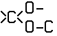 groups, 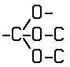 groups or 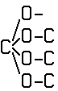 groups**
### **43/00 Ethers; Compounds having  groups,  groups or  groups**
### **45/00 Preparation of compounds having 〉C=O groups bound only to carbon or hydrogen atoms; Preparation of chelates of such compounds**
### **46/00 Preparation of quinones**
### **47/00 Compounds having —CHO groups**
### 47/02 . Saturated compounds having —CHO groups bound to acyclic carbon atoms or to hydrogen
### 47/20 . Unsaturated compounds having —CHO groups bound to acyclic carbon atoms
### 47/28 . Saturated compounds having —CHO groups bound to carbon atoms of rings other than six-membered aromatic rings
### 47/38 . Unsaturated compounds having —CHO groups bound to carbon atoms of rings other than six-membered aromatic rings
### 47/52 . Compounds having —CHO groups bound to carbon atoms of six-membered aromatic rings
### **49/00 Ketones; Ketenes; Dimeric ketenes** (heterocyclic compounds C07D, e.g. beta-lactones C07D 305/00); Ketonic chelates
### **50/00 Quinones** (for quinone methides, <u>see</u> unsaturated ketones with a keto group being part of a ring)
> ### <u>**Note**</u>
> In this group, quinhydrones are classified according to their quinoid part.&nbsp;
### **51/00 Preparation of carboxylic acids or their salts, halides, or anhydrides** (of acids by hydrolysis of oils, fats, or waxes C11C)
### 51/02 . from salts of carboxylic acids
### 51/04 . from carboxylic acid halides
### 51/06 . from carboxylic acid amides
### 51/08 . from nitriles
### 51/083 . from carboxylic acid anhydrides
### 51/09 . from carboxylic acid esters or lactones (saponification of carboxylic acid esters C07C 27/00)
### 51/093 . by hydrolysis of —CX3 groups, X being halogen
### 51/097 . from or <u>via</u> nitro-substituted organic compounds
### 51/10 . by reaction with carbon monoxide
### 51/15 . by reaction of organic compounds with carbon dioxide, e.g. Kolbe-Schmitt synthesis
### 51/16 . by oxidation (C07C 51/10 takes precedence)
### 51/34 . by oxidation with ozone; by hydrolysis of ozonides
### 51/347 . by reactions not involving formation of carboxyl groups
### 51/41 . Preparation of salts of carboxylic acids by conversion of the acids or their salts into salts with the same carboxylic acid part (preparation of soap C11D)
### 51/42 . Separation; Purification; Stabilisation; Use of additives
### 51/54 . Preparation of carboxylic acid anhydrides (by oxidation C07C 51/16)
### 51/58 . Preparation of carboxylic acid halides
### **53/00 Saturated compounds having only one carboxyl group bound to an acyclic carbon atom or hydrogen**
### **55/00 Saturated compounds having more than one carboxyl group bound to acyclic carbon atoms** (cyclic anhydrides C07D)
### **57/00 Unsaturated compounds having carboxyl groups bound to acyclic carbon atoms** (cyclic anhydrides C07D)
### **59/00 Compounds having carboxyl groups bound to acyclic carbon atoms and containing any of the groups OH, O-metal, —CHO, keto, ether,  groups,  groups, or  groups** (cyclic anhydrides C07D)
### **61/00 Compounds having carboxyl groups bound to carbon atoms of rings other than six-membered aromatic rings** (cyclic anhydrides C07D)
### **62/00 Compounds having carboxyl groups bound to carbon atoms of rings other than six-membered aromatic rings and containing any of the groups OH, O-metal, —CHO, keto, ether,  groups,  groups, or  groups** (cyclic anhydrides C07D)
### **63/00 Compounds having carboxyl groups bound to carbon atoms of six-membered aromatic rings** (cyclic anhydrides C07D)
### **65/00 Compounds having carboxyl groups bound to carbon atoms of six-membered aromatic rings and containing any of the groups OH, O-metal, —CHO, keto, ether,  groups,  groups, or  groups** (cyclic anhydrides C07D)
### **66/00 Quinone carboxylic acids** (cyclic anhydrides C07D)
### **67/00 Preparation of carboxylic acid esters**
> ### <u>**Note**</u>
> In this group, lactones used as reactants are considered as being esters.&nbsp;
### **68/00 Preparation of esters of carbonic or haloformic acids**
### **69/00 Esters of carboxylic acids; Esters of carbonic or haloformic acids** (ortho esters, <u>see</u> the relevant groups, e.g. C07C 43/00)
> ### <u>**Note**</u>
> Attention is drawn to Note (6) following the title of this subclass.
### **71/00 Esters of oxyacids of halogens**
### <u>**Compounds containing carbon and nitrogen with or without hydrogen, halogens or oxygen**</u> (irradiation products of cholesterol or its derivatives C07C 401/00; vitamin D derivatives, 9,10-seco cyclopenta[a]phenanthrene or analogues obtained by chemical preparation without irradiation C07C 401/00; derivatives of cyclohexane or of a cyclohexene, having a side-chain containing an acyclic unsaturated part of at least four carbon atoms, this part being directly attached to the cyclohexane or cyclohexene rings C07C 403/00; prostaglandins or derivatives thereof C07C 405/00; peroxy compounds C07C 407/00, C07C 409/00)
### **201/00 Preparation of esters of nitric or nitrous acid or of compounds containing nitro or nitroso groups bound to a carbon skeleton**
### **203/00 Esters of nitric or nitrous acid**
### **205/00 Compounds containing nitro groups bound to a carbon skeleton**
### **207/00 Compounds containing nitroso groups bound to a carbon skeleton**
### **209/00 Preparation of compounds containing amino groups bound to a carbon skeleton**
### **211/00 Compounds containing amino groups bound to a carbon skeleton**
### **213/00 Preparation of compounds containing amino and hydroxy, amino and etherified hydroxy or amino and esterified hydroxy groups bound to the same carbon skeleton**
### **215/00 Compounds containing amino and hydroxy groups bound to the same carbon skeleton**
### **217/00 Compounds containing amino and etherified hydroxy groups bound to the same carbon skeleton**
### **219/00 Compounds containing amino and esterified hydroxy groups bound to the same carbon skeleton**
### **221/00 Preparation of compounds containing amino groups and doubly-bound oxygen atoms bound to the same carbon skeleton**
### **223/00 Compounds containing amino and —CHO groups bound to the same carbon skeleton**
### **225/00 Compounds containing amino groups and doubly-bound oxygen atoms bound to the same carbon skeleton, at least one of the doubly-bound oxygen atoms not being part of a —CHO group, e.g. amino ketones**
### **227/00 Preparation of compounds containing amino and carboxyl groups bound to the same carbon skeleton**
### **229/00 Compounds containing amino and carboxyl groups bound to the same carbon skeleton**
### **231/00 Preparation of carboxylic acid amides**
### **233/00 Carboxylic acid amides**
### **235/00 Carboxylic acid amides, the carbon skeleton of the acid part being further substituted by oxygen atoms**
### **237/00 Carboxylic acid amides, the carbon skeleton of the acid part being further substituted by amino groups**
### **239/00 Compounds containing nitrogen-to-halogen bonds; Hydroxylamino compounds or ethers or esters thereof** (oximes C07C 251/00; hydroxamic acids or derivatives thereof C07C 259/00)
### **241/00 Preparation of compounds containing chains of nitrogen atoms singly-bound to each other, e.g. hydrazines, triazanes**
### **243/00 Compounds containing chains of nitrogen atoms singly-bound to each other, e.g. hydrazines, triazanes**
### **245/00 Compounds containing chains of at least two nitrogen atoms with at least one nitrogen-to-nitrogen multiple bond** (azoxy compound C07C 291/00)
### **247/00 Compounds containing azido groups**
### **249/00 Preparation of compounds containing nitrogen atoms doubly-bound to a carbon skeleton** (of diazo compounds C07C 245/00)
### **251/00 Compounds containing nitrogen atoms doubly- bound to a carbon skeleton** (diazo compounds C07C 245/00)
### **253/00 Preparation of carboxylic acid nitriles** (of cyanogen or compounds thereof C01C 3/00)
### **255/00 Carboxylic acid nitriles** (cyanogen or compounds thereof C01C 3/00)
### **257/00 Compounds containing carboxyl groups, the doubly-bound oxygen atom of a carboxyl group being replaced by a doubly-bound nitrogen atom, this nitrogen atom not being further bound to an oxygen atom, e.g. imino-ethers, amidines**
### **259/00 Compounds containing carboxyl groups, an oxygen atom of a carboxyl group being replaced by a nitrogen atom, this nitrogen atom being further bound to an oxygen atom and not being part of nitro or nitroso groups**
### **261/00 Derivatives of cyanic acid**
### **263/00 Preparation of derivatives of isocyanic acid**
### **265/00 Derivatives of isocyanic acid**
### **267/00 Carbodiimides**
### **269/00 Preparation of derivatives of carbamic acid, i.e. compounds containing any of the groups  the nitrogen atom not being part of nitro or nitroso groups**
### **271/00 Derivatives of carbamic acid, i.e. compounds containing any of the groups 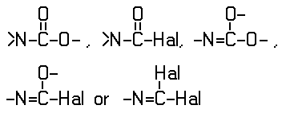 the nitrogen atom not being part of nitro or nitroso groups**
### **273/00 Preparation of urea or its derivatives, i.e. compounds containing any of the groups 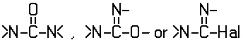 the nitrogen atoms not being part of nitro or nitroso groups**
### **275/00 Derivatives of urea, i.e. compounds containing any of the groups  the nitrogen atoms not being part of nitro or nitroso groups**
### **277/00 Preparation of guanidine or its derivatives, i.e. compounds containing the group 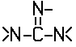 the singly-bound nitrogen atoms not being part of nitro or nitroso groups**
### **279/00 Derivatives of guanidine, i.e. compounds containing the group  the singly-bound nitrogen atoms not being part of nitro or nitroso groups**
### **281/00 Derivatives of carbonic acid containing functional groups covered by groups C07C 269/00 to C07C 279/00 in which at least one nitrogen atom of these functional groups is further bound to another nitrogen atom not being part of a nitro or nitroso group**
### **291/00 Compounds containing carbon and nitrogen and having functional groups not covered by groups C07C 201/00 to C07C 281/00**
### <u>**Compounds containing carbon together with sulfur, selenium, or tellurium, with or without hydrogen, halogens, oxygen, or nitrogen**</u> (irradiation products of cholesterol or its derivatives C07C 401/00; vitamin D derivatives, 9,10-seco cyclopenta[a]phenanthrene or analogues obtained by chemical preparation without irradiation C07C 401/00; derivatives of cyclohexane or of a cyclohexene, having a side-chain containing an acyclic unsaturated part of at least four carbon atoms, this part being directly attached to the cyclohexane or cyclohexene rings C07C 403/00; prostaglandins or derivatives thereof C07C 405/00; peroxy compounds C07C 407/00, C07C 409/00)
### **301/00 Esters of sulfurous acid** (cyclic esters C07D)
### **303/00 Preparation of esters or amides of sulfuric acids; Preparation of sulfonic acids or of their esters, halides, anhydrides or amides**
### **305/00 Esters of sulfuric acids** (cyclic esters C07D)
### **307/00 Amides of sulfuric acids, i.e. compounds having singly-bound oxygen atoms of sulfate groups replaced by nitrogen atoms, not being part of nitro or nitroso groups**
### **309/00 Sulfonic acids; Halides, esters, or anhydrides thereof** (chemical modification of petroleum waxes C10G 73/00)
### **311/00 Amides of sulfonic acids, i.e. compounds having singly-bound oxygen atoms of sulfo groups replaced by nitrogen atoms, not being part of nitro or nitroso groups**
### **313/00 Sulfinic acids; Sulfenic acids; Halides, esters or anhydrides thereof; Amides of sulfinic or sulfenic acids, i.e. compounds having singly-bound oxygen atoms of sulfinic or sulfenic groups replaced by nitrogen atoms, not being part of nitro or nitroso groups**
### **315/00 Preparation of sulfones; Preparation of sulfoxides**
### **317/00 Sulfones; Sulfoxides**
### **319/00 Preparation of thiols, sulfides, hydropolysulfides or polysulfides**
### **321/00 Thiols, sulfides, hydropolysulfides or polysulfides**
### **323/00 Thiols, sulfides, hydropolysulfides or polysulfides substituted by halogen, oxygen or nitrogen atoms, or by sulfur atoms not being part of thio groups**
### **325/00 Thioaldehydes; Thioketones; Thioquinones; Oxides thereof**
### **327/00 Thiocarboxylic acids**
### **329/00 Thiocarbonic acids; Halides, esters or anhydrides thereof**
### **331/00 Derivatives of thiocyanic acid or of isothiocyanic acid**
### **333/00 Derivatives of thiocarbamic acids, i.e. compounds containing any of the groups 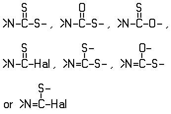 the nitrogen atom not being part of nitro or nitroso groups**
### **335/00 Thioureas, i.e. compounds containing any of the groups 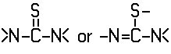 the nitrogen atoms not being part of nitro or nitroso groups**
### **337/00 Derivatives of thiocarbonic acids containing functional groups covered by groups C07C 333/00 or C07C 335/00 in which at least one nitrogen atom of these functional groups is further bound to another nitrogen atom not being part of a nitro or nitroso group**
### **381/00 Compounds containing carbon and sulfur and having functional groups not covered by groups C07C 301/00 to C07C 337/00**
### **391/00 Compounds containing selenium**
### **395/00 Compounds containing tellurium**
***
### **401/00 Irradiation products of cholesterol or its derivatives; Vitamin D derivatives, 9,10-seco cyclopenta[a]phenanthrene or analogues obtained by chemical preparation without irradiation**
### **403/00 Derivatives of cyclohexane or of a cyclohexene, having a side-chain containing an acyclic unsaturated part of at least four carbon atoms, this part being directly attached to the cyclohexane or cyclohexene rings, e.g. vitamin A, beta-carotene, beta-ionone**
### **405/00 Compounds containing a five-membered ring having two side-chains in ortho position to each other, and having oxygen atoms directly attached to the ring in ortho position to one of the side-chains, one side-chain containing, not directly attached to the ring, a carbon atom having three bonds to hetero atoms with at the most one bond to halogen, and the other side-chain having oxygen atoms attached in gamma-position to the ring, e.g. prostaglandins**
### **407/00 Preparation of peroxy compounds**
### **409/00 Peroxy compounds**
***
### **C07D HETEROCYCLIC COMPOUNDS**
> ### <u>**Note**</u>
> 1. This subclass <u>does not cover</u> compounds containing saccharide radicals (as defined in Note (3) following the title of subclass C07H), which are covered by subclass C07H.
> 2. In this subclass, in compounds containing a hetero ring covered by group C07D 295/00 and at least one other hetero ring, the hetero ring covered by group C07D 295/00 is considered as an acyclic chain containing nitrogen atoms.
> 3. In this subclass, the following terms or expressions are used with the meanings indicated:
> 		- "hetero ring" is a ring having at least one halogen, nitrogen, oxygen, sulfur, selenium, or tellurium atom as a ring member;
> 		- "bridged" means the presence of at least one fusion other than ortho, peri or spiro;
> 		- two rings are "condensed" if they share at least one ring member, i.e. "spiro" and "bridged" are considered as condensed;
> 		- "condensed ring system" is a ring system in which all rings are condensed among themselves;
> 		- "number of relevant rings" in a condensed ring system equals the number of scissions necessary to convert the ring system into one acyclic chain;
> 		- "relevant rings" in a condensed ring system, i.e. the rings which taken together describe all the links between every atom of the ring system, are chosen according to the following criteria consecutively:
> 			- lowest number of ring members;
> 			- highest number of hetero atoms as ring members;
> 			- lowest number of members shared with other rings;
> 			- last place in the classification scheme.
> 4. Attention is drawn to Note (3) after class C07, which defines the last place priority rule applied in the range of subclasses C07C to C07K and within these subclasses.
> 5. Therapeutic activity of compounds is further classified in subclass A61P.
> 6. In this subclass, in the absence of an indication to the contrary:
> 		- compounds having only one hetero ring are classified in the last appropriate place in one of the groups C07D 203/00 to C07D 347/00. The same applies for compounds having more hetero rings covered by the same main group, neither condensed among themselves nor condensed with a common carbocyclic ring system;
> 		- compounds having two or more hetero rings covered by different main groups neither condensed among themselves nor condensed with a common carbocyclic ring system are classified in the last appropriate place in one of the groups C07D 401/00 to C07D 421/00;
> 		- compounds having two or more relevant hetero rings, covered by the same or by different main groups, which are condensed among themselves or condensed with a common carbocyclic ring system, are classified in the last appropriate place in one of the groups C07D 451/00 to C07D 519/00.
> 7. In this subclass:
> 		- where a compound may exist in tautomeric forms, it is classified as though existing in the form which is classified last in the system. Therefore, double bonds between ring members and non-ring members and double bonds between ring members themselves are considered equivalent in determining the degree of hydrogenation of the ring. Formulae are considered to be written in Kekule form;
> 		- hydrocarbon radicals containing a carbocyclic ring and an acyclic chain by which it is linked to the hetero ring and being substituted on both the carbocyclic ring and the acyclic chain by hetero atoms or by carbon atoms having three bonds to hetero atoms with at the most one bond to halogen, are classified according to the substituents on the acyclic chain. For example, the compound
> 			- 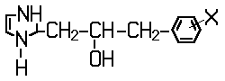 is classified in group C07D 233/00, and the compound 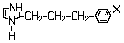
> 			- is classified in group C07D 233/00, where X —NH2, —NHCOCH3, or —COOCH3.
> 8. Individual components of heterocyclic compounds, such as essential substituents, single hetero rings and single condensed systems, which are considered to represent information of interest for search, may also be classified according to Note (6). This can, for example, be the case when it is considered of interest to enable searching of heterocyclic compounds using a combination of classification symbols. Such non-obligatory classification should be given as "additional information".
### <u>**Subclass Index**</u>
+ COMPOUNDS CONTAINING ONE HETERO RING
	+ HAVING NITROGEN AS RING HETERO ATOM
		+ only nitrogen atoms
			+ one nitrogen atom
				+ Polymethyleneimine		295/00
				+ Preparation of lactams		201/00
				+ three-membered ring		203/00
				+ four-membered ring		205/00
				+ five-membered ring		207/00, 209/00
				+ six-membered ring		211/00, 213/00, 215/00, 217/00, 219/00, 221/00
				+ seven-membered ring		223/00
				+ Other compounds		225/00, 227/00
			+ two nitrogen atoms
				+ four-membered ring		229/00
				+ five-membered ring		231/00, 233/00, 235/00
				+ six-membered ring		237/00, 239/00, 241/00
					+ Piperazine		295/00
				+ seven-membered ring		243/00
				+ Other compounds		245/00, 247/00
			+ three nitrogen atoms
				+ five-membered ring		249/00
				+ six-membered ring		251/00, 253/00
				+ Other compounds		255/00
			+ four or more nitrogen atoms		257/00, 259/00
		+ nitrogen and oxygen atoms
			+ five-membered ring		261/00, 263/00, 271/00
			+ six-membered ring		265/00, 273/00
				+ morpholine		295/00
			+ Other compounds		267/00, 269/00, 273/00
		+ nitrogen and sulfur atoms
			+ five-membered ring		275/00, 277/00, 285/00
			+ six-membered ring		279/00, 285/00
				+ Thiomorpholine		295/00
			+ Other compounds		281/00, 283/00, 285/00
		+ nitrogen, oxygen, and sulfur atoms		291/00
	+ HAVING OXYGEN AS RING HETERO ATOM
		+ only oxygen atoms
			+ one oxygen atom
				+ three-membered ring		301/00, 303/00
				+ four-membered ring		305/00
				+ five-membered ring		307/00
				+ six-membered ring		309/00, 311/00
				+ Other compounds		313/00, 315/00
			+ two oxygen atoms
				+ five-membered ring		317/00
				+ six-membered ring		319/00
				+ Other compounds		321/00
			+ three or more oxygen atoms		323/00
				+ Other compounds		325/00
		+ oxygen and nitrogen atoms
			+ five-membered ring		261/00, 263/00, 271/00
			+ six-membered ring		265/00, 273/00
				+ Morpholine		295/00
			+ Other compounds		267/00, 269/00, 273/00
		+ oxygen and sulfur atoms		327/00
		+ oxygen, nitrogen and sulfur atoms		291/00
	+ HAVING SULFUR AS RING HETERO ATOM
		+ only sulfur atoms
			+ one sulfur atom
				+ five-membered ring		333/00
				+ six-membered ring		335/00
				+ Other compounds		331/00, 337/00
			+ two or more sulfur atoms		339/00, 341/00
		+ sulfur and nitrogen atoms
			+ five-membered ring		275/00, 277/00, 285/00
			+ six-membered ring		279/00, 285/00
				+ Thiomorpholine		295/00
			+ Other compounds		281/00, 283/00, 285/00
		+ sulfur and oxygen atoms		327/00
		+ sulfur, nitrogen, and oxygen atoms		291/00
	+ HAVING SELENIUM OR TELLURIUM AS RING HETERO ATOM
		+ only selenium or tellurium atoms		345/00
		+ together with nitrogen atoms		293/00
		+ together with oxygen atoms		329/00
		+ together with sulfur atoms		343/00
	+ HAVING HALOGEN AS RING HETERO ATOM		347/00
+ COMPOUNDS CONTAINING TWO OR MORE HETERO RINGS
	+ IN THE SAME RING SYSTEM
		+ HAVING NITROGEN AS RING HETERO ATOM
			+ only nitrogen
				+ at least one six-membered ring with one nitrogen atom		471/00
					+ Tropane, granatane		451/00
					+ Quinine, quinuclidine, isoquinuclidine		453/00
					+ Emetine, berberine		455/00
					+ Lysergic acid, ergot alkaloids		457/00
					+ Yohimbine		459/00
					+ Vincamine		461/00
					+ Carbacephalosporins		463/00
				+ Other compounds		487/00, 507/00, 513/00
					+ Purine		473/00
					+ Pteridine		475/00
					+ Thienamycin		477/00
			+ nitrogen and oxygen		491/00, 498/00, 507/00
				+ Morphine		489/00
				+ Oxapenicillins		503/00
				+ Oxacephalosporins		505/00
			+ nitrogen and sulfur		507/00, 513/00
				+ Penicillins		499/00
				+ Cephalosporins		501/00
			+ nitrogen, oxygen, and sulfur		507/00, 515/00
		+ HAVING OXYGEN AS RING HETERO ATOM
			+ only oxygen		493/00
			+ oxygen and nitrogen		491/00, 498/00, 507/00
				+ Morphine		489/00
				+ Oxapenicillins		503/00
				+ Oxacephalosporins		505/00
			+ oxygen and sulfur		497/00
			+ oxygen, nitrogen, and sulfur		507/00, 515/00
		+ HAVING SULFUR AS RING HETERO ATOM
			+ only sulfur in a particular ring		495/00
			+ sulfur and oxygen		497/00
			+ sulfur, nitrogen, and oxygen		507/00, 515/00
		+ HAVING SELENIUM, TELLURIUM, OR HALOGEN AS RING HETERO ATOM		517/00
	+ IN DIFFERENT RING SYSTEMS, EACH CONTAINING ONLY ONE HETERO RING
		+ HAVING NITROGEN AS RING HETERO ATOM
			+ only nitrogen
				+ at least one six-membered ring with one nitrogen atom		401/00
				+ Other compounds		403/00
			+ nitrogen and oxygen		405/00, 413/00
			+ nitrogen and sulfur		417/00
				+ thiamine		415/00
			+ nitrogen, oxygen, and sulfur		419/00
		+ HAVING OXYGEN AS RING HETERO ATOM
			+ only oxygen		407/00
			+ oxygen and nitrogen		405/00, 413/00
			+ oxygen and sulfur		411/00
			+ oxygen, nitrogen, and sulfur		419/00
		+ HAVING SULFUR AS RING HETERO ATOM
			+ only sulfur in a particular ring		409/00
			+ sulfur and nitrogen		417/00
				+ thiamine		415/00
			+ sulfur and oxygen		411/00
			+ sulfur, nitrogen, and oxygen		419/00
		+ HAVING SELENIUM, TELLURIUM, OR HALOGEN AS RING HETERO ATOM		421/00
	+ COMPOUNDS CONTAINING TWO OR MORE RING SYSTEMS, HAVING EACH TWO OR MORE HETERO RINGS		519/00
	+ ALKALOIDS
		+ Emetine		455/00
		+ Ergot		457/00, 519/00
		+ Granatanine		451/00
		+ Morphine		489/00
		+ Nicotine		401/00
		+ Papaverine		217/00
		+ Quinine		453/00
		+ Strychnine		498/00
		+ Tropane		451/00
	+ CEPHALOSPORIN		501/00
	+ PENICILLIN		499/00
	+ PTERIDINE		475/00
	+ THIENAMYCIN		477/00
	+ PURINE		473/00
	+ THIAMINE		415/00
	+ COMPOUNDS CONTAINING UNSPECIFIED HETERO RINGS		521/00
***
### <u>**Heterocyclic compounds having only nitrogen as ring hetero atom**</u>
### **201/00 Preparation, separation, purification, or stabilisation of unsubstituted lactams**
### **203/00 Heterocyclic compounds containing three-membered rings with one nitrogen atom as the only ring hetero atom**
### **205/00 Heterocyclic compounds containing four-membered rings with one nitrogen atom as the only ring hetero atom**
### **207/00 Heterocyclic compounds containing five-membered rings not condensed with other rings, with one nitrogen atom as the only ring hetero atom**
> ### <u>**Note**</u>
> Pyrrolidines having only hydrogen atoms attached to the ring carbon atoms are classified in group C07D 295/00.&nbsp;
### **209/00 Heterocyclic compounds containing five-membered rings, condensed with other rings, with one nitrogen atom as the only ring hetero atom**
### **211/00 Heterocyclic compounds containing hydrogenated pyridine rings, not condensed with other rings**
> ### <u>**Note**</u>
> 1. In this group, the following term is used with the meaning indicated:
> 		- "hydrogenated" means having less than three double bonds between ring members or between ring members and non-ring members.&nbsp;
> 2. Piperidines having only hydrogen atoms attached to ring carbon atoms are classified in group C07D 295/00.&nbsp;
### **213/00 Heterocyclic compounds containing six-membered rings, not condensed with other rings, with one nitrogen atom as the only ring hetero atom and three or more double bonds between ring members or between ring members and non-ring members**
### **215/00 Heterocyclic compounds containing quinoline or hydrogenated quinoline ring systems**
### **217/00 Heterocyclic compounds containing isoquinoline or hydrogenated isoquinoline ring systems**
### **219/00 Heterocyclic compounds containing acridine or hydrogenated acridine ring systems**
### **221/00 Heterocyclic compounds containing six-membered rings having one nitrogen atom as the only ring hetero atom, not provided for by groups C07D 211/00 to C07D 219/00**
### **223/00 Heterocyclic compounds containing seven-membered rings having one nitrogen atom as the only ring hetero atom**
> ### <u>**Note**</u>
> Hexamethylene imines or 3-azabicyclo [3.2.2] nonanes, having only hydrogen atoms attached to the ring carbon atoms, are classified in group C07D 295/00.&nbsp;
### **225/00 Heterocyclic compounds containing rings of more than seven members having one nitrogen atom as the only ring hetero atom**
> ### <u>**Note**</u>
> Polymethyleneimines with at least five ring members and having only hydrogen atoms attached to the ring carbon atoms are classified in group C07D 295/00.&nbsp;
### **227/00 Heterocyclic compounds containing rings having one nitrogen atom as the only ring hetero atom, according to more than one of groups C07D 203/00 to C07D 225/00**
> ### <u>**Note**</u>
> Polymethyleneimines with at least five ring members and having only hydrogen atoms attached to the ring carbon atoms are classified in group C07D 295/00.&nbsp;
### **229/00 Heterocyclic compounds containing rings of less than five members having two nitrogen atoms as the only ring hetero atoms**
### **231/00 Heterocyclic compounds containing 1,2-diazole or hydrogenated 1,2-diazole rings**
### **233/00 Heterocyclic compounds containing 1,3-diazole or hydrogenated 1,3-diazole rings, not condensed with other rings**
### **235/00 Heterocyclic compounds containing 1,3-diazole or hydrogenated 1,3-diazole rings, condensed with other rings**
### **237/00 Heterocyclic compounds containing 1,2-diazine or hydrogenated 1,2-diazine rings**
### **239/00 Heterocyclic compounds containing 1,3-diazine or hydrogenated 1,3-diazine rings**
### **241/00 Heterocyclic compounds containing 1,4-diazine or hydrogenated 1,4-diazine rings**
> ### <u>**Note**</u>
> Piperazines with only hydrogen atoms directly attached to ring carbon atoms are classified in group C07D 295/00.&nbsp;
### **243/00 Heterocyclic compounds containing seven-membered rings having two nitrogen atoms as the only ring hetero atoms**
### **245/00 Heterocyclic compounds containing rings of more than seven members having two nitrogen atoms as the only ring hetero atoms**
### **247/00 Heterocyclic compounds containing rings having two nitrogen atoms as the only ring hetero atoms, according to more than one of groups C07D 229/00 to C07D 245/00**
### **249/00 Heterocyclic compounds containing five-membered rings having three nitrogen atoms as the only ring hetero atoms**
### **251/00 Heterocyclic compounds containing 1,3,5-triazine rings**
### **253/00 Heterocyclic compounds containing six-membered rings having three nitrogen atoms as the only ring hetero atoms, not provided for by group C07D 251/00**
### **255/00 Heterocyclic compounds containing rings having three nitrogen atoms as the only ring hetero atoms, not provided for by groups C07D 249/00 to C07D 253/00**
### **257/00 Heterocyclic compounds containing rings having four nitrogen atoms as the only ring hetero atoms**
### **259/00 Heterocyclic compounds containing rings having more than four nitrogen atoms as the only ring hetero atoms**
### <u>**Heterocyclic compounds having nitrogen and oxygen as the only ring hetero atoms**</u>
### **261/00 Heterocyclic compounds containing 1,2-oxazole or hydrogenated 1,2-oxazole rings**
### **263/00 Heterocyclic compounds containing 1,3-oxazole or hydrogenated 1,3-oxazole rings**
### **265/00 Heterocyclic compounds containing six-membered rings having one nitrogen atom and one oxygen atom as the only ring hetero atoms**
> ### <u>**Note**</u>
> Morpholines having only hydrogen atoms attached to the ring carbon atoms are classified in group C07D 295/00.&nbsp;
### **267/00 Heterocyclic compounds containing rings of more than six members having one nitrogen atom and one oxygen atom as the only ring hetero atoms**
### **269/00 Heterocyclic compounds containing rings having one nitrogen atom and one oxygen atom as the only ring hetero atoms according to more than one of groups C07D 261/00 to C07D 267/00**
### **271/00 Heterocyclic compounds containing five-membered rings having two nitrogen atoms and one oxygen atom as the only ring hetero atoms**
### **273/00 Heterocyclic compounds containing rings having nitrogen and oxygen atoms as the only ring hetero atoms, not provided for by groups C07D 261/00 to C07D 271/00**
### <u>**Heterocyclic compounds having nitrogen and sulfur as the only ring hetero atoms**</u>
### **275/00 Heterocyclic compounds containing 1, 2-thiazole or hydrogenated 1,2-thiazole rings**
### **277/00 Heterocyclic compounds containing 1,3-thiazole or hydrogenated 1,3-thiazole rings**
### **279/00 Heterocyclic compounds containing six-membered rings having one nitrogen atom and one sulfur atom as the only ring hetero atoms**
> ### <u>**Note**</u>
> Thiomorpholines having only hydrogen atoms attached to the ring carbon atoms are classified in group C07D 295/00.&nbsp;
### **281/00 Heterocyclic compounds containing rings of more than six members having one nitrogen atom and one sulfur atom as the only ring hetero atoms**
### **283/00 Heterocyclic compounds containing rings having one nitrogen atom and one sulfur atom as the only ring hetero atoms, according to more than one of groups C07D 275/00 to C07D 281/00**
### **285/00 Heterocyclic compounds containing rings having nitrogen and sulfur atoms as the only ring hetero atoms, not provided for by groups C07D 275/00 to C07D 283/00**
***
### **291/00 Heterocyclic compounds containing rings having nitrogen, oxygen and sulfur atoms as the only ring hetero atoms**
### **293/00 Heterocyclic compounds containing rings having nitrogen and selenium or nitrogen and tellurium, with or without oxygen or sulfur atoms, as the ring hetero atoms**
### **295/00 Heterocyclic compounds containing polymethylene-imine rings with at least five ring members, 3-azabicyclo [3.2.2] nonane, piperazine, morpholine or thiomorpholine rings, having only hydrogen atoms directly attached to the ring carbon atoms**
### <u>**Heterocyclic compounds having oxygen atoms, with or without sulfur, selenium, or tellurium atoms, as ring hetero atoms**</u>
### **301/00 Preparation of oxiranes**
### **303/00 Compounds containing three-membered rings having one oxygen atom as the only ring hetero atom**
### **305/00 Heterocyclic compounds containing four-membered rings having one oxygen atom as the only ring hetero atoms**
### **307/00 Heterocyclic compounds containing five-membered rings having one oxygen atom as the only ring hetero atom**
### **309/00 Heterocyclic compounds containing six-membered rings having one oxygen atom as the only ring hetero atom, not condensed with other rings**
### **311/00 Heterocyclic compounds containing six-membered rings having one oxygen atom as the only hetero atom, condensed with other rings**
### **313/00 Heterocyclic compounds containing rings of more than six members having one oxygen atom as the only ring hetero atom**
### **315/00 Heterocyclic compounds containing rings having one oxygen atom as the only ring hetero atom according to more than one of groups C07D 303/00 to C07D 313/00**
### **317/00 Heterocyclic compounds containing five-membered rings having two oxygen atoms as the only ring hetero atoms**
### **319/00 Heterocyclic compounds containing six-membered rings having two oxygen atoms as the only ring hetero atoms**
### **321/00 Heterocyclic compounds containing rings having two oxygen atoms as the only ring hetero atoms, not provided for by groups C07D 317/00 to C07D 319/00**
### **323/00 Heterocyclic compounds containing more than two oxygen atoms as the only ring hetero atoms**
### **325/00 Heterocyclic compounds containing rings having oxygen as the only ring hetero atom according to more than one of groups C07D 303/00 to C07D 323/00**
### **327/00 Heterocyclic compounds containing rings having oxygen and sulfur atoms as the only ring hetero atoms**
### **329/00 Heterocyclic compounds containing rings having oxygen and selenium or oxygen and tellurium atoms as the only ring hetero atoms**
### <u>**Heterocyclic compounds having sulfur, selenium, or tellurium atoms as the only ring hetero atoms**</u>
### **331/00 Heterocyclic compounds containing rings of less than five members, having one sulfur atom as the only ring hetero atom**
### **333/00 Heterocyclic compounds containing five-membered rings having one sulfur atom as the only ring hetero atom**
### **335/00 Heterocyclic compounds containing six-membered rings having one sulfur atom as the only ring hetero atom**
### **337/00 Heterocyclic compounds containing rings of more than six members having one sulfur atom as the only ring hetero atom**
### **339/00 Heterocyclic compounds containing rings having two sulfur atoms as the only ring hetero atoms**
### **341/00 Heterocyclic compounds containing rings having three or more sulfur atoms as the only ring hetero atoms**
### **343/00 Heterocyclic compounds containing rings having sulfur and selenium or sulfur and tellurium atoms as the only ring hetero atoms**
### **345/00 Heterocyclic compounds containing rings having selenium or tellurium atoms as the only ring hetero atoms**
***
### **347/00 Heterocyclic compounds containing rings having halogen atoms as ring hetero atoms**
### <u>**Heterocyclic compounds containing two or more hetero rings**</u>
> ### <u>**Note**</u>
> Groups C07D 401/00 to C07D 421/00<u>cover</u> compounds containing two or more relevant hetero rings at least two of which are covered by different main groups of groups C07D 203/00 to C07D 347/00, neither condensed among themselves nor condensed with a common carbocyclic ring or ring system.&nbsp;
### **401/00 Heterocyclic compounds containing two or more hetero rings, having nitrogen atoms as the only ring hetero atoms, at least one ring being a six-membered ring with only one nitrogen atom**
### **403/00 Heterocyclic compounds containing two or more hetero rings, having nitrogen atoms as the only ring hetero atoms, not provided for by group C07D 401/00**
### **405/00 Heterocyclic compounds containing both one or more hetero rings having oxygen atoms as the only ring hetero atoms, and one or more rings having nitrogen as the only ring hetero atom**
### **407/00 Heterocyclic compounds containing two or more hetero rings, at least one ring having oxygen atoms as the only ring hetero atoms, not provided for by group C07D 405/00**
### **409/00 Heterocyclic compounds containing two or more hetero rings, at least one ring having sulfur atoms as the only ring hetero atoms**
### **411/00 Heterocyclic compounds containing two or more hetero rings, at least one ring having oxygen and sulfur atoms as the only ring hetero atoms**
### **413/00 Heterocyclic compounds containing two or more hetero rings, at least one ring having nitrogen and oxygen atoms as the only ring hetero atoms**
### **415/00 Heterocyclic compounds containing the thiamine skeleton**
### **417/00 Heterocyclic compounds containing two or more hetero rings, at least one ring having nitrogen and sulfur atoms as the only ring hetero atoms, not provided for by group C07D 415/00**
### **419/00 Heterocyclic compounds containing two or more hetero rings, at least one ring having nitrogen, oxygen, and sulfur atoms as the only ring hetero atoms**
### **421/00 Heterocyclic compounds containing two or more hetero rings, at least one ring having selenium, tellurium, or halogen atoms as ring hetero atoms**
### <u>**Heterocyclic compounds containing condensed hetero ring systems**</u>
> ### <u>**Note**</u>
> 1. Groups C07D 451/00 to C07D 517/00<u>cover</u> compounds containing one system of two or more relevant hetero rings condensed among themselves or condensed with a common carbocyclic ring system, with or without other non-condensed hetero rings.&nbsp;
> 2. For the purpose of classification in groups C07D 451/00 to C07D 519/00, the degree of hydrogenation of the ring system is not taken into consideration.&nbsp;
> 3. For the purpose of classification in groups C07D 451/00 to C07D 463/00, C07D 473/00 to C07D 477/00, C07D 489/00, C07D 499/00 to C07D 507/00, the wording of the groups has to be understood, in the absence of an indication to the contrary, as including ring systems further condensed with carbocyclic rings or ring systems, but excluding ring systems further condensed with other hetero rings, either directly or through a common carbocyclic ring system, e.g. sparteine 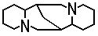 is classified in group C07D 471/00, not in group C07D 455/00.&nbsp;
> 4. In groups C07D 471/00, C07D 487/00, C07D 491/00 to C07D 498/00 or C07D 513/00 to C07D 517/00, the subdivision is based on the number of relevant hetero rings.&nbsp;
### **451/00 Heterocyclic compounds containing 8-azabicyclo [3.2.1] octane, 9-azabicyclo [3.3.1] nonane, or 3-oxa-9-azatricyclo [3.3.1.02,4] nonane ring systems, e.g. tropane or granatane alkaloids, scopolamine; Cyclic acetals thereof**
### **453/00 Heterocyclic compounds containing quinuclidine or iso-quinuclidine ring systems, e.g. quinine alkaloids**
### **455/00 Heterocyclic compounds containing quinolizine ring systems, e.g. emetine alkaloids, protoberberine; Alkylenedioxy derivatives of dibenzo [a, g] quinolizines, e.g. berberine**
### **457/00 Heterocyclic compounds containing indolo [4, 3-f, g] quinoline ring systems, e.g. derivatives of ergoline, of the formula: 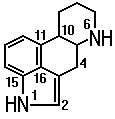, e.g. lysergic acid** (compounds of the cyclic peptide type derived from ergotamane C07D 519/00)
> ### <u>**Note**</u>
> The numbering may be different according to the RING INDEX and given by the formula: 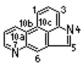. &nbsp;
### **459/00 Heterocyclic compounds containing benz [g] indolo [2, 3-a] quinolizine ring systems, e.g. yohimbine; 16, 18-lactones thereof, e.g. reserpic acid lactone**
### **461/00 Heterocyclic compounds containing indolo [3, 2, 1-d, e] pyrido [3, 2, 1-i, j] [1, 5]-naphthyridine ring systems, e.g. vincamine** (dimeric indolo alkaloids C07D 519/00)
### **463/00 Heterocyclic compounds containing 1-azabicyclo [4.2.0] octane ring systems, i.e. compounds containing a ring system of the formula: 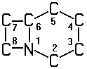, e.g. carbacephalosporins; Such ring systems being further condensed, e.g. 2,3-condensed with an oxygen-, nitrogen- or sulfur-containing hetero ring**
### **471/00 Heterocyclic compounds containing nitrogen atoms as the only ring hetero atoms in the condensed system, at least one ring being a six-membered ring with one nitrogen atom, not provided for by groups C07D 451/00 to C07D 463/00**
### **473/00 Heterocyclic compounds containing purine ring systems**
### **475/00 Heterocyclic compounds containing pteridine ring systems**
### **477/00 Heterocyclic compounds containing 1-azabicyclo [3.2.0] heptane ring systems, i.e. compounds containing a ring system of the formula: 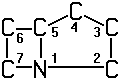, e.g. carbapenicillins, thienamycins; Such ring systems being further condensed, e.g. 2,3-condensed with an oxygen-, nitrogen- or sulfur-containing hetero ring**
### **487/00 Heterocyclic compounds containing nitrogen atoms as the only ring hetero atoms in the condensed system, not provided for by groups C07D 451/00 to C07D 477/00**
### **489/00 Heterocyclic compounds containing 4aH-8, 9 c- Iminoethano-phenanthro [4, 5-b, c, d] furan ring systems, e.g. derivatives of [4, 5-epoxy]-morphinan of the formula: 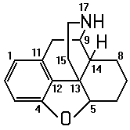**
> ### <u>**Note**</u>
> The numbering may be different according to the RING INDEX and given by the formula: 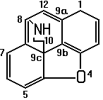. &nbsp;
### **491/00 Heterocyclic compounds containing in the condensed ring system both one or more rings having oxygen atoms as the only ring hetero atoms and one or more rings having nitrogen atoms as the only ring hetero atoms, not provided for by groups C07D 451/00 to C07D 459/00, C07D 463/00, C07D 477/00 or C07D 489/00**
### **493/00 Heterocyclic compounds containing oxygen atoms as the only ring hetero atoms in the condensed system**
### **495/00 Heterocyclic compounds containing in the condensed system at least one hetero ring having sulfur atoms as the only ring hetero atoms**
### **497/00 Heterocyclic compounds containing in the condensed system at least one hetero ring having oxygen and sulfur atoms as the only ring hetero atoms**
### **498/00 Heterocyclic compounds containing in the condensed system at least one hetero ring having nitrogen and oxygen atoms as the only ring hetero atoms** (4-oxa-1-azabicyclo [3.2.0] heptanes, e.g. oxapenicillins C07D 503/00; 5-oxa-1-azabicyclo [4.2.0] octanes, e.g. oxacephalosporins C07D 505/00; analogues thereof having ring oxygen atoms in other position C07D 507/00)
### **499/00 Heterocyclic compounds containing 4-thia-1-azabicyclo [3.2.0] heptane ring systems, i.e. compounds containing a ring system of the formula: 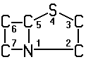, e.g. penicillins, penems; Such ring systems being further condensed, e.g. 2,3-condensed with an oxygen-, nitrogen- or sulfur-containing hetero ring**
### **501/00 Heterocyclic compounds containing 5-thia-1-azabicyclo [4.2.0] octane ring systems, i.e. compounds containing a ring system of the formula: 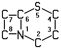, e.g. cephalosporins; Such ring systems being further condensed, e.g. 2,3-condensed with an oxygen-, nitrogen- or sulfur-containing hetero ring**
### **503/00 Heterocyclic compounds containing 4-oxa-1-azabicyclo [3.2.0] heptane ring systems, i.e. compounds containing a ring system of the formula: 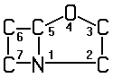, e.g. oxapenicillins, clavulanic acid derivatives; Such ring systems being further condensed, e.g. 2,3-condensed with an oxygen-, nitrogen- or sulfur-containing hetero ring**
### **505/00 Heterocyclic compounds containing 5-oxa-1-azabicyclo [4.2.0] octane ring systems, i.e. compounds containing a ring system of the formula: 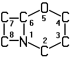, e.g. oxacephalosporins; Such ring systems being further condensed, e.g. 2,3-condensed with an oxygen-, nitrogen- or sulfur-containing hetero ring**
### **507/00 Heterocyclic compounds containing a condensed beta-lactam ring system, not provided for by groups C07D 463/00, C07D 477/00 or C07D 499/00 to C07D 505/00; Such ring systems being further condensed**
### **513/00 Heterocyclic compounds containing in the condensed system at least one hetero ring having nitrogen and sulfur atoms as the only ring hetero atoms, not provided for in groups C07D 463/00, C07D 477/00 or C07D 499/00 to C07D 507/00**
### **515/00 Heterocyclic compounds containing in the condensed system at least one hetero ring having nitrogen, oxygen, and sulfur atoms as the only ring hetero atoms, not provided for in groups C07D 463/00, C07D 477/00 or C07D 499/00 to C07D 507/00**
### **517/00 Heterocyclic compounds containing in the condensed system at least one hetero ring having selenium, tellurium, or halogen atoms as ring hetero atoms**
### **519/00 Heterocyclic compounds containing more than one system of two or more relevant hetero rings condensed among themselves or condensed with a common carbocyclic ring system not provided for in groups C07D 453/00 or C07D 455/00**
***
### **521/00 Heterocyclic compounds containing unspecified hetero rings**
***
### **C07F ACYCLIC, CARBOCYCLIC, OR HETEROCYCLIC COMPOUNDS CONTAINING ELEMENTS OTHER THAN CARBON, HYDROGEN, HALOGEN, OXYGEN, NITROGEN, SULFUR, SELENIUM, OR TELLURIUM** (metal-containing porphyrins C07D 487/00)
> ### <u>**Note**</u>
> 1. Attention is drawn to Note (3) after class C07, which defines the last place priority rule applied in the range of subclasses C07C to C07K and within these subclasses.
> 2. Attention is drawn to Note (6) following the title of class C07.
> 3. Therapeutic activity of compounds is further classified in subclass A61P.
> 4. In this subclass, organic acid salts, alcoholates, phenates, chelates or mercaptides are classified as the parent compounds.
### **1/00 Compounds containing elements of the 1st Group of the Periodic System**
### **3/00 Compounds containing elements of the 2nd Group of the Periodic System**
### **5/00 Compounds containing elements of the 3rd Group of the Periodic System**
### **7/00 Compounds containing elements of the 4th Group of the Periodic System**
### **9/00 Compounds containing elements of the 5th Group of the Periodic System**
### **11/00 Compounds containing elements of the 6th Group of the Periodic System**
### **13/00 Compounds containing elements of the 7th Group of the Periodic System**
### **15/00 Compounds containing elements of the 8th Group of the Periodic System**
### **17/00 Metallocenes**
### **19/00 Metal compounds according to more than one of main groups C07F 1/00 to C07F 17/00**
***
### **C07G COMPOUNDS OF UNKNOWN CONSTITUTION**
> ### <u>**Note**</u>
> 1. This subclass <u>does not cover</u> peptides or proteins, of unknown constitution, which are covered by subclass C07K.
> 2. Attention is drawn to Note (3) after class C07, which defines the last place priority rule applied in the range of subclasses C07C to C07K and within these subclasses.
> 3. Therapeutic activity of compounds is further classified in subclass A61P.
### **1/00 Lignin; Lignin derivatives**
### **3/00 Glycosides** (polysaccharides C08B)
### **5/00 Alkaloids**
### **9/00 Ammonium bituminosulfonate, e.g. Ichthyol**
### **11/00 Antibiotics**
### **13/00 Vitamins** (vitamin K1C07C 50/00; pantothenic acid C07C 235/00; vitamins of the D group C07C 401/00; vitamin A C07C 403/00; pyridoxal, pyridoxamin C07D 213/00; pyridoxin C07D 213/00; vitamin C C07D 307/00; tocopherols C07D 311/00; lipoic acid C07D 339/00; vitamin B1C07D 415/00; riboflavin C07D 475/00; biotin C07D 495/00; sideramines, corresponding desferri compounds C07F 15/00; vitamin B12C07H 23/00)
### **15/00 Hormones**
### **17/00 Other compounds of unknown constitution** (sulfonated fats, oils or waxes of undetermined constitution C07C 309/00)
***
### **C07H SUGARS; DERIVATIVES THEREOF; NUCLEOSIDES; NUCLEOTIDES; NUCLEIC ACIDS** (derivatives of aldonic or saccharic acids C07C, C07D; aldonic acids, saccharic acids C07C 59/00; cyanohydrins C07C 255/00; glycals C07D; compounds of unknown constitution C07G; polysaccharides, derivatives thereof C08B; DNA or RNA concerning genetic engineering, vectors, e.g. plasmids, or their isolation, preparation or purification C12N 15/00; sugar industry C13)
> ### <u>**Note**</u>
> 1. This subclass <u>covers</u> compounds containing saccharide radicals (see the definitions in Note (3) below).
> 2. This subclass <u>does not cover</u> polysaccharides which for the purpose of this subclass are defined as having more than five saccharide radicals attached to each other by glycosidic linkages.
> 3. In this subclass, the following expressions are used with the meanings indicated:
> 		- "saccharide radical" which is derived from acyclic polyhydroxy-aldehydes or acyclic polyhydroxy-ketones, or from their cyclic tautomers, by removing hydrogen atoms or by replacing hetero bonds to oxygen by the same number of hetero bonds to halogen, nitrogen, sulfur, selenium, or tellurium, in accordance with either of the following definitions:
> 			- It
> 				- consists of an uninterrupted carbon skeleton and oxygen atoms directly attached thereto, and
> 				- is considered to be terminated by every bond to a carbon atom of a cyclic structure and by every bond to a carbon atom having three bonds to hetero atoms, e.g. ester or nitrile radicals, and
> 				- contains within the carbon skeleton an unbranched sequence of at the most six carbon atoms in which at least three carbon atoms — at least two in the case of a skeleton having only four carbon atoms — have one single bond to an oxygen atom as the only hetero bond, and
> 					- in a cyclic or acyclic sequence, at least one other carbon atom has two single bonds to oxygen atoms as the only hetero bonds, or
> 					- in an acyclic sequence, at least one other carbon atom has one double bond to an oxygen atom as the only hetero bond,the said sequence containing at the most one double bond, i.e. C=C or possibly ketalised C(=O), in addition to the hetero bonds mentioned above under (A) or (B), e.g. the compounds
> 						- 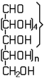 an unbranched sequence of at the most six carbon atoms, having bonds to oxygen as defined in this Note 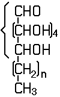
> 						- n being an integer, are classified in group C07H 3/00 ;
> 			- It is also a radical derived from a radical as defined in (a) above by replacing at the most four of the specified hetero bonds to oxygen by the same number of hetero bonds to halogen, nitrogen, sulfur, selenium, or tellurium;
> 		- "heterocyclic radical" or "hetero ring" is considered to exclude saccharide radicals as defined above.
> 4. Attention is drawn to Note (3) after class C07, which defines the last place priority rule applied in the range of subclasses C07C to C07K and within these subclasses.
> 5. Therapeutic activity of compounds is further classified in subclass A61P .
### <u>**Subclass Index**</u>
+ GENERAL PROCESSES		1/00
+ COMPOUNDS
	+ saccharides, deoxysugars, anhydrosugars, osones		3/00
	+ aminosugars, aza-, thio-, seleno-, telluro-analogues		5/00
	+ sugar esters		11/00, 13/00
	+ sugar ethers, glycosides		15/00, 17/00
	+ cyclic acetals		9/00
	+ nucleosides		19/00
	+ nucleotides		19/00, 21/00
	+ nucleic acids		21/00
	+ derivatives containing acyclic radicals		7/00, 13/00, 15/00
	+ derivatives containing carbocyclic radicals		7/00, 13/00, 15/00
	+ derivatives containing heterocyclic radicals		9/00, 13/00, 15/00, 17/00, 19/00, 21/00
	+ derivatives containing boron, silicon or a metal		23/00
+ SUBJECT MATTER NOT PROVIDED FOR IN OTHER GROUPS OF THIS SUBCLASS		99/00
***
### **1/00 Processes for the preparation of sugar derivatives**
### **3/00 Compounds containing only hydrogen atoms and saccharide radicals having only carbon, hydrogen, and oxygen atoms** (1,2-dideoxy-1-enoses C07D; preparation by hydrolysis of di-or polysaccharides C13; separation or purification of sucrose, glucose, fructose, lactose or maltose C13);
### **5/00 Compounds containing saccharide radicals in which the hetero bonds to oxygen have been replaced by the same number of hetero bonds to halogen, nitrogen, sulfur, selenium, or tellurium**
### **7/00 Compounds containing non-saccharide radicals linked to saccharide radicals by a carbon-to-carbon bond**
### **9/00 Compounds containing a hetero ring sharing at least two hetero atoms with a saccharide radical**
### **11/00 Compounds containing saccharide radicals esterified by inorganic acids; Metal salts thereof** (halo-sugars C07H 5/00; thio-, seleno-, or telluro-sugars C07H 5/00; esterified by carbonic acid or derivatives thereof C07H 13/00)
### **13/00 Compounds containing saccharide radicals esterified by carbonic acid or derivatives thereof, or by organic acids, e.g. phosphonic acids**
### **15/00 Compounds containing hydrocarbon or substituted hydrocarbon radicals directly attached to hetero atoms of saccharide radicals**
> ### <u>**Note**</u>
> In this group, acyl radicals directly attached to hetero atoms of the saccharide radicals are not considered as substituted hydrocarbon radicals.&nbsp;
### **17/00 Compounds containing heterocyclic radicals directly attached to hetero atoms of saccharide radicals**
### **19/00 Compounds containing a hetero ring sharing one ring hetero atom with a saccharide radical; Nucleosides; Mononucleotides; Anhydro derivatives thereof**
### **21/00 Compounds containing two or more mononucleotide units having separate phosphate or polyphosphate groups linked by saccharide radicals of nucleoside groups, e.g. nucleic acids**
### **23/00 Compounds containing boron, silicon, or a metal, e.g. chelates, vitamin B12** (esters with inorganic acids C07H 11/00; metal salts, <u>see</u> parent compounds)
### **99/00 Subject matter not provided for in other groups of this subclass**
***
### **C07J STEROIDS** (seco-steroids C07C)
> ### <u>**Note**</u>
> 1. This subclass <u>covers</u> compounds containing a cyclopenta[a]hydrophenanthrene skeleton or a ring structure derived therefrom:
> 		- by contraction or expansion of one ring by one or two atoms,
> 		- by contraction or expansion of two rings each by one atom,
> 		- by contraction of one ring by one atom and expansion of one ring by one atom,
> 		- by substitution of one or two carbon atoms of the cyclopenta[a]hydrophenanthrene skeleton, which are not shared by rings, by hetero atoms, in combination with the above defined contraction or expansion or not, or
> 		- by condensation with carbocyclic or heterocyclic rings in combination with one or more of the foregoing alterations or not.
> 2. Attention is drawn to Note (3) after class C07, which defines the last place priority rule applied in the range of subclasses C07C to C07Kand within these subclasses.
> 3. Therapeutic activity of compounds is further classified in subclass A61P.
### <u>**Subclass Index**</u>
+ NORMAL STEROIDS
	+ containing halogen or oxygen
		+ oxygen other than as ring hetero atom		1/00, 3/00, 5/00, 7/00, 9/00, 11/00, 13/00, 15/00
		+ oxygen as ring hetero atom		17/00, 19/00, 21/00
	+ containing sulfur		31/00, 33/00
	+ containing nitrogen		41/00, 43/00
	+ other steroids		51/00
+ STEROIDS WITH MODIFIED SKELETON
	+ retrosteroids		15/00
	+ nor-, homosteroids		61/00, 63/00, 65/00, 67/00, 69/00
	+ condensed with carbocyclic rings		53/00
	+ heterosteroids		71/00, 73/00
+ PREPARATION OF STEROIDS IN GENERAL		75/00
***
### <u>**Normal steroids, i.e. cyclopenta[a]hydrophenanthrenes, containing carbon, hydrogen, halogen, or oxygen**</u>
### **1/00 Normal steroids containing carbon, hydrogen, halogen, or oxygen, not substituted in position 17 beta by a carbon atom, e.g. oestrane, androstane**
### **3/00 Normal steroids containing carbon, hydrogen, halogen, or oxygen, substituted in position 17 beta by one carbon atom**
### **5/00 Normal steroids containing carbon, hydrogen, halogen, or oxygen, substituted in position 17 beta by a chain of two carbon atoms, e.g. pregnane, and substituted in position 21 by only one singly bound oxygen atom**
### **7/00 Normal steroids containing carbon, hydrogen, halogen, or oxygen, substituted in position 17 beta by a chain of two carbon atoms** (C07J 5/00 takes precedence)
### **9/00 Normal steroids containing carbon, hydrogen, halogen, or oxygen, substituted in position 17 beta by a chain of more than two carbon atoms, e.g. cholane, cholestane, coprostane**
### **11/00 Normal steroids containing carbon, hydrogen, halogen, or oxygen, not substituted in position 3**
### **13/00 Normal steroids containing carbon, hydrogen, halogen, or oxygen, having a carbon-to-carbon double bond from or to position 17**
### **15/00 Stereochemically pure steroids containing carbon, hydrogen, halogen, or oxygen, having a partially or totally inverted skeleton, e.g. retrosteroids, L-isomers**
### **17/00 Normal steroids containing carbon, hydrogen, halogen, or oxygen, having an oxygen-containing hetero ring not condensed with the cyclopenta[a]hydrophenanthrene skeleton** (cardanolide, bufanolide C07J 19/00)
### **19/00 Normal steroids containing carbon, hydrogen, halogen, or oxygen, substituted in position 17 by a lactone ring**
### **21/00 Normal steroids containing carbon, hydrogen, halogen, or oxygen, having an oxygen-containing hetero ring spiro-condensed with the cyclopenta[a]hydrophenanthrene skeleton**
### <u>**Normal steroids, i.e. cyclopenta[a]hydrophenanthrenes, containing sulfur**</u>
### **31/00 Normal steroids containing one or more sulfur atoms not belonging to a hetero ring**
### **33/00 Normal steroids having a sulfur-containing hetero ring spiro-condensed or not condensed with the cyclopenta[a]hydrophenanthrene skeleton**
### <u>**Normal steroids, i.e. cyclopenta[a]hydrophenanthrenes, containing nitrogen**</u>
### **41/00 Normal steroids containing one or more nitrogen atoms not belonging to a hetero ring**
### **43/00 Normal steroids having a nitrogen-containing hetero ring spiro-condensed or not condensed with the cyclopenta[a]hydrophenanthrene skeleton**
***
### **51/00 Normal steroids with unmodified cyclopenta[a]hydrophenanthrene skeleton not provided for in groups C07J 1/00 to C07J 43/00**
### **53/00 Steroids in which the cyclopenta[a]hydrophenanthrene skeleton has been modified by condensation with carbocyclic rings or by formation of an additional ring by means of a direct link between two ring carbon atoms**
### <u>**Nor- or homosteroids**</u>
### **61/00 Steroids in which the cyclopenta[a]hydrophenanthrene skeleton has been modified by contraction of only one ring by one or two atoms**
### **63/00 Steroids in which the cyclopenta[a]hydrophenanthrene skeleton has been modified by expansion of only one ring by one or two atoms**
### **65/00 Steroids in which the cyclopenta[a]hydrophenanthrene skeleton has been modified by contraction of two rings, each by one atom**
### **67/00 Steroids in which the cyclopenta[a]hydrophenanthrene skeleton has been modified by expansion of two rings, each by one atom**
### **69/00 Steroids in which the cyclopenta[a]hydrophenanthrene skeleton has been modified by contraction of only one ring by one atom and expansion of only one ring by one atom**
***
### **71/00 Steroids in which the cyclopenta[a]hydrophenanthrene skeleton is condensed with a heterocyclic ring** (spiro-condensed heterocyclic rings C07J 21/00, C07J 33/00, C07J 43/00)
### **73/00 Steroids in which the cyclopenta[a]hydrophenanthrene skeleton has been modified by substitution of one or two carbon atoms by hetero atoms**
### **75/00 Processes for the preparation of steroids, in general**
***
### **C07K PEPTIDES** (peptides in foodstuffs A23, e.g. obtaining protein compositions for foodstuffs A23J; preparations for medicinal purposes A61K; peptides containing β-lactam rings C07D; cyclic dipeptides not having in their molecule any other peptide link than those which form their ring, e.g. piperazine-2,5-diones, C07D; ergot alkaloids of the cyclic peptide type C07D 519/00; macromolecular compounds having statistically distributed amino acid units in their molecules, i.e. when the preparation does not provide for a specific, but for a random sequence of the amino acid units, homopolyamides and block copolyamides derived from amino acids C08G 69/00; macromolecular products derived from proteins C08H 1/00; preparation of glue or gelatine C09H; single cell proteins, enzymes C12N; genetic engineering processes for obtaining peptides C12N 15/00; compositions for measuring or testing processes involving enzymes C12Q; investigation or analysis of biological material G01N 33/00)
> ### <u>**Note**</u>
> 1. In this subclass, the following terms or expressions are used with the meanings indicated:
> 		- "amino acids" are compounds in which at least one amino group and at least one carboxyl group are bound to the same carbon skeleton and the nitrogen atom of the amino group may form part of a ring;
> 		- "normal peptide link" is one between an alpha-amino group of an amino acid and the carboxyl group — in position 1 — of another alpha-amino acid;
> 		- "abnormal peptide link" is a link where at least one of the linked amino acids is not an alpha-amino acid or a link formed by at least one carboxyl or amino group being part of the side chain of an alpha-amino acid;
> 		- "peptides" are compounds containing at least two amino acid units, which are bound through at least one normal peptide link, including oligopeptides, polypeptides and proteins, where
> 			- "linear peptides" may comprise rings formed through S—S bridges, or through an hydroxy or a mercapto group of an hydroxy- or a mercapto-amino acid and the carboxyl group of another amino acid (e.g. peptide lactones) but do not comprise rings which are formed only through peptide links;
> 			- "cyclic peptides" are peptides comprising at least one ring formed only through peptide links; the cyclisation may occur only through normal peptide links or through abnormal peptide links, e.g. through the 4-amino group of 2,4-diamino-butanoic acid. Thus, cyclic compounds in which at least one link in the ring is a non-peptide link are considered as "linear peptides";
> 			- "depsipeptides" are compounds containing a sequence of at least two alpha-amino acids and at least one alpha-hydroxy carboxylic acid, which are bound through at least one normal peptide link and ester links, derived from the hydroxy carboxylic acids, where
> 				- "linear depsipeptides" may comprise rings formed through S—S bridges, or through an hydroxy or a mercapto group of an hydroxy-, or mercapto-amino acid and the carboxyl group of another amino- or hydroxy-acid but do not comprise rings formed only through peptide or ester links derived from hydroxy carboxylic acids, e.g. Gly-Ala-Gly—OCH2CO2H and Gly—OCH2CO-Ala-Gly are considered as "linear depsipeptides", but HOCH2CO-Gly-Ala-Gly does not contain an ester link, and is thus a derivative of Gly-Ala-Gly which is covered by C07K 5/00;
> 				- "cyclic depsipeptides" are peptides containing at least one ring formed only through peptide or ester links — derived from hydroxy carboxylic acids —, e.g. 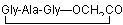;
> 			- "hybrid peptides" are peptides produced through fusion or covalent binding of two or more heterologous peptides.
> 2. Attention is drawn to Note (3) after class C07, which defines the last place priority rule applied in the range of subclasses C07C to C07K and within these subclasses.
> 3. Therapeutic activity of compounds is further classified in subclass A61P.
> 4. When classifying in this subclass, classification is also made in group B01D 15/08 insofar as subject matter of general interest relating to chromatography is concerned.
> 5. Fragments of peptides or peptides modified by removal or addition of amino acids, by substitution of amino acids by others, or by combination of these modifications are classified as the parent peptides. However, fragments of peptides having only four or less amino acids are also classified in group C07K 5/00.
> 6. Peptides prepared by chemical processes and having an amino acid sequence derived from naturally occurring peptides are classified with the natural one.
> 7. Peptides prepared by recombinant DNA technology are not classified according to the host, but according to the original peptide expressed, e.g. HIV peptide expressed in E. coli is classified with HIV peptides.
### <u>**Subclass Index**</u>
+ PEPTIDES
	+ Preparation		1/00
	+ of undefined number of amino acids		2/00
	+ Having up to 20 amino acids in an undefined or only partially defined sequence		4/00
	+ Having up to 20 amino acids in a fully defined sequence		5/00 to 9/00
	+ Depsipeptides having up to 20 amino acids in a fully defined sequence		11/00
	+ Having more than 20 amino acids		14/00
	+ Immunoglobulins		16/00
	+ Carrier-bound or immobilised peptides		17/00
	+ Hybrid peptides		19/00
***
### **1/00 General processes for the preparation of peptides**
### **2/00 Peptides of undefined number of amino acids; Derivatives thereof**
### **4/00 Peptides having up to 20 amino acids in an undefined or only partially defined sequence; Derivatives thereof**
### **5/00 Peptides having up to four amino acids in a fully defined sequence; Derivatives thereof**
> ### <u>**Note**</u>
> In this group, the following expression is used with the meaning indicated:&nbsp;
> 	- "first amino acid" means the first amino acid from the left side, i.e. the N-terminal amino acid, of the peptide sequence.&nbsp;
### **7/00 Peptides having 5 to 20 amino acids in a fully defined sequence; Derivatives thereof** (gastrins, somatostatins or melanotropins, having 12 or more amino acids C07K 14/435)
### **9/00 Peptides having up to 20 amino acids, containing saccharide radicals and having a fully defined sequence; Derivatives thereof**
### **11/00 Depsipeptides having up to 20 amino acids in a fully defined sequence; Derivatives thereof**
### **14/00 Peptides having more than 20 amino acids; Gastrins; Somatostatins; Melanotropins; Derivatives thereof**
### 14/005 . from viruses
### 14/195 . from bacteria
### 14/37 . from fungi
### 14/405 . from algae
### 14/41 . from lichens
### 14/415 . from plants
### 14/435 . from animals; from humans
### 14/795 . Porphyrin- or corrin-ring-containing peptides
### 14/81 . Protease inhibitors
### 14/82 . Translation products from oncogenes
### 14/825 . Metallothioneins
### **16/00 Immunoglobulins, e.g. monoclonal or polyclonal antibodies**
### 16/02 . from eggs
### 16/04 . from milk
### 16/06 . from serum
### 16/08 . against material from viruses
### 16/12 . against material from bacteria
### 16/14 . against material from fungi, algae or lichens
### 16/16 . against material from plants
### 16/18 . against material from animals or humans
### 16/38 . against protease inhibitors of peptide structure
### 16/40 . against enzymes
### 16/42 . against immunoglobulins (anti-idiotypic antibodies)
### 16/44 . against material not provided for elsewhere
### 16/46 . Hybrid immunoglobulins (hybrids of an immunoglobulin with a peptide not being an immunoglobulin C07K 19/00)
### **17/00 Carrier-bound or immobilised peptides** (carrier-bound or immobilised enzymes C12N 11/00); Preparation thereof
### **19/00 Hybrid peptides**
## **C08 ORGANIC MACROMOLECULAR COMPOUNDS; THEIR PREPARATION OR CHEMICAL WORKING-UP; COMPOSITIONS BASED THEREON** (manufacture or treatment of artificial threads, fibres, bristles or ribbons D01)
> ### <u>**Note**</u>
> 1. Biocidal, pest repellant, pest attractant or plant growth regulatory activity of compounds or preparations is further classified in subclass A01P.
> 2. Processes using enzymes or micro-organisms in order to:
> 		- liberate, separate or purify a pre-existing compound or composition, or to
> 		- treat textiles or clean solid surfaces of materialsare further classified in subclass C12S.
***
### **C08B POLYSACCHARIDES; DERIVATIVES THEREOF** (polysaccharides containing less than six saccharide radicals attached to each other by glycosidic linkages C07H; fermentation or enzyme-using processes C12P 19/00; sugar industry C13; production of cellulose D21)
> ### <u>**Note**</u>
> Therapeutic activity of compounds is further classified in subclass A61P.
### <u>**Subclass Index**</u>
+ CELLULOSE AND DERIVATIVES THEREOF
	+ Preparatory treatment of cellulose		1/00
	+ Esters		3/00, 5/00, 7/00, 13/00, 17/00
	+ Ethers		11/00, 13/00, 17/00
	+ Xanthates		9/00
	+ Other derivatives		15/00
	+ Regeneration of cellulose		16/00
+ STARCH; DEGRADED OR NON-CHEMICALLY MODIFIED STARCH; AMYLOSE; AMYLOPECTIN		30/00
+ CHEMICAL DERIVATIVES OF STARCH, OF AMYLOSE OR OF AMYLOPECTIN
	+ of starch		31/00
	+ of amylose		33/00
	+ of amylopectin		35/00
+ OTHER POLYSACCHARIDES		37/00
***
### <u>**Preparation**</u>
### **1/00 Preparatory treatment of cellulose for making derivatives thereof**
### **3/00 Preparation of cellulose esters of organic acids** (post-esterification stabilisation by addition of stabilisers C08K; surface esterification of textiles D06M 13/00)
### **5/00 Preparation of cellulose esters of inorganic acids** (post-esterification stabilisation of cellulose nitrate by addition of stabilisers C08K)
### **7/00 Preparation of cellulose esters of both organic and inorganic acids**
### **9/00 Cellulose xanthate; Viscose**
### **11/00 Preparation of cellulose ethers**
### **13/00 Preparation of cellulose ether-esters**
### **15/00 Preparation of other cellulose derivatives or modified cellulose** (esters of phosphorus acids C08B 5/00)
### **16/00 Regeneration of cellulose**
### **17/00 Apparatus for esterification or etherification of cellulose**
### **30/00 Preparation of starch, degraded or non-chemically modified starch, amylose, or amylopectin**
### **31/00 Preparation of chemical derivatives of starch** (chemical derivatives of amylose C08B 33/00; chemical derivatives of amylopectin C08B 35/00)
### **33/00 Preparation of chemical derivatives of amylose**
### **35/00 Preparation of chemical derivatives of amylopectin**
### **37/00 Preparation of polysaccharides not provided for in C08B 1/00 to C08B 35/00; Derivatives thereof** (foodstuff preparations of alginic acid or derivatives thereof A23L 1/05; cellulose D21);
***
### **C08C TREATMENT OR CHEMICAL MODIFICATION OF RUBBERS**
> ### <u>**Note**</u>
> This subclass <u>covers</u>:
> 	- processes directed to natural rubber or to conjugated diene rubbers (synthesis thereof C08F);&nbsp;
> 	- processes directed to rubbers in general (to a specific rubber, other than provided for above, C08F to C08H).&nbsp;
### <u>**Preparation**</u>
### **1/00 Treatment of rubber latex**
### **2/00 Treatment of rubber solutions**
### **3/00 Treatment of coagulated rubber**
### **4/00 Treatment of rubber before vulcanisation, not provided for in groups C08C 1/00 to C08C 3/00**
### **19/00 Chemical modification of rubber** (crosslinking agents, other than provided for by group C08C 19/00, C08K)
***
### **C08F MACROMOLECULAR COMPOUNDS OBTAINED BY REACTIONS ONLY INVOLVING CARBON-TO-CARBON UNSATURATED BONDS** (production of liquid hydrocarbon mixtures from lower carbon number hydrocarbons, e.g. by oligomerisation, C10G 50/00)
> ### <u>**Note**</u>
> 1. In this subclass, boron or silicon are considered as metals.
> 2. In this subclass, the following expression is used with the meaning indicated:
> 		- "aliphatic radical" means an acyclic or a non-aromatic carbocyclic carbon skeleton which is considered to be terminated by every bond to:
> 			- an element other than carbon;
> 			- a carbon atom having a double bond to one atom other than carbon;
> 			- an aromatic carbocyclic ring or a heterocyclic ring.Examples: Polymers of
> 				- CH2=CH—O—CH2-CH2—NH—COO—CH2-CH2—OH are classified in group C08F 16/00;
> 				- 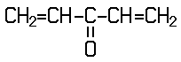 are classified in group C08F 16/00;
> 				- 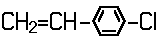 are classified in group C08F 12/00.
> 3. Therapeutic activity of compounds is further classified in subclass A61P.
> 4. In this subclass, in the absence of an indication to the contrary, a catalyst or a polymer is classified in the last appropriate place.
> 5. In this subclass:
> 		- macromolecular compounds and their preparation are classified in the groups for the type of compound prepared. General processes for the preparation of macromolecular compounds according to more than one main group are classified in the groups for the processes employed (C08F 2/00 to C08F 8/00). Processes for the preparation of macromolecular compounds are also classified in the groups for the types of reactions employed, if of interest;
> 		- subject matter relating to both homopolymers and copolymers is classified in groups C08F 10/00 to C08F 38/00;
> 		- subject matter limited to homopolymers is classified only in groups C08F 110/00 to C08F 138/00;
> 		- subject matter limited to copolymers is classified only in groups C08F 210/00 to C08F 246/00;
> 		- in groups C08F 210/00 to C08F 238/00, in the absence of an indication to the contrary, a copolymer is classified according to the major monomeric component.
> 6. This subclass <u>covers</u> also compositions based on monomers which form macromolecular compounds classifiable in this subclass (paints C09D 4/00; adhesives C09J 4/00).
> 		- In this subclass:
> 			- if the monomers are defined, classification is made according to the polymer to be formed:
> 				- in groups C08F 10/00 to C08F 246/00 if no preformed polymer is present;
> 				- in groups C08F 251/00 to C08F 291/00 if a preformed polymer is present, considering the reaction to take place as a graft or cross-linking reaction;
> 			- if the presence of compounding ingredients is of interest, classification is made in group C08F 2/44 (sensitising agents C08F 2/46; catalysts C08F 4/00);
> 			- if the compounding ingredients are of interest <u>per se</u>, classification is also made in subclass C08K.
### <u>**Subclass Index**</u>
+ Processes of polymerisation; Catalysts		2/00; 4/00
+ Post-polymerisation treatments; Chemical modification		6/00; 8/00
+ Homopolymers and copolymers of compounds having one or more unsaturated aliphatic radicals, each having only one carbon-to-carbon double bond		10/00 to 30/00
	+ Homopolymers		110/00 to 130/00
	+ Copolymers		210/00 to 230/00
+ Homopolymers and copolymers of cyclic compounds having no unsaturated aliphatic radicals in a side chain and having one or more carbon-to-carbon double bonds in a ring		32/00, 34/00
	+ Homopolymers		132/00, 134/00
	+ Copolymers		232/00, 234/00
+ Homopolymers and copolymers of compounds having one or more unsaturated aliphatic radicals, at least one having two or more carbon-to-carbon double bonds		36/00
	+ Homopolymers		136/00
	+ Copolymers		236/00
+ Homopolymers and copolymers of compounds having one or more carbon-to-carbon triple bonds		38/00
	+ Homopolymers		138/00
	+ Copolymers		238/00
+ Copolymers of hydrocarbons and mineral oils		240/00
+ Copolymers of drying oils with other monomers		242/00
+ Coumarone-indene copolymers		244/00
+ Copolymers in which the nature of only the monomers in minority is defined		246/00
+ Graft polymers; Polymers cross-linked with unsaturated monomers		251/00 to 292/00
+ Block polymers		293/00 to 297/00
+ Macromolecular compounds obtained by interreacting polymers involving only carbon-to-carbon unsaturated bond reactions, in the absence of non-macromolecular monomers		299/00
+ Subject matter not provided for in other groups of this subclass		301/00
***
### <u>**Processes; Catalysts**</u>
### **2/00 Processes of polymerisation**
### 2/01 . characterised by special features of the polymerisation apparatus used
### 2/02 . Polymerisation in bulk
### 2/04 . Polymerisation in solution (C08F 2/32 takes precedence)
### 2/12 . Polymerisation in non-solvents (C08F 2/32 takes precedence)
### 2/32 . Polymerisation in water-in-oil emulsions
### 2/34 . Polymerisation in gaseous state
### 2/36 . Polymerisation in solid state
### 2/38 . Polymerisation using regulators, e.g. chain terminating agents
### 2/44 . Polymerisation in the presence of compounding ingredients, e.g. plasticisers, dyestuffs, fillers
### 2/46 . Polymerisation initiated by wave energy or particle radiation
### 2/58 . Polymerisation initiated by direct application of electric current (electrolytic processes, e.g. electrophoresis, C25)
### 2/60 . Polymerisation by the diene synthesis
### **4/00 Polymerisation catalysts** (catalysts in general B01J)
### **6/00 Post-polymerisation treatments** (C08F 8/00 takes precedence; of conjugated diene rubbers C08C; short-stopping C08F 2/38);
### **8/00 Chemical modification by after-treatment** (graft polymers, block polymers, crosslinking with unsaturated monomers or with polymers C08F 251/00 to C08F 299/00; of conjugated diene rubbers C08C; crosslinking in general C08J)
### <u>**Homopolymers or copolymers**</u>
### **10/00 Homopolymers or copolymers of unsaturated aliphatic hydrocarbons having only one carbon-to-carbon double bond**
### **12/00 Homopolymers or copolymers of compounds having one or more unsaturated aliphatic radicals, each having only one carbon-to-carbon double bond, and at least one being terminated by an aromatic carbocyclic ring**
### **14/00 Homopolymers or copolymers of compounds having one or more unsaturated aliphatic radicals, each having only one carbon-to-carbon double bond, and at least one being terminated by a halogen**
### **16/00 Homopolymers or copolymers of compounds having one or more unsaturated aliphatic radicals, each having only one carbon-to-carbon double bond, and at least one being terminated by an alcohol, ether, aldehydo, ketonic, acetal, or ketal radical**
### **18/00 Homopolymers or copolymers of compounds having one or more unsaturated aliphatic radicals, each having only one carbon-to-carbon double bond, and at least one being terminated by an acyloxy radical of a saturated carboxylic acid, of carbonic acid, or of a haloformic acid**
### **20/00 Homopolymers or copolymers of compounds having one or more unsaturated aliphatic radicals, each having only one carbon-to-carbon double bond, and only one being terminated by only one carboxyl radical or a salt, anhydride, ester, amide, imide, or nitrile thereof**
### **22/00 Homopolymers or copolymers of compounds having one or more unsaturated aliphatic radicals, each having only one carbon-to-carbon double bond, and at least one being terminated by a carboxyl radical and containing at least one other carboxyl radical in the molecule; Salts, anhydrides, esters, amides, imides, or nitriles thereof**
### **24/00 Homopolymers or copolymers of compounds having one or more unsaturated aliphatic radicals, each having only one carbon-to-carbon double bond, and at least one being terminated by a heterocyclic ring containing oxygen** (cyclic esters of polyfunctional acids C08F 18/00; cyclic anhydrides of unsaturated acids C08F 20/00, C08F 22/00)
### **26/00 Homopolymers or copolymers of compounds having one or more unsaturated aliphatic radicals, each having only one carbon-to-carbon double bond, and at least one being terminated by a single or double bond to nitrogen or by a heterocyclic ring containing nitrogen**
### **28/00 Homopolymers or copolymers of compounds having one or more unsaturated aliphatic radicals, each having only one carbon-to-carbon double bond, and at least one being terminated by a bond to sulfur or by a heterocyclic ring containing sulfur**
### **30/00 Homopolymers or copolymers of compounds having one or more unsaturated aliphatic radicals, each having only one carbon-to-carbon double bond, and containing phosphorus, selenium, tellurium or a metal** (metal salts, e.g. phenolates or alcoholates, <u>see</u> the parent compounds)
### **32/00 Homopolymers or copolymers of cyclic compounds having no unsaturated aliphatic radicals in a side chain, and having one or more carbon-to-carbon double bonds in a carbocyclic ring system**
### **34/00 Homopolymers or copolymers of cyclic compounds having no unsaturated aliphatic radicals in a side chain and having one or more carbon-to-carbon double bonds in a heterocyclic ring** (cyclic esters of polyfunctional acids C08F 18/00; cyclic anhydrides or imides C08F 22/00)
### **36/00 Homopolymers or copolymers of compounds having one or more unsaturated aliphatic radicals, at least one having two or more carbon-to-carbon double bonds** (C08F 32/00 takes precedence)
### **38/00 Homopolymers or copolymers of compounds having one or more carbon-to-carbon triple bonds**
### <u>**Homopolymers**</u>
### **110/00 Homopolymers of unsaturated aliphatic hydrocarbons having only one carbon-to-carbon double bond**
### **112/00 Homopolymers of compounds having one or more unsaturated aliphatic radicals, each having only one carbon-to-carbon double bond, and at least one being terminated by an aromatic carbocyclic ring**
### **114/00 Homopolymers of compounds having one or more unsaturated aliphatic radicals, each having only one carbon-to-carbon double bond, and at least one being terminated by a halogen**
### **116/00 Homopolymers of compounds having one or more unsaturated aliphatic radicals, each having only one carbon-to-carbon double bond, and at least one being terminated by an alcohol, ether, aldehydo, ketonic, acetal, or ketal radical**
### **118/00 Homopolymers of compounds having one or more unsaturated aliphatic radicals, each having only one carbon-to-carbon double bond, and at least one being terminated by an acyloxy radical of a saturated carboxylic acid, of carbonic acid, or of a haloformic acid**
### **120/00 Homopolymers of compounds having one or more unsaturated aliphatic radicals, each having only one carbon-to-carbon double bond, and only one being terminated by only one carboxyl radical or a salt, anhydride, ester, amide, imide, or nitrile thereof**
### **122/00 Homopolymers of compounds having one or more unsaturated aliphatic radicals, each having only one carbon-to-carbon double bond, and at least one being terminated by a carboxyl radical and containing at least one other carboxyl radical in the molecule; Salts, anhydrides, esters, amides, imides, or nitriles thereof**
### **124/00 Homopolymers of compounds having one or more unsaturated aliphatic radicals, each having only one carbon-to-carbon double bond, and at least one being terminated by a heterocyclic ring containing oxygen** (cyclic esters of polyfunctional acids C08F 118/00; cyclic anhydrides of unsaturated acids C08F 120/00, C08F 122/00)
### **126/00 Homopolymers of compounds having one or more unsaturated aliphatic radicals, each having only one carbon-to-carbon double bond, and at least one being terminated by a single or double bond to nitrogen or by a heterocyclic ring containing nitrogen**
### **128/00 Homopolymers of compounds having one or more unsaturated aliphatic radicals, each having only one carbon-to-carbon bond, and at least one being terminated by a bond to sulfur or by a heterocyclic ring containing sulfur**
### **130/00 Homopolymers of compounds having one or more unsaturated aliphatic radicals, each having only one carbon-to-carbon double bond, and containing phosphorus, selenium, tellurium, or a metal** (metal salts, e.g. phenolates or alcoholates, <u>see</u> the parent compounds)
### **132/00 Homopolymers of cyclic compounds containing no unsaturated aliphatic radicals in a side chain, and having one or more carbon-to-carbon double bonds in a carbocyclic ring system**
### **134/00 Homopolymers of cyclic compounds having no unsaturated aliphatic radicals in a side chain and having one or more carbon-to-carbon double bonds in a heterocyclic ring** (cyclic esters of polyfunctional acids C08F 118/00; cyclic anhydrides or imides C08F 122/00)
### **136/00 Homopolymers of compounds having one or more unsaturated aliphatic radicals, at least one having two or more carbon-to-carbon double bonds** (C08F 132/00 takes precedence)
### **138/00 Homopolymers of compounds having one or more carbon-to-carbon triple bonds**
### <u>**Copolymers**</u>
> ### <u>**Note**</u>
> 1. When classifying in groups C08F 210/00 to C08F 297/00, any monomeric components not identified by the classification according to Note (4) after the title of subclass C08F within this classification range, and where the use of such monomeric components is determined to be novel and non-obvious, must also be classified in the last appropriate place in groups C08F 210/00 to C08F 238/00.
> 2. Any monomeric components not identified by the classification according to Note (4) after the title of subclass C08F or Note (1) above, and where the use of such monomeric components is considered to represent information of interest for search, may also be classified in the last appropriate place in groups C08F 210/00 to C08F 238/00. This can for example be the case when it is considered of interest to enable searching of copolymers using a combination of classification symbols. Such non-obligatory classification should be given as "additional information".
### **210/00 Copolymers of unsaturated aliphatic hydrocarbons having only one carbon-to-carbon double bond**
### **212/00 Copolymers of compounds having one or more unsaturated aliphatic radicals, each having only one carbon-to-carbon double bond, and at least one being terminated by an aromatic carbocyclic ring**
### **214/00 Copolymers of compounds having one or more unsaturated aliphatic radicals, each having only one carbon-to-carbon double bond, and at least one being terminated by a halogen**
### **216/00 Copolymers of compounds having one or more unsaturated aliphatic radicals, each having only one carbon-to-carbon double bond, and at least one being terminated by an alcohol, ether, aldehydo, ketonic, acetal, or ketal radical**
### **218/00 Copolymers having one or more unsaturated aliphatic radicals, each having only one carbon-to-carbon double bond, and at least one being terminated by an acyloxy radical of a saturated carboxylic acid, of carbonic acid, or of a haloformic acid**
### **220/00 Copolymers of compounds having one or more unsaturated aliphatic radicals, each having only one carbon-to-carbon double bond, and only one being terminated by only one carboxyl radical or a salt, anhydride, ester, amide, imide, or nitrile thereof**
### **222/00 Copolymers of compounds having one or more unsaturated aliphatic radicals, each having only one carbon-to-carbon double bond, and at least one being terminated by a carboxyl radical and containing at least one other carboxyl radical in the molecule; Salts, anhydrides, esters, amides, imides, or nitriles thereof**
### **224/00 Copolymers of compounds having one or more unsaturated aliphatic radicals, each having only one carbon-to-carbon double bond, and at least one being terminated by a heterocyclic ring containing oxygen** (cyclic esters of polyfunctional acids C08F 218/00; cyclic anhydrides of unsaturated acids C08F 220/00, C08F 222/00)
### **226/00 Copolymers of compounds having one or more unsaturated aliphatic radicals, each having only one carbon-to-carbon double bond, and at least one being terminated by a single or double bond to nitrogen or by a heterocyclic ring containing nitrogen**
### **228/00 Copolymers of compounds having one or more unsaturated aliphatic radicals, each having only one carbon-to-carbon double bond, and at least one being terminated by a bond to sulfur or by a heterocyclic ring containing sulfur**
### **230/00 Copolymers of compounds having one or more unsaturated aliphatic radicals, each having only one carbon-to-carbon double bond, and containing phosphorus, selenium, tellurium, or a metal** (metal salts, e.g. phenolates or alcoholates, <u>see</u> the parent compounds)
### **232/00 Copolymers of cyclic compounds containing no unsaturated aliphatic radicals in a side chain, and having one or more carbon-to-carbon double bonds in a carbocyclic ring system**
### **234/00 Copolymers of cyclic compounds having no unsaturated aliphatic radicals in a side chain and having one or more carbon-to-carbon double bonds in a heterocyclic ring** (cyclic esters of polyfunctional acids C08F 218/00; cyclic anhydrides or imides C08F 222/00)
### **236/00 Copolymers of compounds having one or more unsaturated aliphatic radicals, at least one having two or more carbon-to-carbon double bonds** (C08F 232/00 takes precedence)
### **238/00 Copolymers of compounds having one or more carbon-to-carbon triple bonds**
### **240/00 Copolymers of hydrocarbons and mineral oils, e.g. petroleum resins**
### **242/00 Copolymers of drying-oils with other monomers**
### **244/00 Coumarone-indene copolymers**
### **246/00 Copolymers in which the nature of only the monomers in minority is defined**
### <u>**Graft polymers; Polymers crosslinked with unsaturated monomers**</u> (graft polymerisation of monomers on to fibres, threads, yarns, fabrics or fibrous goods made from such materials D06M 14/00)
### **251/00 Macromolecular compounds obtained by polymerising monomers on to polysaccharides or derivatives thereof**
### **253/00 Macromolecular compounds obtained by polymerising monomers on to natural rubbers or derivatives thereof**
### **255/00 Macromolecular compounds obtained by polymerising monomers on to polymers of hydrocarbons as defined in group C08F 10/00**
### **257/00 Macromolecular compounds obtained by polymerising monomers on to polymers of aromatic monomers as defined in group C08F 12/00**
### **259/00 Macromolecular compounds obtained by polymerising monomers on to polymers of halogen containing monomers as defined in group C08F 14/00**
### **261/00 Macromolecular compounds obtained by polymerising monomers on to polymers of oxygen-containing monomers as defined in group C08F 16/00**
### **263/00 Macromolecular compounds obtained by polymerising monomers on to polymers of esters of unsaturated alcohols with saturated acids as defined in group C08F 18/00**
### **265/00 Macromolecular compounds obtained by polymerising monomers on to polymers of unsaturated monocarboxylic acids or derivatives thereof as defined in group C08F 20/00**
### **267/00 Macromolecular compounds obtained by polymerising monomers on to polymers of unsaturated polycarboxylic acids or derivatives thereof as defined in group C08F 22/00**
### **269/00 Macromolecular compounds obtained by polymerising monomers on to polymers of heterocyclic oxygen-containing monomers as defined in group C08F 24/00**
### **271/00 Macromolecular compounds obtained by polymerising monomers on to polymers of nitrogen-containing monomers as defined in group C08F 26/00**
### **273/00 Macromolecular compounds obtained by polymerising monomers on to polymers of sulfur-containing monomers as defined in group C08F 28/00**
### **275/00 Macromolecular compounds obtained by polymerising monomers on to polymers of monomers containing phosphorus, selenium, tellurium, or a metal as defined in group C08F 30/00**
### **277/00 Macromolecular compounds obtained by polymerising monomers on to polymers of carbocyclic or heterocyclic monomers as defined respectively in group C08F 32/00 or in group C08F 34/00**
### **279/00 Macromolecular compounds obtained by polymerising monomers on to polymers of monomers having two or more carbon-to-carbon double bonds as defined in group C08F 36/00**
### **281/00 Macromolecular compounds obtained by polymerising monomers on to polymers of monomers having carbon-to-carbon triple bonds as defined in group C08F 38/00**
### **283/00 Macromolecular compounds obtained by polymerising monomers on to polymers provided for in subclass C08G**
### **285/00 Macromolecular compounds obtained by polymerising monomers on to preformed graft polymers**
### **287/00 Macromolecular compounds obtained by polymerising monomers on to block polymers**
### **289/00 Macromolecular compounds obtained by polymerising monomers on to macromolecular compounds not provided for in groups C08F 251/00 to C08F 287/00**
### **290/00 Macromolecular compounds obtained by polymerising monomers on to polymers modified by introduction of aliphatic unsaturated end or side groups**
### **291/00 Macromolecular compounds obtained by polymerising monomers on to macromolecular compounds according to more than one of the groups C08F 251/00 to C08F 289/00**
### **292/00 Macromolecular compounds obtained by polymerising monomers on to inorganic materials**
### <u>**Block polymers**</u>
### **293/00 Macromolecular compounds obtained by polymerisation on to a macromolecule having groups capable of inducing the formation of new polymer chains bound exclusively at one or both ends of the starting macromolecule** (on to polymers modified by introduction of unsaturated end groups C08F 290/00)
### **295/00 Macromolecular compounds obtained by polymerisation using successively different catalyst types without deactivating the intermediate polymer**
### **297/00 Macromolecular compounds obtained by successively polymerising different monomer systems using a catalyst of the ionic or coordination type without deactivating the intermediate polymer**
***
### **299/00 Macromolecular compounds obtained by interreacting polymers involving only carbon-to-carbon unsaturated bond reactions, in the absence of non-macromolecular monomers** (in the presence of non-macromolecular monomers C08F 251/00 to C08F 291/00; involving other reactions C08G 81/00)
### **301/00 Macromolecular compounds not provided for in groups C08F 10/00 to C08F 299/00**
***
### **C08G MACROMOLECULAR COMPOUNDS OBTAINED OTHERWISE THAN BY REACTIONS ONLY INVOLVING CARBON-TO-CARBON UNSATURATED BONDS**
> ### <u>**Note**</u>
> 1. Therapeutic activity of compounds is further classified in subclass A61P.
> 2. In this subclass, group C08G 18/00 takes precedence over the other groups. A further classification is given if the polymers are obtained by reactions forming specific linkages for which an appropriate group is provided.
> 3. Within each main group of this subclass, in the absence of an indication to the contrary, classification is made in the last appropriate place.
> 4. This subclass <u>covers</u> also compositions based on monomers which form macromolecular compounds classifiable in this subclass.
> 		- In this subclass:
> 			- if the monomers are defined, classification is made in groups C08G 2/00 to C08G 79/00, C08G 83/00 according to the polymer to be formed;
> 			- if the monomers are defined in a way that a composition cannot be classified within one main group of this subclass, the composition is classified in group C08G 85/00;
> 			- if the compounding ingredients are of interest <u>per se</u>, classification is also made in subclass C08K.
### <u>**Subclass Index**</u>
+ MACROMOLECULAR COMPOUNDS OBTAINED FROM ALDEHYDES OR KETONES		2/00 to 16/00
	+ Polyacetals		2/00, 4/00
+ MACROMOLECULAR COMPOUNDS OBTAINED FROM ISOCYANATES OR ISOTHIOCYANATES		18/00
+ EPOXY RESINS		59/00
+ MACROMOLECULAR COMPOUNDS OBTAINED BY REACTIONS FORMING A LINKAGE IN THE MAIN CHAIN		61/00 to 79/00
	+ a carbon-to-carbon link		61/00
	+ a linkage containing oxygen		63/00 to 67/00
	+ a linkage containing nitrogen		69/00 to 73/00
	+ a linkage containing sulfur		75/00
	+ a linkage containing silicon		77/00
	+ a linkage containing atoms other than carbon, oxygen, nitrogen, sulfur, or silicon		79/00
+ MACROMOLECULAR COMPOUNDS OBTAINED BY INTERREACTING POLYMERS IN THE ABSENCE OF MONOMERS		81/00
+ OTHER MACROMOLECULAR COMPOUNDS		83/00
+ GENERAL PROCESSES		85/00
***
### **2/00 Addition polymers of aldehydes or cyclic oligomers thereof or of ketones; Addition copolymers thereof with less than 50 molar percent of other substances**
### **4/00 Condensation polymers of aldehydes or ketones with polyalcohols; Addition polymers of heterocyclic oxygen compounds containing in the ring at least once the grouping —O—C—O—** (of cyclic oligomers of aldehydes C08G 2/00)
### **6/00 Condensation polymers of aldehydes or ketones only**
### **8/00 Condensation polymers of aldehydes or ketones with phenols only**
### **10/00 Condensation polymers of aldehydes or ketones with aromatic hydrocarbons or halogenated aromatic hydrocarbons only**
### **12/00 Condensation polymers of aldehydes or ketones with only compounds containing hydrogen attached to nitrogen** (amino phenols C08G 8/00)
### **14/00 Condensation polymers of aldehydes or ketones with two or more other monomers covered by at least two of the groups C08G 8/00 to C08G 12/00**
### **16/00 Condensation polymers of aldehydes or ketones with monomers not provided for in the groups C08G 4/00 to C08G 14/00** (with polynitriles C08G 69/00)
### **18/00 Polymeric products of isocyanates or isothiocyanates** (preparatory processes of porous or cellular materials, in which the monomers or catalysts are not specific C08J)
### **59/00 Polycondensates containing more than one epoxy group per molecule** (low-molecular-weight polyepoxy compounds C07); Macromolecules obtained by reaction of epoxy polycondensates with monofunctional low-molecular-weight compounds; Macromolecules obtained by polymerising compounds containing more than one epoxy group per molecule using curing agents or catalysts which react with the epoxy groups
> ### <u>**Note**</u>
> In groups C08G 61/00 to C08G 79/00, in the absence of an indication to the contrary, macromolecular compounds obtained by reactions forming two different linkages in the main chain are classified only according to the linkage present in excess.
### **61/00 Macromolecular compounds obtained by reactions forming a carbon-to-carbon link in the main chain of the macromolecule** (C08G 2/00 to C08G 16/00 take precedence)
### **63/00 Macromolecular compounds obtained by reactions forming a carboxylic ester link in the main chain of the macromolecule** (polyesters derived from ester-forming epoxy compounds other than esters thereof C08G 59/00; polyester-amides C08G 69/00; polyester-imides C08G 73/00);
### **64/00 Macromolecular compounds obtained by reactions forming a carbonic ester link in the main chain of the macromolecule** (polycarbonate-amides C08G 69/00; polycarbonate-imides C08G 73/00)
### **65/00 Macromolecular compounds obtained by reactions forming an ether link in the main chain of the macromolecule** (polyacetals C08G 2/00, C08G 4/00; epoxy resins C08G 59/00; polythioether-ethers C08G 75/00; polyethers containing less than eleven monomer units C07C)
### **67/00 Macromolecular compounds obtained by reactions forming in the main chain of the macromolecule a linkage containing oxygen or oxygen and carbon, not provided for in groups C08G 2/00 to C08G 65/00**
### **69/00 Macromolecular compounds obtained by reactions forming a carboxylic amide link in the main chain of the macromolecule** (products obtained from isocyanates or isothiocyanates C08G 18/00; polyhydrazides C08G 73/00; polyamide acids C08G 73/00; polyamide-imides C08G 73/00)
### **71/00 Macromolecular compounds obtained by reactions forming in the main chain of the macromolecule a ureide or urethane link, otherwise than from isocyanate radicals**
### **73/00 Macromolecular compounds obtained by reactions forming in the main chain of the macromolecule a linkage containing nitrogen, with or without oxygen or carbon, not provided for in groups C08G 12/00 to C08G 71/00** (Polyamines containing less than eleven monomer units C07C)
### **75/00 Macromolecular compounds obtained by reactions forming in the main chain of the macromolecule a linkage containing sulfur, with or without nitrogen, oxygen, or carbon**
### **77/00 Macromolecular compounds obtained by reactions forming in the main chain of the macromolecule a linkage containing silicon, with or without sulfur, nitrogen, oxygen, or carbon**
### **79/00 Macromolecular compounds obtained by reactions forming in the main chain of the macromolecule a linkage containing atoms other than silicon, sulfur, nitrogen, oxygen, and carbon**
### **81/00 Macromolecular compounds obtained by interreacting polymers in the absence of monomers, e.g. block polymers** (involving only carbon-to-carbon unsaturated bond reactions C08F 299/00)
### **83/00 Macromolecular compounds not provided for in groups C08G 2/00 to C08G 81/00**
### **85/00 General processes for preparing compounds provided for in this subclass**
***
### **C08H DERIVATIVES OF NATURAL MACROMOLECULAR COMPOUNDS** (polysaccharides C08B; natural rubber C08C)
> ### <u>**Note**</u>
> Therapeutic activity of compounds is further classified in subclass A61P.
### <u>**Preparation**</u>
### **1/00 Macromolecular products derived from proteins** (food proteins A23; glue, gelatine C09H)
### **3/00 Vulcanised oils, e.g. factice**
### **5/00 Other macromolecular compounds** (natural resins or their derivatives C09F; bituminous materials C10)
***
### **C08J WORKING-UP; GENERAL PROCESSES OF COMPOUNDING; AFTER-TREATMENT NOT COVERED BY SUBCLASSES C08B, C08C, C08F, C08G or C08H** (working, e.g. shaping, of plastics B29; layered products, manufacture thereof B32B; treatment of macromolecular material specially adapted to enhance its filling properties in mortars, concrete or artificial stone C04B 16/00, C04B 18/04, C04B 20/00; treatment of textiles D06)
> ### <u>**Note**</u>
> 1. This subclass <u>covers</u> processes, not covered by subclasses C08B to C08H, for treating polymers.
> 2. In this subclass, in the absence of an indication to the contrary, classification is made in the last appropriate place.
> 3. When classifying in this subclass, additional classification may be made in class C08L relating to the materials used.
### **3/00 Processes of treating or compounding macromolecular substances**
### 3/02 . Making solutions, dispersions, lattices or gels by other methods than by solution, emulsion or suspension polymerisation techniques
### 3/12 . Powdering or granulating
### 3/18 . Plasticising macromolecular compounds (plasticisers C08K)
### 3/20 . Compounding polymers with additives, e.g. colouring
### 3/24 . Crosslinking, e.g. vulcanising, of macromolecules (mechanical aspects B29C 35/00; crosslinking agents C08K)
### 3/28 . Treatment by wave energy or particle radiation
### **5/00 Manufacture of articles or shaped materials containing macromolecular substances** (shaping of foodstuffs A23P; manufacture of semi-permeable membranes B01D 67/00 to B01D 71/00; working, e.g. shaping, of plastics B29)
### 5/02 . Direct processing of dispersions, e.g. latex, to articles
### 5/04 . Reinforcing macromolecular compounds with loose or coherent fibrous material (after-treatment of threads during manufacture D01F)
### 5/12 . Bonding of a preformed macromolecular material to the same or other solid material such as metal, glass, leather, e.g. using adhesives
### 5/14 . Manufacture of abrasive or friction articles or materials
### 5/16 . Manufacture of articles or materials having reduced friction
### 5/18 . Manufacture of films or sheets
### 5/20 . Manufacture of shaped structures of ion-exchange resins
### 5/24 . Impregnating materials with prepolymers which can be polymerised <u>in situ</u>, e.g. manufacture of prepregs
### **7/00 Chemical treatment or coating of shaped articles made of macromolecular substances** (coating with metallic material C23C; electrolytic deposition of metals C25)
### **9/00 Working-up of macromolecular substances to porous or cellular articles or materials; After-treatment thereof** (mechanical aspects of shaping of plastics or substances in a plastic state for the production of porous or cellular articles B29C; foamed polymeric products of isocyanates or isothiocyanates characterised by the monomers or catalysts used C08G 18/00)
### **11/00 Recovery or working-up of waste materials** (recovery of plastics B29B 17/00; depolymerisation to the original monomer C07; polymerisation processes involving purification or recycling of waste polymers or their depolymerisation products C08B, C08C, C08F, C08G, C08H; destructive distillation of carbonaceous materials for production of gas, coke, tar or similar matters C10B; production of liquid hydrocarbon mixtures from rubber or rubber waste C10G 1/00);
### **99/00 Subject matter not provided for in other groups of this subclass**
***
### **C08K USE OF INORGANIC OR NON-MACROMOLECULAR ORGANIC SUBSTANCES AS COMPOUNDING INGREDIENTS** (pesticides, herbicides A01N; pharmaceuticals, cosmetics A61K; explosives C06B; paints, inks, varnishes, dyes, polishes, adhesives C09; lubricants C10M; detergents C11D; artificial filaments or fibres D01F; textile treating compositions D06)
> ### <u>**Note**</u>
> 1. In this subclass, in the absence of an indication to the contrary, an ingredient is classified in the last appropriate place.
> 2. In this subclass:
> 		- a mixture of ingredients is classified in the most indented group covering all the essential ingredients of the mixture, e.g.:
> 			- a mixture of a monohydroxylic and a polyhydroxylic alcohol C08K 5/00;
> 			- a mixture of two polyhydroxylic alcohols C08K 5/00;
> 			- a mixture of an alcohol and an ether C08K 5/00;
> 			- a mixture of an ether and an amine C08K 5/00;
> 			- a mixture of an amine and a metal C08K 13/00;
> 		- ammonium salts are classified in the same way as metal salts.
> 3. In this subclass, any ingredient of a mixture which is not identified by the classification according to Note (2) above, and the use of which is determined to be novel and non-obvious, must also be classified in this subclass according to Note (1). The ingredient can be either a single compound or a composition in itself.
> 4. Any ingredient of a mixture which is not identified by the classification according to Notes (2) or (3) above, and which is considered to represent information of interest for search, may also be classified in this subclass according to Note (1). This can, for example, be the case when it is considered of interest to enable searching of mixtures using a combination of classification symbols. Such non-obligatory classification should be given as "additional information".
### **3/00 Use of inorganic ingredients**
### **5/00 Use of organic ingredients**
### **7/00 Use of ingredients characterised by shape**
### **9/00 Use of pretreated ingredients** (use of pretreated fibrous materials in the manufacture of articles or shaped materials containing macromolecular substances C08J 5/04)
### **11/00 Use of ingredients of unknown constitution, e.g. undefined reaction products**
### **13/00 Use of mixtures of ingredients not covered by any single one of main groups C08K 3/00 to C08K 11/00, each of these compounds being essential**
***
### **C08L COMPOSITIONS OF MACROMOLECULAR COMPOUNDS** (pesticides, herbicides A01N; pharmaceuticals, cosmetics A61K; explosives C06B; compositions based on polymerisable monomers C08F, C08G; paints, inks, varnishes, dyes, polishes, adhesives C09; lubricants C10M; detergents C11D; artificial filaments or fibres D01F; textile treating compositions D06)
> ### <u>**Note**</u>
> 1. In this subclass, the following term is used with the meaning indicated:
> 		- "rubber" includes:
> 			- natural or conjugated diene rubbers;
> 			- rubber in general (for a specific rubber, other than a natural rubber or a conjugated diene rubber, <u>see</u> the group provided for compositions of such macromolecular compounds).
> 2. In this subclass:
> 		- compositions are classified according to the mutual proportions by weight of only the macromolecular constituents;
> 		- compositions are classified according to the macromolecular constituent or constituents present in the highest proportion; if all these constituents are present in equal proportions the composition is classified according to each of these constituents.
> 3. Any macromolecular constituent of a composition which is not identified by the classification according to Note (2) above, and the use of which is determined to be novel and non-obvious, must also be classified in this subclass. For example, a composition containing 80 parts polyethene and 20 parts polyvinyl chloride is classified in both groups C08L 23/00 and C08L 27/00, if the use of polyvinyl chloride is determined to be novel and non-obvious.
> 4. Any macromolecular constituent of a composition which is not identified by the classification according to Notes (2) or (3) above, and which is considered to represent information of interest for search, may also be classified in this subclass. This can, for example, be the case when it is considered of interest to enable searching of compositions using a combination of classification symbols. Such non-obligatory classification should be given as "additional information".
### <u>**Subclass Index**</u>
+ Compositions of polysaccharides or of their derivatives		1/00 to 5/00
+ Compositions of rubbers or of their derivatives		7/00 to 21/00
+ Compositions of macromolecular compounds obtained by reactions involving only carbon-to-carbon unsaturated bonds; Compositions of derivatives of such polymers		23/00 to 57/00
+ Compositions of macromolecular compounds obtained otherwise than by reactions only involving carbon-to-carbon unsaturated bonds; Compositions of derivatives of such polymers		59/00 to 87/00
+ Compositions of natural macromolecular compounds or of derivatives thereof		89/00 to 99/00
+ Compositions of unspecified macromolecular compounds		101/00
***
### <u>**Compositions of polysaccharides or of their derivatives**</u>
### **1/00 Compositions of cellulose, modified cellulose, or cellulose derivatives**
### **3/00 Compositions of starch, amylose or amylopectin or of their derivatives or degradation products**
### **5/00 Compositions of polysaccharides or of their derivatives not provided for in group C08L 1/00 or C08L 3/00**
### <u>**Compositions of rubbers or of their derivatives**</u>
### **7/00 Compositions of natural rubber**
### **9/00 Compositions of homopolymers or copolymers of conjugated diene hydrocarbons**
### **11/00 Compositions of homopolymers or copolymers of chloroprene**
### **13/00 Compositions of rubbers containing carboxyl groups**
### **15/00 Compositions of rubber derivatives** (C08L 11/00, C08L 13/00 take precedence)
### **17/00 Compositions of reclaimed rubber**
### **19/00 Compositions of rubbers not provided for in groups C08L 7/00 to C08L 17/00**
### **21/00 Compositions of unspecified rubbers**
### <u>**Compositions of macromolecular compounds obtained by reactions involving only carbon-to-carbon unsaturated bonds**</u>
> ### <u>**Note**</u>
> 1. In groups C08L 23/00 to C08L 49/00, "aliphatic radical" means an acyclic or a non-aromatic carbocyclic carbon skeleton which is considered to be terminated by every bond to:
> 		- an element other than carbon;
> 		- a carbon atom having a double&nbsp;bond to one atom other than&nbsp;carbon;
> 		- an aromatic carbocyclic ring or a&nbsp;heterocyclic ring.
> 2. In groups C08L 23/00 to C08L 49/00, in the absence of an indication to the contrary, a copolymer is classified according to the major monomeric component.
### **23/00 Compositions of homopolymers or copolymers of unsaturated aliphatic hydrocarbons having only one carbon-to-carbon double bond; Compositions of derivatives of such polymers**
### **25/00 Compositions of homopolymers or copolymers of compounds having one or more unsaturated aliphatic radicals, each having only one carbon-to-carbon double bond, and at least one being terminated by an aromatic carbocyclic ring; Compositions of derivatives of such polymers** (C08L 35/00 takes precedence; styrene copolymers with allyl alcohol C08L 29/00; ABS polymers C08L 55/00)
### **27/00 Compositions of homopolymers or copolymers of compounds having one or more unsaturated aliphatic radicals, each having only one carbon-to-carbon double bond, and at least one being terminated by a halogen; Compositions of derivatives of such polymers**
### **29/00 Compositions of homopolymers or copolymers of compounds having one or more unsaturated aliphatic radicals, each having only one carbon-to-carbon double bond, and at least one being terminated by an alcohol, ether, aldehydo, ketonic, acetal, or ketal radical; Compositions of hydrolysed polymers of esters of unsaturated alcohols with saturated carboxylic acids; Compositions of derivatives of such polymers** (vinyl ether copolymers with compounds described in group C08L 35/00)
### **31/00 Compositions of homopolymers or copolymers of compounds having one or more unsaturated aliphatic radicals, each having only one carbon-to-carbon double bond, and at least one being terminated by an acyloxy radical of a saturated carboxylic acid, of carbonic acid, or of a haloformic acid** (of hydrolysed polymers C08L 29/00); Compositions of derivatives of such polymers
### **33/00 Compositions of homopolymers or copolymers of compounds having one or more unsaturated aliphatic radicals, each having only one carbon-to-carbon double bond, and only one being terminated by only one carboxyl radical, or of salts, anhydrides, esters, amides, imides, or nitriles thereof; Compositions of derivatives of such polymers** (ABS polymers C08L 55/00)
### **35/00 Compositions of homopolymers or copolymers of compounds having one or more unsaturated aliphatic radicals, each having only one carbon-to-carbon double bond, and at least one being terminated by a carboxyl radical, and containing at least one other carboxyl radical in the molecule, or of salts, anhydrides, esters, amides, imides or nitriles thereof; Compositions of derivatives of such polymers**
### **37/00 Compositions of homopolymers or copolymers of compounds having one or more unsaturated aliphatic radicals, each having only one carbon-to-carbon double bond, and at least one being terminated by a heterocyclic ring containing oxygen** (of cyclic esters of polyfunctional acids C08L 31/00; of cyclic anhydrides of unsaturated acids C08L 35/00); Compositions of derivatives of such polymers
### **39/00 Compositions of homopolymers or copolymers of compounds having one or more unsaturated aliphatic radicals, each having only one carbon-to-carbon double bond, and at least one being terminated by a single or double bond to nitrogen or by a heterocyclic ring containing nitrogen; Compositions of derivatives of such polymers**
### **41/00 Compositions of homopolymers or copolymers of compounds having one or more unsaturated aliphatic radicals, each having only one carbon-to-carbon double bond, and at least one being terminated by a bond to sulfur or by a heterocyclic ring containing sulfur; Compositions of derivatives of such polymers**
### **43/00 Compositions of homopolymers or copolymers of compounds having one or more unsaturated aliphatic radicals, each having only one carbon-to-carbon double bond, and containing boron, silicon, phosphorus, selenium, tellurium, or a metal; Compositions of derivatives of such polymers** (of metal salts, e.g. phenolates, alcoholates, <u>see</u> the parent compounds)
### **45/00 Compositions of homopolymers or copolymers of compounds having no unsaturated aliphatic radicals in a side chain, and having one or more carbon-to-carbon double bonds in a carbocyclic or in a heterocyclic ring system; Compositions of derivatives of such polymers** (of cyclic esters of polyfunctional acids C08L 31/00; of cyclic anhydrides or imides C08L 35/00)
### **47/00 Compositions of homopolymers or copolymers of compounds having one or more unsaturated aliphatic radicals, at least one having two or more carbon-to-carbon double bonds; Compositions of derivatives of such polymers** (C08L 45/00 takes precedence; of conjugated diene rubbers C08L 9/00 to C08L 21/00)
### **49/00 Compositions of homopolymers or copolymers of compounds having one or more carbon-to-carbon triple bonds; Compositions of derivatives of such polymers**
### **51/00 Compositions of graft polymers in which the grafted component is obtained by reactions only involving carbon-to-carbon unsaturated bonds** (for ABS polymers C08L 55/00); Compositions of derivatives of such polymers
### **53/00 Compositions of block copolymers containing at least one sequence of a polymer obtained by reactions only involving carbon-to-carbon unsaturated bonds; Compositions of derivatives of such polymers**
### **55/00 Compositions of homopolymers or copolymers, obtained by polymerisation reactions only involving carbon-to-carbon unsaturated bonds, not provided for in groups C08L 23/00 to C08L 53/00**
### **57/00 Compositions of unspecified polymers obtained by reactions only involving carbon-to-carbon unsaturated bonds**
### <u>**Compositions of macromolecular compounds obtained otherwise than by reactions only involving carbon-to-carbon unsaturated bonds**</u>
### **59/00 Compositions of polyacetals; Compositions of derivatives of polyacetals**
### **61/00 Compositions of condensation polymers of aldehydes or ketones** (with polyalcohols C08L 59/00; with polynitriles C08L 77/00); Compositions of derivatives of such polymers
### **63/00 Compositions of epoxy resins; Compositions of derivatives of epoxy resins**
> ### <u>**Note**</u>
> In groups C08L 65/00 to C08L 85/00, in the absence of an indication to the contrary, compositions of macromolecular compounds obtained by reactions forming two different linkages in the main chain are classified only according to the linkage present in excess.&nbsp;
### **65/00 Compositions of macromolecular compounds obtained by reactions forming a carbon-to-carbon link in the main chain** (C08L 7/00 to C08L 57/00, C08L 61/00 take precedence); Compositions of derivatives of such polymers
### **67/00 Compositions of polyesters obtained by reactions forming a carboxylic ester link in the main chain** (of polyester-amides C08L 77/00; of polyester-imides C08L 79/00); Compositions of derivatives of such polymers
### **69/00 Compositions of polycarbonates; Compositions of derivatives of polycarbonates**
### **71/00 Compositions of polyethers obtained by reactions forming an ether link in the main chain** (of polyacetals C08L 59/00; of epoxy resins C08L 63/00; of polythioether-ethers C08L 81/00; of polyethersulfones C08L 81/00); Compositions of derivatives of such polymers
### **73/00 Compositions of macromolecular compounds obtained by reactions forming a linkage containing oxygen or oxygen and carbon in the main chain, not provided for in groups C08L 59/00 to C08L 71/00; Compositions of derivatives of such polymers**
### **75/00 Compositions of polyureas or polyurethanes; Compositions of derivatives of such polymers**
### **77/00 Compositions of polyamides obtained by reactions forming a carboxylic amide link in the main chain** (of polyhydrazides C08L 79/00; of polyamide-imides or polyamide acids C08L 79/00); Compositions of derivatives of such polymers
### **79/00 Compositions of macromolecular compounds obtained by reactions forming in the main chain of the macromolecule a linkage containing nitrogen with or without oxygen, or carbon only, not provided for in groups C08L 61/00 to C08L 77/00**
### **81/00 Compositions of macromolecular compounds obtained by reactions forming in the main chain of the macromolecule a linkage containing sulfur with or without nitrogen, oxygen, or carbon only; Compositions of polysulfones; Compositions of derivatives of such polymers**
### **83/00 Compositions of macromolecular compounds obtained by reactions forming in the main chain of the macromolecule a linkage containing silicon with or without sulfur, nitrogen, oxygen, or carbon only; Compositions of derivatives of such polymers** (block- or graft-copolymers obtained by polymerising a compound having a carbon-to-carbon double bond onto a polysiloxane C08L 51/00, C08L 53/00)
### **85/00 Compositions of macromolecular compounds obtained by reactions forming in the main chain of the macromolecule a linkage containing atoms other than silicon, sulfur, nitrogen, oxygen, and carbon; Compositions of derivatives of such polymers**
### **87/00 Compositions of unspecified macromolecular compounds, obtained otherwise than by polymerisation reactions only involving unsaturated carbon-to-carbon bonds**
### <u>**Compositions of natural macromolecular compounds or of derivatives thereof**</u> (of polysaccharides C08L 1/00 to C08L 5/00; of natural rubber C08L 7/00)
### **89/00 Compositions of proteins; Compositions of derivatives thereof** (foodstuff preparations A23J 3/00)
### **91/00 Compositions of oils, fats or waxes; Compositions of derivatives thereof** (polishing compositions, ski waxes C09G; soaps, detergent compositions C11D)
### **93/00 Compositions of natural resins; Compositions of derivatives thereof** (French polish C09F; polishing compositions C09G);
### **95/00 Compositions of bituminous materials, e.g. asphalt, tar, pitch**
### **97/00 Compositions of lignin-containing materials**
### **99/00 Compositions of natural macromolecular compounds or of derivatives thereof not provided for in groups C08L 89/00 to C08L 97/00**
***
### **101/00 Compositions of unspecified macromolecular compounds**
## **C09 DYES; PAINTS; POLISHES; NATURAL RESINS; ADHESIVES; COMPOSITIONS NOT OTHERWISE PROVIDED FOR; APPLICATIONS OF MATERIALS NOT OTHERWISE PROVIDED FOR**
***
### **C09B ORGANIC DYES OR CLOSELY-RELATED COMPOUNDS FOR PRODUCING DYES; MORDANTS; LAKES** (fermentation or enzyme-using processes to synthesise a desired chemical compound C12P)
> ### <u>**Note**</u>
> 1. In this subclass, in the absence of an indication to the contrary, a compound is classified in the last appropriate place.
> 2. Processes using enzymes or micro-organisms in order to:
> 		- liberate, separate or purify a pre-existing compound or composition, or to
> 		- treat textiles or clean solid surfaces of materialsare further classified in subclass C12S.&nbsp;
### <u>**Subclass Index**</u>
+ ANTHRACENE DYES		1/00, 3/00, 5/00, 6/00, 9/00
+ AZO DYES
	+ Prepared by diazotising and coupling
		+ Monoazo dyes		29/00
		+ Disazo and polyazo dyes		31/00, 33/00, 35/00
		+ by coupling the diazoted amine with itself		37/00
		+ Other azo dyes		39/00
		+ Special methods of performing the coupling reaction		41/00
	+ Preparation of azo dyes from other azo compounds		43/00
	+ Preparation other than by diazotising and coupling		27/00
	+ Compounds containing onium groups		44/00
	+ Complex metal compounds		45/00
	+ Compounds containing other chromophoric systems		56/00
	+ Other azo dyes		46/00
+ INDIGOID; DIARYL AND TRIARYL METHANE; OXYKETONE DYES		7/00, 9/00; 11/00; 13/00
+ ACRIDINE, AZINE, OXAZINE, THIAZINE DYES		15/00 to 21/00
+ QUINOLINE AND POLYMETHINE DYES		23/00, 25/00
+ HYDRAZONE, TRIAZENE DYES		26/00
+ PORPHYRINS, PORPHYRAZINS; SULFUR DYES		47/00; 49/00
+ QUINACRIDONES		48/00
+ FORMAZANE DYES; NITRO AND NITROSO DYES; QUINONE IMIDES; AZOMETHINE DYES		50/00; 51/00; 53/00; 55/00
+ OTHER SYNTHETIC DYES		57/00, 59/00
+ DYES OF NATURAL ORIGIN		61/00
+ REACTIVE DYES		62/00
+ LAKES; MORDANTS; DYESTUFF PREPARATIONS		63/00; 65/00; 67/00
+ OTHER DYES		69/00
***
### <u>**Anthracene dyes**</u>
### **1/00 Dyes with an anthracene nucleus not condensed with any other ring**
### **3/00 Dyes with anthracene nucleus condensed with one or more carbocyclic rings**
### **5/00 Dyes with an anthracene nucleus condensed with one or more heterocyclic rings with or without carbocyclic rings**
### **6/00 Anthracene dyes not provided for above**
### **7/00 Indigoid dyes**
### **9/00 Esters or ester-salts of leuco compounds of vat dyestuffs**
### **11/00 Diaryl- or triarylmethane dyes**
### **13/00 Oxyketone dyes**
### <u>**Acridine, azine, oxazine, or thiazine dyes**</u>
### **15/00 Acridine dyes**
### **17/00 Azine dyes**
### **19/00 Oxazine dyes**
### **21/00 Thiazine dyes**
### <u>**Quinoline or polymethine dyes**</u>
### **23/00 Methine or polymethine dyes, e.g. cyanine dyes**
### **25/00 Quinophthalones**
***
### **26/00 Hydrazone dyes; Triazene dyes**
### <u>**Azo dyes**</u>
> ### <u>**Note**</u>
> In groups C09B 27/00 to C09B 46/00, arrows in the formulae of the various types of azo dyes indicate which part of an azo dye, prepared by diazotising and coupling, is derived from the diazo component and which part is derived from the coupling component. The arrow is pointing to the part derived from the coupling component.&nbsp;
### **27/00 Preparations in which the azo group is formed in any way other than by diazotising and coupling**
### **29/00 Monoazo dyes prepared by diazotising and coupling**
### 29/06 . from coupling components containing amino as the only directing group
### **31/00 Disazo or polyazo dyes of the type A → B → C, A → B → C → D, or the like, prepared by diazotising and coupling**
### **33/00 Disazo or polyazo dyes of the types A → K ← B, A → B → K ← C, or the like, prepared by diazotising and coupling**
### **35/00 Disazo or polyazo dyes of the type A ← D → B prepared by diazotising and coupling**
### **37/00 Azo dyes prepared by coupling the diazotised amine with itself**
### **39/00 Other azo dyes prepared by diazotising and coupling**
### **41/00 Special methods of performing the coupling reaction**
### **43/00 Preparation of azo dyes from other azo compounds**
### **44/00 Azo dyes containing onium groups**
### **45/00 Complex metal compounds of azo dyes**
### **46/00 Azo dyes not provided for in groups C09B 27/00 to C09B 45/00**
***
### **47/00 Porphines; Azaporphines**
### 47/04 . Phthalocyanines
### **48/00 Quinacridones**
### **49/00 Sulfur dyes**
### **50/00 Formazane dyes; Tetrazolium dyes**
### **51/00 Nitro or nitroso dyes**
### **53/00 Quinone imides**
### **55/00 Azomethine dyes**
### **56/00 Azo dyes containing other chromophoric systems**
### **57/00 Other synthetic dyes of known constitution**
### **59/00 Artificial dyes of unknown constitution**
### **61/00 Dyes of natural origin prepared from natural sources**
### **62/00 Reactive dyes, i.e. dyes which form covalent bonds with the substrates or which polymerise with themselves**
### 62/002 . with the linkage of the reactive group being alternatively specified
### 62/02 . with the reactive group directly attached to a heterocyclic ring
### 62/44 . with the reactive group not directly attached to a heterocyclic ring
### <u>**Lakes; Mordants; Dyestuff preparations**</u>
### **63/00 Lakes**
### **65/00 Compositions containing mordants** (preparation of the mordant compounds C01, C07)
### **67/00 Influencing the physical, e.g. the dyeing or printing, properties of dyestuffs without chemical reaction, e.g. by treating with solvents; Process features in the making of dyestuff preparations; Dyestuff preparations of a special physical nature, e.g. tablets, films**
***
### **69/00 Dyes not provided for by a single group of this subclass**
***
### **C09C TREATMENT OF INORGANIC MATERIALS, OTHER THAN FIBROUS FILLERS, TO ENHANCE THEIR PIGMENTING OR FILLING PROPERTIES** (preparation of inorganic compounds or non-metallic elements C01; treatment of materials specially adapted to enhance their filling properties in mortars, concrete or artificial stone C04B 14/00, C04B 18/00, C04B 20/00); PREPARATION OF CARBON BLACK
> ### <u>**Note**</u>
> In this subclass, in the absence of an indication to the contrary, a compound is classified in the last appropriate place.
### **1/00 Treatment of specific inorganic materials other than fibrous fillers** (luminescent or tenebrescent materials C09K); Preparation of carbon black
### 1/02 . Compounds of alkaline earth metals or magnesium
### 1/04 . Compounds of zinc
### 1/10 . Compounds of cadmium
### 1/14 . Compounds of lead
### 1/22 . Compounds of iron
### 1/28 . Compounds of silicon
### 1/34 . Compounds of chromium
### 1/36 . Compounds of titanium
### 1/38 . Compounds of mercury
### 1/40 . Compounds of aluminium (preparatory treatment of aluminous clays for clay-wares C04B 33/02)
### 1/44 . Carbon
### 1/62 . Metallic pigments or fillers (obtaining metal powder, <u>see</u> the relevant class for the method used, e.g. B22F 9/00, C21B 15/00, C22B 5/00, C25C 5/00)
### 1/68 . Loose abrasive particles
### **3/00 Treatment in general of inorganic materials, other than fibrous fillers, to enhance their pigmenting or filling properties** (dyeing other macromolecular particles C08J 3/20; dyeing macromolecular fibres D06P)
### 3/04 . Physical treatment, e.g. grinding, treatment with ultrasonic vibrations
### 3/06 . Treatment with inorganic compounds
### 3/08 . Treatment with low-molecular-weight organic compounds
### 3/10 . Treatment with macromolecular organic compounds
### 3/12 . Treatment with organosilicon compounds
***
### **C09D COATING COMPOSITIONS, e.g. PAINTS, VARNISHES, LACQUERS; FILLING PASTES; CHEMICAL PAINT OR INK REMOVERS; INKS; CORRECTING FLUIDS; WOODSTAINS; PASTES OR SOLIDS FOR COLOURING OR PRINTING; USE OF MATERIALS THEREFOR** (cosmetics A61K; processes for applying liquids or other fluent materials to surfaces, in general, B05D; staining wood B27K 5/00; organic macromolecular compounds C08; organic dyes or closely-related compounds for producing dyes, mordants or lakes, <u>per se</u>, C09B; treatment of inorganic materials other than fibrous fillers used as pigments or fillers C09C; natural resins, French polish, drying-oils, driers, turpentine, <u>per se</u>, C09F; polishing compositions other than French polish, ski waxes C09G; preparation of glue or gelatine C09H; adhesives or use of materials as adhesives C09J; processes for the electrolytic or electrophoretic production of coatings C25D; textile-treating compositions D06; paper-making D21; conductors, insulators H01B)
> ### <u>**Note**</u>
> 1. In this subclass, the following terms or expressions are used with the meanings indicated:
> 		- "use of materials for coating compositions" means the use of known or new polymers or products;
> 		- "rubber" includes:
> 			- natural or conjugated diene rubbers;
> 			- rubber in general (for a specific rubber, other than a natural rubber or a conjugated diene rubber, <u>see</u> the group provided for coating compositions based on such macromolecular compounds);
> 		- "based on" is defined by means of Note (3), below;
> 		- "filling pastes" means materials used to fill up the holes or cavities of a substrate in order to smooth its surface prior to coating.
> 2. In this subclass, coating compositions, containing specific organic macromolecular substances are classified only according to the macromolecular substance, non-macromolecular substances not being taken into account.
> 		- Example: a coating composition containing polyethene and amino-propyltrimethoxysilane is classified in group C09D 123/00.
> 		- However, coating compositions containing combinations of organic non-macromolecular compounds having at least one polymerisable carbon-to-carbon unsaturated bond with prepolymers or polymers other than unsaturated polymers of groups C09D 159/00 to C09D 187/00 are classified according to the unsaturated non-macromolecular component in group C09D 4/00.
> 		- Example: a coating composition containing polyethene and styrene monomer is classified in group C09D 4/00.
> 		- Aspects relating to the physical nature of the coating compositions or to the effects produced, as defined in group C09D 5/00, if clearly and explicitly stated, are also classified in this subclass.
> 		- Coating compositions characterised by other features, e.g. additives, are classified in group C09D 7/00, unless the macromolecular constituent is specified.
> 3. In this subclass, coating compositions comprising two or more macromolecular constituents are classified according to the macromolecular constituent or constituents present in the highest proportion, i.e. the constituent on which the composition is based. If the composition is based on two or more constituents, present in equal proportions, the composition is classified according to each of these constituents.
> 		- Example: a coating composition containing 80 parts of polyethene and 20 parts of polyvinylchloride is classified in group C09D 123/00. A coating composition containing 40 parts of polyethene and 40 parts of polyvinylchloride is classified in groups C09D 123/00 and C09D 127/02.
### <u>**Subclass Index**</u>
+ COATING COMPOSITIONS, e.g. PAINTS, VARNISHES, LACQUERS
	+ Based on inorganic substances		1/00
	+ Based on organic macromolecular substances		101/00 to 201/00
	+ Based on organic non-macromolecular compounds having at least one polymerisable carbon-to-carbon unsaturated bond		4/00
	+ Physical nature or effects produced, including use as filling pastes		5/00
	+ Other features		7/00
+ INKS		11/00
+ WOODSTAINS		15/00
+ CHEMICAL PAINT OR INK REMOVERS		9/00
+ CORRECTING FLUIDS		10/00
+ PASTES OR SOLIDS FOR COLOURING OR PRINTING
	+ Pencil-leads; crayon compositions; chalk compositions		13/00
	+ Pigment pastes		17/00
***
### **1/00 Coating compositions, e.g. paints, varnishes or lacquers, based on inorganic substances** (C04B takes precedence; glazes or vitreous enamels C03C)
### **4/00 Coating compositions, e.g. paints, varnishes or lacquers, based on organic non-macromolecular compounds having at least one polymerisable carbon-to-carbon unsaturated bond**
### 4/02 . Acrylmonomers
### 4/06 . in combination with a macromolecular compound other than an unsaturated polymer of groups C09D 159/00 to C09D 187/00
### **5/00 Coating compositions, e.g. paints, varnishes or lacquers, characterised by their physical nature or the effects produced; Filling pastes**
### 5/02 . Emulsion paints
### 5/03 . Powdery paints (C09D 5/46 takes precedence)
### 5/04 . Thixotropic paints
### 5/06 . Artists' paints
### 5/08 . Anti-corrosive paints
### 5/10 . . containing metal dust
### 5/12 . . Wash primers
### 5/14 . Paints containing biocides, e.g. fungicides, insecticides, pesticides (C09D 5/16 takes precedence)
### 5/16 . Anti-fouling paints; Underwater paints
### 5/18 . Fireproof paints
### 5/20 . for coatings strippable as coherent films
### 5/22 . Luminous paints
### 5/23 . Magnetisable or magnetic paints or lacquers
### 5/24 . Electrically-conducting paints
### 5/25 . Electrically-insulating paints or lacquers
### 5/26 . Thermosensitive paints
### 5/28 . for wrinkle, crackle, orange-peel, or similar decorative effects
### 5/29 . for multicolour effects
### 5/30 . Camouflage paints
### 5/32 . Radiation-absorbing paints
### 5/33 . Radiation-reflecting paints (C09D 5/30 takes precedence)
### 5/34 . Filling pastes (materials for sealing or packing joints or covers C09K 3/10; materials for stopping leaks C09K 3/12)
### 5/36 . Pearl essence
### 5/38 . Paints containing free metal not provided for above
### 5/44 . for electrophoretic applications (C09D 5/46 takes precedence; processes for coating by electrophoresis C25D 13/00)
### 5/46 . for flame-spraying; for electrostatic or whirl-sintering coating
### **7/00 Other features** (driers C09F 9/00)
### 7/02 . Use of compounds as anti-settling agents
### 7/04 . Use of compounds as anti-skinning agents
### 7/06 . Use of compounds as levelling agents
### 7/12 . Other additives
### 7/14 . Special processes for incorporating ingredients
### **9/00 Chemical paint or ink removers** (fluid media for correction of typographical errors by coating C09D 10/00)
### **10/00 Correcting fluids, e.g. fluid media for correction of typographical errors by coating**
### **11/00 Inks**
### 11/02 . Printing inks
### 11/04 . . based on proteins
### 11/06 . . based on fatty oils
### 11/08 . . based on natural resins
### 11/10 . . based on artificial resins
### 11/12 . . based on waxes or bitumen
### 11/14 . . based on carbohydrates
### 11/16 . Writing inks
### 11/18 . . for use in ball-point writing instruments
### **13/00 Pencil-leads; Crayon compositions; Chalk compositions**
### **15/00 Woodstains**
### **17/00 Pigment pastes, e.g. for mixing in paints** (artists' paints C09D 5/06)
### <u>**Coating compositions based on polysaccharides or on their derivatives**</u>
> ### <u>**Note**</u>
> 1. In groups C09D 101/00 to C09D 201/00, any macromolecular constituent of a coating composition which is not identified by the classification according to Note (3) after the title of subclass C09D, and the use of which is determined to be novel and non-obvious, must also be classified in a group chosen from groups C09D 101/00 to C09D 201/00.
> 2. Any macromolecular constituent of a coating composition which is not identified by the classification according to Note (3) after the title of subclass C09D or Note (1) above,&nbsp;and which is considered to represent information of interest for search, may also be classified in a group chosen from groups C09D 101/00 to C09D 201/00. This can for example be the case when it is considered of interest to enable searching of coating compositions using a combination of classification symbols.&nbsp; Such non-obligatory classification should be given as "additional information."
### **101/00 Coating compositions based on cellulose, modified cellulose, or cellulose derivatives**
### **103/00 Coating compositions based on starch, amylose or amylopectin or on their derivatives or degradation products**
### **105/00 Coating compositions based on polysaccharides or on their derivatives, not provided for in groups C09D 101/00 or C09D 103/00**
### <u>**Coating compositions based on rubbers or on their derivatives**</u>
### **107/00 Coating composition based on natural rubber**
### **109/00 Coating compositions based on homopolymers or copolymers of conjugated diene hydrocarbons**
### **111/00 Coating compositions based on homopolymers or copolymers of chloroprene**
### **113/00 Coating compositions based on rubbers containing carboxyl groups**
### **115/00 Coating compositions based on rubber derivatives** (C09D 111/00, C09D 113/00 take precedence)
### **117/00 Coating compositions based on reclaimed rubber**
### **119/00 Coating compositions based on rubbers, not provided for in groups C09D 107/00 to C09D 117/00**
### **121/00 Coating compositions based on unspecified rubbers**
### <u>**Coating compositions based on organic macromolecular compounds obtained by reactions only involving carbon-to-carbon unsaturated bonds**</u>
> ### <u>**Note**</u>
> 1. In groups C09D 123/00 to C09D 149/00, "aliphatic radical" means an acyclic or a non-aromatic carbocyclic carbon skeleton which is considered to be terminated by every bond to:
> 		- an element other than carbon;
> 		- a carbon atom having a double bond to one atom other than carbon;
> 		- an aromatic carbocyclic ring or a heterocyclic ring.
> 2. In groups C09D 123/00 to C09D 149/00, in the absence of an indication to the contrary, a copolymer is classified according to the major monomeric component.
### **123/00 Coating compositions based on homopolymers or copolymers of unsaturated aliphatic hydrocarbons having only one carbon-to-carbon double bond; Coating compositions based on derivatives of such polymers**
### **125/00 Coating compositions based on homopolymers or copolymers of compounds having one or more unsaturated aliphatic radicals, each having only one carbon-to-carbon double bond, and at least one being terminated by an aromatic carbocyclic ring; Coating compositions based on derivatives of such polymers**
### **127/00 Coating compositions based on homopolymers or copolymers of compounds having one or more unsaturated aliphatic radicals, each having only one carbon-to-carbon double bond, and at least one being terminated by a halogen; Coating compositions based on derivatives of such polymers**
### 127/02 . not modified by chemical after-treatment
### 127/12 . . containing fluorine atoms
### 127/14 . . . Homopolymers or copolymers of vinyl fluoride
### 127/16 . . . Homopolymers or copolymers of vinylidene fluoride
### 127/18 . . . Homopolymers or copolymers of tetrafluoroethene
### 127/20 . . . Homopolymers or copolymers of hexafluoropropene
### **129/00 Coating compositions based on homopolymers or copolymers of compounds having one or more unsaturated aliphatic radicals, each having only one carbon-to-carbon double bond, and at least one being terminated by an alcohol, ether, aldehydo, ketonic, acetal, or ketal radical; Coating compositions based on hydrolysed polymers of esters of unsaturated alcohols with saturated carboxylic acids; Coating compositions based on derivatives of such polymers**
### **131/00 Coating compositions based on homopolymers or copolymers of compounds having one or more unsaturated aliphatic radicals, each having only one carbon-to-carbon double bond, and at least one being terminated by an acyloxy radical of a saturated carboxylic acid, of carbonic acid, or of a haloformic acid** (based on hydrolysed polymers C09D 129/00); Coating compositions based on derivatives of such polymers
### **133/00 Coating compositions based on homopolymers or copolymers of compounds having one or more unsaturated aliphatic radicals, each having only one carbon-to-carbon double bond, and at least one being terminated by only one carboxyl radical, or of salts, anhydrides, esters, amides, imides, or nitriles thereof; Coating compositions based on derivatives of such polymers** (based on ABS polymers C09D 155/00)
### 133/02 . Homopolymers or copolymers of acids; Metal or ammonium salts thereof
### 133/04 . Homopolymers or copolymers of esters
### 133/06 . . of esters containing only carbon, hydrogen, and oxygen, the oxygen atom being present only as part of the carboxyl radical
### 133/08 . . . Homopolymers or copolymers of acrylic acid esters
### 133/10 . . . Homopolymers or copolymers of methacrylic acid esters
### 133/14 . . of esters containing halogen, nitrogen, sulfur, or oxygen atoms in addition to the carboxy oxygen
### 133/18 . Homopolymers or copolymers of nitriles
### 133/24 . Homopolymers or copolymers of amides or imides
### **135/00 Coating compositions based on homopolymers or copolymers of compounds having one or more unsaturated aliphatic radicals, each having only one carbon-to-carbon double bond, and at least one being terminated by a carboxyl radical, and containing at least another carboxyl radical in the molecule, or of salts, anhydrides, esters, amides, imides or nitriles thereof; Coating compositions based on derivatives of such polymers**
### **137/00 Coating compositions based on homopolymers or copolymers of compounds having one or more unsaturated aliphatic radicals, each having only one carbon-to-carbon double bond, and at least one being terminated by a heterocyclic ring containing oxygen** (based on polymers of cyclic esters of polyfunctional acids C09D 131/00; based on polymers of cyclic anhydrides of unsaturated acids C09D 135/00); Coating compositions based on derivatives of such polymers
### **139/00 Coating compositions based on homopolymers or copolymers of compounds having one or more unsaturated aliphatic radicals, each having only one carbon-to-carbon double bond, and at least one being terminated by a single or double bond to nitrogen or by a heterocyclic ring containing nitrogen; Coating compositions based on derivatives of such polymers**
### **141/00 Coating compositions based on homopolymers or copolymers of compounds having one or more unsaturated aliphatic radicals, each having only one carbon-to-carbon double bond, and at least one being terminated by a bond to sulfur or by a heterocyclic ring containing sulfur; Coating compositions based on derivatives of such polymers**
### **143/00 Coating compositions based on homopolymers or copolymers of compounds having one or more unsaturated aliphatic radicals, each having only one carbon-to-carbon double bond, and containing boron, silicon, phosphorus, selenium, tellurium, or a metal; Coating compositions based on derivatives of such polymers** (based on metal salt derivatives of polymers, e.g. phenolates, alcoholates, <u>see</u> the coating compositions based on the parent compounds)
### **145/00 Coating compositions based on homopolymers or copolymers of compounds having no unsaturated aliphatic radicals in a side chain, and having one or more carbon-to-carbon double bonds in a carbocyclic or in a heterocyclic ring system; Coating compositions based on derivatives of such polymers** (based on polymers of cyclic esters of polyfunctional acids C09D 131/00; based on polymers of cyclic anhydrides or imides C09D 135/00)
### **147/00 Coating compositions based on homolymers or copolymers of compounds having one or more unsaturated aliphatic radicals, at least one having two or more carbon-to-carbon double bonds; Coating compositions based on derivatives of such polymers** (C09D 145/00 takes precedence; based on conjugated diene rubbers C09D 109/00 to C09D 121/00)
### **149/00 Coating compositions based on homopolymers or copolymers of compounds having one or more carbon-to-carbon triple bonds; Coating compositions based on derivatives of such polymers**
### **151/00 Coating compositions based on graft polymers in which the grafted component is obtained by reactions only involving carbon-to-carbon unsaturated bonds** (based on ABS polymers C09D 155/00); Coating compositions based on derivatives of such polymers
### 151/08 . grafted on to macromolecular compounds obtained otherwise than by reactions only involving carbon-to-carbon unsaturated bonds
### **153/00 Coating compositions based on block copolymers containing at least one sequence of a polymer obtained by reactions only involving carbon-to-carbon unsaturated bonds; Coating compositions based on derivatives of such polymers**
### **155/00 Coating composition based on homopolymers or copolymers, obtained by polymerisation reactions only involving carbon-to-carbon unsaturated bonds, not provided for in groups C09D 123/00 to C09D 153/00**
### **157/00 Coating compositions based on unspecified polymers obtained by reactions only involving carbon-to-carbon unsaturated bonds**
### <u>**Coating compositions based on organic macromolecular compounds obtained otherwise than by reactions only involving carbon-to-carbon unsaturated bonds**</u>
### **159/00 Coating compositions based on polyacetals; Coating compositions based on derivatives of polyacetals**
### **161/00 Coating compositions based on condensation polymers of aldehydes or ketones** (with polyalcohols C09D 159/00; with polynitriles C09D 177/00); Coating compositions based on derivatives of such polymers
### 161/20 . Condensation polymers of aldehydes or ketones with only compounds containing hydrogen attached to nitrogen (with amino phenols C09D 161/00)
### **163/00 Coating compositions based on epoxy resins; Coating compositions based on derivatives of epoxy resins**
### 163/02 . Polyglycidyl ethers of bis-phenols
### 163/04 . Epoxynovolacs
### 163/06 . Triglycidylisocyanurates
### 163/08 . Epoxidised polymerised polyenes
### 163/10 . Epoxy resins modified by unsaturated compounds
> ### <u>**Note**</u>
> In groups C09D 165/00 to C09D 185/00, in the absence of an indication to the contrary, coating compositions based on macromolecular compounds obtained by reactions forming two different linkages in the main chain are classified only according to the linkage present in excess.&nbsp;
### **165/00 Coating compositions based on macromolecular compounds obtained by reactions forming a carbon-to-carbon link in the main chain** (C09D 107/00 to C09D 157/00, C09D 161/00 take precedence); Coating compositions based on derivatives of such polymers
### **167/00 Coating compositions based on polyesters obtained by reactions forming a carboxylic ester link in the main chain** (based on polyester-amides C09D 177/00; based on polyester-imides C09D 179/00); Coating compositions based on derivatives of such polymers
### 167/02 . Polyesters derived from dicarboxylic acids and dihydroxy compounds (C09D 167/06 takes precedence)
### 167/04 . Polyesters derived from hydroxy carboxylic acids, e.g. lactones (C09D 167/06 takes precedence)
### 167/06 . Unsaturated polyesters having carbon-to-carbon unsaturation
### 167/08 . Polyesters modified with higher fatty oils or their acids, or with natural resins or resin acids
### **169/00 Coating compositions based on polycarbonates; Coating compositions based on derivatives of polycarbonates**
### **171/00 Coating compositions based on polyethers obtained by reactions forming an ether link in the main chain** (based on polyacetals C09D 159/00; based on epoxy resins C09D 163/00; based on polythioether-ethers C09D 181/00; based on polyethersulfones C09D 181/00); Coating compositions based on derivatives of such polymers
### **173/00 Coating compositions based on macromolecular compounds obtained by reactions forming a linkage containing oxygen or oxygen and carbon in the main chain, not provided for in groups C09D 159/00 to C09D 171/00; Coating compositions based on derivatives of such polymers**
### **175/00 Coating compositions based on polyureas or polyurethanes; Coating compositions based on derivatives of such polymers**
### 175/04 . Polyurethanes
### 175/06 . . from polyesters
### 175/08 . . from polyethers
### 175/10 . . from polyacetals
### 175/12 . . from compounds containing nitrogen and active hydrogen, the nitrogen atom not being part of an isocyanate group
### 175/14 . . Polyurethanes having carbon-to-carbon unsaturated bonds
### **177/00 Coating compositions based on polyamides obtained by reactions forming a carboxylic amide link in the main chain** (based on polyhydrazides C09D 179/00; based on polyamide-imides C09D 179/00); Coating compositions based on derivatives of such polymers
### **179/00 Coating compositions based on macromolecular compounds obtained by reactions forming in the main chain of the macromolecule a linkage containing nitrogen, with or without oxygen, or carbon only, not provided for in groups C09D 161/00 to C09D 177/00**
### **181/00 Coating compositions based on macromolecular compounds obtained by reactions forming in the main chain of the macromolecule a linkage containing sulfur, with or without nitrogen, oxygen, or carbon only; Coating compositions based on polysulfones; Coating compositions based on derivatives of such polymers**
### **183/00 Coating compositions based on macromolecular compounds obtained by reactions forming in the main chain of the macromolecule a linkage containing silicon, with or without sulfur, nitrogen, oxygen, or carbon only; Coating compositions based on derivatives of such polymers**
### 183/02 . Polysilicates
### 183/04 . Polysiloxanes
### 183/05 . . containing silicon bound to hydrogen
### 183/06 . . containing silicon bound to oxygen-containing groups (C09D 183/10 takes precedence)
### 183/07 . . containing silicon bound to unsaturated aliphatic groups
### 183/08 . . containing silicon bound to organic groups containing atoms other than carbon, hydrogen, and oxygen
### 183/10 . Block or graft copolymers containing polysiloxane sequences (obtained by polymerising a compound having a carbon-to-carbon double bond on to a polysiloxane C09D 151/08, C09D 153/00)
### 183/14 . in which at least two but not all the silicon atoms are connected by linkages other than oxygen atoms (C09D 183/10 takes precedence)
### 183/16 . in which all the silicon atoms are connected by linkages other than oxygen atoms
### **185/00 Coating compositions based on macromolecular compounds obtained by reactions forming in the main chain of the macromolecule a linkage containing atoms other than silicon, sulfur, nitrogen, oxygen, and carbon; Coating compositions based on derivatives of such polymers**
### **187/00 Coating compositions based on unspecified macromolecular compounds, obtained otherwise than by polymerisation reactions only involving unsaturated carbon-to-carbon bonds**
### <u>**Coating compositions based on natural macromolecular compounds or on derivatives thereof**</u> (based on polysaccharides C09D 101/00 to C09D 105/00; based on natural rubber C09D 107/00)
### **189/00 Coating compositions based on proteins; Coating compositions based on derivatives thereof** (foodstuff preparations A23J 3/00)
### **191/00 Coating compositions based on oils, fats or waxes; Coating compositions based on derivatives thereof** (polishing compositions, ski waxes C09G; soaps, detergent compositions C11D)
### **193/00 Coating compositions based on natural resins; Coating compositions based on derivatives thereof** (polishing compositions C09G)
### **195/00 Coating compositions based on bituminous materials, e.g. asphalt, tar, pitch**
### **197/00 Coating compositions based on lignin-containing materials**
### **199/00 Coating compositions based on natural macromolecular compounds or on derivatives thereof, not provided for in groups C09D 189/00 to C09D 197/00**
***
### **201/00 Coating compositions based on unspecified macromolecular compounds**
### 201/02 . characterised by the presence of specified groups
***
### **C09F NATURAL RESINS; FRENCH POLISH; DRYING-OILS; DRIERS** (SICCATIVES); TURPENTINE
### **1/00 Obtaining, purification, or chemical modification of natural resins, e.g. oleo-resins** (resin soaps C11D)
### **3/00 Obtaining spirits of turpentine**
### **5/00 Obtaining drying-oils** (preparation of synthetic oil by polymerisation C08F, C08G)
### **7/00 Chemical modification of drying-oils** (modifying by copolymerisation C08F; by polycondensation C08G; factice C08H)
### **9/00 Compounds to be used as driers** (siccatives)
### **11/00 Preparation of French polish**
***
### **C09G POLISHING COMPOSITIONS OTHER THAN FRENCH POLISH; SKI WAXES**
### **1/00 Polishing compositions** (French polish C09F 11/00; detergents C11D)
### **3/00 Ski waxes**
***
### **C09H PREPARATION OF GLUE OR GELATINE**
> ### <u>**Note**</u>
> Processes using enzymes or micro-organisms in order to:
> 	- liberate, separate or purify a pre-existing compound or composition, or to
> 	- treat textiles or clean solid surfaces of materialsare further classified in subclass C12S.&nbsp;
### **1/00 Pretreatment of collagen-containing raw materials for the manufacture of glue** (defatting bones C11B)
### **3/00 Isolation of glue or gelatine from raw materials, e.g. by extracting, by heating** (gelatine for foodstuffs A23J 1/00)
### **5/00 Stabilisation of solutions of glue or gelatine**
### **7/00 Preparation of water-insoluble gelatine**
### **9/00 Drying of glue or gelatine**
***
### **C09J ADHESIVES; ADHESIVE PROCESSES IN GENERAL** (NON-MECHANICAL PART); ADHESIVE PROCESSES NOT PROVIDED FOR ELSEWHERE; USE OF MATERIALS AS ADHESIVES (surgical adhesives A61L 24/00; processes for applying liquids or other fluent materials to surfaces in general B05D; adhesives on the basis of non specified organic macromolecular compounds used as bonding agents in layered products B32B; organic macromolecular compounds C08; production of multi-layer textile fabrics D06M 17/00)
> ### <u>**Note**</u>
> 1. In this subclass, the following terms or expressions are used with the meanings indicated:
> 		- "use of materials as adhesives" means the use of known or new polymers or products;
> 		- "rubber" includes:
> 			- natural or conjugated diene rubbers;
> 			- rubber in general (for a specific rubber, other than a natural rubber or a conjugated diene rubber, <u>see</u> the group provided for adhesives based on such macromolecular compounds);
> 		- "based on" is defined by means of Note (3), below.
> 2. In this subclass, adhesives containing specific organic macromolecular substances are classified only according to the macromolecular substance, non-macromolecular substances not being taken into account.
> 		- Example: an adhesive containing polyethene and amino-propyltrimethoxysilane is classified in group C09J 123/00.
> 		- However, adhesives containing combinations of organic non-macromolecular compounds having at least one polymerisable carbon-to-carbon unsaturated bond with prepolymers or polymers other than unsaturated polymers of groups C09J 159/00 to C09J 187/00 are classified according to the unsaturated non-macromolecular component in group C09J 4/00.
> 		- Example: an adhesive containing polyethene and styrene monomer is classified in group C09J 4/00.
> 		- Aspects relating to the physical nature of the adhesives or to the effects produced, as defined in group C09J 9/00, if clearly and explicitly stated, are also classified in this subclass.
> 		- Adhesives characterised by other features, e.g. additives, are classified in group C09J 11/00, unless the macromolecular constituent is specified.
> 3. In this subclass, adhesives comprising two or more macromolecular constituents are classified according to the macromolecular constituent or constituents present in the highest proportion, i.e. the constituent on which the adhesive is based. If the adhesive is based on two or more constituents, present in equal proportions, the adhesive is classified according to each of these constituents.Example: an adhesive containing 80 parts of polyethene and 20 parts of polyvinylchloride is classified in group C09J 123/00. An adhesive containing 40 parts of polyethene and 40 parts of polyvinylchloride is classified in groups C09J 123/00 and C09J 127/00.
> 4. In groups C09J 101/00 to C09J 201/00, any macromolecular constituent of an adhesive composition which is not identified by the classification according to Note (3) after the title of subclass C09J, and the use of which is determined to be novel and non-obvious, must also be classified in a group chosen from groups C09J 101/00 to C09J 201/00.
> 5. Any macromolecular constituent of an adhesive composition which is not identified by the classification according to Note (3) or (4) after the title of subclass C09J, and which is considered to represent information of interest for search, may also be classified in a group chosen from groups C09J 101/00 to C09J 201/00. This can, for example, be the case when it is considered of interest to enable searching of adhesive compositions using a combination of classification symbols. Such non-obligatory classification should be given as "additional information".
### <u>**Subclass Index**</u>
+ ADHESIVES
	+ Based on inorganic constituents		1/00
	+ Based on organic macromolecular constituents		101/00 to 201/00
	+ Based on organic non-macromolecular compounds having at least one polymerisable carbon-to-carbon unsaturated bond		4/00
	+ Physical nature or effects produced		9/00
	+ Other features, e.g. additives		11/00
+ ADHESIVE PROCESSES IN GENERAL; ADHESIVE PROCESSES NOT PROVIDED FOR ELSEWHERE		5/00
+ ADHESIVES IN THE FORM OF FILMS OR FOILS		7/00
***
### **1/00 Adhesives based on inorganic constituents**
### **4/00 Adhesives based on organic non-macromolecular compounds having at least one polymerisable carbon-to-carbon unsaturated bond**
### 4/02 . Acrylmonomers
### 4/06 . in combination with a macromolecular compound other than an unsaturated polymer of groups C09J 159/00 to C09J 187/00
### **5/00 Adhesive processes in general; Adhesive processes not provided for elsewhere** (devices for applying glue to surfaces to be joined B05, B27G 11/00)
### 5/02 . involving pretreatment of the surfaces to be joined
### 5/04 . separate application of adhesive ingredients to the different surfaces to be joined
### 5/06 . involving heating of the applied adhesive
### 5/08 . using foamed adhesives
### 5/10 . Joining materials by welding overlapping edges with an insertion of plastic material
### **7/00 Adhesives in the form of films or foils**
### 7/02 . on carriers
### 7/04 . . on paper or textile fabric (adhesive bandages, dressings or absorbent pads A61L 15/16)
### **9/00 Adhesives characterised by their physical nature or the effects produced** (C09J 7/00 takes precedence; electrically conductive adhesives specially adapted for use in therapy or testing <u>in vivo</u>A61K 50/00);
### **11/00 Other features, e.g. additives**
### 11/02 . Non-macromolecular additives
### <u>**Adhesives based on polysaccharides or on their derivatives**</u>
### **101/00 Adhesives based on cellulose, modified cellulose, or cellulose derivatives**
### **103/00 Adhesives based on starch, amylose or amylopectin or on their derivatives or degradation products**
### **105/00 Adhesives based on polysaccharides or on their derivatives, not provided for in groups C09J 101/00 or C09J 103/00**
### <u>**Adhesives based on rubbers or on their derivatives**</u>
### **107/00 Adhesives based on natural rubber**
### **109/00 Adhesives based on homopolymers or copolymers of conjugated diene hydrocarbons**
### **111/00 Adhesives based on homopolymers or copolymers of chloroprene**
### **113/00 Adhesives based on rubbers containing carboxyl groups**
### **115/00 Adhesives based on rubber derivatives** (C09J 111/00, C09J 113/00 take precedence)
### **117/00 Adhesives based on reclaimed rubber**
### **119/00 Adhesives based on rubbers, not provided for in groups C09J 107/00 to C09J 117/00**
### **121/00 Adhesives based on unspecified rubbers**
### <u>**Adhesives based on organic macromolecular compounds obtained by reactions only involving carbon-to-carbon unsaturated bonds**</u>
> ### <u>**Note**</u>
> 1. In groups C09J 123/00 to C09J 149/00, "aliphatic radical" means an acyclic or a non-aromatic carbocyclic carbon skeleton which is considered to be terminated by every bond to:
> 		- an element other than carbon;
> 		- a carbon atom having a double bond to one atom other than&nbsp; carbon;
> 		- an aromatic carbocyclic ring or a&nbsp; heterocyclic ring.
> 2. In groups C09J 123/00 to C09J 149/00, in the absence of an indication to the contrary, a copolymer is classified according to the major monomeric component.
### **123/00 Adhesives based on homopolymers or copolymers of unsaturated aliphatic hydrocarbons having only one carbon-to-carbon double bond; Adhesives based on derivatives of such polymers**
### **125/00 Adhesives based on homopolymers or copolymers of compounds having one or more unsaturated aliphatic radicals, each having only one carbon-to-carbon double bond, and at least one being terminated by an aromatic carbocyclic ring; Adhesives based on derivatives of such polymers**
### **127/00 Adhesives based on homopolymers or copolymers of compounds having one or more unsaturated aliphatic radicals, each having only one carbon-to-carbon double bond, and at least one being terminated by a halogen; Adhesives based on derivatives of such polymers**
### **129/00 Adhesives based on homopolymers or copolymers of compounds having one or more unsaturated aliphatic radicals, each having only one carbon-to-carbon double bond, and at least one being terminated by an alcohol, ether, aldehydo, ketonic, acetal, or ketal radical; Adhesives based on hydrolysed polymers of esters of unsaturated alcohols with saturated carboxylic acids; Adhesives based on derivatives of such polymers**
### **131/00 Adhesives based on homopolymers or copolymers of compounds having one or more unsaturated aliphatic radicals, each having only one carbon-to-carbon double bond, and at least one being terminated by an acyloxy radical of a saturated carboxylic acid, of carbonic acid, or of a haloformic acid** (based on hydrolysed polymers C09J 129/00); Adhesives based on derivatives of such polymers
### **133/00 Adhesives based on homopolymers or copolymers of compounds having one or more unsaturated aliphatic radicals, each having only one carbon-to-carbon double bond, and at least one being terminated by only one carboxyl radical, or of salts, anhydrides, esters, amides, imides, or nitriles thereof; Adhesives based on derivatives of such polymers** (based on ABS polymers C09J 155/00)
### 133/02 . Homopolymers or copolymers of acids; Metal or ammonium salts thereof
### 133/04 . Homopolymers or copolymers of esters
### 133/06 . . of esters containing only carbon, hydrogen, and oxygen, the oxygen atom being present only as part of the carboxyl radical
### 133/14 . . of esters containing halogen, nitrogen, sulfur, or oxygen atoms in addition to the carboxy oxygen
### 133/18 . Homopolymers or copolymers of nitriles
### 133/24 . Homopolymers or copolymers of amides or imides
### **135/00 Adhesives based on homopolymers or copolymers of compounds having one or more unsaturated aliphatic radicals, each having only one carbon-to-carbon double bond, and at least one being terminated by a carboxyl radical, and containing at least another carboxyl radical in the molecule, or of salts, anhydrides, esters, amides, imides or nitriles thereof; Adhesives based on derivatives of such polymers**
### **137/00 Adhesives based on homopolymers or copolymers of compounds having one or more unsaturated aliphatic radicals, each having only one carbon-to-carbon double bond, and at least one being terminated by a heterocyclic ring containing oxygen** (based on polymers of cyclic esters of polyfunctional acids C09J 131/00; based on polymers of cyclic anhydrides of unsaturated acids C09J 135/00); Adhesives based on derivatives of such polymers
### **139/00 Adhesives based on homopolymers or copolymers of compounds having one or more unsaturated aliphatic radicals, each having only one carbon-to-carbon double bond, and at least one being terminated by a single or double bond to nitrogen or by a heterocyclic ring containing nitrogen; Adhesives based on derivatives of such polymers**
### **141/00 Adhesives based on homopolymers or copolymers of compounds having one or more unsaturated aliphatic radicals, each having only one carbon-to-carbon double bond, and at least one being terminated by a bond to sulfur or by a heterocyclic ring containing sulfur; Adhesives based on derivatives of such polymers**
### **143/00 Adhesives based on homopolymers or copolymers of compounds having one or more unsaturated aliphatic radicals, each having only one carbon-to-carbon double bond, and containing boron, silicon, phosphorus, selenium, tellurium, or a metal; Adhesives based on derivatives of such polymers** (based on metal salt derivatives of polymers, e.g. phenolates, alcoholates, <u>see</u> the adhesives based on the parent compounds)
### **145/00 Adhesives based on homopolymers or copolymers of compounds having no unsaturated aliphatic radicals in a side chain, and having one or more carbon-to-carbon double bonds in a carbocyclic or in a heterocyclic ring system; Adhesives based on derivatives of such polymers** (based on polymers of cyclic esters of polyfunctional acids C09J 131/00; based on polymers of cyclic anhydrides or imides C09J 135/00)
### **147/00 Adhesives based on homopolymers or copolymers of compounds having one or more unsaturated aliphatic radicals, at least one having two or more carbon-to-carbon double bonds; Adhesives based on derivatives of such polymers** (C09J 145/00 takes precedence; based on conjugated diene rubbers C09J 109/00 to C09J 121/00)
### **149/00 Adhesives based on homopolymers or copolymers of compounds having one or more carbon-to-carbon triple bonds; Adhesives based on derivatives of such polymers**
### **151/00 Adhesives based on graft polymers in which the grafted component is obtained by reactions only involving carbon-to-carbon unsaturated bonds** (based on ABS polymers C09J 155/00); Adhesives based on derivatives of such polymers
### **153/00 Adhesives based on block copolymers containing at least one sequence of a polymer obtained by reactions only involving carbon-to-carbon unsaturated bonds; Adhesives based on derivatives of such polymers**
### **155/00 Adhesives based on homopolymers or copolymers, obtained by polymerisation reactions only involving carbon-to-carbon unsaturated bonds, not provided for in groups C09J 123/00 to C09J 153/00**
### **157/00 Adhesives based on unspecified polymers obtained by reactions only involving carbon-to-carbon unsaturated bonds**
### <u>**Adhesives based on organic macromolecular compounds obtained otherwise than by reactions only involving carbon-to-carbon unsaturated bonds**</u>
### **159/00 Adhesives based on polyacetals; Adhesives based on derivatives of polyacetals**
### **161/00 Adhesives based on condensation polymers of aldehydes or ketones** (with polyalcohols C09J 159/00; with polynitriles C09J 177/00); Adhesives based on derivatives of such polymers
### **163/00 Adhesives based on epoxy resins; Adhesives based on derivatives of epoxy resins**
### 163/02 . Polyglycidyl ethers of bis-phenols
### 163/04 . Epoxynovolacs
### 163/06 . Triglycidylisocyanurates
### 163/08 . Epoxidised polymerised polyenes
### 163/10 . Epoxy resins modified by unsaturated compounds
> ### <u>**Note**</u>
> In groups C09J 165/00 to C09J 185/00, in the absence of an indication to the contrary, adhesives based on macromolecular compounds obtained by reactions forming two different linkages in the main chain are classified only according to the linkage present in excess.&nbsp;
### **165/00 Adhesives based on macromolecular compounds obtained by reactions forming a carbon-to-carbon link in the main chain** (C09J 107/00 to C09J 157/00, C09J 161/00 take precedence); Adhesives based on derivatives of such polymers
### **167/00 Adhesives based on polyesters obtained by reactions forming a carboxylic ester link in the main chain** (based on polyester-amides C09J 177/00; based on polyester-imides C09J 179/00); Adhesives based on derivatives of such polymers
### **169/00 Adhesives based on polycarbonates; Adhesives based on derivatives of polycarbonates**
### **171/00 Adhesives based on polyethers obtained by reactions forming an ether link in the main chain** (based on polyacetals C09J 159/00; based on epoxy resins C09J 163/00; based on polythioether-ethers C09J 181/00; based on polyethersulfones C09J 181/00); Adhesives based on derivatives of such polymers
### **173/00 Adhesives based on macromolecular compounds obtained by reactions forming a linkage containing oxygen or oxygen and carbon in the main chain, not provided for in groups C09J 159/00 to C09J 171/00; Adhesives based on derivatives of such polymers**
### **175/00 Adhesives based on polyureas or polyurethanes; Adhesives based on derivatives of such polymers**
### 175/04 . Polyurethanes
### 175/06 . . from polyesters
### 175/08 . . from polyethers
### 175/10 . . from polyacetals
### 175/12 . . from compounds containing nitrogen and active hydrogen, the nitrogen atom not being part of an isocyanate group
### 175/14 . . Polyurethanes having carbon-to-carbon unsaturated bonds
### **177/00 Adhesives based on polyamides obtained by reactions forming a carboxylic amide link in the main chain** (based on polyhydrazides C09J 179/00; based on polyamide-imides C09J 179/00); Adhesives based on derivatives of such polymers
### **179/00 Adhesives based on macromolecular compounds obtained by reactions forming in the main chain of the macromolecule a linkage containing nitrogen, with or without oxygen, or carbon only, not provided for in groups C09J 161/00 to C09J 177/00**
### **181/00 Adhesives based on macromolecular compounds obtained by reactions forming in the main chain of the macromolecule a linkage containing sulfur, with or without nitrogen, oxygen, or carbon only; Adhesives based on polysulfones; Adhesives based on derivatives of such polymers**
### **183/00 Adhesives based on macromolecular compounds obtained by reactions forming in the main chain of the macromolecule a linkage containing silicon, with or without sulfur, nitrogen, oxygen, or carbon only; Adhesives based on derivatives of such polymers** (block- or graft-copolymers obtained by polymerising a compound having a carbon-to-carbon double bond onto a polysiloxane C09J 151/00, C09J 153/00)
### **185/00 Adhesives based on macromolecular compounds obtained by reactions forming in the main chain of the macromolecule a linkage containing atoms other than silicon, sulfur, nitrogen, oxygen, and carbon; Adhesives based on derivatives of such polymers**
### **187/00 Adhesives based on unspecified macromolecular compounds, obtained otherwise than by polymerisation reactions only involving unsaturated carbon-to-carbon-bonds**
### <u>**Adhesives based on natural macromolecular compounds or on derivatives thereof**</u> (based on polysaccharides C09J 101/00 to C09J 105/00; based on natural rubber C09J 107/00)
### **189/00 Adhesives based on proteins; Adhesives based on derivatives thereof** (foodstuff preparations A23J 3/00)
### **191/00 Adhesives based on oils, fats or waxes; Adhesives based on derivatives thereof** (polishing compositions, ski waxes C09G; soaps, detergent compositions C11D)
### **193/00 Adhesives based on natural resins; Adhesives based on derivatives thereof** (polishing compositions C09G)
### **195/00 Adhesives based on bituminous materials, e.g. asphalt, tar, pitch**
### **197/00 Adhesives based on lignin-containing materials**
### **199/00 Adhesives based on natural macromolecular compounds or on derivatives thereof, not provided for in groups C09J 189/00 to C09J 197/00**
***
### **201/00 Adhesives based on unspecified macromolecular compounds**
***
### **C09K MATERIALS FOR APPLICATIONS NOT OTHERWISE PROVIDED FOR; APPLICATIONS OF MATERIALS NOT OTHERWISE PROVIDED FOR**
> ### <u>**Note**</u>
> 1. This subclass <u>covers</u> also the use of specified materials in general or their use for the applications not specifically provided for elsewhere.
> 2. In this subclass, the following term is used with the meaning indicated:
> 		- "materials" includes compositions.&nbsp;
### **3/00 Materials not provided for elsewhere**
### 3/10 . for sealing or packing joints or covers (filling pastes C09D 5/34)
### 3/12 . for stopping leaks, e.g. in radiators, in tanks (filling pastes C09D 5/34)
### 3/14 . Anti-slip materials; Abrasives (manufacture of abrasive or friction articles or shaped materials, containing macromolecular substances C08J 5/14)
### 3/16 . Anti-static materials
### 3/18 . for application to surface to minimize adherence of ice, mist or water thereto (rendering particulate materials free flowing, in general, e.g. making them hydrophobic, B01J 2/30); Thawing or antifreeze materials for application to surfaces (used in liquids for heat-transfer, heat-exchange or heat-storage or for the production of heat or cold other than by combustion, e.g. radiator liquids, C09K 5/00)
### 3/20 . as substitutes for glycerol in its non-chemical uses, e.g. as a base in toilet creams or ointments
### 3/22 . for dust-laying or dust-absorbing
### 3/24 . for simulating ice or snow
### 3/30 . for aerosols (aerosol containers B65D 83/14)
### 3/32 . for treating liquid pollutants, e.g. oil, gasoline, fat (processes for making harmful chemical substances harmless, or less harmful, by effecting a chemical change in the substances A62D 3/00; solid sorbent compositions B01J 20/00; for treatment of water, waste water or sewage C02F)
### **5/00 Heat-transfer, heat-exchange or heat-storage materials, e.g. refrigerants; Materials for the production of heat or cold by chemical reactions other than by combustion** (with antifreeze additives, for application to surfaces C09K 3/18)
### **8/00 Compositions for drilling of boreholes or wells; Compositions for treating boreholes or wells, e.g. for completion or for remedial operations**
### 8/02 . Well-drilling compositions
### 8/40 . Spacer compositions, e.g. compositions used to separate well-drilling from cementing masses
### 8/42 . Compositions for cementing, e.g. for cementing casings into boreholes; Compositions for plugging, e.g. for killing wells (compositions for plastering C09K 8/50)
### 8/50 . Compositions for plastering borehole walls, i.e. compositions for temporary consolidation of borehole walls (compositions for consolidating loose sand or the like around wells C09K 8/56)
### 8/52 . Compositions for preventing, limiting or eliminating depositions, e.g. for cleaning
### 8/54 . Compositions for <u>in situ</u> inhibition of corrosion in boreholes or wells
### 8/56 . Compositions for consolidating loose sand or the like around wells without excessively decreasing the permeability thereof (compositions for plastering borehole walls C09K 8/50)
### 8/58 . Compositions for enhanced recovery methods for obtaining hydrocarbons, i.e. for improving the mobility of the oil, e.g. displacing fluids
### 8/60 . Compositions for stimulating production by acting on the underground formation
### **9/00 Tenebrescent materials, i.e. materials for which the range of wavelengths for energy adsorption is changed as a result of excitation by some form of energy** (photosensitive materials for photographic purposes G03C)
### 9/02 . Organic tenebrescent materials
### **11/00 Luminescent, e.g. electroluminescent, chemiluminescent, materials**
### 11/02 . Use of particular materials as binders, particle coatings or suspension media therefor
### 11/06 . containing organic luminescent materials
### 11/07 . . having chemically-interreactive components, e.g. reactive chemiluminescent compositions
### 11/08 . containing inorganic luminescent materials
> ### <u>**Note**</u>
> In groups C09K 11/54 to C09K 11/89, in the absence of an indication to the contrary, materials are classified in the last appropriate place; however, activating constituents of the luminescent materials are disregarded for classification purposes.&nbsp;
### 11/54 . . containing zinc or cadmium
### 11/55 . . containing beryllium, magnesium, alkali metals or alkaline earth metals
### 11/56 . . containing sulfur
### 11/57 . . containing manganese or rhenium
### 11/58 . . containing copper, silver or gold
### 11/59 . . containing silicon
### 11/60 . . containing iron, cobalt or nickel
### 11/61 . . containing fluorine, chlorine, bromine, iodine or unspecified halogen elements
### 11/62 . . containing gallium, indium or thallium
### 11/63 . . containing boron
### 11/64 . . containing aluminium
### 11/65 . . containing carbon (in organic compounds C09K 11/06)
### 11/66 . . containing germanium, tin or lead
### 11/67 . . containing refractory metals
### 11/70 . . containing phosphorus
### 11/74 . . containing arsenic, antimony or bismuth
### 11/77 . . containing rare earth metals
### 11/87 . . containing platinum group metals
### 11/88 . . containing selenium, tellurium or unspecified chalcogen elements
### 11/89 . . containing mercury
### **13/00 Etching, surface-brightening or pickling compositions** (for glass C03C 15/00; for metallic material C23F, C23G 1/00, C25F 1/00)
### **15/00 Anti-oxidant compositions; Compositions inhibiting chemical change** (incorporated in foodstuffs A21D, A23; incorporated in macromolecular compositions C08; incorporated in liquid fuels or lubricants C10; incorporated in fats, fatty substances, fatty oils or waxes C11B 5/00; incorporated in detergents C11D; corrosion inhibiting compositions for metallic material C23F 11/00; incorporated in pickling compositions for metallic materials C23G)
### **17/00 Soil-conditioning materials or soil-stabilising materials** (specially adapted for boreholes or wells C09K 8/00; fertilisers C05; consolidating by placing solidifying or pore-filling substances in the soil E02D 3/00)
> ### <u>**Note**</u>
> 1. This group <u>covers</u> mixtures of soil-conditioning or soil-stabilising materials with fertilisers characterised by their soil-conditioning or soil-stabilising activity.
> 2. This group <u>does not cover</u> mixtures of soil-conditioning or soil-stabilising materials with fertilisers characterised by their fertilising activity which are covered by subclass C05G.
> 3. For the purpose of classification in this group, the presence of fertilisers in the composition is not taken into account.
> 4. In groups C09K 17/02 to C09K 17/40, in the absence of an indication to the contrary, materials are classified in the last appropriate place.
### 17/02 . containing inorganic compounds only
### 17/14 . containing organic compounds only
### 17/40 . containing mixtures of inorganic and organic compounds
### **19/00 Liquid crystal materials**
> ### <u>**Note**</u>
> In groups C09K 19/02 to C09K 19/52&nbsp;in the absence of an indication to the contrary, materials are classified in the last appropriate place.
### 19/02 . characterised by optical, electrical or physical properties of the components, in general
### 19/04 . characterised by the chemical structure of the liquid crystal components
### 19/06 . . Non-steroidal liquid crystal compounds
### 19/08 . . . containing at least two non-condensed rings
### 19/10 . . . . containing at least two benzene rings
### 19/30 . . . . containing saturated or unsaturated non-aromatic rings, e.g. cyclohexane rings
### 19/32 . . . containing condensed ring systems, i.e. fused, bridged or spiro ring systems
### 19/34 . . . containing at least one heterocyclic ring
### 19/36 . . Steroidal liquid crystal compounds
### 19/38 . . Polymers, e.g. polyamides
### 19/40 . . containing elements other than carbon, hydrogen, halogen, oxygen, nitrogen or sulfur, e.g. silicon, metals
### 19/42 . . Mixtures of liquid crystal compounds covered by two or more of the preceding groups C09K 19/06 to C09K 19/40
> ### <u>**Note**</u>
> 1. This group does not cover mixtures containing two or more liquid crystal compounds covered individually by the same one of groups C09K 19/04 to C09K 19/40 which are classified only in that group.
> 2. If liquid crystal components of the mixtures classified in this group are of interest as such, they are also classified according to the compounds in groups C09K 19/04 to C09K 19/40.
### 19/44 . . . containing compounds with benzene rings directly linked
### 19/46 . . . containing esters
### 19/48 . . . containing Schiff bases
### 19/50 . . . containing steroidal liquid crystal compounds
### 19/52 . characterised by components which are not liquid crystals, e.g. additives
### 19/54 . . Additives having no specific mesophase
### 19/56 . . . Aligning agents
### 19/58 . . Dopants or charge transfer agents
### 19/60 . . Pleochroic dyes
### **21/00 Fireproofing materials** (for use in a particular application, <u>see</u> the relevant places, e.g. fireproofing of wood B27K, of polymers C08, of textiles D06M, of paper D21H; fireproof paints C09D 5/18)
## **C10 PETROLEUM, GAS OR COKE INDUSTRIES; TECHNICAL GASES CONTAINING CARBON MONOXIDE; FUELS; LUBRICANTS; PEAT**
***
### **C10B DESTRUCTIVE DISTILLATION OF CARBONACEOUS MATERIALS FOR PRODUCTION OF GAS, COKE, TAR, OR SIMILAR MATERIALS** (cracking oils C10G; underground gasification of minerals E21B 43/00)
### <u>**Subclass Index**</u>
+ RETORTS; COKE OVENS
	+ Retorts		1/00
	+ Coke ovens		3/00 to 15/00
	+ Structural features of coke ovens
		+ doors, closures; other features		25/00; 27/00, 29/00
		+ heating		17/00 to 23/00
		+ charging devices		13/00, 31/00 to 35/00
		+ safety devices; preventing or removing incrustations		41/00; 43/00
		+ other details		45/00
+ CARBONISING OR COKING PROCESSES
	+ By destructive distillation		47/00 to 53/00
	+ Coking mineral oils or the like		55/00
	+ Other processes		57/00
+ FEATURES OF DESTRUCTIVE DISTILLATION PROCESSES IN GENERAL		7/00, 13/00, 37/00, 39/00, 57/00
***
### <u>**Retorts or coke ovens**</u>
### **1/00 Retorts**
### **3/00 Coke ovens with vertical chambers**
### **5/00 Coke ovens with horizontal chambers**
### **7/00 Coke ovens with mechanical conveying means for the raw material inside the oven**
### **9/00 Beehive ovens**
### **11/00 Coke ovens with inclined chambers**
### **13/00 Coke ovens with means for bringing and keeping the charge under mechanical pressure**
### **15/00 Other coke ovens**
### <u>**Heating of coke ovens**</u>
### **17/00 Preheating of coke ovens**
### **19/00 Heating of coke ovens by electrical means**
### **21/00 Heating of coke ovens with combustible gases**
### **23/00 Other methods of heating coke ovens**
***
### **25/00 Doors or closures for coke ovens**
### **27/00 Arrangements for withdrawal of the distillation gases**
### **29/00 Other details of coke ovens**
### <u>**Devices for charging or discharging coke ovens; Mechanical treatments of coal charges**</u>
### **31/00 Charging devices**
### **33/00 Discharging devices; Coke guides**
### **35/00 Combined charging and discharging devices**
### **37/00 Mechanical treatments of coal charges in the oven** (compressing charges during coking C10B 47/00)
***
### **39/00 Cooling or quenching coke**
### **41/00 Safety devices, e.g. signalling or controlling devices for use in the discharge of coke**
### **43/00 Preventing or removing incrustations**
### **45/00 Other details** (briquetting presses B30B)
### <u>**Carbonising or coking processes**</u>
### **47/00 Destructive distillation of solid carbonaceous materials with indirect heating, e.g. by external combustion**
### **49/00 Destructive distillation of solid carbonaceous materials by direct heating with heat-carrying agents including the partial combustion of the solid material to be treated**
### **51/00 Destructive distillation of solid carbonaceous materials by combined direct and indirect heating**
### **53/00 Destructive distillation, specially adapted for particular solid raw materials or solid raw materials in special form** (production of pyroligneous acid C10C 5/00; wet carbonising of peat C10F)
### 53/07 . of synthetic polymeric materials, e.g. tyres (recovery or working-up of waste materials of organic macromolecular compounds or compositions based thereon by dry-heat treatment for obtaining partially depolymerised materials C08J 11/00; production of liquid hydrocarbon mixtures from rubber or rubber waste C10G 1/00)
### **55/00 Coking mineral oils, bitumen, tar or the like, or mixtures thereof, with solid carbonaceous materials** (cracking oils C10G)
### **57/00 Other processes not covered above; Features of destructive distillation processes in general** (non-mechanical pre-treatment of the charge to improve its combustion C10L 9/00)
***
### **C10C WORKING-UP TAR, PITCH, ASPHALT, BITUMEN; PYROLIGNEOUS ACID** (compositions of bituminous materials C08L 95/00; carbon filaments by decomposition of organic filaments D01F 9/14)
### **1/00 Working-up tar** (coumarone resins C08F 244/00; obtaining hydrocarbon oils C10G)
### **3/00 Working-up pitch, asphalt, bitumen**
### **5/00 Production of pyroligneous acid** (carbonisation of wood C10B)
***
### **C10F DRYING OR WORKING-UP OF PEAT**
### **5/00 Drying or de-watering peat** (drying in general F26B)
### **7/00 Working-up peat** (extracting wax from peat C10G; obtaining fibres from peat D01B 1/00)
***
### **C10G CRACKING HYDROCARBON OILS; PRODUCTION OF LIQUID HYDROCARBON MIXTURES, e.g. BY DESTRUCTIVE HYDROGENATION, OLIGOMERISATION, POLYMERISATION** (cracking to hydrogen or synthesis gas C01B; cracking or pyrolysis of hydrocarbon gases to individual hydrocarbons or mixtures thereof of definite or specified constitution C07C; cracking to cokes C10B); RECOVERY OF HYDROCARBON OILS FROM OIL-SHALE, OIL-SAND, OR GASES; REFINING MIXTURES MAINLY CONSISTING OF HYDROCARBONS; REFORMING OF NAPHTHA; MINERAL WAXES (inhibiting corrosion or incrustation in general C23F)
> ### <u>**Note**</u>
> 1. In this subclass:
> 		- groups C10G 9/00 to C10G 49/00 are limited to one-step processes;&nbsp;
> 		- combined or multi-step processes are covered by groups C10G 51/00 to C10G 69/00;&nbsp;
> 		- refining or recovery of mineral waxes is covered by group C10G 73/00.&nbsp;
> 2. In this subclass, the following terms or expressions are used with the meanings indicated:
> 		- "in the presence of hydrogen" or "in the absence of hydrogen" mean treatments in which hydrogen, in free form or as hydrogen generating compounds, is added, or not added, respectively;&nbsp;
> 		- "hydrotreatment" is used for conversion processes as defined in group C10G 45/00 or group C10G 47/00;&nbsp;
> 		- "hydrocarbon oils" covers mixtures of hydrocarbons such as tar oils or mineral oils.&nbsp;
> 3. In this subclass, in the absence of an indication to the contrary, classification is made in the last appropriate place.&nbsp;
> 4. Processes using enzymes or micro-organisms in order to:
> 		- liberate, separate or purify a pre-existing compound or composition, or to
> 		- treat textiles or clean solid surfaces of materialsare further classified in subclass C12S.&nbsp;
### <u>**Subclass Index**</u>
+ PRODUCTION OF LIQUID HYDROCARBON MIXTURES		1/00 to 5/00, 50/00
+ DISTILLATION OF HYDROCARBON OILS		7/00
+ CRACKING		9/00 to 15/00, 47/00
+ REFINING HYDROCARBON OILS
	+ by treatment with acids, with alkalis		17/00, 19/00
	+ by extraction with solvents or adsorptive solids		21/00, 25/00
	+ by reaction with hydrogen, by oxidation or by other chemical reaction		27/00, 29/00, 45/00, 49/00
	+ Other processes		31/00, 32/00, 33/00
+ REFORMING		35/00, 59/00 to 63/00
+ MULTI-STEP PROCESSES		51/00 to 69/00
+ OTHER PROCESSES		70/00, 71/00
+ TREATING MINERAL WAXES		73/00
+ INHIBITING CORROSION		75/00
+ SUBJECT MATTER NOT PROVIDED FOR IN OTHER GROUPS OF THIS SUBCLASS		99/00
***
### **1/00 Production of liquid hydrocarbon mixtures from oil shale, oil-sand, or non-melting solid carbonaceous or similar materials, e.g. wood, coal** (destructive distillation of oil-shale C10B 53/00; mechanical winning of oil from oil-shales, oil-sand, or the like B03B)
### **2/00 Production of liquid hydrocarbon mixtures of undefined composition from oxides of carbon**
### **3/00 Production of liquid hydrocarbon mixtures from oxygen-containing organic materials, e.g. fatty oils, fatty acids** (production from non-melting solid oxygen-containing carbonaceous materials C10G 1/00; preparation of individual hydrocarbons or mixtures thereof of definite or specified constitution C07C)
### **5/00 Recovery of liquid hydrocarbon mixtures from gases, e.g. natural gas**
### **7/00 Distillation of hydrocarbon oils** (distillation in general B01D)
### <u>**Cracking in the absence of hydrogen**</u>
### **9/00 Thermal non-catalytic cracking, in the absence of hydrogen, of hydrocarbon oils**
### **11/00 Catalytic cracking, in the absence of hydrogen, of hydrocarbon oils** (cracking in direct contact with molten metals or salts C10G 9/00)
***
### **15/00 Cracking of hydrocarbon oils by electric means, electromagnetic or mechanical vibrations, by particle radiation or with gases superheated in electric arcs**
### <u>**Refining in the absence of hydrogen**</u>
### **17/00 Refining of hydrocarbon oils, in the absence of hydrogen, with acids, acid-forming compounds, or acid-containing liquids, e.g. acid sludge** (using acids generating halogen C10G 27/00)
### **19/00 Refining hydrocarbon oils, in the absence of hydrogen, by alkaline treatment**
### **21/00 Refining of hydrocarbon oils, in the absence of hydrogen, by extraction with selective solvents** (C10G 17/00, C10G 19/00 take precedence; de-waxing oils C10G 73/00)
### **25/00 Refining of hydrocarbon oils, in the absence of hydrogen, with solid sorbents**
> ### <u>**Note**</u>
> When classifying in this group, classification is also made in group B01D 15/08 insofar as subject matter of general interest relating to chromatography is concerned.
### **27/00 Refining of hydrocarbon oils, in the absence of hydrogen, by oxidation** (using plumbites or plumbates C10G 19/00)
### **29/00 Refining of hydrocarbon oils, in the absence of hydrogen, with other chemicals**
### **31/00 Refining of hydrocarbon oils, in the absence of hydrogen, by methods not otherwise provided for** (by distillation C10G 7/00)
***
### **32/00 Refining of hydrocarbon oils by electric or magnetic means, by irradiation, or by using microorganisms**
### **33/00 De-watering or demulsification of hydrocarbon oils** (by distillation C10G 7/00)
### **35/00 Reforming naphtha**
> ### <u>**Note**</u>
> In this group, the following term is used with the meaning indicated:
> 	- "reforming" means the treatment of naphtha in order to improve the octane number or its aromatic content.&nbsp;
### <u>**Hydrotreatment processes**</u> (reforming of naphtha C10G 35/00)
### **45/00 Refining of hydrocarbon oils using hydrogen or hydrogen-generating compounds**
> ### <u>**Note**</u>
> Treatment of hydrocarbon oils in the presence of hydrogen-generating compounds not provided for in a single one of groups C10G 45/02, C10G 45/32, C10G 45/44, or C10G 45/58 is covered by group C10G 49/00.&nbsp;
### 45/02 . to eliminate hetero atoms without changing the skeleton of the hydrocarbon involved and without cracking into lower boiling hydrocarbons; Hydrofinishing
### 45/32 . Selective hydrogenation of the diolefin or acetylene compounds
### 45/44 . Hydrogenation of the aromatic hydrocarbons
### 45/58 . to change the structural skeleton of some of the hydrocarbon content without cracking the other hydrocarbons present, e.g. lowering pour point; Selective hydrocracking of normal paraffins (C10G 32/00 takes precedence; improving or increasing the octane number or aromatic content of naphtha C10G 35/00)
### **47/00 Cracking of hydrocarbon oils, in the presence of hydrogen or hydrogen-generating compounds, to obtain lower boiling fractions** (C10G 15/00 takes precedence; destructive hydrogenation of non-melting solid carbonaceous or similar materials C10G 1/00)
### **49/00 Treatment of hydrocarbon oils, in the presence of hydrogen or hydrogen-generating compounds, not provided for in a single one of groups C10G 45/02, C10G 45/32, C10G 45/44, C10G 45/58, or C10G 47/00**
***
### **50/00 Production of liquid hydrocarbon mixtures from lower carbon number hydrocarbons, e.g. by oligomerisation** (preparation of individual hydrocarbons or mixtures thereof of definite or specified constitution C07C)
### <u>**Multi-step processes**</u>
> ### <u>**Note**</u>
> Groups C10G 51/00 to C10G 69/00<u>cover</u> only those combined treating operations where the interest is directed to the relationship between the steps.&nbsp;
### **51/00 Treatment of hydrocarbon oils, in the absence of hydrogen, by two or more cracking processes only**
### **53/00 Treatment of hydrocarbon oils, in the absence of hydrogen, by two or more refining processes**
### **55/00 Treatment of hydrocarbon oils, in the absence of hydrogen, by at least one refining process and at least one cracking process**
### **57/00 Treatment of hydrocarbon oils, in the absence of hydrogen, by at least one cracking process or refining process and at least one other conversion process**
### **59/00 Treatment of naphtha by two or more reforming processes only or by at least one reforming process and at least one process which does not substantially change the boiling range of the naphtha**
### **61/00 Treatment of naphtha by at least one reforming process and at least one process of refining in the absence of hydrogen**
### **63/00 Treatment of naphtha by at least one reforming process and at least one other conversion process** (C10G 59/00, C10G 61/00 take precedence)
### **65/00 Treatment of hydrocarbon oils by two or more hydrotreatment processes only**
### **67/00 Treatment of hydrocarbon oils by at least one hydrotreatment process and at least one process for refining in the absence of hydrogen only**
### **69/00 Treatment of hydrocarbon oils by at least one hydrotreatment process and at least one other conversion process** (C10G 67/00 takes precedence)
***
### **70/00 Working-up undefined normally gaseous mixtures obtained by processes covered by groups C10G 9/00, C10G 11/00, C10G 15/00, C10G 47/00, C10G 51/00**
### **71/00 Treatment by methods not otherwise provided for of hydrocarbon oils or fatty oils for lubricating purposes** (chemical modification of drying-oils by voltolising C09F 7/00; lubricating compositions C10M);
### **73/00 Recovery or refining of mineral waxes, e.g. montan wax** (compositions essentially based on waxes C08L 91/00)
### **75/00 Inhibiting corrosion or fouling in apparatus for treatment or conversion of hydrocarbon oils, in general** (C10G 7/00, C10G 9/00 take precedence; protection of pipes against corrosion or incrustation F16L 58/00)
### **99/00 Subject matter not provided for in other groups of this subclass**
***
### **C10H PRODUCTION OF ACETYLENE BY WET METHODS** (purification of acetylene C07C 11/00)
### <u>**Subclass Index**</u>
+ GENERATORS
	+ With non-automatic water feed		1/00
	+ With automatic water feed		3/00, 5/00
	+ Kipp's or Dobereiner's type		7/00, 9/00
	+ Other types		11/00 to 19/00
	+ Details		21/00
***
### **1/00 Acetylene gas generators with dropwise, gravity, non-automatic water feed** (valves, cocks F16K)
### **3/00 Acetylene gas generators with automatic water feed regulation by means independent of the gas-holder**
### **5/00 Acetylene gas generators with automatic water feed regulation by the gas-holder**
### **7/00 Acetylene gas generators with water feed by Kipp's principle**
### **9/00 Acetylene gas generators according to Dobereiner's principle with fixed carbide bell**
### **11/00 Acetylene gas generators with submersion of the carbide in water**
### **13/00 Acetylene gas generators with combined dipping and drop-by-drop system**
### **15/00 Acetylene gas generators with carbide feed, with or without regulation by the gas pressure**
### **17/00 High-pressure acetylene gas generators**
### **19/00 Other acetylene gas generators**
### **21/00 Details of acetylene generators; Accessory equipment for, or features of, the wet production of acetylene**
***
### **C10J PRODUCTION OF PRODUCER GAS, WATER-GAS, SYNTHESIS GAS FROM SOLID CARBONACEOUS MATERIAL, OR MIXTURES CONTAINING THESE GASES** (synthesis gas from liquid or gaseous hydrocarbons C01B; underground gasification of minerals E21B 43/00); CARBURETTING AIR OR OTHER GASES
### **1/00 Production of fuel gases by carburetting air or other gases without pyrolysis** (for internal-combustion engines F02)
### **3/00 Production of combustible gases containing carbon monoxide from solid carbonaceous fuels** (destructive distillation processes C10B)
### 3/02 . Fixed-bed gasification of lump fuel
### 3/46 . Gasification of granular or pulverulent fuels in suspension
### 3/48 . . Apparatus; Plants
***
### **C10K PURIFYING OR MODIFYING THE CHEMICAL COMPOSITION OF COMBUSTIBLE GASES CONTAINING CARBON MONOXIDE**
### **1/00 Purifying combustible gases containing carbon monoxide** (isolation of hydrogen from mixtures containing hydrogen and carbon monoxide C01B 3/00)
### **3/00 Modifying the chemical composition of combustible gases containing carbon monoxide to produce an improved fuel, e.g. one of different calorific value, which may be free from carbon monoxide**
***
### **C10L FUELS NOT OTHERWISE PROVIDED FOR** (fuels for generating pressure gas, e.g. for rockets, C06D 5/00; candles C11C; nuclear fuel G21C 3/00); NATURAL GAS; SYNTHETIC NATURAL GAS OBTAINED BY PROCESSES NOT COVERED BY SUBCLASSES C10G, C10K; LIQUEFIED PETROLEUM GAS; ADDING MATERIALS TO FUELS OR FIRES TO REDUCE SMOKE OR UNDESIRABLE DEPOSITS OR TO FACILITATE SOOT REMOVAL; FIRE-LIGHTERS
### **1/00 Liquid carbonaceous fuels**
### 1/10 . containing additives
### 1/32 . consisting of coal-oil suspensions or aqueous emulsions
### **3/00 Gaseous fuels; Natural gas; Synthetic natural gas obtained by processes not covered by subclasses C10G, C10K; Liquefied petroleum gas**
### **5/00 Solid fuels** (produced by solidifying fluid fuels C10L 7/00)
### 5/40 . essentially based on materials of non-mineral origin
### **7/00 Fuels produced by solidifying fluid fuels**
### **8/00 Fuels not provided for in other groups of this subclass**
### **9/00 Treating solid fuels to improve their combustion**
### **10/00 Use of additives to fuels or fires for particular purposes** (additives for liquid carbonaceous fuels characterised by their chemical nature C10L 1/10; using binders for briquetting solid fuels C10L 5/00; using additives to improve the combustion of solid fuels C10L 9/00)
### 10/08 . for improving lubricity; for reducing wear
### 10/10 . for improving the octane number
### 10/12 . for improving the cetane number
### 10/14 . for improving low temperature properties
### **11/00 Fire-lighters** (matches C06F)
***
### **C10M LUBRICATING COMPOSITIONS** (well drilling compositions C09K 8/02); USE OF CHEMICAL SUBSTANCES EITHER ALONE OR AS LUBRICATING INGREDIENTS IN A LUBRICATING COMPOSITION (mould release, i.e. separating, agents for metals B22C 3/00, for plastics or substances in a plastic state, in general B29C 33/56, for glass C03B 40/00; textile lubricating compositions D06M 11/00, D06M 13/00, D06M 15/00; use of particular substances in particular apparatus or conditions, <u>see</u>F16N or the relevant groups for the application, e.g. A21D 8/00, B21C 9/00, H01B 3/18; immersion oils for microscopy G02B 21/33)
> ### <u>**Note**</u>
> 1. In this subclass, the following terms or expressions are used with the meanings indicated:
> 		- "lubricant" or "lubricating composition" includes cutting oils, hydraulic fluids, metal drawing compositions, flushing oils, slushing oils, or the like;
> 		- "aliphatic" includes "cycloaliphatic".
> 2. In this subclass, in the absence of an indication to the contrary, classification is made in the last appropriate place. Thus, a compound having an aromatic ring is classified as aromatic regardless of whether the substituent(s) of interest are on the ring or on an aliphatic part of the molecule.
> 3. In this subclass:
> 		- metal or ammonium salts of a compound are classified as that compound;
> 		- salts or adducts formed between two or more organic compounds are classified according to all compounds forming the salt or adduct, if of interest;
> 		- a specified compound, e.g. phenols, acids, <u>substituted</u> by a macromolecular hydrocarbon radical is classified as that compound;
> 		- base-materials or thickeners or additives consisting of a mixture for which no specific main group is provided are classified in the most indented group covering <u>all essential constituents</u> of the mixture, for example,
> 			- a base-material mixture of ketone and amide group C10M 105/00;
> 			- a base-material mixture of ketone and ether group C10M 105/00;
> 			- an additive mixture of long and short chain esters group C10M 129/00;
> 			- an additive mixture of short chain aliphatic and aromatic carboxylic acids group C10M 129/00;
> 		- except for aqueous lubricating compositions containing more than 10% water, which are classified separately, classification is made according to the type of ingredient or mixture of types of ingredient (base-material, thickener or additive) which characterises the composition.
> 			- Attention is drawn to the fact that a mixture of essential ingredients characterised by <u>only one</u> of its components, rather than by the mixture as a whole, is <u>not</u> classified as a mixture, e.g., a lubricating composition consisting of:
> 				- a known base-material and a new additive is classified only in the "additive" part of the classification scheme;
> 				- a known base-material with both a thickener and a further additive as essential ingredients, which may be individually known or not, is classified as a mixture of thickener and additive;
> 				- a known base-material with a combination of additives as essential ingredients, which may be individually known or not, is classified in the appropriate place for the additive mixture.
> 4. Any part of a composition which is not identified by the classification according to Notes (2) or (3) above, and which itself is determined to be novel and non-obvious, must also be classified in the last appropriate place. The part can be either a single ingredient or a composition in itself.
> 5. Any part of a composition which is not identified by the classification according to Notes (2) to (4) above, and which is considered to represent information of interest for search, may also be classified in the last appropriate place. This can, for example, be the case when it is considered of interest to enable searching of compositions using a combination of classification symbols. Such non-obligatory classification should be given as "additional information".
### <u>**Subclass Index**</u>
+ BASE-MATERIALS
	+ Mineral or fatty oils		101/00
	+ Inorganic materials		103/00
	+ Non-macromolecular organic compounds		105/00
	+ Macromolecular compounds		107/00
	+ Compounds of unknown or incompletely defined constitution		109/00
	+ Mixtures		111/00, 169/00
+ THICKENERS
	+ Inorganic materials		113/00
	+ Non-macromolecular organic compounds		115/00, 117/00
	+ Macromolecular compounds		119/00
	+ Compounds of unknown or incompletely defined constitution		121/00
	+ Mixtures		123/00, 169/00
+ ADDITIVES
	+ Inorganic materials		125/00
	+ Non-macromolecular organic compounds		127/00 to 139/00
	+ Macromolecular compounds		143/00 to 155/00
	+ Compounds of unknown or incompletely defined constitution		159/00
	+ Mixtures		141/00, 157/00, 161/00 to 169/00
+ COMPOSITIONS CHARACTERISED BY PHYSICAL PROPERTIES		171/00
+ AQUEOUS COMPOSITIONS		173/00
+ WORKING-UP		175/00
+ PREPARATION OR AFTER TREATMENT		177/00
***
### <u>**Base-materials**</u>
### **101/00 Lubricating compositions characterised by the base-material being a mineral or fatty oil** (containing more than 10% water C10M 173/00)
### **103/00 Lubricating compositions characterised by the base-material being an inorganic material** (containing more than 10% water C10M 173/00)
### **105/00 Lubricating compositions characterised by the base-material being a non-macromolecular organic compound**
### **107/00 Lubricating compositions characterised by the base-material being a macromolecular compound**
### **109/00 Lubricating compositions characterised by the base-material being a compound of unknown or incompletely defined constitution** (C10M 101/00 takes precedence)
### **111/00 Lubricating compositions characterised by the base-material being a mixture of two or more compounds covered by more than one of the main groups C10M 101/00 to C10M 109/00, each of these compounds being essential**
### <u>**Thickeners**</u>
> ### <u>**Note**</u>
> In groups C10M 113/00 to C10M 123/00, the following term is used with the meaning indicated:
> 	- "thickener" is an agent which solidifies other liquid components to form a grease (solid lubricants consisting of solid components C10M 101/00 to C10M 111/00).&nbsp;
### **113/00 Lubricating compositions characterised by the thickener being an inorganic material**
### **115/00 Lubricating compositions characterised by the thickener being a non-macromolecular organic compound other than a carboxylic acid or salt thereof**
### **117/00 Lubricating compositions characterised by the thickener being a non-macromolecular carboxylic acid or salt thereof**
### **119/00 Lubricating compositions characterised by the thickener being a macromolecular compound**
### **121/00 Lubricating compositions characterised by the thickener being a compound of unknown or incompletely defined constitution**
### **123/00 Lubricating compositions characterised by the thickener being a mixture of two or more compounds covered by more than one of the main groups C10M 113/00 to C10M 121/00, each of these compounds being essential** (inorganic materials coated with organic compounds C10M 113/00)
### <u>**Additives**</u>
### **125/00 Lubricating compositions characterised by the additive being an inorganic material** (aqueous lubricating compositions containing more than 10% water C10M 173/00)
### **127/00 Lubricating compositions characterised by the additive being a non-macromolecular hydrocarbon** (petroleum fractions C10M 159/00)
### **129/00 Lubricating compositions characterised by the additive being an organic non-macromolecular compound containing oxygen**
### **131/00 Lubricating compositions characterised by the additive being an organic non-macromolecular compound containing halogen**
### **133/00 Lubricating compositions characterised by the additive being an organic non-macromolecular compound containing nitrogen** (polyalkylene polyamines with eleven or more monomer units C10M 149/00)
### **135/00 Lubricating compositions characterised by the additive being an organic non-macromolecular compound containing sulfur, selenium or tellurium**
### **137/00 Lubricating compositions characterised by the additive being an organic non-macromolecular compound containing phosphorus**
### **139/00 Lubricating compositions characterised by the additive being an organic non-macromolecular compound containing atoms of elements not provided for in groups C10M 127/00 to C10M 137/00**
### **141/00 Lubricating compositions characterised by the additive being a mixture of two or more compounds covered by more than one of the main groups C10M 125/00 to C10M 139/00, each of these compounds being essential**
### **143/00 Lubricating composition characterised by the additive being a macromolecular hydrocarbon or such hydrocarbon modified by oxidation**
### **145/00 Lubricating compositions characterised by the additive being a macromolecular compound containing oxygen** (oxidised hydrocarbons C10M 143/00)
### **147/00 Lubricating compositions characterised by the additive being a macromolecular compound containing halogen**
### **149/00 Lubricating compositions characterised by the additive being a macromolecular compound containing nitrogen**
### **151/00 Lubricating compositions characterised by the additive being a macromolecular compound containing sulfur, selenium or tellurium**
### **153/00 Lubricating compositions characterised by the additive being a macromolecular compound containing phosphorus**
### **155/00 Lubricating compositions characterised by the additive being a macromolecular compound containing atoms of elements not provided for in groups C10M 143/00 to C10M 153/00**
### **157/00 Lubricating compositions characterised by the additive being a mixture of two or more macromolecular compounds covered by more than one of the main groups C10M 143/00 to C10M 155/00, each of these compounds being essential**
### **159/00 Lubricating compositions characterised by the additive being of unknown or incompletely defined constitution** (carboxylic acids with less than 30 carbon atoms in the chain, of unknown or incompletely defined constitution C10M 129/00)
### **161/00 Lubricating compositions characterised by the additive being a mixture of a macromolecular compound and a non-macromolecular compound, each of these compounds being essential**
### **163/00 Lubricating compositions characterised by the additive being a mixture of a compound of unknown or incompletely defined constitution and a non-macromolecular compound, each of these compounds being essential**
### **165/00 Lubricating compositions characterised by the additive being a mixture of a macromolecular compound and a compound of unknown or incompletely defined constitution, each of these compounds being essential**
### **167/00 Lubricating compositions characterised by the additive being a mixture of a macromolecular compound, a non-macromolecular compound and a compound of unknown or incompletely defined constitution, each of these compounds being essential**
### <u>**Mixtures of base-materials, thickeners and additives**</u>
### **169/00 Lubricating compositions characterised by containing as components a mixture of at least two types of ingredient selected from base-materials, thickeners or additives, covered by the preceding groups, each of these compounds being essential**
### <u>**Compositions characterised by physical properties**</u>
### **171/00 Lubricating compositions characterised by purely physical criteria, e.g. containing as base-material, thickener or additive, ingredients which are characterised exclusively by their numerically specified physical properties, i.e. containing ingredients which are physically well defined but for which the chemical nature is either unspecified or only very vaguely indicated** (chemically defined ingredients C10M 101/00 to C10M 169/00; petroleum fractions C10M 101/00, C10M 121/00, C10M 159/00)
### <u>**Aqueous lubricating compositions**</u>
### **173/00 Lubricating compositions containing more than 10% water**
### 173/02 . not containing mineral or fatty oils
### <u>**Working-up**</u>
### **175/00 Working-up used lubricants to recover useful products**
### <u>**Preparation or after-treatment**</u>
### **177/00 Special methods of preparation of lubricating compositions; Chemical modification by after-treatment of components or of the whole of a lubricating composition, not covered by other classes**
## **C11 ANIMAL OR VEGETABLE OILS, FATS, FATTY SUBSTANCES OR WAXES; FATTY ACIDS THEREFROM; DETERGENTS; CANDLES** (edible oil or fat compositions A23)
***
### **C11B PRODUCING** (pressing, extraction), REFINING OR PRESERVING FATS, FATTY SUBSTANCES (e.g. lanolin), FATTY OILS OR WAXES, INCLUDING EXTRACTION FROM WASTE MATERIALS; ESSENTIAL OILS; PERFUMES (drying-oils C09F)
### <u>**Subclass Index**</u>
+ PRODUCTION
	+ of fats or fatty oils		1/00, 13/00
	+ of other fatty substances		11/00
+ REFINING, PRESERVING, SOLIDIFYING		3/00, 5/00, 7/00, 15/00
+ ESSENTIAL OILS, PERFUMES		9/00
***
### **1/00 Production of fats or fatty oils from raw materials**
### **3/00 Refining fats or fatty oils**
### **5/00 Preserving by using additives, e.g. anti-oxidants**
### **7/00 Separation of mixtures of fats or fatty oils into their constituents, e.g. saturated oils from unsaturated oils**
### **9/00 Essential oils; Perfumes** (synthesis of chemical substances C07)
### 9/02 . Recovery or refining of essential oils from raw materials
### **11/00 Recovery or refining of other fatty substances, e.g. lanolin, waxes** (synthetic waxes C07, C08; mineral waxes C10G)
### **13/00 Recovery of fats, fatty oils, or fatty acids from waste materials** (mechanical separation from waste water C02F, E03F)
### **15/00 Solidifying fatty oils, fats, or waxes by physical processes**
***
### **C11C FATTY ACIDS FROM FATS, OILS OR WAXES; CANDLES; FATS, OILS OR FATTY ACIDS BY CHEMICAL MODIFICATION OF FATS, OILS, OR FATTY ACIDS OBTAINED THEREFROM**
### **1/00 Preparation of fatty acids from fats, fatty oils, or waxes; Refining the fatty acids** (recovery of fatty acids from waste materials C11B 13/00)
### **3/00 Fats, oils, or fatty acids by chemical modification of fats, oils, or fatty acids obtained therefrom** (sulfonated fats or oils C07C 309/00; factice C08H; drying-oils C09F)
### **5/00 Candles**
***
### **C11D DETERGENT COMPOSITIONS** (preparations specially adapted for washing the hair A61K 8/00, A61Q 5/12; methods or apparatus for disinfection or sterilisation A61L; special washing compositions for cleaning semi-permeable membranes B01D 65/00); USE OF SINGLE SUBSTANCES AS DETERGENTS; SOAP OR SOAP-MAKING; RESIN SOAPS; RECOVERY OF GLYCEROL
> ### <u>**Note**</u>
> 1. When classifying in the mixture groups of this subclass, any individual ingredient of a composition which is not identified by such classification, and which itself is determined to be novel and non-obvious, must also be classified in groups C11D 1/00 to C11D 9/00. The individual ingredient can be either a single substance or a composition in itself.
> 2. Any ingredient of a composition which is not identified by the classification according to Note (1) above, and which is considered to represent information of interest for search, may also be classified in groups C11D 1/00 to C11D 9/00. This can, for example, be the case when it is considered of interest to enable searching of compositions using a combination of classification symbols. Such non-obligatory classification should be given as "additional information".
### <u>**Subclass Index**</u>
+ SURFACE-ACTIVE DETERGENTS
	+ Non-soap		1/00, 3/00
	+ Based on soap		9/00
+ NON-SURFACE-ACTIVE DETERGENTS		7/00
+ DETERGENT MIXTURES		10/00, 11/00
+ SOAP-MAKING; GLYCEROL		13/00, 15/00; 19/00
+ SHAPE		17/00
***
### <u>**Surface-active non-soap detergents**</u>
### **1/00 Detergent compositions based essentially on surface-active compounds; Use of these compounds as a detergent**
> ### <u>**Note**</u>
> In groups C11D 1/02 to C11D 1/88, in the absence of an indication to the contrary, a compound is classified in the last appropriate place.
### 1/02 . Anionic compounds (sulfonic acids or sulphuric acid esters, or salts thereof, in admixture with phosphates or polyphosphates C11D 3/06)
### 1/38 . Cationic compounds (mixtures of sulfonated products with carboxylic acid alkylolamides, in admixture with phosphates or polyphosphates C11D 3/06)
### 1/66 . Non-ionic compounds
### 1/68 . . Alcohols; Oxidation products of paraffin wax, other than acids
### 1/70 . . Phenols
### 1/72 . . Ethers of polyoxyalkylene glycols (C11D 3/06 takes precedence)
### 1/722 . . Ethers of polyoxyalkylenes having mixed oxyalkylene groups
### 1/74 . . Carboxylates or sulfonates of polyoxyalkylene glycols
### 1/75 . . Amino oxides
### 1/755 . . Sulfoxides
### 1/76 . . Synthetic resins containing no nitrogen
### 1/78 . . Neutral esters of acids of phosphorus
### 1/79 . . Phosphine oxides
### 1/80 . . Derivatives of lignin containing no sulfo- or sulfate groups
### 1/82 . . Compounds containing silicon
### 1/825 . . Mixtures of compounds all of which are non-anionic
### 1/83 . . Mixtures of non-ionic with anionic compounds
### 1/831 . . . of sulfonates with ethers of polyoxyalkylenes without phosphates
### 1/835 . . Mixtures of non-ionic with cationic compounds
### 1/86 . Mixtures of anionic, cationic, and non-ionic compounds
### 1/88 . Ampholytes; Electroneutral compounds
### **3/00 Other compounding ingredients of detergent compositions covered in group C11D 1/00**
> ### <u>**Note**</u>
> In groups C11D 3/02 to C11D 3/39, in the absence of an indication to the contrary, a compound is classified in the last appropriate place.&nbsp;
### 3/02 . Inorganic compounds
### 3/04 . . Water-soluble compounds
### 3/06 . . . Phosphates, including polyphosphates
### 3/08 . . . Silicates
### 3/10 . . . Carbonates
### 3/12 . . Water-insoluble compounds
### 3/14 . . . Pigments; Fillers; Abrasives
### 3/16 . Organic compounds
### 3/18 . . Hydrocarbons
### 3/20 . . containing oxygen
### 3/22 . . . Carbohydrates or derivatives thereof
### 3/24 . . containing halogen
### 3/26 . . containing nitrogen
### 3/34 . . containing sulfur
### 3/36 . . containing phosphorus
### 3/37 . . Polymers
### 3/38 . . Products with no well-defined composition
### 3/39 . Organic or inorganic per-compounds
### 3/395 . Bleaching agents
### 3/40 . Dyes
### 3/43 . Solvents
### 3/46 . Superfatting agents
### 3/48 . Medicinal or disinfecting agents
### 3/50 . Perfumes
### 3/60 . Mixtures of compounding ingredients
***
### **7/00 Compositions of detergents based essentially on non-surface-active compounds**
> ### <u>**Note**</u>
> In groups C11D 7/02 to C11D 7/22, in the absence of an indication to the contrary, a compound is classified in the last appropriate place.
### 7/02 . Inorganic compounds
### 7/22 . Organic compounds
### 7/50 . Solvents
### 7/52 . . combined with promoters
### 7/54 . Bleaching agents
### 7/60 . Mixtures of non-surface-active compounds
### <u>**Soap Detergents**</u>
### **9/00 Compositions of detergents based essentially on soap** (compositions containing resin soap C11D 15/00)
### 9/04 . containing compounding ingredients other than soaps
***
### **10/00 Compositions of detergents, not provided for by any single one of main groups C11D 1/00 to C11D 9/00**
### **11/00 Special methods for preparing compositions containing mixtures of detergents**
### 11/02 . Preparation in the form of powder by spray-drying
### 11/04 . by chemical means, e.g. sulfonating in the presence of other compounding ingredients followed by neutralising
### <u>**Soap or soap-making; Resin soaps**</u>
### **13/00 Making of soap or soap solutions in general; Apparatus therefor** (resin soap C11D 15/00)
### **15/00 Manufacture of resin soap or soaps derived from naphthenic acids; Compositions**
***
### **17/00 Detergent materials or soaps characterised by their shape or physical properties** (shaping soap C11D 13/00)
### 17/02 . Floating bodies of detergents
### 17/04 . combined with or containing other objects
### 17/06 . Powder; Flakes; Free-flowing mixtures; Sheets
### 17/08 . Liquid soap; capsuled
### **19/00 Recovery of glycerol from a saponification liquor** (refining glycerol C07C 31/00)
## **C12 BIOCHEMISTRY; BEER; SPIRITS; WINE; VINEGAR; MICROBIOLOGY; ENZYMOLOGY; MUTATION OR GENETIC ENGINEERING**
> ### <u>**Note**</u>
> 1. In subclasses C12M to C12Q or C12S, and within each of these subclasses, in the absence of an indication to the contrary, classification is made in the last appropriate place.
> 2. In this class, viruses, undifferentiated human, animal or plant cells, protozoa, tissues and unicellular algae are considered as micro-organisms.
> 3. In this subclass, unless specifically provided for, undifferentiated human, animal or plant cells, protozoa, tissues and unicellular algae are classified together with micro-organisms. Sub-cellular parts, unless specifically provided for, are classified with the whole cell.
***
### **C12C BREWING OF BEER** (cleaning of raw materials A23N; pitching or depitching machines, cellar tools C12L; propagating yeasts C12N 1/14; non-beverage ethanolic fermentation C12P 7/02)
### <u>**Subclass Index**</u>
+ RAW MATERIALS FOR PREPARING BEER		1/00, 3/00, 5/00
+ PREPARATION AND TREATMENT OF WORT; FERMENTATION PROCESSES FOR BEER		7/00, 11/00
+ SPECIAL BEER		12/00
+ BREWING DEVICES		13/00
***
### **1/00 Preparation of malt** (malt products for use as foodstuffs A23L)
### **3/00 Treatment of hops**
### **5/00 Other raw materials for the preparation of beer**
### **7/00 Preparation of wort** (malt extract C12C 1/00)
### **11/00 Fermentation processes for beer** (post-fermentation pasteurisation, sterilisation, preservation, purification, clarification, ageing or alcohol removal from beer C12H)
### **12/00 Processes specially adapted for making special kinds of beer**
### **13/00 Brewing devices, not covered by a single group of C12C 1/00 to C12C 12/00**
***
### **C12F RECOVERY OF BY-PRODUCTS OF FERMENTED SOLUTIONS; DENATURING OF, OR DENATURED, ALCOHOL**
### **3/00 Recovery of by-products**
### **5/00 Preparation of denatured alcohol**
***
### **C12G WINE; OTHER ALCOHOLIC BEVERAGES; PREPARATION THEREOF** (beer C12C)
### **1/00 Preparation of wine or sparkling wine**
### **3/00 Preparation of other alcoholic beverages**
### 3/02 . by straight fermentation
***
### **C12H PASTEURISATION, STERILISATION, PRESERVATION, PURIFICATION, CLARIFICATION, AGEING OF ALCOHOLIC BEVERAGES OR REMOVAL OF ALCOHOL THEREFROM** (deacidifying wine C12G 1/00; preventing winestone precipitation C12G 1/00; simulation ageing by flavouring C12G 3/00)
> ### <u>**Note**</u>
> When classifying in this subclass, classification is also made in group B01D 15/08 insofar as subject matter of general interest relating to chromatography is concerned.
### **1/00 Pasteurisation, sterilisation, preservation, purification, clarification, or ageing of alcoholic beverages**
### **3/00 Removal of alcohol from alcoholic beverages to obtain alcohol-free or low-alcohol beverages** (distillation or rectification of fermented solutions to obtain pure alcohol B01D 3/00; recovery of by-products of wine or beer other than low-alcohol beverages C12F 3/00; preparation of alcoholic beverages other than wine or beer by varying the composition of fermented solutions C12G 3/00)
***
### **C12J VINEGAR; ITS PREPARATION**
### **1/00 Vinegar; Preparation; Purification**
***
### **C12L PITCHING OR DEPITCHING MACHINES; CELLAR TOOLS** (cleaning of casks B08B 9/00)
### **3/00 Pitching or depitching machines**
### **9/00 Venting devices for casks, barrels, or the like**
### **11/00 Cellar tools**
***
### **C12M APPARATUS FOR ENZYMOLOGY OR MICROBIOLOGY** (installations for fermenting manure A01C 3/00; preservation of living parts of humans or animals A01N 1/02; physical or chemical apparatus in general B01; brewing apparatus C12C; fermentation apparatus for wine C12G; apparatus for preparing vinegar C12J 1/00)
> ### <u>**Note**</u>
> Attention is drawn to Notes (1) to (3) following the title of class C12.
### **1/00 Apparatus for enzymology or microbiology**
> ### <u>**Note**</u>
> This group <u>covers</u>:
> 	- apparatus where micro-organisms or enzymes are produced or isolated;
> 	- apparatus where the characteristics of micro-organisms or enzymes are investigated, e.g. which growth factors are necessary;
> 	- apparatus specially adapted to employ micro-organisms or enzymes as "reactants" or biocatalysts;
> 	- apparatus of both the laboratory and industrial scale.&nbsp;
### 1/02 . with agitation means; with heat exchange means
### 1/04 . with gas introduction means
### 1/10 . rotatably mounted
### 1/107 . with means for collecting fermentation gases, e.g. methane (producing methane by anaerobic treatment of sludge C02F 11/04)
### 1/12 . with sterilisation, filtration, or dialysis means
### 1/14 . with means providing thin layers or with multi-level trays
### 1/16 . containing, or adapted to contain, solid media
### 1/21 . Froth suppressors
### 1/22 . Petri type dish
### 1/24 . tube or bottle type
### 1/26 . Inoculator or sampler
### 1/33 . Disintegrators
### 1/34 . Measuring or testing with condition measuring or sensing means, e.g. colony counters
### 1/36 . including condition or time responsive control, e.g. automatically controlled fermentors (controlling or regulating in general G05)
### 1/40 . Apparatus specially designed for the use of free, immobilised, or carrier-bound enzymes, e.g. apparatus containing a fluidised bed of immobilised enzymes
### 1/42 . Apparatus for the treatment of micro-organisms or enzymes with electrical or wave energy, e.g. magnetism, sonic wave
### **3/00 Tissue, human, animal or plant cell, or virus culture apparatus**
### 3/02 . with means providing suspensions
### 3/04 . with means providing thin layers
### 3/06 . with filtration, ultrafiltration, inverse osmosis or dialysis means
### 3/08 . Apparatus for tissue disaggregation
### 3/10 . for culture in eggs
***
### **C12N MICRO-ORGANISMS OR ENZYMES; COMPOSITIONS THEREOF** (biocides, pest repellants or attractants, or plant growth regulators containing micro-organisms, viruses, microbial fungi, enzymes, fermentates, or substances produced by, or extracted from, micro-organisms or animal material A01N 63/00; food compositions A21, A23; medicinal preparations A61K; chemical aspects of, or use of materials for, bandages, dressings, absorbent pads or surgical articles A61L; fertilisers C05); PROPAGATING, PRESERVING, OR MAINTAINING MICRO-ORGANISMS (preservation of living parts of humans or animals A01N 1/02); MUTATION OR GENETIC ENGINEERING; CULTURE MEDIA (microbiological testing media C12Q)
> ### <u>**Note**</u>
> 1. Attention is drawn to Notes (1) to (3) following the title of class C12.
> 2. Biocidal, pest repellant, pest attractant or plant growth regulatory activity of compounds or preparations is further classified in subclass A01P.
> 3. Therapeutic activity of single-cell proteins or enzymes is further classified in subclass A61P.
> 4. When classifying in this subclass, classification is also made in group B01D 15/08 insofar as subject matter of general interest relating to chromatography is concerned.
### <u>**Subclass Index**</u>
+ MICRO-ORGANISMS; SPORES; UNDIFFERENTIATED CELLS; VIRUSES		1/00; 3/00; 5/00; 7/00; 11/00
+ ENZYMES		9/00, 11/00
+ TREATMENT WITH ELECTRICAL OR WAVE ENERGY		13/00
+ MUTATION OR GENETIC ENGINEERING		15/00
***
### **1/00 Micro-organisms, e.g. protozoa; Compositions thereof** (medicinal preparations containing material from protozoa, bacteria or viruses A61K 35/66, from algae A61K 36/02, from fungi A61K 36/06; preparing medicinal bacterial antigen or antibody compositions, e.g. bacterial vaccines, A61K 39/00); Processes of propagating, maintaining or preserving micro-organisms or compositions thereof; Processes of preparing or isolating a composition containing a micro-organism; Culture media therefor
### 1/02 . Separating micro-organisms from their culture media
### 1/04 . Preserving or maintaining viable micro-organisms (immobilised micro-organisms C12N 11/00)
### 1/06 . Lysis of micro-organisms
### 1/08 . Reducing the nucleic acid content
### 1/10 . Protozoa; Culture media therefor
### 1/12 . Unicellular algae; Culture media therefor (culture of multi-cellular plants A01G; as new plants A01H 13/00)
### 1/14 . Fungi (culture of mushrooms A01G 1/04; as new plants A01H 15/00); Culture media therefor
### 1/15 . . modified by introduction of foreign genetic material
### 1/16 . . Yeasts; Culture media therefor
### 1/18 . . . Baker's yeast; Brewer's yeast
### 1/19 . . . modified by introduction of foreign genetic material
### 1/20 . Bacteria; Culture media therefor
### 1/21 . . modified by introduction of foreign genetic material
### 1/22 . Processes using, or culture media containing, cellulose or hydrolysates thereof
### 1/24 . Processes using, or culture media containing, waste sulfite liquor
### 1/26 . Processes using, or culture media containing, hydrocarbons (refining of hydrocarbon oils by using micro-organisms C10G 32/00)
### 1/32 . Processes using, or culture media containing, lower alkanols, i.e. C1 to C6
### 1/34 . Processes using foam culture
### 1/36 . Adaptation or attenuation of cells
### 1/38 . Chemical stimulation of growth or activity by addition of chemical compounds which are not essential growth factors; Stimulation of growth by removal of a chemical compound (C12N 1/34 takes precedence)
### **3/00 Spore-forming or isolating processes**
### **5/00 Undifferentiated human, animal or plant cells, e.g. cell lines; Tissues; Cultivation or maintenance thereof; Culture media therefor** (plant reproduction by tissue culture techniques A01H 4/00)
### 5/02 . Propagation of single cells or cells in suspension; Maintenance thereof; Culture media therefor
### 5/04 . Plant cells or tissues
### 5/06 . Animal cells or tissues
### 5/08 . Human cells or tissues
### 5/10 . Cells modified by introduction of foreign genetic material, e.g. virus-transformed cells
### 5/12 . . Fused cells, e.g. hybridomas
### 5/14 . . . Plant cells
### 5/16 . . . Animal cells
### 5/18 . . . . Murine cells, e.g. mouse cells
### 5/20 . . . . . one of the fusion partners being a B lymphocyte
### 5/22 . . . Human cells
### 5/26 . . . Cells resulting from interspecies fusion
### **7/00 Viruses, e.g. bacteriophages; Compositions thereof; Preparation or purification thereof** (medicinal preparations containing viruses A61K 35/66; preparing medicinal viral antigen or antibody compositions, e.g. virus vaccines, A61K 39/00)
### 7/01 . Viruses, e.g. bacteriophages, modified by introduction of foreign genetic material (vectors C12N 15/00)
### 7/02 . Recovery or purification
### 7/04 . Inactivation or attenuation; Producing viral sub-units
### **9/00 Enzymes, e.g. ligases** (6.); Proenzymes; Compositions thereof (preparations containing enzymes for cleaning teeth A61K 8/30, A61Q 11/00; medicinal preparations containing enzymes or proenzymes A61K 38/43; enzyme containing detergent compositions C11D); Processes for preparing, activating, inhibiting, separating, or purifying enzymes (preparation of malt C12C 1/00)
> ### <u>**Note**</u>
> In this group:
> 	- proenzymes are classified with the corresponding enzymes;&nbsp;
> 	- enzymes are generally categorised according to the "Nomenclature and Classification of Enzymes" of the International Commission on Enzymes. Where appropriate, this designation appears in the subgroups below in parenthesis.&nbsp;
### 9/02 . Oxidoreductases (1.), e.g. luciferase
### 9/04 . . acting on CHOH groups as donors, e.g. glucose oxidase, lactate dehydrogenase (1.1)
### 9/06 . . acting on nitrogen containing compounds as donors (1.4, 1.5, 1.7)
### 9/08 . . acting on hydrogen peroxide as acceptor (1.11)
### 9/10 . Transferases (2.) (ribonucleases C12N 9/22)
### 9/12 . . transferring phosphorus containing groups, e.g. kinases (2.7)
### 9/14 . Hydrolases (3.)
### 9/16 . . acting on ester bonds (3.1)
### 9/18 . . . Carboxylic ester hydrolases
### 9/22 . . . Ribonucleases
### 9/24 . . acting on glycosyl compounds (3.2)
### 9/26 . . . acting on alpha-1, 4-glucosidic bonds, e.g. hyaluronidase, invertase, amylase
### 9/36 . . . acting on beta-1, 4 bonds between N-acetylmuramic acid and 2-acetylamino 2-deoxy-D-glucose, e.g. lysozyme
### 9/38 . . . acting on beta-galactose-glycoside bonds, e.g. beta-galactosidase
### 9/40 . . . acting on alpha-galactose-glycoside bonds, e.g. alpha-galactosidase
### 9/42 . . . acting on beta-1, 4-glucosidic bonds, e.g. cellulase
### 9/44 . . . acting on alpha-1, 6-glucosidic bonds, e.g. isoamylase, pullulanase
### 9/48 . . acting on peptide bonds, e.g. thromboplastin, leucine aminopeptidase (3.4)
### 9/50 . . . Proteinases
### 9/52 . . . . derived from bacteria
### 9/64 . . . . derived from animal tissue, e.g. rennin
### 9/66 . . . Elastase
### 9/68 . . . Plasmin, i.e. fibrinolysin
### 9/70 . . . Streptokinase
### 9/72 . . . Urokinase
### 9/74 . . . Thrombin
### 9/76 . . . Trypsin; Chymotrypsin
### 9/78 . . acting on carbon to nitrogen bonds other than peptide bonds (3.5)
### 9/88 . Lyases (4.)
### 9/90 . Isomerases (5.)
### 9/94 . Pancreatin
### 9/96 . Stabilising an enzyme by forming an adduct or a composition; Forming enzyme conjugates
### 9/98 . Preparation of granular or free-flowing enzyme compositions (C12N 9/96 takes precedence)
### 9/99 . Enzyme inactivation by chemical treatment
### **11/00 Carrier-bound or immobilised enzymes; Carrier-bound or immobilised microbial cells; Preparation thereof**
### **13/00 Treatment of micro-organisms or enzymes with electrical or wave energy, e.g. magnetism, sonic waves**
### **15/00 Mutation or genetic engineering; DNA or RNA concerning genetic engineering, vectors, e.g. plasmids, or their isolation, preparation or purification; Use of hosts therefor** (mutants or genetically engineered micro-organisms C12N 1/00, C12N 5/00, C12N 7/00; new plants A01H; plant reproduction by tissue culture techniques A01H 4/00; new animals A01K 67/00; use of medicinal preparations containing genetic material which is inserted into cells of the living body to treat genetic diseases, gene therapy A61K 48/00; peptides in general C07K)
> ### <u>**Note**</u>
> This group <u>covers</u> processes wherein there is a modification of the genetic material which would not normally occur in nature without intervention of man which produce a change in the gene structure which is passed on to succeeding generations.&nbsp;
### 15/01 . Preparation of mutants without inserting foreign genetic material therein; Screening processes therefor
### 15/02 . Preparation of hybrid cells by fusion of two or more cells, e.g. protoplast fusion
### 15/03 . . Bacteria
### 15/04 . . Fungi
### 15/05 . . Plant cells
### 15/06 . . Animal cells
### 15/07 . . Human cells
### 15/08 . . Cells resulting from interspecies fusion
### 15/09 . Recombinant DNA-technology
### 15/10 . . Processes for the isolation, preparation or purification of DNA or RNA (chemical preparation of DNA or RNA C07H 21/00; preparation of non-structural polynucleotides from micro-organisms or with enzymes C12P 19/00)
### 15/11 . . DNA or RNA fragments; Modified forms thereof (DNA or RNA not used in recombinant technology C07H 21/00)
### 15/12 . . . Genes encoding animal proteins
### 15/13 . . . . Immunoglobulins
### 15/14 . . . . Human serum albumins
### 15/15 . . . . Protease inhibitors, e.g. antithrombin, antitrypsin, hirudin
### 15/16 . . . . Hormones
### 15/19 . . . . Interferons; Lymphokines; Cytokines
### 15/29 . . . Genes encoding plant proteins, e.g. thaumatin
### 15/30 . . . Genes encoding protozoal proteins, e.g. from Plasmodium, Trypanosoma, Eimeria
### 15/31 . . . Genes encoding microbial proteins, e.g. enterotoxins
### 15/32 . . . . Bacillus crystal proteins
### 15/33 . . . . Genes encoding viral proteins
### 15/34 . . . . . Proteins from DNA viruses
### 15/40 . . . . . Proteins from RNA viruses, e.g. flaviviruses
### 15/51 . . . . . Hepatitis viruses
### 15/52 . . . Genes encoding for enzymes or proenzymes
> ### <u>**Note**</u>
> In this group:
> 	- genes encoding for proenzymes are classified with the corresponding genes encoding enzymes;
> 	- enzymes are generally categorised according to the "Nomenclature and Classification of Enzymes" of the International Commission on Enzymes. Where appropriate, this designation appears in the groups below in parenthesis.&nbsp;
### 15/53 . . . . Oxidoreductases (1)
### 15/54 . . . . Transferases (2)
### 15/55 . . . . Hydrolases (3)
### 15/56 . . . . . acting on glycosyl compounds (3.2), e.g. amylase, galactosidase, lysozyme
### 15/57 . . . . . acting on peptide bonds (3.4)
### 15/60 . . . . Lyases (4)
### 15/61 . . . . Isomerases (5)
### 15/62 . . . DNA sequences coding for fusion proteins
> ### <u>**Note**</u>
> In this group, the following term is used with the meaning indicated:
> 	- "fusion" means the fusion of two different proteins.&nbsp;
### 15/63 . . Introduction of foreign genetic material using vectors; Vectors; Use of hosts therefor; Regulation of expression
### 15/64 . . . General methods for preparing the vector, for introducing it into the cell or for selecting the vector-containing host
### 15/65 . . . using markers (enzymes used as markers C12N 15/52)
### 15/66 . . . General methods for inserting a gene into a vector to form a recombinant vector using cleavage and ligation; Use of non-functional linkers or adaptors, e.g. linkers containing the sequence for a restriction endonuclease
> ### <u>**Note**</u>
> In this group, the following expression is used with the meaning indicated:
> 	- "non-functional linkers" means DNA sequences which are used to link DNA sequences and which have no known function of structural gene or regulating function.&nbsp;
### 15/67 . . . General methods for enhancing the expression
### 15/70 . . . Vectors or expression systems specially adapted for E. coli
> ### <u>**Note**</u>
> 1. This group <u>covers</u> the use of E. coli as host.&nbsp;
> 2. Shuttle vectors also replicating in E. coli are classified according to the other host.&nbsp;
### 15/71 . . . . Expression systems using regulatory sequences derived from the trp-operon
### 15/72 . . . . Expression systems using regulatory sequences derived from the lac-operon
### 15/73 . . . . Expression systems using phage lambda regulatory sequences
### 15/74 . . . Vectors or expression systems specially adapted for prokaryotic hosts other than E. coli, e.g. Lactobacillus, Micromonospora
> ### <u>**Note**</u>
> This group <u>covers</u> the use of prokaryotes as hosts.&nbsp;
### 15/79 . . . Vectors or expression systems specially adapted for eukaryotic hosts
> ### <u>**Note**</u>
> This group <u>covers</u> the use of eukaryotes as hosts.&nbsp;
### 15/80 . . . . for fungi
### 15/81 . . . . . for yeasts
### 15/82 . . . . for plant cells
### 15/83 . . . . . Viral vectors, e.g. cauliflower mosaic virus
### 15/84 . . . . . Ti-plasmids
### 15/85 . . . . for animal cells
### 15/86 . . . . . Viral vectors
### 15/861 . . . . . . Adenoviral vectors
### 15/863 . . . . . . Poxviral vectors, e.g. vaccinia virus
### 15/864 . . . . . . Parvoviral vectors
### 15/866 . . . . . . Baculoviral vectors
### 15/867 . . . . . . Retroviral vectors
### 15/869 . . . . . . Herpesviral vectors
### 15/87 . . Introduction of foreign genetic material using processes not otherwise provided for, e.g. co-transformation
***
### **C12P FERMENTATION OR ENZYME-USING PROCESSES TO SYNTHESISE A DESIRED CHEMICAL COMPOUND OR COMPOSITION OR TO SEPARATE OPTICAL ISOMERS FROM A RACEMIC MIXTURE** (fermentation processes to form a food composition A21, A23; compounds in general, <u>see</u> the relevant compound class, e.g. C01, C07; brewing of beer C12C; producing vinegar C12J; processes for producing enzymes C12N 9/00; DNA or RNA concerning genetic engineering, vectors, e.g. plasmids, or their isolation, preparation or purification C12N 15/00)
> ### <u>**Note**</u>
> 1. This subclass <u>covers</u> both major and minor chemical modifications.
> 2. Group C12P 1/00<u>covers</u> processes for producing organic compounds not sufficiently identified to be classified in groups C12P 3/00 to C12P 37/00. Compounds identified only by their empirical formulae are not considered to be sufficiently identified.
> 3. Attention is drawn to Notes (1) to (3) following the title of class C12.
> 4. If a particular reaction is considered of interest, it is also classified in the relevant chemical compound class, e.g. C07, C08.
> 5. In this subclass:
> 		- metal or ammonium salts of a compound are classified as that compound.
> 		- compositions are classified in the relevant compound groups.
### <u>**Subclass Index**</u>
+ BIOSYNTHESIS OF CHEMICAL SUBSTANCES
	+ Inorganic compounds		3/00
	+ Acyclic or carbocyclic organic compounds		5/00 to 15/00
	+ peptides or proteins		21/00
	+ Carotenes		23/00
	+ Tetracyclines		29/00
	+ Prostaglandins		31/00
	+ Steroids		33/00
	+ Heterocyclic organic compounds		17/00
	+ containing saccharide radicals		19/00
	+ Riboflavin		25/00
	+ Giberellin		27/00
	+ Cephalosporin; penicillin		35/00; 37/00
+ SEPARATION OF OPTICAL ISOMERS		41/00
+ OTHER PROCESSES FOR BIOSYNTHESIS PREPARATIONS		1/00, 39/00
***
### **1/00 Preparation of compounds or compositions, not provided for in groups C12P 3/00 to C12P 39/00, by using micro-organisms or enzymes; General processes for the preparation of compounds or compositions by using micro-organisms or enzymes**
### 1/02 . by using fungi
### 1/04 . by using bacteria
### 1/06 . by using actinomycetales
### **3/00 Preparation of elements or inorganic compounds except carbon dioxide**
### **5/00 Preparation of hydrocarbons** (producing methane by anaerobic treatment of sludge C02F 11/04)
### **7/00 Preparation of oxygen-containing organic compounds**
### 7/02 . containing a hydroxy group
### 7/24 . containing a carbonyl group
### 7/40 . containing a carboxyl group
### 7/62 . Carboxylic acid esters
### 7/64 . Fats; Fatty oils; Ester-type waxes; Higher fatty acids, i.e. having at least seven carbon atoms in an unbroken chain bound to a carboxyl group; Oxidised oils or fats
### 7/66 . containing the quinoid structure
### **9/00 Preparation of organic compounds containing a metal or atom other than H, N, C, O, S, or halogen**
### **11/00 Preparation of sulfur-containing organic compounds**
### **13/00 Preparation of nitrogen-containing organic compounds**
### **15/00 Preparation of compounds containing at least three condensed carbocyclic rings**
### **17/00 Preparation of heterocyclic carbon compounds with only O, N, S, Se, or Te as ring hetero atoms** (C12P 13/00 takes precedence)
### 17/02 . Oxygen as only ring hetero atoms
### 17/10 . Nitrogen as only ring hetero atom
### 17/14 . Nitrogen or oxygen as hetero atom and at least one other diverse hetero ring atom in the same ring
### 17/16 . containing two or more hetero rings
### 17/18 . containing at least two hetero rings condensed among themselves or condensed with a common carbocyclic ring system, e.g. rifamycin
### **19/00 Preparation of compounds containing saccharide radicals** (ketoaldonic acids C12P 7/40)
> ### <u>**Note**</u>
> Attention is drawn to Note (3) following the title of subclass C07H, which defines the expression "saccharide radical".&nbsp;
### **21/00 Preparation of peptides or proteins** (single-cell protein C12N 1/00)
### 21/02 . having a known sequence of two or more amino acids, e.g. glutathione
### 21/04 . . Cyclic or bridged peptides or polypeptides, e.g. bacitracin (cyclised by —S—S— bonds only C12P 21/02)
### 21/06 . produced by the hydrolysis of a peptide bond, e.g. hydrolysate products (preparing foodstuffs by protein hydrolysis A23J 3/00)
### 21/08 . Monoclonal antibodies
### **23/00 Preparation of compounds containing a cyclohexene ring having an unsaturated side chain containing at least ten carbon atoms bound by conjugated double bonds, e.g. carotenes** (containing hetero-rings C12P 17/00)
### **25/00 Preparation of compounds containing alloxazine or isoalloxazine nucleus, e.g. riboflavin**
### **27/00 Preparation of compounds containing a gibbane ring system, e.g. gibberellin**
### **29/00 Preparation of compounds containing a naphthacene ring system, e.g. tetracycline** (C12P 19/00 takes precedence)
### **31/00 Preparation of compounds containing a five-membered ring having two side-chains in ortho position to each other, and having at least one oxygen atom directly bound to the ring in ortho position to one of the side-chains, one side-chain containing, not directly bound to the ring, a carbon atom having three bonds to hetero atoms with at the most one bond to halogen, and the other side-chain having at least one oxygen atom bound in gamma-position to the ring, e.g. prostaglandins**
### **33/00 Preparation of steroids**
> ### <u>**Note**</u>
> Attention is drawn to Note (1) following the title of subclass C07J, which explains what is covered by the term "steroids".
### **35/00 Preparation of compounds having a 5-thia-1-azabicyclo [4.2.0] octane ring system, e.g. cephalosporin**
### **37/00 Preparation of compounds having a 4-thia-1-azabicyclo [3.2.0] heptane ring system, e.g. penicillin**
### **39/00 Processes involving micro-organisms of different genera in the same process, simultaneously**
### **41/00 Processes using enzymes or micro-organisms to separate optical isomers from a racemic mixture**
***
### **C12Q MEASURING OR TESTING PROCESSES INVOLVING ENZYMES OR MICRO-ORGANISMS** (immunoassay G01N 33/53); COMPOSITIONS OR TEST PAPERS THEREFOR; PROCESSES OF PREPARING SUCH COMPOSITIONS; CONDITION-RESPONSIVE CONTROL IN MICROBIOLOGICAL OR ENZYMOLOGICAL PROCESSES
> ### <u>**Note**</u>
> 1. This subclass <u>does not cover</u> the observation of the progress or of the result of processes specified in this subclass by any of the methods specified in groups G01N 3/00 to G01N 29/00, which is covered by subclass G01N.
> 2. In this subclass, the following expression is used with the meaning indicated:
> 		- "involving", when used in relation to a substance, includes the testing for the substance as well as employing the substance as a determinant or reactant in a test for a different substance.
> 3. Attention is drawn to Notes (1) to (3) following the title of class C12.
> 4. In this subclass, test media are classified in the appropriate group for the relevant test process.
### **1/00 Measuring or testing processes involving enzymes or micro-organisms** (measuring or testing apparatus with condition measuring or sensing means, e.g. colony counters, C12M 1/34); Compositions therefor; Processes of preparing such compositions
### 1/02 . involving viable micro-organisms
### 1/04 . . Determining presence or kind of micro-organism; Use of selective media for testing antibiotics or bacteriocides; Compositions containing a chemical indicator therefor
### 1/06 . . . Quantitative determination
### 1/10 . . . Enterobacteria
### 1/12 . . . Nitrate to nitrite reducing bacteria
### 1/14 . . . Streptococcus; Staphylococcus
### 1/16 . . . using radioactive material
### 1/18 . . Testing for antimicrobial activity of a material
### 1/22 . . Testing for sterility conditions
### 1/24 . . Methods of sampling, or inoculating or spreading a sample; Methods of physically isolating an intact micro-organism
### 1/25 . involving enzymes not classifiable in groups C12Q 1/26 to C12Q 1/70
### 1/26 . involving oxidoreductase
### 1/28 . . involving peroxidase
### 1/30 . . involving catalase
### 1/32 . . involving dehydrogenase
### 1/34 . involving hydrolase
### 1/37 . . involving peptidase or proteinase
### 1/40 . . involving amylase
### 1/42 . . involving phosphatase
### 1/44 . . involving esterase
### 1/48 . involving transferase
### 1/50 . . involving creatine phosphokinase
### 1/52 . . involving transaminase
### 1/527 . involving lyase
### 1/533 . involving isomerase
### 1/54 . involving glucose or galactose
### 1/56 . involving blood clotting factors, e.g. involving thrombin, thromboplastin, fibrinogen
### 1/58 . involving urea or urease
### 1/60 . involving cholesterol
### 1/61 . involving triglycerides
### 1/62 . involving uric acid
### 1/64 . Geomicrobiological testing, e.g. for petroleum
### 1/66 . involving luciferase
### 1/68 . involving nucleic acids
### 1/70 . involving virus or bacteriophage
### **3/00 Condition-responsive control processes** (apparatus therefor C12M 1/36; controlling or regulating in general G05)
***
### **C12S PROCESSES USING ENZYMES OR MICRO-ORGANISMS TO LIBERATE, SEPARATE OR PURIFY A PRE-EXISTING COMPOUND OR COMPOSITION** (biological treatment of water, waste water, or sewage C02F 3/00, of sludge C02F 11/02; processes using enzymes or micro-organisms to separate optical isomers from a racemic mixture C12P 41/00); PROCESSES USING ENZYMES OR MICRO-ORGANISMS TO TREAT TEXTILES OR TO CLEAN SOLID SURFACES OF MATERIALS
> ### <u>**Note**</u>
> 1. This subclass <u>covers</u> processes already provided for in:
> 		- Section A: A21, A23, A61L, A62D;
> 		- Section B: B01D, B08B, B09C;
> 		- Section C: C01, C05F, C08, C09B, C09H, C10G, C13, C14C, C21B, C22B, C23F, C23G;
> 		- Section D: D01C, D01F, D06L, D06M, D06P, D21C, D21H;
> 		- Section E: E21B;
> 		- Section F: F24F, F24J, F26B;
> 		- Section H: H01M.This subclass is intended to provide a basis for a complete search to be made with respect to the subject matter defined by the subclass title and, therefore, all relevant information is classified in this subclass, even if classified elsewhere.
> 2. Attention is drawn to Notes (1) to (3) following the title of class C12.
> 3. The classification symbols of this subclass are not listed first when printed on the patent documents.
### **1/00 Treatment of petroleum oils, shale oils or sand oils**
### **3/00 Treatment of animal or plant materials or micro-organisms**
### **5/00 Treatment of emulsions, gases or foams**
### **7/00 Treatment of hides, e.g. depilating, bating**
### **9/00 Cleaning solid surfaces of materials**
### **11/00 Treatment of textiles, e.g. cleaning**
### **13/00 Processes not provided for in groups C12S 1/00 to C12S 11/00**
## **C13 SUGAR INDUSTRY** (polysaccharides, e.g. starch, derivatives thereof C08B; malt C12C)
> ### <u>**Note**</u>
> Processes using enzymes or micro-organisms in order to:
> 	- liberate, separate or purify a pre-existing compound or composition, or to
> 	- treat textiles or clean solid surfaces of materialsare further classified in subclass C12S.&nbsp;
***
### **C13C CUTTING MILLS; SHREDDING KNIVES; PULP PRESSES**
### **1/00 Reducing the size of material from which sugars are to be extracted** (for extraction of starch C08B 30/00)
### **3/00 Pressing water from material from which sugars have been extracted** (from starch-extracted material C08B 30/00)
***
### **C13D PRODUCTION OR PURIFICATION OF SUGAR JUICES**
### **1/00 Production of sugar, i.e. sucrose, juices**
### **3/00 Purification of sugar juices** (mechanical separation of solids from liquids B01)
> ### <u>**Note**</u>
> When classifying in this group, classification is also made in group B01D 15/08 insofar as subject matter of general interest relating to chromatography is concerned.
***
### **C13F PREPARATION OR PROCESSING OF RAW SUGAR, SUGAR, OR SYRUP**
### **1/00 Thickening, evaporating, or boiling sugar juice** (boiling apparatus B01B; evaporators B01D; centrifuges B04B)
### **3/00 Sugar products not otherwise provided for, e.g. powdered, lump, or liquid sugar; Working-up of sugar** (C13F 5/00, C13H take precedence; sweetmeats A23G 3/00; foods containing carbohydrate syrups, sugars, sugar alcohols or starch hydrolysates A23L 1/09)
### **5/00 Drying sugar** (storing sugar B65)
### **99/00 Subject matter not provided for in other groups of this subclass**
***
### **C13G EVAPORATION APPARATUS; BOILING PANS**
### **1/00 Evaporators or boiling pans adapted to be specially applicable for sugar solutions**
***
### **C13H CUTTING MACHINES FOR SUGAR; COMBINED CUTTING, SORTING AND PACKING MACHINES FOR SUGAR**
### **1/00 Combined cutting, sorting and packing machines for sugar**
### **3/00 Cutting machines for sugar**
***
### **C13J EXTRACTION OF SUGAR FROM MOLASSES**
### **1/00 Production of sucrose from final molasses**
***
### **C13K GLUCOSE; INVERT SUGAR; LACTOSE; MALTOSE; SYNTHESIS OF SUGARS BY HYDROLYSIS OF DI- OR POLYSACCHARIDES** (carbohydrate syrups in foods or foodstuffs A23L 1/09; chemical synthesis other than by hydrolysis of di- or polysaccharides C07H; fermentation or enzyme-using processes C12P 19/00)
### **1/00 Glucose** (separation from invert sugar C13K 3/00); Glucose-containing syrups
### **3/00 Invert sugar; Separation of glucose or fructose from invert sugar**
### **5/00 Lactose**
### **7/00 Maltose**
### **11/00 Fructose** (separation from invert sugar C13K 3/00)
### **13/00 Sugars not otherwise provided for in this class**
## **C14 SKINS; HIDES; PELTS; LEATHER**
***
### **C14B MECHANICAL TREATMENT OR PROCESSING OF SKINS, HIDES, OR LEATHER IN GENERAL; PELT-SHEARING MACHINES; INTESTINE-SPLITTING MACHINES** (making leather substitutes B29, D06N; making articles from leather B68F; mechanical cleaning of hides or the like D06G; artificial leather D06N)
### <u>**Subclass Index**</u>
+ LEATHER
	+ Manufacture		1/00, 7/00
	+ Treatments
		+ milling; cutting		3/00; 5/00
		+ finishing		11/00, 13/00
		+ making belts		9/00
	+ Apparatus, tools		17/00, 19/00
+ FURS
	+ Treatments		15/00
	+ Apparatus, tools		17/00, 19/00
+ INTESTINES
	+ Splitting, cutting		21/00
+ SUBJECT MATTER NOT PROVIDED FOR IN OTHER GROUPS OF THIS SUBCLASS		99/00
***
### **1/00 Manufacture of leather; Machines or devices therefor**
### **3/00 Milling leather**
### **5/00 Clicking, perforating, or cutting leather** (for shoe parts, e.g. soles, A43D; apparatus not specially adapted for leather B26D)
### **7/00 Special leathers or their manufacture** (with one or more laminae of plastics material B32B)
### **9/00 Making driving belts or other leather belts or strips**
### **11/00 Finishing the edges of leather pieces, e.g. by folding, by burning** (milling C14B 3/00)
### **13/00 Shredding hides or leather** (shredding in general B02C)
### **15/00 Mechanical treatment of furs**
### **17/00 Details of apparatus or machines for manufacturing or treating skins, hides, leather, or furs**
### **19/00 Hand tools specially adapted for the treatment of hides, skins, or leather in the manufacture of leather or furs** (equipment or tools for saddlery B68C)
### **21/00 Splitting intestines; Cutting intestines longitudinally** (cleaning or cutting intestines during processing of meat A22C 17/00)
### **99/00 Subject matter not provided for in other groups of this subclass**
***
### **C14C CHEMICAL TREATMENT OF HIDES, SKINS OR LEATHER, e.g. TANNING, IMPREGNATING, FINISHING; APPARATUS THEREFOR; COMPOSITIONS FOR TANNING** (dyeing or bleaching of leather or furs D06)
> ### <u>**Note**</u>
> Processes using enzymes or micro-organisms in order to:
> 	- liberate, separate or purify a pre-existing compound or composition, or to
> 	- treat textiles or clean solid surfaces of materialsare further classified in subclass C12S.&nbsp;
### <u>**Subclass Index**</u>
+ PRETREATMENT		1/00
+ TANNING; PASTING; IMPREGNATING		3/00; 7/00; 9/00
+ DEGREASING		5/00
+ FINISHING; SPECIAL LEATHERS		11/00; 13/00
+ APPARATUS		15/00
+ SUBJECT MATTER NOT PROVIDED FOR IN OTHER GROUPS OF THIS SUBCLASS		99/00
***
### **1/00 Chemical treatment prior to tanning**
### **3/00 Tanning; Compositions for tanning**
### **5/00 Degreasing leather**
### **7/00 Pasting processes** (chemical part)
### **9/00 Impregnating leather for preserving, waterproofing, making resistant to heat or similar purposes**
### **11/00 Surface finishing of leather**
### **13/00 Manufacture of special kinds of leather, e.g. vellum** (chamois tanning C14C 3/00)
### **15/00 Apparatus for chemical treatment or washing of hides, skins, or leather**
### **99/00 Subject matter not provided for in other groups of this subclass**
## **METALLURGY**
## **C21 METALLURGY OF IRON**
***
### **C21B MANUFACTURE OF IRON OR STEEL** (preliminary treatment of ferrous ores or scrap C22B 1/00; electric heating H05B)
> ### <u>**Note**</u>
> 1. This subclass <u>covers</u>:
> 		- the production of iron or steel from source materials, e.g. the production of pig-iron;
> 		- apparatus specially adapted therefor, e.g. blast furnaces, air heaters (furnaces in general F27).
> 2. Processes using enzymes or micro-organisms in order to:
> 		- liberate, separate or purify a pre-existing compound or composition, or to
> 		- treat textiles or clean solid surfaces of materialsare further classified in subclass C12S.&nbsp;
### <u>**Subclass Index**</u>
+ MAKING PIG-IRON
	+ In blast furnaces		5/00, 7/00, 9/00
	+ Other processes		11/00
	+ General features		3/00
+ MAKING IRON		13/00, 15/00
+ MAKING LIQUID STEEL BY DIRECT PROCESSES		13/00
***
### **3/00 General features in the manufacture of pig-iron** (mixers for pig-iron C21C 1/00)
### **5/00 Making pig-iron in the blast furnace**
### 5/02 . Making special pig-iron, e.g. by applying additives, e.g. oxides of other metals
### 5/04 . Making slag of special composition
### 5/06 . using top gas in the blast furnace process (in coke ovens C10B)
### **7/00 Blast furnaces** (lifts associated with blast furnaces B66B 9/06)
### 7/12 . Opening or sealing the tap holes
### 7/14 . Discharging devices, e.g. for slag
### 7/18 . Bell-and-hopper arrangements
### 7/24 . Test rods or other checking devices
### **9/00 Stoves for heating the blast in blast furnaces**
### **11/00 Making pig-iron other than in blast furnaces**
### **13/00 Making spongy iron or liquid steel, by direct processes**
### 13/14 . Multi-stage processes
### **15/00 Other processes for the manufacture of iron from iron compounds** (general methods of reducing to metal C22B 5/00; by electrolysis C25C 1/00)
***
### **C21C PROCESSING OF PIG-IRON, e.g. REFINING, MANUFACTURE OF WROUGHT-IRON OR STEEL** (refining or remelting metals in general C22B 9/00); TREATMENT IN MOLTEN STATE OF FERROUS ALLOYS
### **1/00 Refining of pig-iron; Cast iron**
### 1/02 . Dephosphorising or desulfurising
### **3/00 Manufacture of wrought-iron or wrought-steel**
### **5/00 Manufacture of carbon steel, e.g. plain mild steel, medium carbon steel, or cast-steel**
### 5/28 . Manufacture of steel in the converter
### 5/30 . . Regulating or controlling the blowing
### 5/42 . . Constructional features of converters
### 5/44 . . . Refractory linings
### 5/46 . . . Details or accessories
### 5/48 . . . . Bottoms or tuyères of converters
### **7/00 Treating molten ferrous alloys, e.g. steel, not covered by groups C21C 1/00 to C21C 5/00** (treating molten metals during moulding B22D 1/00, B22D 27/00; remelting ferrous metals C22B)
### 7/04 . Removing impurities by adding a treating agent
### 7/06 . . Deoxidising, e.g. killing
### 7/064 . . Dephosphorising; Desulfurising
### 7/068 . . Decarburising
### 7/072 . . Treatment with gases (C21C 7/06, C21C 7/064, C21C 7/068 take precedence)
### 7/10 . Handling in vacuum
***
### **C21D MODIFYING THE PHYSICAL STRUCTURE OF FERROUS METALS; GENERAL DEVICES FOR HEAT TREATMENT OF FERROUS OR NON-FERROUS METALS OR ALLOYS; MAKING METAL MALLEABLE BY DECARBURISATION, TEMPERING, OR OTHER TREATMENTS** (cementation by diffusion processes C23C; surface treatment of metallic material involving at least one process provided for in class C23 and at least one process covered by this subclass C23F 17/00; unidirectional solidification of eutectic materials or unidirectional demixing of eutectoid materials C30B)
### <u>**Subclass Index**</u>
+ HEAT TREATMENT
	+ General methods or devices		1/00, 11/00
	+ of cast-iron, of iron alloys		5/00, 6/00
	+ adapted for particular articles		9/00
+ MECHANICAL TREATMENT		7/00
+ COMBINED MECHANICAL AND THERMAL TREATMENTS		8/00
+ OTHER TREATMENTS		10/00
+ DIFFUSION PROCESSES FOR EXTRACTION OF NON-METALS		3/00
***
### **1/00 General methods or devices for heat treatment, e.g. annealing, hardening, quenching, tempering** (furnaces in general F27; electric heating H05B)
### 1/02 . Hardening articles or materials formed by forging or rolling, with no further heating beyond that required for the formation
### 1/04 . with simultaneous application of supersonic waves, magnetic or electric fields
### 1/06 . Surface hardening
### 1/09 . . by direct application of electrical or wave energy; by particle radiation
### 1/18 . Hardening (C21D 1/02 takes precedence); Quenching with or without subsequent tempering (quenching devices C21D 1/62)
### 1/26 . Methods of annealing
### 1/34 . Methods of heating (C21D 1/06 takes precedence)
### 1/42 . . Induction heating
### 1/54 . Determining when the hardening temperature has been reached by measurement of magnetic or electrical properties
### 1/55 . Hardenability tests, e.g. end-quench tests (investigating or analysing materials by determining their chemical or physical properties, in general G01N)
### 1/56 . characterised by the quenching agents
### 1/62 . Quenching devices
### 1/68 . Temporary coatings or embedding materials applied before or during heat treatment
### 1/74 . Methods of treatment in inert gas, controlled atmosphere, vacuum, or pulverulent material (production of gases C01, C10)
### 1/76 . . Adjusting the composition of the atmosphere
### 1/78 . Combined heat-treatments not provided for above
### 1/82 . Descaling by thermal stresses (mechanically B21, B23; chemically C23; electrolytically C25F)
### 1/84 . Controlled slow cooling (cooling-beds for metal rolling B21B 43/00)
### **3/00 Diffusion processes for extraction of non-metals; Furnaces therefor** (local protective coatings C21D 1/68; furnaces in general F27)
### **5/00 Heat treatment of cast-iron**
### **6/00 Heat treatment of ferrous alloys**
> ### <u>**Note**</u>
> 1. When classifying in group C21D 6/00, any aspect of the method for the heat treatment of ferrous alloys which is considered to represent information of interest for search may also be classified in groups C21D 1/02 to C21D 1/84. This can, for example, be the case when it is considered of interest to enable searching of heat treatment methods of ferrous alloys using a combination of classification symbols. Such non-obligatory classification should be given as "additional information".
> 2. When classifying in group C21D 6/00, any alloying constituent which is considered to represent information of interest for search may also be classified in groups C22C 38/02 to C22C 38/60. This can, for example, be the case when it is considered of interest to enable searching of heat treatment of specific ferrous alloys using a combination of classification symbols. Such non-obligatory classification should be given as "additional information".
### 6/02 . Hardening by precipitation
### 6/04 . Hardening by cooling below 0° C
### **7/00 Modifying the physical properties of iron or steel by deformation** (apparatus for mechanical working of metal B21, B23, B24)
### **8/00 Modifying the physical properties by deformation combined with, or followed by, heat treatment** (hardening articles or materials formed by forging or rolling with no further heating beyond that required for the formation C21D 1/02)
### 8/02 . during manufacturing of plates or strips (C21D 8/12 takes precedence)
### 8/04 . . to produce plates or strips for deep-drawing
### 8/06 . during manufacturing of rods or wires
### 8/10 . during manufacturing of tubular bodies
### 8/12 . during manufacturing of articles with special electromagnetic properties
### **9/00 Heat treatment, e.g. annealing, hardening, quenching, tempering, adapted for particular articles; Furnaces therefor** (furnaces in general F27)
### 9/02 . for springs
### 9/04 . for rails (apparatus for heat treatment of railway rails on the spot E01B 31/00)
### 9/08 . for tubular bodies or pipes
### 9/16 . for explosive shells
### 9/18 . for knives, scythes, scissors, or like hand cutting tools
### 9/20 . for blades for skates
### 9/22 . for drills; for milling cutters; for machine cutting tools
### 9/24 . for saw blades
### 9/26 . for needles; for teeth for card-clothing
### 9/28 . for plain shafts
### 9/30 . for crankshafts; for camshafts
### 9/32 . for gear wheels, worm wheels, or the like
### 9/34 . for tyres; for rims
### 9/36 . for balls; for rollers
### 9/38 . for roll bodies
### 9/40 . for rings; for bearing races
### 9/42 . for armour plate
### 9/44 . for equipment for lining mine shafts, e.g. segments, rings, props
### 9/46 . for sheet metals
### 9/48 . . deep-drawing sheets
### 9/50 . for welded joints
### 9/52 . for wires; for strips
### 9/54 . . Furnaces for treating strips or wire
### 9/56 . . . Continuous furnaces for strip or wire
### 9/567 . . . . with heating in fluidised beds
### 9/573 . . . . with cooling
### 9/58 . . . . with heating by baths
### 9/60 . . . . with induction heating
### 9/62 . . . . with direct resistance heating
### 9/63 . . . . the strip being supported by a cushion of gas
### 9/70 . Furnaces for ingots, i.e. soaking pits
### **10/00 Modifying the physical properties by methods other than heat treatment or deformation**
### **11/00 Process control or regulation for heat treatments** (controlling or regulating in general G05)
## **C22 METALLURGY** (of iron C21); FERROUS OR NON-FERROUS ALLOYS; TREATMENT OF ALLOYS OR NON-FERROUS METALS (general methods or devices for heat treatment of ferrous or non-ferrous metals or alloys C21D; production of metals by electrolysis or electrophoresis C25)
***
### **C22B PRODUCTION OR REFINING OF METALS** (making metallic powder or suspensions thereof B22F 9/00; electrolytic C25); PRETREATMENT OF RAW MATERIALS
> ### <u>**Note**</u>
> 1. In this subclass, groups for obtaining metals include obtaining the metals by non-metallurgical processes, and obtaining metal compounds by metallurgical processes. Thus, for example, group C22B 11/00 covers the production of silver by reduction of ammoniacal silver oxide in solution, and group C22B 17/00 covers the production of cadmium oxide by a metallurgical process. Furthermore, although compounds of arsenic and antimony are classified in C01G, production of the elements themselves is covered by C22B, as well as the production of their compounds by metallurgical processes.
> 2. Processes using enzymes or micro-organisms in order to:
> 		- liberate, separate or purify a pre-existing compound or composition, or to
> 		- treat textiles or clean solid surfaces of materialsare further classified in subclass C12S.&nbsp;
### <u>**Subclass Index**</u>
+ PRETREATMENT OF RAW MATERIALS		1/00, 4/00, 7/00
+ PROCESSES FOR OBTAINING METALS		3/00, 4/00, 5/00
+ REFINING OR REMELTING METALS		9/00
+ OBTAINING SPECIFIC METALS		11/00 to 61/00
***
### **1/00 Preliminary treatment of ores or scrap** (furnaces, sintering apparatus F27B)
### 1/14 . Agglomerating; Briquetting; Binding; Granulating
### 1/16 . . Sintering; Agglomerating
### **3/00 Extraction of metal compounds from ores or concentrates by wet processes**
> ### <u>**Note**</u>
> When classifying in this group, the nature of any metal which is considered to represent information of interest for search may also be classified in the main groups only of C22B 11/00 to C22B 25/00, in group C22B 19/00 or in any of groups C22B 26/00 to C22B 61/00. This can, for example, be the case when it is considered of interest to enable searching for extraction of specific metals or their compounds. Such non-obligatory classification should be given as "additional information".
### **4/00 Electrothermal treatment of ores or metallurgical products for obtaining metals or alloys** (general methods of refining or remelting metals C22B 9/00; obtaining iron or steel C21B, C21C)
### **5/00 General processes of reducing to metals**
### **7/00 Working-up raw materials other than ores, e.g. scrap, to produce non-ferrous metals or compounds thereof**
### 7/02 . Working-up flue dust
### 7/04 . Working-up slag
### **9/00 General processes of refining or remelting of metals; Apparatus for electroslag or arc remelting of metals**
### 9/02 . Refining by liquating, filtering, centrifuging, distilling or supersonic wave action
### 9/16 . Remelting metals (liquating C22B 9/02)
### **11/00 Obtaining noble metals**
### **13/00 Obtaining lead**
### **15/00 Obtaining copper**
### **17/00 Obtaining cadmium**
### **19/00 Obtaining zinc or zinc oxide** (purifying zinc oxide C01G 9/00)
### **21/00 Obtaining aluminium**
### **23/00 Obtaining nickel or cobalt**
### **25/00 Obtaining tin**
### **26/00 Obtaining alkali, alkaline earth metals or magnesium**
### **30/00 Obtaining antimony, arsenic or bismuth**
### **34/00 Obtaining refractory metals**
### **35/00 Obtaining beryllium**
### **41/00 Obtaining germanium**
### **43/00 Obtaining mercury**
### **47/00 Obtaining manganese**
### **58/00 Obtaining gallium or indium**
### **59/00 Obtaining rare earth metals**
### **60/00 Obtaining metals of atomic number 87 or higher, i.e. radioactive metals**
### **61/00 Obtaining metals not elsewhere provided for in this subclass** (iron C21)
***
### **C22C ALLOYS** (flints C06C 15/00; treatment of alloys C21D, C22F)
> ### <u>**Note**</u>
> In this subclass, the following terms or expressions are used with the meanings indicated:
> 	- "alloys" includes also:
> 		- metallic composite materials containing a substantial proportion of fibres or other somewhat larger particles;
> 		- ceramic compositions containing free metal bonded to carbides, diamond, oxides, borides, nitrides or silicides, e.g. cermets, or other metal compounds, e.g. oxynitrides or sulfides, other than as macroscopic reinforcing agents.
> 	- "based on" requires at least 50% by weight of the specified constituent or of the specified group of constituents.
### <u>**Subclass Index**</u>
+ NON-FERROUS ALLOYS
	+ Manufacture		1/00, 3/00
	+ Based on or containing particular metals		5/00 to 32/00
+ FERROUS ALLOYS
	+ Manufacture		33/00
	+ Master alloys		35/00
	+ Cast-iron alloys		37/00
	+ Iron alloys		38/00
+ RADIOACTIVE ALLOYS		43/00
+ AMORPHOUS ALLOYS		45/00
+ ALLOYS CONTAINING FIBRES OR FILAMENTS		47/00, 49/00
***
### <u>**Non-ferrous alloys, i.e. alloys based essentially on metals other than iron**</u> (master alloys for iron and steel C22C 35/00; alloys containing radioactive material C22C 43/00; amorphous alloys C22C 45/00; alloys containing fibres or filaments C22C 47/00, C22C 49/00)
### **1/00 Making alloys** (powder-metallurgical apparatus or processes, not specially modified for making alloys B22F; by electrothermic methods C22B 4/00; by electrolysis C25C)
### 1/02 . by melting
### 1/03 . . using master alloys
### 1/04 . by powder metallurgy (C22C 1/08 takes precedence)
### 1/05 . . Mixtures of metal powder with non-metallic powder (C22C 1/08 takes precedence)
### 1/08 . Alloys with open or closed pores
### 1/10 . Alloys containing non-metals (C22C 1/08 takes precedence)
### **3/00 Removing material from alloys to produce alloys of different constitution**
### **5/00 Alloys based on noble metals**
### 5/06 . Alloys based on silver
### **7/00 Alloys based on mercury**
### **9/00 Alloys based on copper**
### 9/01 . with aluminium as the next major constituent
### 9/02 . with tin as the next major constituent
### 9/04 . with zinc as the next major constituent
### 9/05 . with manganese as the next major constituent
### 9/06 . with nickel or cobalt as the next major constituent
### 9/08 . with lead as the next major constituent
### 9/10 . with silicon as the next major constituent
### **11/00 Alloys based on lead**
### **12/00 Alloys based on antimony or bismuth**
### **13/00 Alloys based on tin**
### **14/00 Alloys based on titanium**
### **16/00 Alloys based on zirconium**
### **18/00 Alloys based on zinc**
### **19/00 Alloys based on nickel or cobalt**
### 19/03 . based on nickel
### 19/05 . . with chromium
### 19/07 . based on cobalt
### **20/00 Alloys based on cadmium**
### **21/00 Alloys based on aluminium**
### 21/02 . with silicon as the next major constituent
### 21/06 . with magnesium as the next major constituent
### 21/10 . with zinc as the next major constituent
### 21/12 . with copper as the next major constituent
### **22/00 Alloys based on manganese**
### **23/00 Alloys based on magnesium**
### **24/00 Alloys based on an alkali or an alkaline earth metal**
### **25/00 Alloys based on beryllium**
### **26/00 Alloys containing diamond**
### **27/00 Alloys based on rhenium or a refractory metal not mentioned in groups C22C 14/00 or C22C 16/00**
### **28/00 Alloys based on a metal not provided for in groups C22C 5/00 to C22C 27/00**
### **29/00 Alloys based on carbides, oxides, borides, nitrides or silicides, e.g. cermets, or other metal compounds, e. g. oxynitrides, sulfides**
### 29/02 . based on carbides or carbonitrides
### 29/06 . . based on carbides, but not containing other metal compounds
### **30/00 Alloys containing less than 50% by weight of each constituent**
### **32/00 Non-ferrous alloys containing at least 5% by weight but less than 50% by weight of oxides, carbides, borides, nitrides, silicides or other metal compounds, e.g. oxynitrides, sulfides, whether added as such or formed <u>in situ</u>**
### <u>**Ferrous alloys, i.e. alloys based on iron**</u> (alloys containing radioactive material C22C 43/00; amorphous alloys C22C 45/00; alloys containing fibres or filaments C22C 47/00, C22C 49/00; heat treatment thereof C21D)
### **33/00 Making ferrous alloys**
### 33/02 . by powder metallurgy (working metallic powder B22F)
### **35/00 Master alloys for iron or steel**
> ### <u>**Note**</u>
> In groups C22C 37/00&nbsp;and C22C 38/00, in the absence of an indication to the contrary, an alloy is classified in the last appropriate place that provides for one of the alloying components.
### **37/00 Cast-iron alloys**
### **38/00 Ferrous alloys, e.g. steel alloys** (cast-iron alloys C22C 37/00)
### 38/02 . containing silicon
### 38/04 . containing manganese
### 38/06 . containing aluminium
### 38/08 . containing nickel
### 38/10 . containing cobalt
### 38/12 . containing tungsten, tantalum, molybdenum, vanadium or niobium
### 38/14 . containing titanium or zirconium
### 38/16 . containing copper
### 38/18 . containing chromium
### 38/20 . . with copper
### 38/22 . . with molybdenum or tungsten
### 38/24 . . with vanadium
### 38/26 . . with niobium or tantalum
### 38/28 . . with titanium or zirconium
### 38/30 . . with cobalt
### 38/32 . . with boron
### 38/34 . . with more than 1.5% by weight of silicon
### 38/36 . . with more than 1.7% by weight of carbon
### 38/38 . . with more than 1.5% by weight of manganese
### 38/40 . . with nickel
### 38/42 . . . with copper
### 38/44 . . . with molybdenum or tungsten
### 38/46 . . . with vanadium
### 38/48 . . . with niobium or tantalum
### 38/50 . . . with titanium or zirconium
### 38/52 . . . with cobalt
### 38/54 . . . with boron
### 38/56 . . . with more than 1.7% by weight of carbon
### 38/58 . . . with more than 1.5% by weight of manganese
### 38/60 . containing lead, selenium, tellurium or antimony, or more than 0.04% by weight of sulfur
***
### **43/00 Alloys containing radioactive materials**
### **45/00 Amorphous alloys**
### <u>**Alloys containing fibres or filaments**</u>
### **47/00 Making alloys containing metallic or non-metallic fibres or filaments**
### **49/00 Alloys containing metallic or non-metallic fibres or filaments**
***
### **C22F CHANGING THE PHYSICAL STRUCTURE OF NON-FERROUS METALS OR NON-FERROUS ALLOYS** (surface treatment of metallic material involving at least one process provided for in class C23 and at least one process covered by this subclass C23F 17/00)
### **1/00 Changing the physical structure of non-ferrous metals or alloys by heat treatment or by hot or cold working** (apparatus for mechanical working of metal B21, B23, B24)
### 1/02 . in inert or controlled atmosphere or vacuum (adjusting the composition of the atmosphere C21D 1/76)
### 1/04 . of aluminium or alloys based thereon
### 1/043 . . of alloys with silicon as the next major constituent
### 1/047 . . of alloys with magnesium as the next major constituent
### 1/05 . . of alloys of the Al-Si-Mg type, i.e. containing silicon and magnesium in approximately equal proportions
### 1/053 . . of alloys with zinc as the next major constituent
### 1/057 . . of alloys with copper as the next major constituent
### 1/06 . of magnesium or alloys based thereon
### 1/08 . of copper or alloys based thereon
### 1/10 . of nickel or cobalt or alloys based thereon
### 1/11 . of chromium or alloys based thereon
### 1/12 . of lead or alloys based thereon
### 1/14 . of noble metals or alloys based thereon
### 1/16 . of other metals or alloys based thereon
### 1/18 . . High-melting or refractory metals or alloys based thereon
### **3/00 Changing the physical structure of non-ferrous metals or alloys by special physical methods, e.g. treatment with neutrons**
## **C23 COATING METALLIC MATERIAL; COATING MATERIAL WITH METALLIC MATERIAL** (by metallising textiles D06M 11/00; decorating textiles by locally metallising D06Q 1/00); CHEMICAL SURFACE TREATMENT; DIFFUSION TREATMENT OF METALLIC MATERIAL; COATING BY VACUUM EVAPORATION, BY SPUTTERING, BY ION IMPLANTATION OR BY CHEMICAL VAPOUR DEPOSITION, IN GENERAL (for specific applications, <u>see</u> the relevant places, e.g. for manufacturing resistors H01C 17/06); INHIBITING CORROSION OF METALLIC MATERIAL OR INCRUSTATION IN GENERAL (treating metal surfaces or coating of metals by electrolysis or electrophoresis C25D, C25F)
> ### <u>**Note**</u>
> In this class, the following expression is used with the meaning indicated:
> 	- "metallic material" covers:
> 		- metals;&nbsp;
> 		- alloys (attention is drawn to the Note following the title of subclass C22C).
***
### **C23C COATING METALLIC MATERIAL; COATING MATERIAL WITH METALLIC MATERIAL; SURFACE TREATMENT OF METALLIC MATERIAL BY DIFFUSION INTO THE SURFACE, BY CHEMICAL CONVERSION OR SUBSTITUTION; COATING BY VACUUM EVAPORATION, BY SPUTTERING, BY ION IMPLANTATION OR BY CHEMICAL VAPOUR DEPOSITION, IN GENERAL** (applying liquids or other fluent materials to surfaces in general B05; making metal-coated products by extrusion B21C 23/22; covering with metal by connecting pre-existing layers to articles, <u>see</u> the relevant places, e.g. B21D 39/00, B23K; working of metal by the action of a high concentration of electric current on a workpiece using an electrode B23H; metallising of glass C03C; metallising mortars, concrete, artificial stone, ceramics or natural stone C04B 41/00; paints, varnishes, laquers C09D; enamelling of, or applying a vitreous layer to, metals C23D; inhibiting corrosion of metallic material or incrustation in general C23F; single-crystal film growth C30B; details of scanning-probe apparatus, in general G12B 21/00; manufacture of semiconductor devices H01L; manufacture of printed circuits H05K)
> ### <u>**Note**</u>
> In this subclass, an operation is considered as pretreatment or after-treatment when it is specially adapted for, but quite distinct from, the coating process concerned and constitutes an independent operation. If an operation results in the formation of a permanent sub- or upper layer, it is not considered as pretreatment or after-treatment and is classified as a multi-coating process.&nbsp;
### <u>**Subclass Index**</u>
+ COATING USING MOLTEN COATING MATERIAL		2/00 to 6/00
+ SOLID STATE DIFFUSION COATING		8/00 to 12/00
+ COATING BY VACUUM EVAPORATION, SPUTTERING OR ION-IMPLANTATION		14/00
+ CHEMICAL COATING		16/00 to 20/00
+ CONTACT PLATING		18/00
+ CHEMICAL SURFACE TREATMENT		22/00
+ COATING USING INORGANIC POWDER		24/00
+ OTHER COATING, MULTI-LAYER COATING		26/00, 28/00
+ COMPOSITION OF METALLIC COATING MATERIAL		30/00
***
### <u>**Coating by applying the coating material in the molten state**</u> (casting B22D, e.g. B22D 19/08, B22D 23/00, B29; built-up welding B23K, e.g. B23K 5/00, B23K 9/04)
### **2/00 Hot-dipping or immersion processes for applying the coating material in the molten state without affecting the shape; Apparatus therefor**
### 2/02 . Pretreatment of the material to be coated, e.g. for coating on selected surface areas (C23C 2/30 takes precedence)
### 2/04 . characterised by the coating material
### 2/06 . . Zinc or cadmium or alloys based thereon
### 2/14 . Removing excess of molten coatings; Controlling or regulating the coating thickness (controlling or regulating thickness in general G05D 5/00)
### 2/26 . After-treatment (C23C 2/14 takes precedence)
### 2/28 . . Thermal after-treatment, e.g. treatment in oil bath
### 2/30 . Fluxes or coverings on molten baths (C23C 2/14 takes precedence)
### 2/32 . using vibratory energy applied to the bath or substrate (C23C 2/14 takes precedence)
### 2/34 . characterised by the shape of the material to be treated (C23C 2/14 takes precedence)
### 2/36 . . Elongated material
### **4/00 Coating by spraying the coating material in the molten state, e.g. by flame, plasma or electric discharge** (spraying guns B05B; making alloys containing fibres or filaments by thermal spraying of metal C22C 47/00; plasma guns H05H)
### 4/02 . Pretreatment of the material to be coated, e.g. for coating on selected surface areas
### 4/04 . characterised by the coating material
### 4/06 . . Metallic material
### 4/08 . . . containing only metal elements
### 4/10 . . Oxides, borides, carbides, nitrides, silicides or mixtures thereof
### 4/12 . characterised by the method of spraying
### 4/18 . After-treatment
### **6/00 Coating by casting molten material on the substrate**
### <u>**Solid state diffusion into metallic material surfaces**</u>
### **8/00 Solid state diffusion of only non-metal elements into metallic material surfaces** (diffusion of silicon C23C 10/00); Chemical surface treatment of metallic material by reaction of the surface with a reactive gas, leaving reaction products of surface material in the coating, e.g. conversion coatings, passivation of metals (C23C 14/00 takes precedence)
### 8/02 . Pretreatment of the material to be coated (C23C 8/04 takes precedence)
### 8/04 . Treatment of selected surface areas, e.g. using masks
### 8/06 . using gases (discharge tubes with provision for introducing objects or material to be exposed to the discharge H01J 37/00)
### 8/08 . . only one element being applied
### 8/10 . . . Oxidising
### 8/24 . . . Nitriding
### 8/80 . After-treatment
### **10/00 Solid state diffusion of only metal elements or silicon into metallic material surfaces**
### **12/00 Solid state diffusion of at least one non-metal element other than silicon and at least one metal element or silicon into metallic material surfaces**
### <u>**Coating by vacuum evaporation, by sputtering or by ion implantation**</u>
### **14/00 Coating by vacuum evaporation, by sputtering or by ion implantation of the coating forming material** (discharge tubes with provision for introducing objects or material to be exposed to the discharge H01J 37/00)
### 14/02 . Pretreatment of the material to be coated (C23C 14/04 takes precedence)
### 14/04 . Coating on selected surface areas, e.g. using masks
### 14/06 . characterised by the coating material (C23C 14/04 takes precedence)
### 14/08 . . Oxides (C23C 14/10 takes precedence)
### 14/10 . . Glass or silica
### 14/12 . . Organic material
### 14/14 . . Metallic material, boron or silicon
### 14/16 . . . on metallic substrates or on substrates of boron or silicon
### 14/18 . . . on other inorganic substrates
### 14/20 . . . on organic substrates
### 14/22 . characterised by the process of coating
### 14/24 . . Vacuum evaporation
### 14/26 . . . by resistance or inductive heating of the source
### 14/28 . . . by wave energy or particle radiation (C23C 14/32 to C23C 14/48 take precedence)
### 14/32 . . . by explosion; by evaporation and subsequent ionisation of the vapours (C23C 14/34 to C23C 14/48 take precedence)
### 14/34 . . Sputtering
### 14/35 . . . by application of a magnetic field, e.g. magnetron sputtering
### 14/36 . . . Diode sputtering (C23C 14/35 takes precedence)
### 14/42 . . . Triode sputtering (C23C 14/35 takes precedence)
### 14/46 . . . by ion beam produced by an external ion source (C23C 14/36 takes precedence)
### 14/48 . . Ion implantation
### 14/50 . . Substrate holders
### 14/52 . . Means for observation of the coating process
### 14/54 . . Controlling or regulating the coating process (controlling or regulating in general G05)
### 14/56 . . Apparatus specially adapted for continuous coating; Arrangements for maintaining the vacuum, e.g. vacuum locks
### 14/58 . After-treatment
### <u>**Chemical deposition or plating by decomposition; Contact plating**</u> (solid state diffusion C23C 8/00 to C23C 12/00)
### **16/00 Chemical coating by decomposition of gaseous compounds, without leaving reaction products of surface material in the coating, i.e. chemical vapour deposition** (CVD) processes (reactive sputtering or vacuum evaporation C23C 14/00)
### 16/02 . Pretreatment of the material to be coated (C23C 16/04 takes precedence)
### 16/04 . Coating on selected surface areas, e.g. using masks
### 16/06 . characterised by the deposition of metallic material
### 16/16 . . from metal carbonyl compounds
### 16/18 . . from metallo-organic compounds
### 16/22 . characterised by the deposition of inorganic material, other than metallic material
### 16/26 . . Deposition of carbon only
### 16/30 . . Deposition of compounds, mixtures or solid solutions, e.g. borides, carbides, nitrides
### 16/32 . . . Carbides
### 16/34 . . . Nitrides
### 16/36 . . . Carbo-nitrides
### 16/38 . . . Borides
### 16/40 . . . Oxides
### 16/42 . . . Silicides
### 16/44 . characterised by the method of coating (C23C 16/04 takes precedence)
### 16/442 . . using fluidised bed processes
### 16/448 . . characterised by the method used for generating reactive gas streams, e.g. by evaporation or sublimation of precursor materials
### 16/453 . . passing the reaction gases through burners or torches, e.g. atmospheric pressure CVD (C23C 16/50 takes precedence; for flame or plasma spraying of coating material in the molten state C23C 4/00)
### 16/455 . . characterised by the method used for introducing gases into the reaction chamber or for modifying gas flows in the reaction chamber
### 16/458 . . characterised by the method used for supporting substrates in the reaction chamber
### 16/46 . . characterised by the method used for heating the substrate (C23C 16/48, C23C 16/50 take precedence)
### 16/48 . . by irradiation, e.g. photolysis, radiolysis, particle radiation
### 16/50 . . using electric discharges
### 16/52 . . Controlling or regulating the coating process (controlling or regulating in general G05)
### 16/54 . . Apparatus specially adapted for continuous coating
### 16/56 . After-treatment
### **18/00 Chemical coating by decomposition of either liquid compounds or solutions of the coating forming compounds, without leaving reaction products of surface material in the coating** (chemical surface reaction C23C 8/00, C23C 22/00); Contact plating
> ### <u>**Note**</u>
> This group <u>covers</u> also suspensions containing reactive liquids and non-reactive solid particles.&nbsp;
### 18/16 . by reduction or substitution, i.e. electroless plating (C23C 18/54 takes precedence)
### 18/18 . . Pretreatment of the material to be coated
### 18/20 . . . of organic surfaces, e.g. resins
### 18/31 . . Coating with metals
### 18/54 . Contact plating, i.e. electroless electrochemical plating
### **20/00 Chemical coating by decomposition of either solid compounds or suspensions of the coating forming compounds, without leaving reaction products of surface material in the coating** (chemical surface reaction C23C 8/00, C23C 22/00)
> ### <u>**Note**</u>
> This group <u>covers</u> also suspensions containing non-reactive liquids and reactive solid particles.&nbsp;
### <u>**Chemical surface treatment of metallic material by reaction of the surface with a reactive medium**</u> (with a reactive gas C23C 8/00)
### **22/00 Chemical surface treatment of metallic material by reaction of the surface with a reactive liquid, leaving reaction products of surface material in the coating, e.g. conversion coatings, passivation of metals** (wash primers C09D 5/12)
> ### <u>**Note**</u>
> 1. This group <u>covers</u> also suspensions containing reactive liquids and non-reactive solid particles.
> 2. Rejuvenating of the bath is classified in the appropriate place for the specific bath composition.
> ### <u>**Note**</u>
> In groups C23C 22/02 to C23C 22/86, in the absence of an indication to the contrary, classification is made in the last appropriate place.&nbsp;&nbsp;
### 22/02 . using non-aqueous solutions
### 22/05 . using aqueous solutions
### 22/70 . using melts
### 22/73 . characterised by the process
### 22/78 . Pretreatment of the material to be coated
### 22/82 . After-treatment
### 22/86 . Regeneration of coating baths
***
### **24/00 Coating starting from inorganic powder** (spraying of the coating material in molten state C23C 4/00; solid state diffusion C23C 8/00 to C23C 12/00; manufacture of composite layers, workpieces or articles by sintering metallic powder B22F 7/00; friction welding B23K 20/12)
### **26/00 Coating not provided for in groups C23C 2/00 to C23C 24/00**
### 26/02 . applying molten material to the substrate (applying melts to surfaces, in general B05)
### **28/00 Coating for obtaining at least two superposed coatings either by methods not provided for in a single one of main groups C23C 2/00 to C23C 26/00, or by combinations of methods provided for in subclasses C23C and C25C or C25D**
### 28/02 . only coatings of metallic material
### 28/04 . only coatings of inorganic non-metallic material
### **30/00 Coating with metallic material characterised only by the composition of the metallic material, i.e. not characterised by the coating process** (C23C 26/00, C23C 28/00 take precedence)
***
### **C23D ENAMELLING OF, OR APPLYING A VITREOUS LAYER TO, METALS** (chemical composition of the enamels C03C)
### <u>**Subclass Index**</u>
+ TREATMENT PRIOR TO ENAMELLING		1/00, 3/00
+ ENAMELLING		5/00 to 11/00
+ AFTER-TREATMENT		13/00, 15/00, 17/00
***
### **1/00 Melting or fritting the enamels; Apparatus or furnaces therefor**
### <u>**Coating with the enamels**</u>
### **3/00 Chemical treatment of the metal surfaces prior to coating** (cleaning or de-greasing of metallic objects C23G)
### **5/00 Coating with enamels or vitreous layers**
### **7/00 Treating the coatings, e.g. drying before burning**
### <u>**Firing the enamels**</u>
### **9/00 Ovens specially adapted for firing enamels**
### **11/00 Continuous processes; Apparatus therefor**
### <u>**After-treatment**</u>
### **13/00 After-treatment of the enamelled articles**
### **15/00 Joining enamelled articles to other enamelled articles by processes involving an enamelling step**
### **17/00 De-enamelling**
***
### **C23F NON-MECHANICAL REMOVAL OF METALLIC MATERIAL FROM SURFACES** (working of metal by electro-erosion B23H; desurfacing by applying flames B23K 7/00; working metal by laser beam B23K 26/00; producing decorative effects by removing surface-material, e.g. by engraving, by etching, B44C 1/22; electrolytic etching or polishing C25F); INHIBITING CORROSION OF METALLIC MATERIAL; INHIBITING INCRUSTATION IN GENERAL; MULTI-STEP PROCESSES FOR SURFACE TREATMENT OF METALLIC MATERIAL INVOLVING AT LEAST ONE PROCESS PROVIDED FOR IN CLASS C23 AND AT LEAST ONE PROCESS COVERED BY SUBCLASS C21D OR C22F OR CLASS C25 (inhibition or prevention of corrosion or incrustation during processing of hydrocarbons C10G 7/00, C10G 9/00, C10G 75/00)
> ### <u>**Note**</u>
> 1. This subclass <u>covers</u> inhibiting corrosion or incrustation in general, whether of or on metallic or non-metallic surfaces, subject to Note (2) below.
> 2. This subclass <u>does not cover</u>:
> 		- protective layers or coating compositions or methods of applying them; these are classified in the appropriate places, e.g. B05, B44, C09D, C10M, C23C;
> 		- mechanical devices or constructional features of particular articles for inhibiting incrustation; these are classified in the appropriate places, e.g. in pipes or pipe fittings F16L 58/00;
> 		- articles characterised by being made of materials selected for their properties of resistance to corrosion or incrustation; these are classified in the appropriate places, e.g. turbine blades F01D 5/28.
> 3. Processes using enzymes or micro-organisms in order to:
> 		- liberate, separate or purify a pre-existing compound or composition, or to
> 		- treat textiles or clean solid surfaces of materialsare further classified in subclass C12S.&nbsp;
### <u>**Subclass Index**</u>
+ ETCHING, BRIGHTENING, COMPOSITIONS THEREFOR		1/00, 3/00
+ OTHER REMOVING OF METALLIC MATERIAL		4/00
+ INHIBITING CORROSION OR INCRUSTATION		11/00 to 15/00
+ MULTI-STEP SURFACE TREATMENTS		17/00
***
### **1/00 Etching metallic material by chemical means** (manufacture of printing surfaces B41C; manufacture of printed circuits H05K)
### 1/02 . Local etching
### 1/06 . Sharpening files
### 1/08 . Apparatus, e.g. for photomechanical printing surfaces (photomechanical reproduction G03F)
### 1/10 . Etching compositions (C23F 1/44 takes precedence)
### 1/44 . Compositions for etching metallic material from a metallic material substrate of different composition
### 1/46 . Regeneration of etching compositions
### **3/00 Brightening metals by chemical means**
### **4/00 Processes for removing metallic material from surfaces, not provided for in group C23F 1/00 or C23F 3/00**
### 4/02 . by evaporation
### 4/04 . by physical dissolution
### **11/00 Inhibiting corrosion of metallic material by applying inhibitors to the surface in danger of corrosion or adding them to the corrosive agent** (compositions for <u>in situ</u> inhibition of corrosion in boreholes or wells C09K 8/54; adding inhibitors to mineral oils, fuels or lubricants C10; adding inhibitors to pickling solutions C23G)
### 11/04 . in markedly acid liquids
### 11/06 . in markedly alkaline liquids
### 11/08 . in other liquids
### 11/10 . . using organic inhibitors
### **13/00 Inhibiting corrosion of metals by anodic or cathodic protection**
### **14/00 Inhibiting incrustation in apparatus for heating liquids for physical or chemical purposes** (adding scale preventives or removers to water C02F 5/00)
### **15/00 Other methods of preventing corrosion or incrustation**
### **17/00 Multi-step processes for surface treatment of metallic material involving at least one process provided for in class C23 and at least one process covered by subclass C21D or C22F or class C25** (C23C 28/00 takes precedence)
***
### **C23G CLEANING OR DE-GREASING OF METALLIC MATERIAL BY CHEMICAL METHODS OTHER THAN ELECTROLYSIS** (polishing compositions C09G; detergents in general C11D)
> ### <u>**Note**</u>
> Processes using enzymes or micro-organisms in order to:
> 	- liberate, separate or purify a pre-existing compound or composition, or to
> 	- treat textiles or clean solid surfaces of materialsare further classified in subclass C12S.&nbsp;
### **1/00 Cleaning or pickling metallic material with solutions or molten salts** (with organic solvents C23G 5/00)
### 1/02 . with acid solutions
### 1/08 . . Iron or steel
### 1/14 . with alkaline solutions
### **3/00 Apparatus for cleaning or pickling metallic material** (with organic solvents C23G 5/00)
### 3/02 . for cleaning wires, strips, filaments continuously
### **5/00 Cleaning or de-greasing metallic material by other methods; Apparatus for cleaning or de-greasing metallic material with organic solvents**
## **C25 ELECTROLYTIC OR ELECTROPHORETIC PROCESSES; APPARATUS THEREFOR** (electrodialysis, electro-osmosis, separation of liquids by electricity B01D; working of metal by the action of a high concentration of electric current B23H; treatment of water, waste water or sewage by electrochemical methods C02F 1/46; surface treatment of metallic material or coating involving at least one process provided for in class C23 and at least one process covered by this class C23C 28/00, C23F 17/00; anodic or cathodic protection C23F; single-crystal growth C30B; metallising textiles D06M 11/00; decorating textiles by locally metallising D06Q 1/00; electrochemical methods of analysis G01N; electrochemical measuring, indicating or recording devices G01R; electrolytic circuit elements, e.g. capacitors, H01G; electrochemical current or voltage generators H01M)
> ### <u>**Note**</u>
> 1. Electrolytic or electrophoretic processes or apparatus or operational features are classified
> 		- in the groups for the compounds or articles produced, and
> 		- in the groups which cover the apparatus or operational features.&nbsp;
> 2. The electrolytic or electrophoretic purification of materials is classified according to the nature of the liquid in the relevant places, e.g. A01K 63/00, C02F 1/46, C25B 15/00, C25D 21/00, C25F 7/00.&nbsp;
### <u>**Subclass Index**</u>
+ ELECTROLYTIC PRODUCTION
	+ Inorganic compounds, non-metals		1/00
	+ Organic compounds		3/00
	+ Non-metallic coatings		9/00
	+ Metals		1/00, 3/00, 5/00
	+ Metallic coatings		3/00, 5/00, 7/00
+ ELECTROLYTIC PRODUCTION OF COMPOUNDS OR NON-METALS WITH SIMULTANEOUS PRODUCTION OF ELECTRICITY		5/00
+ ELECTROPHORETIC PRODUCTION
	+ Compounds, non-metals		7/00
	+ Coatings		13/00
+ ELECTROFORMING		1/00
+ ANODISING, PHOSPHATISING, CHROMATISING		11/00
+ COATINGS WITH EMBEDDED MATERIAL		15/00
+ ELECTROLYTIC CLEANING, PICKLING, OR REMOVAL OF METALLIC COATINGS		1/00, 5/00
+ ELECTROLYTIC ETCHING OR POLISHING		3/00
+ CELLS, ELECTRODES, DIAPHRAGMS
	+ Production of compounds or non-metals		9/00, 11/00, 13/00, 15/00
	+ Production of metals		7/00
	+ Production of coatings		17/00, 19/00, 21/00
	+ Cleaning, pickling, surface treatment		7/00
***
***
### **C25B ELECTROLYTIC OR ELECTROPHORETIC PROCESSES FOR THE PRODUCTION OF COMPOUNDS OR NON- METALS; APPARATUS THEREFOR**
> ### <u>**Note**</u>
> 1. In this subclass, in the absence of an indication to the contrary, classification is made in the last appropriate place.&nbsp;
> 2. Compounds of particular interest are also classified in the relevant classes, e.g. in C01, C07.&nbsp;
### **1/00 Electrolytic production of inorganic compounds or non-metals**
### **3/00 Electrolytic production of organic compounds**
### **5/00 Electrogenerative processes, i.e. processes for producing compounds in which simultaneously electricity is generated**
### **7/00 Electrophoretic production of compounds or non-metals** (separation or purification of peptides, e.g. of proteins, by electrophoresis C07K 1/00)
### **9/00 Cells or assemblies of cells; Constructional parts of cells; Assemblies of constructional parts, e.g. electrode-diaphragm assemblies**
### 9/02 . Holders for electrodes
### 9/04 . Devices for current supply (electrical connections in general H01R); Electrode connections; Electric inter-cell connections
### 9/06 . Cells comprising dimensionally-stable non-movable electrodes; Assemblies of constructional parts thereof
### 9/12 . Cells or assemblies of cells comprising at least one movable electrode, e.g. rotary electrodes; Assemblies of constructional parts thereof
### 9/16 . Cells or assemblies of cells comprising at least one electrode made of particles; Assemblies of constructional parts thereof
### 9/18 . Assemblies comprising a plurality of cells (assemblies of cells with movable electrodes C25B 9/12; assemblies of cells with electrodes made of particles C25B 9/16)
### **11/00 Electrodes; Manufacture thereof not otherwise provided for**
### **13/00 Diaphragms; Spacing elements**
### **15/00 Operating or servicing of cells**
***
### **C25C PROCESSES FOR THE ELECTROLYTIC PRODUCTION, RECOVERY OR REFINING OF METALS; APPARATUS THEREFOR**
### **1/00 Electrolytic production, recovery or refining of metals by electrolysis of solutions** (C25C 5/00 takes precedence)
### **3/00 Electrolytic production, recovery or refining of metals by electrolysis of melts** (C25C 5/00 takes precedence)
### **5/00 Electrolytic production, recovery or refining of metal powders or porous metal masses**
### **7/00 Constructional parts, or assemblies thereof, of cells; Servicing or operating of cells** (for the production of aluminium C25C 3/00; consumable anodes for the refining of metals C25C 1/00 to C25C 5/00)
***
### **C25D PROCESSES FOR THE ELECTROLYTIC OR ELECTROPHORETIC PRODUCTION OF COATINGS; ELECTROFORMING** (decorating textiles by metallising D06Q 1/00; manufacturing printed circuits by metal deposition H05K 3/18); JOINING WORKPIECES BY ELECTROLYSIS; APPARATUS THEREFOR
### **1/00 Electroforming**
### 1/04 . Wires; Strips; Foils
### **2/00 Joining workpieces by electrolysis**
### **3/00 Electroplating; Baths therefor**
### 3/02 . from solutions (C25D 5/24 takes precedence)
### 3/12 . . of nickel or cobalt
### 3/30 . . of tin
### 3/38 . . of copper
### 3/56 . . of alloys
### 3/60 . . . containing more than 50% by weight of tin
### **5/00 Electroplating characterised by the process; Pretreatment or after-treatment of workpieces**
### 5/02 . Electroplating of selected surface areas
### 5/10 . Electroplating with more than one layer of the same or of different metals (for bearings C25D 7/10)
### 5/24 . Electroplating of metal surfaces to which a coating cannot readily be applied (C25D 5/34 takes precedence)
### 5/26 . . of iron or steel surfaces
### 5/34 . Pretreatment of metallic surfaces to be electroplated
### 5/48 . After-treatment of electroplated surfaces
### 5/54 . Electroplating of non-metallic surfaces (C25D 7/12 takes precedence)
### **7/00 Electroplating characterised by the article coated**
### 7/04 . Tubes; Rings; Hollow bodies
### 7/06 . Wires; Strips; Foils
### 7/08 . Mirrors; Reflectors
### 7/10 . Bearings
### 7/12 . Semiconductors
### **9/00 Electrolytic coating other than with metals** (C25D 11/00, C25D 15/00 take precedence; electrophoretic coating C25D 13/00)
### **11/00 Electrolytic coating by surface reaction, i.e. forming conversion layers**
### 11/02 . Anodisation
### 11/04 . . of aluminium or alloys based thereon
### 11/18 . . . After-treatment, e.g. pore-sealing (lacquering B44D)
### **13/00 Electrophoretic coating** (C25D 15/00 takes precedence; apparatus for continuously conveying articles into baths B65G, e.g. B65G 49/00; compositions for electrophoretic coating C09D 5/44)
### 13/02 . with inorganic material
### 13/04 . with organic material
### 13/10 . characterised by the additives used
### 13/12 . characterised by the article coated
### 13/20 . Pretreatment
### 13/22 . Servicing or operating
### **15/00 Electrolytic or electrophoretic production of coatings containing embedded materials, e.g. particles, whiskers, wires**
### **17/00 Constructional parts, or assemblies thereof, of cells for electrolytic coating** (apparatus for continuously conveying articles into baths B65G, e.g. B65G 49/00; electric devices, <u>see</u> the relevant places, e.g. H01B, H02G)
### 17/06 . Suspending or supporting devices for articles to be coated
### 17/10 . Electrodes
### 17/16 . Apparatus for electrolytic coating of small objects in bulk
### **19/00 Electrolytic coating plants**
### **21/00 Processes for servicing or operating cells for electrolytic coating**
### 21/12 . Process control or regulation (controlling or regulating in general G05)
***
### **C25F PROCESSES FOR THE ELECTROLYTIC REMOVAL OF MATERIALS FROM OBJECTS; APPARATUS THEREFOR**
> ### <u>**Note**</u>
> In this subclass, in the absence of an indication to the contrary, classification is made in the last appropriate place.&nbsp;
### **1/00 Electrolytic cleaning, degreasing, pickling, or descaling**
### **3/00 Electrolytic etching or polishing**
### **5/00 Electrolytic stripping of metallic layers or coatings**
### **7/00 Constructional parts, or assemblies thereof, of cells for electrolytic removal of material from objects** (for both electrolytic coating and removal C25D); Servicing or operating
## **C30 CRYSTAL GROWTH** (separation by crystallisation in general B01D 9/00)
***
### **C30B SINGLE-CRYSTAL GROWTH** (by using ultra-high pressure, e.g. for the formation of diamonds B01J 3/06); UNIDIRECTIONAL SOLIDIFICATION OF EUTECTIC MATERIAL OR UNIDIRECTIONAL DEMIXING OF EUTECTOID MATERIAL; REFINING BY ZONE-MELTING OF MATERIAL (zone-refining of metals or alloys C22B); PRODUCTION OF A HOMOGENEOUS POLYCRYSTALLINE MATERIAL WITH DEFINED STRUCTURE (casting of metals, casting of other substances by the same processes or devices B22D; working of plastics B29; modifying the physical structure of metals or alloys C21D, C22F); SINGLE CRYSTALS OR HOMOGENEOUS POLYCRYSTALLINE MATERIAL WITH DEFINED STRUCTURE; AFTER-TREATMENT OF SINGLE CRYSTALS OR A HOMOGENEOUS POLYCRYSTALLINE MATERIAL WITH DEFINED STRUCTURE (for producing semiconductor devices or parts thereof H01L); APPARATUS THEREFOR
> ### <u>**Note**</u>
> 1. In this subclass, the following expressions are used with the meaning indicated:
> 		- "single crystal" includes also twin crystals and a predominantly single crystal product;&nbsp;
> 		- "homogeneous polycrystalline material" means a material with crystal particles, all of which have the same chemical composition;&nbsp;
> 		- "defined structure" means the structure of a material with grains which are oriented in a preferential way or have larger dimensions than normally obtained.&nbsp;
> 2. In this subclass:
> 		- the preparation of single crystals or a homogeneous polycrystalline material with defined structure of particular materials or shapes is classified in the group for the process as well as in group C30B 29/00;&nbsp;
> 		- an apparatus specially adapted for a specific process is classified in the appropriate group for the process. Apparatus to be used in more than one kind of process is classified in group C30B 35/00.&nbsp;
### <u>**Subclass Index**</u>
+ SINGLE-CRYSTAL GROWTH
	+ from solids or gels		1/00, 3/00, 5/00
	+ from liquids		7/00 to 21/00, 27/00
	+ from vapours		23/00, 25/00
+ PRODUCTION OF SINGLE CRYSTALS OR HOMOGENEOUS POLYCRYSTALLINE MATERIAL WITH DEFINED STRUCTURE		28/00, 30/00
+ SINGLE CRYSTALS OR HOMOGENEOUS POLYCRYSTALLINE MATERIAL WITH DEFINED STRUCTURE		29/00
+ AFTER-TREATMENT		31/00, 33/00
+ APPARATUS		35/00
***
### <u>**Single-crystal growth from solids or gels**</u>
### **1/00 Single-crystal growth directly from the solid state** (unidirectional demixing of eutectoid materials C30B 3/00; under a protective fluid C30B 27/00)
### **3/00 Unidirectional demixing of eutectoid materials**
### **5/00 Single-crystal growth from gels** (under a protective fluid C30B 27/00)
### <u>**Single-crystal growth from liquids; Unidirectional solidification of eutectic materials**</u>
### **7/00 Single-crystal growth from solutions using solvents which are liquid at normal temperature, e.g. aqueous solutions** (from molten solvents C30B 9/00; by normal or gradient freezing C30B 11/00; under a protective fluid C30B 27/00)
### **9/00 Single-crystal growth from melt solutions using molten solvents** (by normal or gradient freezing C30B 11/00; by zone-melting C30B 13/00; by crystal pulling C30B 15/00; on immersed seed crystal C30B 17/00; by liquid phase epitaxial growth C30B 19/00; under a protective fluid C30B 27/00)
### **11/00 Single-crystal-growth by normal freezing or freezing under temperature gradient, e.g. Bridgman- Stockbarger method** (C30B 13/00, C30B 15/00, C30B 17/00, C30B 19/00 take precedence; under a protective fluid C30B 27/00)
### **13/00 Single-crystal growth by zone-melting; Refining by zone-melting** (C30B 17/00 takes precedence; by changing the cross-section of the treated solid C30B 15/00; under a protective fluid C30B 27/00; for the growth of homogeneous polycrystalline material with defined structure C30B 28/00; zone-refining of specific materials, <u>see</u> the relevant subclasses for the materials)
### **15/00 Single-crystal growth by pulling from a melt, e.g. Czochralski method** (under a protective fluid C30B 27/00)
### 15/02 . adding crystallising materials or reactants forming it <u>in situ</u> to the melt
### 15/06 . Non-vertical pulling
### 15/08 . Downward pulling
### 15/10 . Crucibles or containers for supporting the melt
### 15/14 . Heating of the melt or the crystallised materials
### 15/20 . Controlling or regulating (controlling or regulating in general G05)
### 15/30 . Mechanisms for rotating or moving either the melt or the crystal (flotation methods C30B 15/20)
### 15/32 . Seed holders, e.g. chucks
### 15/34 . Edge-defined film-fed crystal growth using dies or slits
### 15/36 . characterised by the seed, e.g. its crystallographic orientation
### **17/00 Single-crystal growth on to a seed which remains in the melt during growth, e.g. Nacken-Kyropoulos method** (C30B 15/00 takes precedence)
### **19/00 Liquid-phase epitaxial-layer growth**
### **21/00 Unidirectional solidification of eutectic materials**
### <u>**Single-crystal growth from vapours**</u>
### **23/00 Single-crystal growth by condensing evaporated or sublimed materials**
### 23/02 . Epitaxial-layer growth
### 23/08 . . by condensing ionised vapours (by reactive sputtering C30B 25/06)
### **25/00 Single-crystal growth by chemical reaction of reactive gases, e.g. chemical vapour deposition growth**
### 25/02 . Epitaxial-layer growth
### 25/04 . . Pattern deposit, e.g. by using masks
### 25/06 . . by reactive sputtering
### 25/08 . . Reaction chambers; Selection of materials therefor
### 25/10 . . Heating of the reaction chamber or the substrate
### 25/12 . . Substrate holders or susceptors
### 25/14 . . Feed and outlet means for the gases; Modifying the flow of the reactive gases
### 25/16 . . Controlling or regulating (controlling or regulating in general G05)
### 25/18 . . characterised by the substrate
***
### **27/00 Single-crystal growth under a protective fluid**
### **28/00 Production of homogeneous polycrystalline material with defined structure**
### **29/00 Single crystals or homogeneous polycrystalline material with defined structure characterised by the material or by their shape** (alloys C22C)
> ### <u>**Note**</u>
> In groups C30B 29/02 to C30B 29/54, in the absence of an indication to the contrary, a material is classified in the last appropriate place.
### 29/02 . Elements
### 29/04 . . Diamond
### 29/06 . . Silicon
### 29/08 . . Germanium
### 29/10 . Inorganic compounds or compositions
### 29/54 . Organic compounds
### **30/00 Production of single crystals or homogeneous polycrystalline material with defined structure characterised by the action of electric or magnetic fields, wave energy or other specific physical conditions**
> ### <u>**Note**</u>
> When classifying in this group, classification is also made in groups C30B 1/00 to C30B 28/00 according to the process of crystal growth.&nbsp;
### <u>**After-treatment of single crystals or homogeneous polycrystalline material with defined structure**</u>
### **31/00 Diffusion or doping processes for single crystals or homogeneous polycrystalline material with defined structure; Apparatus therefor**
### **33/00 After-treatment of single crystals or homogeneous polycrystalline material with defined structure** (C30B 31/00 takes precedence; grinding, polishing B24; mechanical fine working of gems, jewels, crystals B28D 5/00)
***
### **35/00 Apparatus in general, specially adapted for the growth, production or after-treatment of single crystals or a homogeneous polycrystalline material with defined structure**
## **COMBINATORIAL TECHNOLOGY**
## **C40 COMBINATORIAL TECHNOLOGY**
***
### **C40B COMBINATORIAL CHEMISTRY; LIBRARIES, e.g. CHEMICAL LIBRARIES, <u>IN SILICO</u> LIBRARIES**
> ### <u>**Note**</u>
> 1. In this subclass, the first place priority rule is applied, i.e. at each hierarchical level, classification is made in the first appropriate place.
> 2. When classifying in this subclass, subject matter of interest is also classified in other appropriate places:
> 		- library members are also classified in the appropriate places elsewhere in the IPC (e.g. in section C) according to established procedure relating to "Markush"-type formulae (see paragraphs 100 and 101 of the Guide);
> 		- methods or apparatus covered by this subclass are also classified for their biological, chemical, physical or other features in the appropriate places in the IPC, if such features are of interest, e.g.
> > |||||
> > |:---|:---:|---:|:---|
> > |A01N|&nbsp;||Biocides|
> > |A61K|&nbsp;||Preparations for medical, dental or toilet purposes|
> > |A61P|&nbsp;||Therapeutic activity of compounds|
> > |B01D|&nbsp;||Separation|
> > |B01J|&nbsp;||Chemical or physical processes, e.g. catalysis; Apparatus therefor|
> > |B01L|&nbsp;||Chemical or physical laboratory apparatus|
> > |B29|&nbsp;||Shaped plastics|
> > |C01 C07 C08|, , &nbsp;||Inorganic, organic or organic macromolecular compounds; Methods of preparation or separation thereof|
> > |C12|&nbsp;||Biochemistry, microbiology, enzymology including micro-organisms or enzymes, preparing them, using them to synthesise compounds or compositions; Measuring or testing processes involving micro-organisms or enzymes; Mutation or genetic engineering|
> > |C22|&nbsp;||Metal alloys|
> > |G01N|&nbsp;||Chemical or physical analysis|
> > |G01R G01T|, &nbsp;||Physical measurements methods; Apparatus therefor|
> > |G03F|&nbsp;||Photomechanical methods|
> > |G06F|&nbsp;||Electrical digital data processing|
> > |G06K|&nbsp;||Data processing|
> > |G06T|&nbsp;||Image data processing|
> > |G09F|&nbsp;||Displaying; Advertising|
### **10/00 Directed molecular evolution of macromolecules, e.g. RNA, DNA or proteins**
### **20/00 Methods specially adapted for identifying library members**
### 20/02 . Identifying library members by their fixed physical location on a support or substrate
### 20/04 . Identifying library members by means of a tag, label, or other readable or detectable entity associated with the library members, e.g. decoding processes
### 20/06 . using iterative deconvolution techniques
### 20/08 . Direct analysis of the library members <u>per se</u> by physical methods, e.g. spectroscopy
### **30/00 Methods of screening libraries**
### 30/02 . <u>In silico</u> screening
### 30/04 . by measuring the ability to specifically bind a target molecule, e.g. antibody-antigen binding, receptor-ligand binding
### 30/06 . by measuring effects on living organisms, tissues or cells
### 30/08 . by measuring catalytic activity
### 30/10 . by measuring physical properties, e.g. mass
### **40/00 Libraries <u>per se</u>, e.g. arrays, mixtures**
### 40/02 . Libraries contained in or displayed by micro-organisms, e.g. bacteria or animal cells; Libraries contained in or displayed by vectors, e.g. plasmids; Libraries containing only micro-organisms or vectors
### 40/04 . Libraries containing only organic compounds
### 40/18 . Libraries containing only inorganic compounds or inorganic materials
### **50/00 Methods of creating libraries, e.g. combinatorial synthesis**
### 50/02 . <u>In silico</u> or mathematical conception of libraries
### 50/04 . using dynamic combinatorial chemistry techniques
### 50/06 . Biochemical methods, e.g. using enzymes or whole viable micro-organisms
### 50/08 . Liquid phase synthesis, i.e. wherein all library building blocks are in liquid phase or in solution during library creation; Particular methods of cleavage from the liquid support
### 50/14 . Solid phase synthesis, i.e. wherein one or more library building blocks are bound to a solid support during library creation; Particular methods of cleavage from the solid support
### **60/00 Apparatus specially adapted for use in combinatorial chemistry or with libraries**
### 60/02 . Integrated apparatus specially adapted for creating libraries, screening libraries and for identifying library members
### 60/04 . Integrated apparatus specially adapted for both screening libraries and identifying library members
### 60/06 . Integrated apparatus specially adapted for both creating libraries and identifying library members
### 60/08 . Integrated apparatus specially adapted for both creating and screening libraries
### 60/10 . for identifying library members
### 60/12 . for screening libraries
### 60/14 . for creating libraries
### **70/00 Tags or labels specially adapted for combinatorial chemistry or libraries, e.g. fluorescent tags or bar codes**
### **80/00 Linkers or spacers specially adapted for combinatorial chemistry or libraries, e.g. traceless linkers or safety-catch linkers**
### **99/00 Subject matter not provided for in other groups of this subclass**
## **C99 SUBJECT MATTER NOT OTHERWISE PROVIDED FOR IN THIS SECTION**
***
### **C99Z SUBJECT MATTER NOT OTHERWISE PROVIDED FOR IN THIS SECTION**
> ### <u>**Note**</u>
> This subclass <u>covers</u> subject matter that:
> 	- is not provided for, but is most closely related to, the subject matter covered by the subclasses of this section, and
> 	- is not explicitly covered by any subclass of another section.
### **99/00 Subject matter not otherwise provided for in this section**